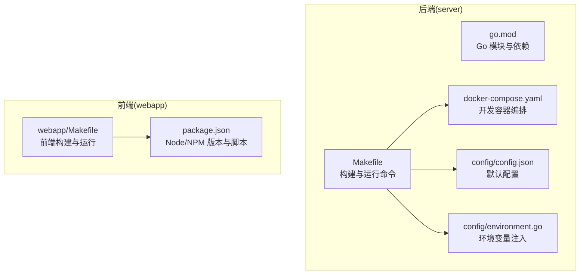
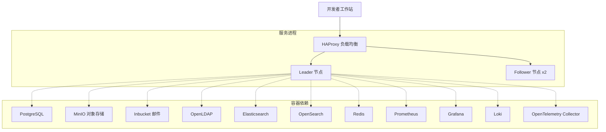
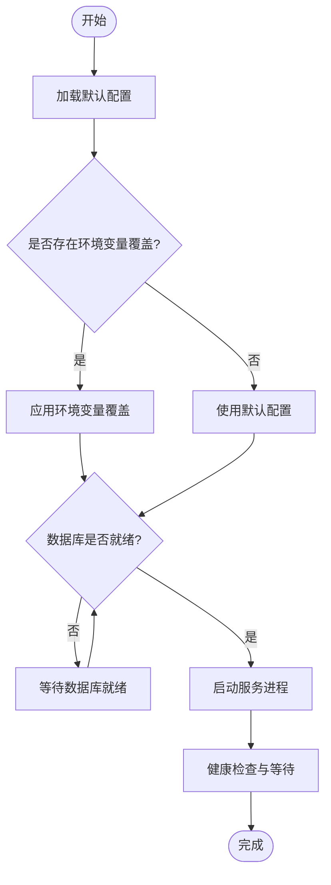
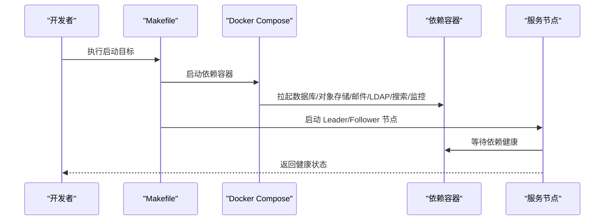
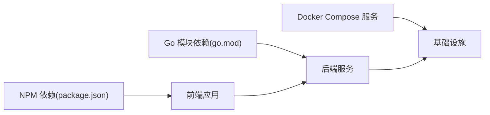

# 快速开始

<cite>
**本文引用的文件**
- [README.md](file://README.md)
- [server/go.mod](file://server/go.mod)
- [webapp/package.json](file://webapp/package.json)
- [server/Makefile](file://server/Makefile)
- [server/docker-compose.yaml](file://server/docker-compose.yaml)
- [server/config/config.json](file://server/config/config.json)
- [server/config/environment.go](file://server/config/environment.go)
- [server/scripts/wait-for-system-start.sh](file://server/scripts/wait-for-system-start.sh)
- [webapp/Makefile](file://webapp/Makefile)
- [server/docker-compose.pgvector.yml](file://server/docker-compose.pgvector.yml)
- [server/scripts/prereq-check-enterprise.sh](file://server/scripts/prereq-check-enterprise.sh)
- [PROJECT_ANALYSIS.md](file://PROJECT_ANALYSIS.md)
</cite>

## 目录
1. [引言](#引言)
2. [项目结构](#项目结构)
3. [核心组件](#核心组件)
4. [架构总览](#架构总览)
5. [详细组件分析](#详细组件分析)
6. [依赖分析](#依赖分析)
7. [性能考虑](#性能考虑)
8. [故障排除指南](#故障排除指南)
9. [结论](#结论)
10. [附录](#附录)

## 引言
本指南面向希望在本地快速搭建并运行 Mattermost 的开发者，涵盖环境要求、开发环境准备、容器化部署、源码编译与安装、数据库初始化以及首次运行的完整流程。同时提供常见问题排查与优化建议，帮助你在最短时间内成功启动项目。

## 项目结构
仓库采用多模块结构：
- server：后端（Go）核心服务、配置、构建与容器编排
- webapp：前端（React/TypeScript）应用与构建脚本
- api：API 定义与文档
- e2e-tests：端到端测试（Playwright/Cypress）
- tools：辅助工具与脚本
- docs：文档资源

图示来源
- [server/Makefile:1-800](file://server/Makefile#L1-L800)
- [server/docker-compose.yaml:1-249](file://server/docker-compose.yaml#L1-L249)
- [server/config/config.json:1-776](file://server/config/config.json#L1-L776)
- [server/config/environment.go:1-198](file://server/config/environment.go#L1-L198)
- [webapp/package.json:1-119](file://webapp/package.json#L1-L119)
- [webapp/Makefile:1-114](file://webapp/Makefile#L1-L114)

章节来源
- [README.md:1-104](file://README.md#L1-L104)
- [PROJECT_ANALYSIS.md:1-588](file://PROJECT_ANALYSIS.md#L1-L588)

## 核心组件
- 后端服务（Go）：提供 HTTP API、WebSocket、作业调度、插件系统与企业特性支持。
- 前端应用（React/TypeScript）：开发模式下通过 Webpack Dev Server 提供热更新体验。
- 开发容器编排：一键拉起 PostgreSQL、对象存储、邮件、LDAP、搜索引擎、监控等依赖服务。
- 配置体系：默认配置文件与环境变量注入机制，支持运行时覆盖。

章节来源
- [server/go.mod:1-243](file://server/go.mod#L1-L243)
- [webapp/package.json:1-119](file://webapp/package.json#L1-L119)
- [server/Makefile:1-800](file://server/Makefile#L1-L800)
- [server/config/environment.go:1-198](file://server/config/environment.go#L1-L198)

## 架构总览
本地开发采用“容器化依赖 + 本地二进制服务”的混合模式。容器负责数据库、对象存储、邮件、LDAP、搜索引擎、监控等基础设施；后端以开发模式运行，自动拉起所需依赖并通过健康检查等待就绪。

图示来源
- [server/docker-compose.yaml:1-249](file://server/docker-compose.yaml#L1-L249)

## 详细组件分析

### 环境要求与前置条件
- 操作系统与硬件
  - 支持 Linux/macOS/Windows（WSL2）。建议内存≥8GB，CPU≥4核，磁盘≥50GB 可用空间。
- 依赖软件
  - Go：版本要求见后端模块声明；Makefile 中包含版本校验与兼容性测试版本列表。
  - Node.js：前端工程声明了 Node 版本范围；NPM 版本也有要求。
  - Docker：用于本地容器化依赖与一键启动。
  - 可选：pgvector 支持（通过环境变量启用）。
- 企业版可选依赖
  - 企业版测试与功能可能需要额外系统工具（如特定 XML 安全工具），可通过企业前置检查脚本验证。

章节来源
- [server/go.mod:1-243](file://server/go.mod#L1-L243)
- [server/Makefile:601-611](file://server/Makefile#L601-L611)
- [webapp/package.json:4-7](file://webapp/package.json#L4-L7)
- [server/scripts/prereq-check-enterprise.sh:1-11](file://server/scripts/prereq-check-enterprise.sh#L1-L11)

### 开发环境准备（步骤分解）
- 步骤 1：安装 Go 与 Node.js
  - 使用版本管理器安装满足要求的 Go 与 Node 版本。
- 步骤 2：安装 Docker
  - 确保 Docker Engine 与 Compose 插件可用。
- 步骤 3：克隆仓库并进入根目录
  - 使用 Git 克隆仓库并在根目录执行后续命令。
- 步骤 4：初始化 Go 工作区
  - Makefile 提供初始化 Go 工作区的目标，自动创建 go.work 并关联子模块。
- 步骤 5：安装前端依赖
  - 进入 webapp 目录，执行前端依赖安装（或使用 Makefile 目标）。

章节来源
- [server/Makefile:422-440](file://server/Makefile#L422-L440)
- [webapp/Makefile:84-94](file://webapp/Makefile#L84-L94)

### 数据库与配置初始化
- 默认配置
  - 服务器监听端口、数据库连接串、日志级别、文件存储等均在默认配置文件中给出。
- 环境变量覆盖
  - 支持通过环境变量以层级命名方式覆盖配置项（如 MM_SQLSETTINGS_DRIVERNAME）。
- 数据库准备
  - 开发模式下通过 Docker Compose 启动 PostgreSQL；也可使用 pgvector 镜像（需开启相应开关）。
- 首次运行等待
  - 提供等待脚本，轮询服务健康状态，超时则报错。

图示来源
- [server/config/config.json:162-179](file://server/config/config.json#L162-L179)
- [server/config/environment.go:16-98](file://server/config/environment.go#L16-L98)
- [server/scripts/wait-for-system-start.sh:1-20](file://server/scripts/wait-for-system-start.sh#L1-L20)

章节来源
- [server/config/config.json:1-776](file://server/config/config.json#L1-L776)
- [server/config/environment.go:1-198](file://server/config/environment.go#L1-L198)
- [server/docker-compose.pgvector.yml:1-8](file://server/docker-compose.pgvector.yml#L1-L8)
- [server/scripts/wait-for-system-start.sh:1-20](file://server/scripts/wait-for-system-start.sh#L1-L20)

### 多种安装方式与运行流程

#### 方式一：Docker 容器化部署（推荐新手）
- 启动依赖服务
  - 使用 Makefile 目标启动所有开发依赖容器。
- 启动服务节点
  - 通过 HA 模式启动 Leader/Follower 节点，自动等待依赖健康。
- 访问服务
  - 默认对外暴露端口，可在浏览器访问服务地址。

图示来源
- [server/Makefile:247-267](file://server/Makefile#L247-L267)
- [server/docker-compose.yaml:96-149](file://server/docker-compose.yaml#L96-L149)

章节来源
- [server/Makefile:247-267](file://server/Makefile#L247-L267)
- [server/docker-compose.yaml:1-249](file://server/docker-compose.yaml#L1-L249)

#### 方式二：源码编译安装（本地二进制）
- 初始化与校验
  - 初始化 Go 工作区并校验 Go 版本。
- 构建与运行
  - 通过 Makefile 目标编译并运行后端服务，自动拉起前端静态资源链接。
- 前端开发
  - 使用前端 Makefile 启动开发服务器，支持热更新。

章节来源
- [server/Makefile:615-623](file://server/Makefile#L615-L623)
- [webapp/Makefile:20-40](file://webapp/Makefile#L20-L40)

#### 方式三：包管理器安装（适用于已有环境）
- 说明：仓库未提供官方包管理器安装脚本。建议优先使用 Docker 或源码编译方式，以获得一致的依赖与配置。

[本节不直接分析具体文件，故无章节来源]

### 首次运行与验证
- 启动顺序
  - 先启动依赖容器，再启动服务节点；服务节点内置健康检查与等待逻辑。
- 验证方法
  - 通过健康检查端点确认服务可用；使用等待脚本检测系统状态。
- 常见端口
  - 服务端口、WebSocket 端口、指标端口等在配置中定义。

章节来源
- [server/docker-compose.yaml:134-140](file://server/docker-compose.yaml#L134-L140)
- [server/scripts/wait-for-system-start.sh:1-20](file://server/scripts/wait-for-system-start.sh#L1-L20)
- [server/config/config.json:6-64](file://server/config/config.json#L6-L64)

## 依赖分析
- 后端依赖
  - Go 模块声明了大量第三方库，涵盖数据库驱动、HTTP 框架、搜索、缓存、监控、云存储等。
- 前端依赖
  - 声明了 Node/ NPM 版本与构建工具链，包含打包、样式、类型检查与测试工具。
- 容器依赖
  - Docker Compose 定义了数据库、对象存储、邮件、LDAP、搜索引擎、监控等服务镜像与端口映射。

图示来源
- [server/go.mod:1-243](file://server/go.mod#L1-L243)
- [webapp/package.json:1-119](file://webapp/package.json#L1-L119)
- [server/docker-compose.yaml:1-249](file://server/docker-compose.yaml#L1-L249)

章节来源
- [server/go.mod:1-243](file://server/go.mod#L1-L243)
- [webapp/package.json:1-119](file://webapp/package.json#L1-L119)
- [server/docker-compose.yaml:1-249](file://server/docker-compose.yaml#L1-L249)

## 性能考虑
- 数据库连接池与超时
  - 合理设置最大连接数、空闲连接、连接生命周期与查询超时，避免并发瓶颈。
- 前端构建优化
  - 使用生产模式构建，启用代码分割与懒加载；避免不必要的依赖体积。
- 容器资源限制
  - 为数据库与搜索引擎设置合理的 CPU/内存限制，避免资源争用。
- 搜索引擎与索引
  - 搜索引擎启用与索引策略影响查询性能，建议在开发环境按需启用。

[本节为通用建议，不直接分析具体文件，故无章节来源]

## 故障排除指南
- Go 版本不满足要求
  - Makefile 内置版本校验，若低于最低版本将直接报错。请升级至满足要求的 Go 版本。
- 前端依赖安装失败
  - 检查 Node/NPM 版本是否符合要求；在 CI 环境使用 npm ci；必要时清理缓存。
- Docker 无法启动依赖
  - 确认端口未被占用；查看容器日志；确保网络桥接正常。
- 服务启动后无法访问
  - 使用等待脚本确认服务健康；检查站点 URL 与监听地址配置；确认防火墙放行。
- 企业版功能不可用
  - 检查企业前置依赖是否安装；必要时运行企业前置检查脚本。
- pgvector 镜像问题
  - 若启用 pgvector，请确认开关已设置且镜像可用；否则回退标准 PostgreSQL 镜像。

章节来源
- [server/Makefile:601-611](file://server/Makefile#L601-L611)
- [webapp/Makefile:84-94](file://webapp/Makefile#L84-L94)
- [server/scripts/wait-for-system-start.sh:1-20](file://server/scripts/wait-for-system-start.sh#L1-L20)
- [server/scripts/prereq-check-enterprise.sh:1-11](file://server/scripts/prereq-check-enterprise.sh#L1-L11)
- [server/docker-compose.pgvector.yml:1-8](file://server/docker-compose.pgvector.yml#L1-L8)

## 结论
通过本指南，你可以基于 Docker 或源码编译快速搭建 Mattermost 开发环境，完成数据库初始化与首次运行验证。建议优先使用 Docker 以降低环境差异带来的问题；在需要深度调试时，切换到源码编译模式。遇到问题时，可依据故障排除指南逐项排查。

[本节为总结性内容，不直接分析具体文件，故无章节来源]

## 附录

### A. 常用命令速查
- 初始化 Go 工作区：make setup-go-work
- 启动依赖容器：make start-docker
- 启动服务与前端：make run
- 停止服务与容器：make stop
- 清理容器与卷：make clean-docker
- 前端开发：make dev
- 前端构建：make dist

章节来源
- [server/Makefile:422-440](file://server/Makefile#L422-L440)
- [server/Makefile:247-267](file://server/Makefile#L247-L267)
- [server/Makefile:703-732](file://server/Makefile#L703-L732)
- [webapp/Makefile:20-40](file://webapp/Makefile#L20-L40)
- [webapp/Makefile:78-83](file://webapp/Makefile#L78-L83)

### B. 环境变量覆盖规则
- 命名规范：以 MM_ 开头的环境变量将被解析并覆盖对应配置项。
- 支持类型：字符串、布尔、整数、切片、映射等。
- 示例：MM_SQLSETTINGS_DRIVERNAME、MM_SERVICESETTINGS_SITEURL 等。

章节来源
- [server/config/environment.go:16-98](file://server/config/environment.go#L16-L98)