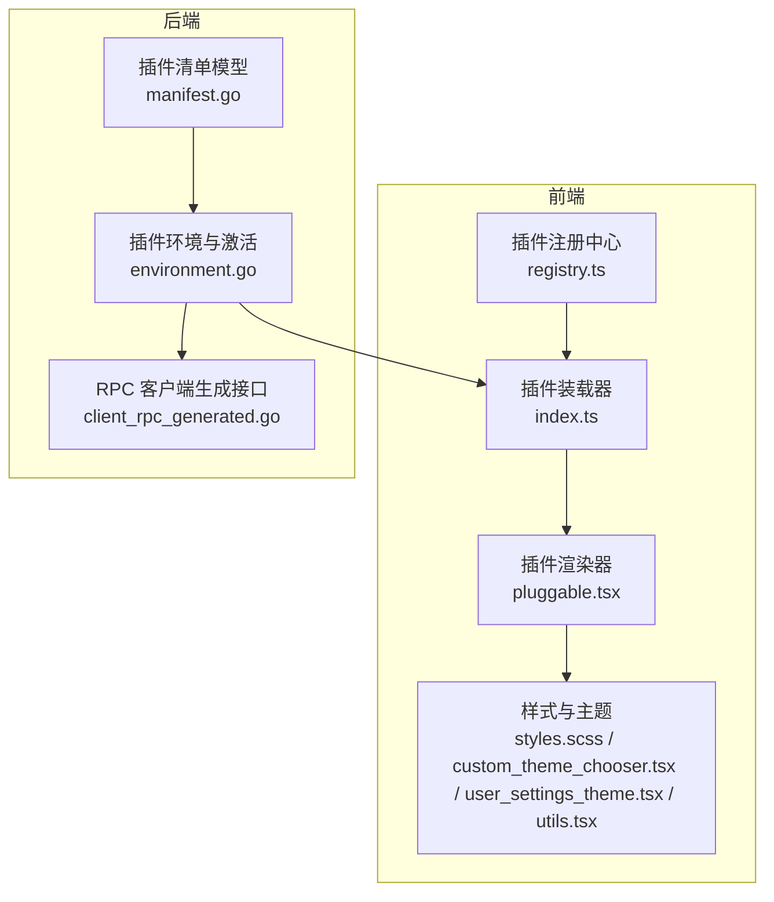
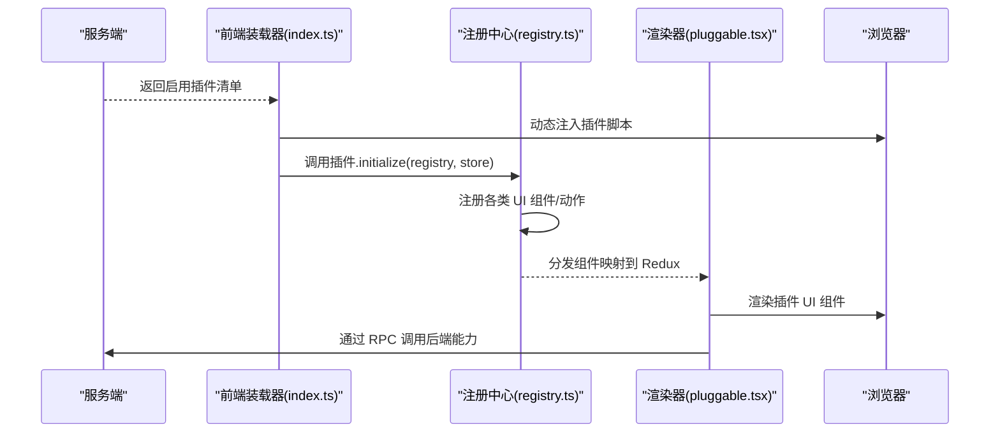
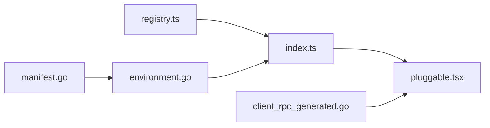

# 前端插件开发

<cite>
**本文引用的文件**
- [registry.ts](file://webapp/channels/src/plugins/registry.ts)
- [index.ts](file://webapp/channels/src/plugins/index.ts)
- [pluggable.tsx](file://webapp/channels/src/plugins/pluggable/pluggable.tsx)
- [manifest.go](file://server/public/model/manifest.go)
- [environment.go](file://server/public/plugin/environment.go)
- [client_rpc_generated.go](file://server/public/plugin/client_rpc_generated.go)
- [sidebar_team_menu.tsx](file://webapp/channels/src/components/sidebar/sidebar_header/sidebar_team_menu.tsx)
- [plugin_setting_extraction.tsx](file://webapp/channels/src/utils/plugins/plugin_setting_extraction.tsx)
- [plugin_management.tsx](file://webapp/channels/src/components/admin_console/plugin_management/plugin_management.tsx)
- [styles.scss](file://webapp/channels/src/sass/styles.scss)
- [custom_theme_chooser.tsx](file://webapp/channels/src/components/user_settings/display/user_settings_theme/custom_theme_chooser/custom_theme_chooser.tsx)
- [user_settings_theme.tsx](file://webapp/channels/src/components/user_settings/display/user_settings_theme/user_settings_theme.tsx)
- [utils.tsx](file://webapp/channels/src/utils/utils.tsx)
</cite>

## 目录
1. [引言](#引言)
2. [项目结构](#项目结构)
3. [核心组件](#核心组件)
4. [架构总览](#架构总览)
5. [详细组件分析](#详细组件分析)
6. [依赖分析](#依赖分析)
7. [性能考虑](#性能考虑)
8. [故障排查指南](#故障排查指南)
9. [结论](#结论)
10. [附录](#附录)

## 引言
本指南面向希望在 Mattermost 前端开发插件的工程师，系统讲解前端插件的开发框架、与后端插件的通信方式、UI 扩展机制、界面集成点（菜单、按钮、对话框）、样式定制与主题适配、以及最佳实践与常见问题排查。文档基于仓库中的真实源码进行分析，确保内容可追溯、可落地。

## 项目结构
Mattermost 前端插件体系由“插件注册中心”“插件装载器”“插件渲染器”“插件清单与后端环境”四部分组成，并通过 Redux 状态管理与 WebSocket 事件实现前后端联动。

图示来源
- [registry.ts:121-130](file://webapp/channels/src/plugins/registry.ts#L121-L130)
- [index.ts:90-127](file://webapp/channels/src/plugins/index.ts#L90-L127)
- [pluggable.tsx:44-130](file://webapp/channels/src/plugins/pluggable/pluggable.tsx#L44-L130)
- [manifest.go:179-266](file://server/public/model/manifest.go#L179-L266)
- [environment.go:308-360](file://server/public/plugin/environment.go#L308-L360)
- [client_rpc_generated.go:2354-2372](file://server/public/plugin/client_rpc_generated.go#L2354-L2372)

章节来源
- [registry.ts:121-130](file://webapp/channels/src/plugins/registry.ts#L121-L130)
- [index.ts:90-127](file://webapp/channels/src/plugins/index.ts#L90-L127)
- [manifest.go:179-266](file://server/public/model/manifest.go#L179-L266)
- [environment.go:308-360](file://server/public/plugin/environment.go#L308-L360)

## 核心组件
- 插件注册中心：提供丰富的 UI 注册 API，如侧边栏组件、通道头部按钮、主菜单项、搜索组件等；统一调度 React 组件注册与数据分发。
- 插件装载器：负责从服务端拉取已启用插件清单，动态加载前端 bundle 并初始化插件实例。
- 插件渲染器：根据 Redux 中的插件组件映射，按需渲染插件提供的 UI 组件，支持错误边界包裹。
- 清单与环境：定义插件元信息（含 webapp bundle 路径），服务端负责校验、打包与激活前端资源。
- RPC 通信：后端暴露统一 RPC 接口，前端通过生成的客户端调用后端能力（日志、配置、KV、WebSocket 事件等）。

章节来源
- [registry.ts:136-800](file://webapp/channels/src/plugins/registry.ts#L136-L800)
- [index.ts:139-198](file://webapp/channels/src/plugins/index.ts#L139-L198)
- [pluggable.tsx:44-130](file://webapp/channels/src/plugins/pluggable/pluggable.tsx#L44-L130)
- [manifest.go:241-266](file://server/public/model/manifest.go#L241-L266)
- [client_rpc_generated.go:2354-2372](file://server/public/plugin/client_rpc_generated.go#L2354-L2372)

## 架构总览
前端插件生命周期：服务端返回启用插件清单 → 前端装载器加载 bundle → 注册中心初始化 → 插件注册 UI 组件 → 渲染器按需渲染 → 通过 RPC 与后端交互。

图示来源
- [index.ts:90-127](file://webapp/channels/src/plugins/index.ts#L90-L127)
- [index.ts:139-198](file://webapp/channels/src/plugins/index.ts#L139-L198)
- [registry.ts:136-800](file://webapp/channels/src/plugins/registry.ts#L136-L800)
- [pluggable.tsx:44-130](file://webapp/channels/src/plugins/pluggable/pluggable.tsx#L44-L130)
- [client_rpc_generated.go:2354-2372](file://server/public/plugin/client_rpc_generated.go#L2354-L2372)

## 详细组件分析

### 插件注册中心（PluginRegistry）
职责与能力
- 提供大量 UI 注册方法：根组件、侧边栏组件、通道头部按钮、主菜单项、搜索组件、文件上传方法、AI 动作菜单、嵌入预览、自定义帖子类型等。
- 统一将组件注册为 Redux 动作，供渲染器按名称选择性挂载。
- 支持图标、文案、提示文本、下拉菜单等参数的标准化处理。

关键点
- 组件注册时会生成唯一 id，并绑定 pluginId，便于渲染器筛选与错误边界包裹。
- 对于需要解析的元素（字符串或函数），提供统一解析逻辑，兼容传入 React 元素或组件类型。

章节来源
- [registry.ts:136-800](file://webapp/channels/src/plugins/registry.ts#L136-L800)
- [registry.ts:98-119](file://webapp/channels/src/plugins/registry.ts#L98-L119)

### 插件装载器（initialize/load/remove）
职责与流程
- 初始化：查询启用插件清单，逐个加载前端 bundle。
- 加载：动态创建 script 标签，注入插件入口；监听加载完成回调，触发插件初始化。
- 卸载：清理事件、注销 WebSocket 监听、移除 DOM 脚本节点、更新 Redux 状态。

关键点
- 版本变更检测：若版本变化则重新加载。
- 性能开关：当性能调试开启且禁用客户端插件时跳过加载。
- 错误处理：加载失败与初始化异常均记录日志。

章节来源
- [index.ts:90-127](file://webapp/channels/src/plugins/index.ts#L90-L127)
- [index.ts:139-198](file://webapp/channels/src/plugins/index.ts#L139-L198)
- [index.ts:203-231](file://webapp/channels/src/plugins/index.ts#L203-L231)

### 插件渲染器（Pluggable）
职责与机制
- 从 Redux 读取指定类型的插件组件集合，按插件 id 或子组件名筛选渲染。
- 为每个插件组件包裹错误边界，避免单个插件异常影响整体 UI。
- 主要用于 Product 类型组件的子组件渲染（如 switcherIcon、mainComponent 等）。

关键点
- 支持 Product 子组件名选择（如 headerCentreComponent、headerRightComponent）。
- 自动注入 theme 与 webSocketClient（非 Product 类型）。

章节来源
- [pluggable.tsx:44-130](file://webapp/channels/src/plugins/pluggable/pluggable.tsx#L44-L130)

### 后端插件清单与环境
- 清单模型：定义插件 id、名称、版本、最小服务器版本、webapp bundle 路径、设置模式等。
- 客户端清单：服务端为前端生成带哈希的 bundle 路径，便于缓存与校验。
- 环境激活：检查最小服务器版本、解包 webapp 包、标记运行状态、处理重复/未找到插件等。

章节来源
- [manifest.go:179-266](file://server/public/model/manifest.go#L179-L266)
- [environment.go:308-360](file://server/public/plugin/environment.go#L308-L360)

### 前后端通信（RPC）
- RPC 客户端生成：前端通过生成的客户端调用后端 API（如执行斜线命令、获取配置、发布 WebSocket 事件、KV 操作、权限判断等）。
- 错误处理：调用失败时记录日志；后端未实现对应钩子时返回可编码错误。

章节来源
- [client_rpc_generated.go:2354-2372](file://server/public/plugin/client_rpc_generated.go#L2354-L2372)
- [client_rpc_generated.go:6535-6562](file://server/public/plugin/client_rpc_generated.go#L6535-L6562)

### UI 扩展与界面集成
- 主菜单与团队菜单：支持注册主菜单项与团队菜单项，点击触发插件动作。
- 通道头部按钮与引导按钮：可注册图标、文案、提示文本与点击回调。
- 文件上传方法：在文件上传菜单中增加自定义入口。
- 搜索组件：注册搜索按钮、建议列表与提示组件。
- 链接提示：为链接悬停显示自定义提示组件。
- 嵌入预览：对特定类型链接提供可折叠的嵌入视图。
- 自定义帖子类型：为自定义帖子类型提供渲染组件。

章节来源
- [sidebar_team_menu.tsx:490-519](file://webapp/channels/src/components/sidebar/sidebar_header/sidebar_team_menu.tsx#L490-L519)
- [registry.ts:247-291](file://webapp/channels/src/plugins/registry.ts#L247-L291)
- [registry.ts:293-326](file://webapp/channels/src/plugins/registry.ts#L293-L326)
- [registry.ts:338-373](file://webapp/channels/src/plugins/registry.ts#L338-L373)
- [registry.ts:462-486](file://webapp/channels/src/plugins/registry.ts#L462-L486)
- [registry.ts:524-555](file://webapp/channels/src/plugins/registry.ts#L524-L555)
- [registry.ts:185-206](file://webapp/channels/src/plugins/registry.ts#L185-L206)
- [registry.ts:215-217](file://webapp/channels/src/plugins/registry.ts#L215-L217)
- [registry.ts:422-452](file://webapp/channels/src/plugins/registry.ts#L422-L452)
- [registry.ts:382-396](file://webapp/channels/src/plugins/registry.ts#L382-L396)

### 插件设置与系统控制台集成
- 设置提取：从插件配置中提取有效 sections 与 action，构建插件设置 UI。
- 系统控制台：提供插件管理页面，支持启用/禁用/移除插件、上传/安装插件、查看状态与实例分布。

章节来源
- [plugin_setting_extraction.tsx:40-87](file://webapp/channels/src/utils/plugins/plugin_setting_extraction.tsx#L40-L87)
- [plugin_management.tsx:229-456](file://webapp/channels/src/components/admin_console/plugin_management/plugin_management.tsx#L229-L456)

### 样式定制与主题适配
- SCSS 模块化：通过 styles.scss 组织工具、基础、路由、布局、组件、响应式、小部件与管理控制台等模块。
- 主题适配：提供主题切换与重置逻辑；支持动态修改 CSS 变量并应用到页面。
- 自定义主题：用户可在设置中选择预设主题或自定义颜色，支持复制/粘贴主题色值。

章节来源
- [styles.scss:1-15](file://webapp/channels/src/sass/styles.scss#L1-L15)
- [utils.tsx:591-623](file://webapp/channels/src/utils/utils.tsx#L591-L623)
- [custom_theme_chooser.tsx:389-483](file://webapp/channels/src/components/user_settings/display/user_settings_theme/custom_theme_chooser/custom_theme_chooser.tsx#L389-L483)
- [user_settings_theme.tsx:200-230](file://webapp/channels/src/components/user_settings/display/user_settings_theme/user_settings_theme.tsx#L200-L230)

## 依赖分析
- 组件耦合
  - 注册中心与装载器：注册中心仅负责注册，装载器负责加载与初始化。
  - 渲染器依赖 Redux 状态与主题上下文，不直接依赖具体插件实现。
  - 后端环境与清单：环境负责激活与打包，清单定义前端 bundle 路径。
- 外部依赖
  - Redux：用于插件组件映射与状态分发。
  - WebSocket：用于实时事件订阅与断线重连处理。
  - RPC：统一的后端能力调用接口。

图示来源
- [registry.ts:121-130](file://webapp/channels/src/plugins/registry.ts#L121-L130)
- [index.ts:90-127](file://webapp/channels/src/plugins/index.ts#L90-L127)
- [pluggable.tsx:44-130](file://webapp/channels/src/plugins/pluggable/pluggable.tsx#L44-L130)
- [manifest.go:179-266](file://server/public/model/manifest.go#L179-L266)
- [environment.go:308-360](file://server/public/plugin/environment.go#L308-L360)
- [client_rpc_generated.go:2354-2372](file://server/public/plugin/client_rpc_generated.go#L2354-L2372)

## 性能考虑
- 插件加载策略
  - 条件加载：当性能调试开启且禁用客户端插件时跳过加载，避免影响性能测试。
  - 版本感知：版本变更时重新加载，保证一致性。
- 渲染优化
  - 使用错误边界包裹插件组件，避免单点异常导致整页崩溃。
  - 仅在必要时渲染插件 UI，减少不必要的组件实例化。
- RPC 调用
  - 对异步钩子（如消息编辑前钩子）等待返回后再发送，避免并发问题。
- 样式与主题
  - 动态修改 CSS 变量时注意批量更新与优先级，减少重排与重绘。

章节来源
- [index.ts:75-88](file://webapp/channels/src/plugins/index.ts#L75-L88)
- [index.ts:270-287](file://webapp/channels/src/plugins/index.ts#L270-L287)
- [pluggable.tsx:88-121](file://webapp/channels/src/plugins/pluggable/pluggable.tsx#L88-L121)
- [client_rpc_generated.go:1234-1246](file://server/public/plugin/client_rpc_generated.go#L1234-L1246)

## 故障排查指南
- 插件未加载
  - 检查服务端是否返回启用插件清单；确认前端已成功注入脚本。
  - 查看控制台错误与网络请求，定位 bundle 加载失败原因。
- 插件初始化失败
  - 确认插件导出 initialize 回调；检查插件内部是否抛出异常。
  - 关注环境最小服务器版本要求与插件哈希校验。
- UI 不显示
  - 确认插件已正确注册相应 UI 组件；检查 Redux 中是否存在该组件映射。
  - 若为 Product 子组件，确认子组件名与 props 一致。
- RPC 调用失败
  - 检查后端是否实现对应钩子；查看前端日志输出的 RPC 调用失败信息。
- 主题与样式异常
  - 检查主题切换逻辑与 CSS 变量应用顺序；确认自定义主题的复制/粘贴流程。

章节来源
- [index.ts:139-198](file://webapp/channels/src/plugins/index.ts#L139-L198)
- [index.ts:203-231](file://webapp/channels/src/plugins/index.ts#L203-L231)
- [registry.ts:136-800](file://webapp/channels/src/plugins/registry.ts#L136-L800)
- [client_rpc_generated.go:1013-1061](file://server/public/plugin/client_rpc_generated.go#L1013-L1061)
- [utils.tsx:604-623](file://webapp/channels/src/utils/utils.tsx#L604-L623)

## 结论
Mattermost 前端插件体系以“注册中心 + 装载器 + 渲染器 + RPC 通信”为核心，提供了丰富而灵活的 UI 扩展点与稳定的前后端协作机制。开发者只需在插件中实现 initialize 并通过注册中心暴露 UI 组件，即可无缝融入 Mattermost 的界面生态。配合系统控制台与主题系统，可实现从简单按钮到复杂对话框的全场景扩展。

## 附录
- 最佳实践清单
  - 在插件中提供明确的错误边界与降级方案。
  - 使用标准化的图标、文案与提示文本，提升一致性。
  - 尽量避免在插件中直接操作全局 DOM，优先通过注册中心暴露组件。
  - 对外暴露的 RPC 调用应具备完善的错误处理与重试策略。
  - 主题与样式尽量遵循 Mattermost 设计规范，保持视觉统一。
- 示例路径参考
  - 通道头部按钮注册与渲染：[registry.ts:256-291](file://webapp/channels/src/plugins/registry.ts#L256-L291)、[pluggable.tsx:99-123](file://webapp/channels/src/plugins/pluggable/pluggable.tsx#L99-L123)
  - 主菜单项注册与渲染：[registry.ts:462-486](file://webapp/channels/src/plugins/registry.ts#L462-L486)、[sidebar_team_menu.tsx:490-519](file://webapp/channels/src/components/sidebar/sidebar_header/sidebar_team_menu.tsx#L490-L519)
  - 搜索组件注册：[registry.ts:185-206](file://webapp/channels/src/plugins/registry.ts#L185-L206)
  - 文件上传方法注册：[registry.ts:774-798](file://webapp/channels/src/plugins/registry.ts#L774-L798)
  - 自定义帖子类型组件注册：[registry.ts:382-396](file://webapp/channels/src/plugins/registry.ts#L382-L396)
  - RPC 调用示例（斜线命令、配置、WebSocket 事件）：[client_rpc_generated.go:2354-2372](file://server/public/plugin/client_rpc_generated.go#L2354-L2372)、[client_rpc_generated.go:2374-2388](file://server/public/plugin/client_rpc_generated.go#L2374-L2388)、[client_rpc_generated.go:6535-6562](file://server/public/plugin/client_rpc_generated.go#L6535-L6562)
  - 插件管理与设置：[plugin_management.tsx:229-456](file://webapp/channels/src/components/admin_console/plugin_management/plugin_management.tsx#L229-L456)、[plugin_setting_extraction.tsx:40-87](file://webapp/channels/src/utils/plugins/plugin_setting_extraction.tsx#L40-L87)
  - 主题与样式：[styles.scss:1-15](file://webapp/channels/src/sass/styles.scss#L1-L15)、[custom_theme_chooser.tsx:389-483](file://webapp/channels/src/components/user_settings/display/user_settings_theme/custom_theme_chooser/custom_theme_chooser.tsx#L389-L483)、[user_settings_theme.tsx:200-230](file://webapp/channels/src/components/user_settings/display/user_settings_theme/user_settings_theme.tsx#L200-L230)、[utils.tsx:591-623](file://webapp/channels/src/utils/utils.tsx#L591-L623)