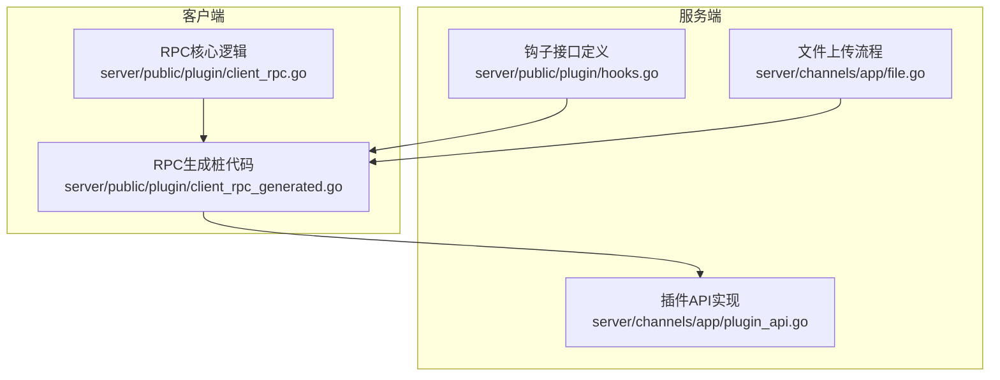
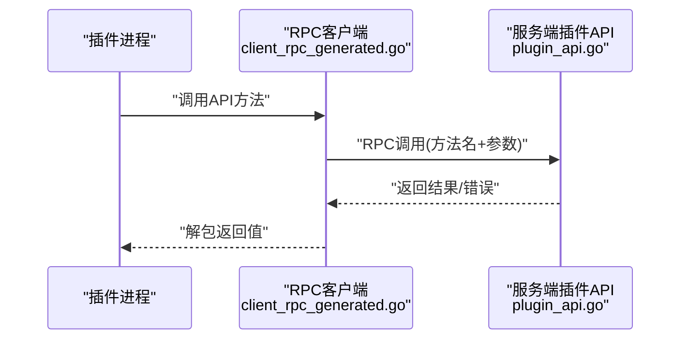
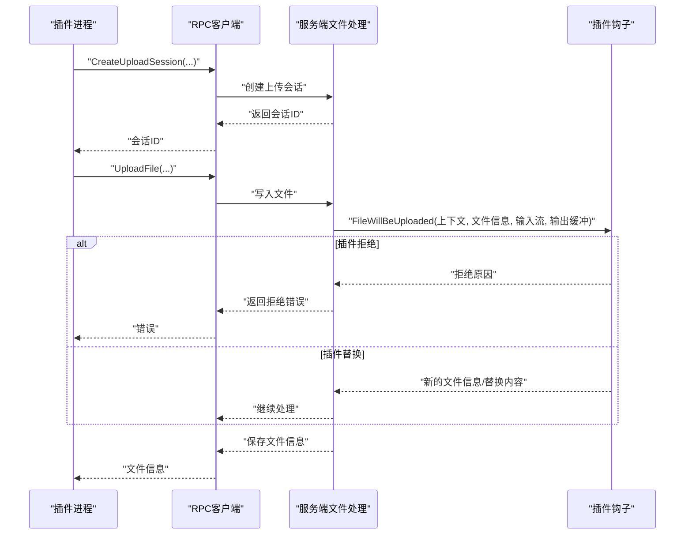
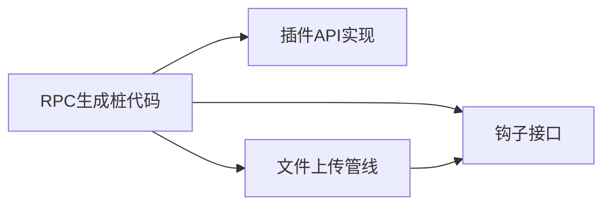

# 插件 API 参考

<cite>
**本文引用的文件**
- [server/channels/app/plugin_api.go](file://server/channels/app/plugin_api.go)
- [server/public/plugin/client_rpc_generated.go](file://server/public/plugin/client_rpc_generated.go)
- [server/public/plugin/hooks.go](file://server/public/plugin/hooks.go)
- [server/public/plugin/client_rpc.go](file://server/public/plugin/client_rpc.go)
- [server/channels/app/file.go](file://server/channels/app/file.go)
- [server/public/pluginapi/file_test.go](file://server/public/pluginapi/file_test.go)
- [server/channels/app/plugin_hooks_test.go](file://server/channels/app/plugin_hooks_test.go)
- [server/channels/api4/plugin.go](file://server/channels/api4/plugin.go)
- [server/cmd/mmctl/commands/plugin.go](file://server/cmd/mmctl/commands/plugin.go)
- [api/v4/source/plugins.yaml](file://api/v4/source/plugins.yaml)
</cite>

## 目录
1. [简介](#简介)
2. [项目结构](#项目结构)
3. [核心组件](#核心组件)
4. [架构总览](#架构总览)
5. [详细组件分析](#详细组件分析)
6. [依赖分析](#依赖分析)
7. [性能考虑](#性能考虑)
8. [故障排查指南](#故障排查指南)
9. [结论](#结论)
10. [附录](#附录)

## 简介
本文件为 Mattermost 插件 API 的完整参考文档，覆盖用户管理、频道与团队操作、消息处理、文件上传以及权限控制等能力。文档从系统架构、数据流、调用方式（同步/异步/事件）、错误处理到最佳实践进行系统化阐述，并提供可追溯的源码路径以便进一步查阅。

## 项目结构
Mattermost 插件 API 的实现由“服务端插件框架”和“客户端 RPC 客户端”两部分组成：
- 服务端：提供插件 API 能力的具体实现，如用户、频道、消息、文件、权限等。
- 客户端：通过 RPC 将插件 API 暴露给插件进程，插件通过 client_rpc_* 自动生成的桩代码调用服务端。

图表来源
- [server/channels/app/plugin_api.go](file://server/channels/app/plugin_api.go)
- [server/public/plugin/client_rpc_generated.go](file://server/public/plugin/client_rpc_generated.go)
- [server/public/plugin/hooks.go](file://server/public/plugin/hooks.go)
- [server/public/plugin/client_rpc.go](file://server/public/plugin/client_rpc.go)
- [server/channels/app/file.go](file://server/channels/app/file.go)

章节来源
- [server/channels/app/plugin_api.go](file://server/channels/app/plugin_api.go)
- [server/public/plugin/client_rpc_generated.go](file://server/public/plugin/client_rpc_generated.go)
- [server/public/plugin/hooks.go](file://server/public/plugin/hooks.go)
- [server/public/plugin/client_rpc.go](file://server/public/plugin/client_rpc.go)
- [server/channels/app/file.go](file://server/channels/app/file.go)

## 核心组件
- 插件 API 结构体：封装对用户、频道、团队、权限、邮件、日志等能力的调用入口。
- RPC 客户端：自动生成的 RPC 客户端将 API 方法映射为远程过程调用。
- 钩子接口：定义消息生命周期、反应、集群事件等事件型扩展点。
- 文件上传管线：在上传前触发插件钩子以允许替换或拒绝文件。

章节来源
- [server/channels/app/plugin_api.go](file://server/channels/app/plugin_api.go)
- [server/public/plugin/client_rpc_generated.go](file://server/public/plugin/client_rpc_generated.go)
- [server/public/plugin/hooks.go](file://server/public/plugin/hooks.go)
- [server/channels/app/file.go](file://server/channels/app/file.go)

## 架构总览
下图展示了插件调用 API 的典型时序：插件通过 RPC 客户端发起请求，服务端插件 API 实现执行业务逻辑并返回结果。

图表来源
- [server/public/plugin/client_rpc_generated.go](file://server/public/plugin/client_rpc_generated.go)
- [server/channels/app/plugin_api.go](file://server/channels/app/plugin_api.go)

## 详细组件分析

### 用户管理 API
- 创建用户
  - 方法：CreateUser
  - 参数：用户对象
  - 返回：用户对象、应用错误
  - 说明：创建新用户并返回结果
  章节来源
  - [server/channels/app/plugin_api.go](file://server/channels/app/plugin_api.go)
  - [server/public/plugin/client_rpc_generated.go](file://server/public/plugin/client_rpc_generated.go)

- 删除用户
  - 方法：DeleteUser
  - 参数：用户ID
  - 返回：应用错误（空表示成功）
  章节来源
  - [server/channels/app/plugin_api.go](file://server/channels/app/plugin_api.go)
  - [server/public/plugin/client_rpc_generated.go](file://server/public/plugin/client_rpc_generated.go)

- 获取用户列表/按ID查询
  - 方法：GetUsers、GetUsersByIds、GetUsersByUsernames、GetUserByEmail、GetUserByUsername
  - 参数：查询选项/用户ID数组/用户名数组/邮箱
  - 返回：用户切片/单个用户、应用错误
  章节来源
  - [server/channels/app/plugin_api.go](file://server/channels/app/plugin_api.go)
  - [server/public/plugin/client_rpc_generated.go](file://server/public/plugin/client_rpc_generated.go)

- 用户令牌
  - 方法：CreateUserAccessToken、RevokeUserAccessToken
  - 参数：令牌对象/令牌ID
  - 返回：令牌对象/应用错误
  章节来源
  - [server/public/plugin/client_rpc_generated.go](file://server/public/plugin/client_rpc_generated.go)

- 团队成员与角色
  - 方法：GetTeamMember、GetTeamMembers、GetTeamMembersForUser、UpdateTeamMemberRoles、GetTeamStats
  - 参数：团队ID、用户ID、分页参数、新角色字符串
  - 返回：团队成员/统计、应用错误
  章节来源
  - [server/channels/app/plugin_api.go](file://server/channels/app/plugin_api.go)
  - [server/public/plugin/client_rpc_generated.go](file://server/public/plugin/client_rpc_generated.go)

- 频道成员与角色
  - 方法：AddChannelMember、AddUserToChannel、GetChannelMember、GetChannelMembers、GetChannelMembersByIds、UpdateChannelMemberRoles、DeleteChannelMember
  - 参数：频道ID、用户ID、作为谁添加、分页参数、新角色字符串
  - 返回：频道成员、应用错误
  章节来源
  - [server/channels/app/plugin_api.go](file://server/channels/app/plugin_api.go)
  - [server/public/plugin/client_rpc_generated.go](file://server/public/plugin/client_rpc_generated.go)

### 频道与团队操作 API
- 频道管理
  - 方法：CreateChannel、UpdateChannel、DeleteChannel、GetChannel、GetPublicChannelsForTeam、SearchChannels、ChannelExists
  - 参数：频道对象/过滤条件/团队ID/名称
  - 返回：频道对象/应用错误
  章节来源
  - [server/public/plugin/client_rpc_generated.go](file://server/public/plugin/client_rpc_generated.go)

- 团队管理
  - 方法：CreateTeam、UpdateTeam、DeleteTeam、GetTeam、GetTeams、SearchTeams、TeamExists
  - 参数：团队对象/过滤条件/名称
  - 返回：团队对象/应用错误
  章节来源
  - [server/public/plugin/client_rpc_generated.go](file://server/public/plugin/client_rpc_generated.go)

### 消息处理 API
- 发布消息
  - 方法：CreatePost
  - 参数：帖子对象
  - 返回：帖子对象、应用错误
  章节来源
  - [server/public/plugin/client_rpc_generated.go](file://server/public/plugin/client_rpc_generated.go)

- 消息生命周期钩子
  - 钩子：MessageWillBePosted、MessageWillBeUpdated、MessageHasBeenPosted、MessageHasBeenUpdated、MessageHasBeenDeleted、MessagesWillBeConsumed
  - 说明：在写入数据库前后触发，支持修改或拒绝
  章节来源
  - [server/public/plugin/hooks.go](file://server/public/plugin/hooks.go)
  - [server/public/plugin/client_rpc.go](file://server/public/plugin/client_rpc.go)

- 反应事件
  - 钩子：ReactionHasBeenAdded、ReactionHasBeenRemoved
  - 说明：在反应被添加/移除时触发
  章节来源
  - [server/public/plugin/client_rpc.go](file://server/public/plugin/client_rpc.go)

- 集群事件与 WebSocket 连接
  - 钩子：OnPluginClusterEvent、OnWebSocketConnect、OnWebSocketDisconnect、OnInstall、OnUninstall、OnPluginEnabled、OnPluginDisabled
  - 说明：用于跨节点事件、连接状态与插件生命周期事件
  章节来源
  - [server/public/plugin/client_rpc.go](file://server/public/plugin/client_rpc.go)

### 文件上传 API
- 上传会话
  - 方法：CreateUploadSession、GetUploadSession、CompleteUploadSession
  - 参数：上传会话对象/会话ID
  - 返回：会话对象/错误
  章节来源
  - [server/public/plugin/client_rpc_generated.go](file://server/public/plugin/client_rpc_generated.go)

- 文件内容上传
  - 方法：UploadFile、GetFileInfo、GetFileLink、GetFileThumbnail、GetFilePreview
  - 参数：文件字节流/文件ID/目标频道/描述
  - 返回：文件信息/链接/预览/缩略图、应用错误
  章节来源
  - [server/public/plugin/client_rpc_generated.go](file://server/public/plugin/client_rpc_generated.go)

- 文件上传钩子
  - 钩子：FileWillBeUploaded
  - 说明：允许插件替换文件内容或拒绝上传
  章节来源
  - [server/channels/app/file.go](file://server/channels/app/file.go)

图表来源
- [server/public/plugin/client_rpc_generated.go](file://server/public/plugin/client_rpc_generated.go)
- [server/channels/app/file.go](file://server/channels/app/file.go)

### 权限控制 API
- 用户权限检查
  - 方法：HasPermissionTo、HasPermissionToTeam、RolesGrantPermission
  - 参数：用户ID/团队ID、权限对象/角色名数组、权限ID
  - 返回：布尔值/应用错误
  章节来源
  - [server/public/plugin/client_rpc_generated.go](file://server/public/plugin/client_rpc_generated.go)

- 日志与邮件
  - 方法：LogDebug、SendMail
  - 参数：调试键值对/收件人、主题、HTML 正文
  - 返回：应用错误
  章节来源
  - [server/public/plugin/client_rpc_generated.go](file://server/public/plugin/client_rpc_generated.go)

## 依赖分析
- 组件耦合
  - 插件 API 通过 RPC 与插件进程解耦，RPC 客户端负责序列化/反序列化与错误传播。
  - 文件上传链路在写入前触发插件钩子，形成“前置钩子 -> 写入 -> 后置处理”的流水线。
- 外部依赖
  - 钩子接口定义来自公共插件包，确保插件与服务端版本兼容。
  - mmctl 命令行工具提供插件安装/启用/禁用等运维能力，便于集成测试与部署。

图表来源
- [server/public/plugin/client_rpc_generated.go](file://server/public/plugin/client_rpc_generated.go)
- [server/channels/app/plugin_api.go](file://server/channels/app/plugin_api.go)
- [server/channels/app/file.go](file://server/channels/app/file.go)
- [server/public/plugin/hooks.go](file://server/public/plugin/hooks.go)

章节来源
- [server/public/plugin/client_rpc_generated.go](file://server/public/plugin/client_rpc_generated.go)
- [server/channels/app/plugin_api.go](file://server/channels/app/plugin_api.go)
- [server/channels/app/file.go](file://server/channels/app/file.go)
- [server/public/plugin/hooks.go](file://server/public/plugin/hooks.go)

## 性能考虑
- RPC 调用开销：每次 API 调用都会经过序列化/网络/反序列化，建议批量操作（如批量获取用户）减少往返次数。
- 文件上传：大文件上传建议使用 UploadSession 分片上传，避免一次性传输导致内存压力。
- 钩子执行：在 FileWillBeUploaded 中尽量避免重读整个输入流，优先使用输出缓冲进行替换。
- 缓存策略：对频繁查询的用户/频道信息可在插件侧做本地缓存，注意与服务端状态一致性。

## 故障排查指南
- 常见错误类型
  - 应用错误（AppError）：通常由业务校验失败或资源不存在引起，需根据返回的错误码定位。
  - RPC 调用失败：检查插件是否实现对应钩子或 API 方法，确认 RPC 名称匹配。
  - 文件上传被拒绝：检查 FileWillBeUploaded 是否返回了拒绝原因。
- 解决方案
  - 使用 LogDebug 输出关键参数与中间状态，便于定位问题。
  - 对于权限相关错误，使用 HasPermissionTo/HasPermissionToTeam 校验当前用户权限。
  - 对于文件上传问题，先在本地模拟 FileWillBeUploaded 的替换逻辑，确认替换后的内容大小与元信息符合预期。

章节来源
- [server/public/plugin/client_rpc_generated.go](file://server/public/plugin/client_rpc_generated.go)
- [server/public/plugin/client_rpc.go](file://server/public/plugin/client_rpc.go)
- [server/channels/app/file.go](file://server/channels/app/file.go)

## 结论
Mattermost 插件 API 提供了覆盖用户、频道、消息、文件与权限的完整能力集。通过 RPC 机制实现与插件进程的稳定交互，并以钩子形式提供强大的扩展点。遵循本文档的调用方式、错误处理与性能建议，可帮助开发者构建健壮且高效的插件。

## 附录
- 调用方式说明
  - 同步调用：直接等待 RPC 返回，适用于小数据量与低延迟要求场景。
  - 异步回调：通过钩子在事件发生时通知插件，适合长耗时任务与事件驱动场景。
  - 事件监听：利用消息钩子、反应钩子、集群事件钩子等，订阅系统内关键事件。
- 实际示例（代码片段路径）
  - 用户管理示例：[server/public/plugin/client_rpc_generated.go](file://server/public/plugin/client_rpc_generated.go)
  - 频道成员管理示例：[server/public/plugin/client_rpc_generated.go](file://server/public/plugin/client_rpc_generated.go)
  - 消息生命周期示例：[server/public/plugin/hooks.go](file://server/public/plugin/hooks.go)
  - 文件上传示例：[server/channels/app/file.go](file://server/channels/app/file.go)
  - 权限检查示例：[server/public/plugin/client_rpc_generated.go](file://server/public/plugin/client_rpc_generated.go)
- OpenAPI 定义
  - 插件相关接口定义位于 OpenAPI 规范中，可用于生成 SDK 或自动化测试。
  章节来源
  - [api/v4/source/plugins.yaml](file://api/v4/source/plugins.yaml)