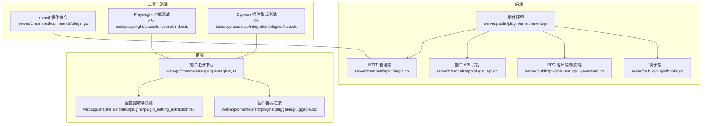
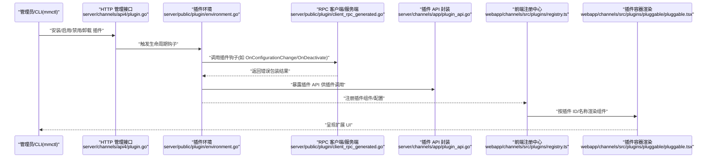
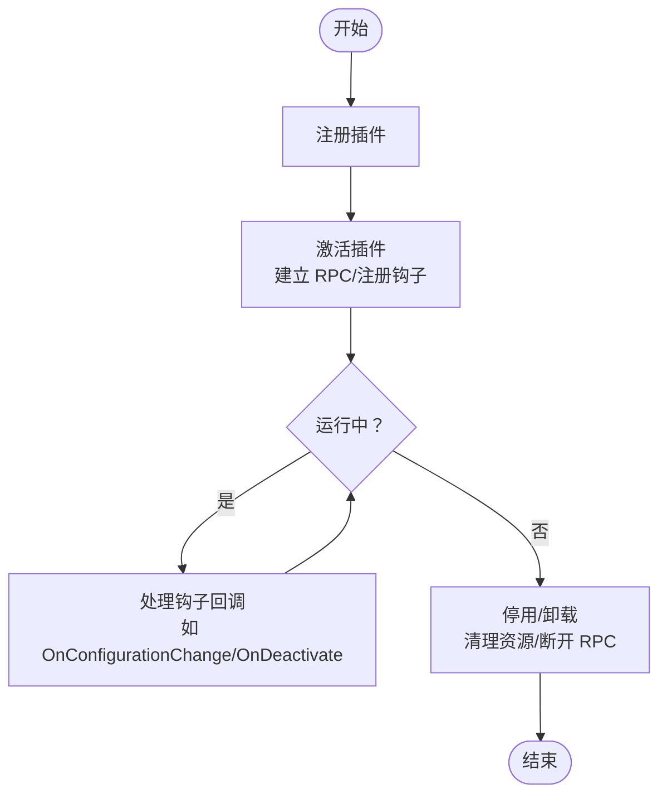
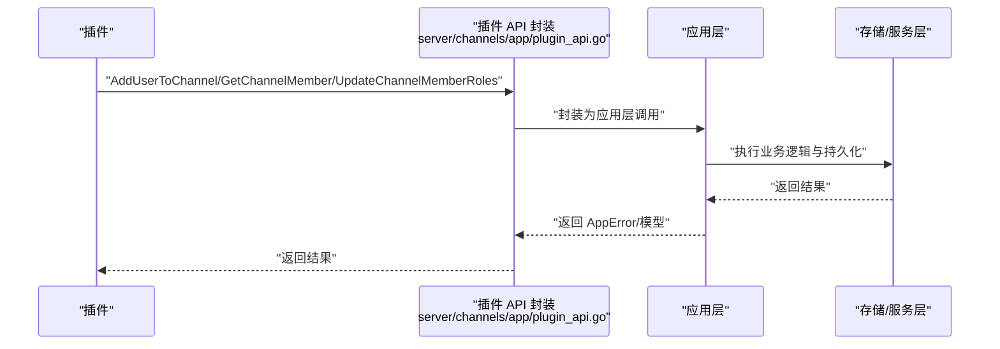
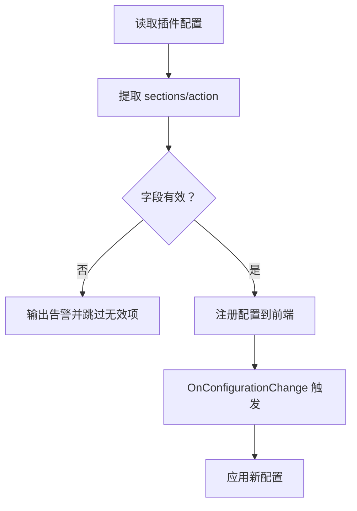
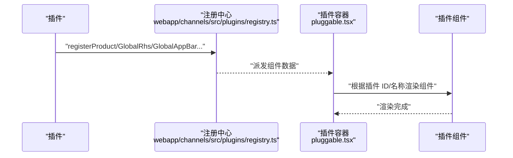
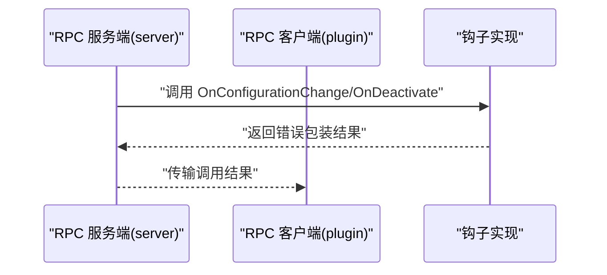
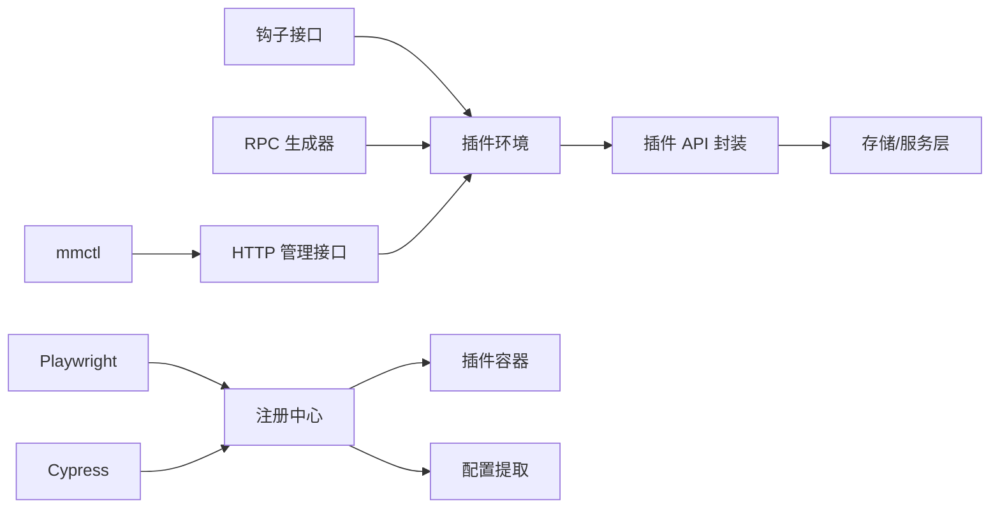

# 插件开发

<cite>
**本文引用的文件**
- [server/public/plugin/hooks.go](file://server/public/plugin/hooks.go)
- [server/public/plugin/environment.go](file://server/public/plugin/environment.go)
- [server/public/plugin/client_rpc_generated.go](file://server/public/plugin/client_rpc_generated.go)
- [server/channels/app/plugin_api.go](file://server/channels/app/plugin_api.go)
- [server/channels/api4/plugin.go](file://server/channels/api4/plugin.go)
- [server/cmd/mmctl/commands/plugin.go](file://server/cmd/mmctl/commands/plugin.go)
- [webapp/channels/src/plugins/pluggable/pluggable.tsx](file://webapp/channels/src/plugins/pluggable/pluggable.tsx)
- [webapp/channels/src/plugins/registry.ts](file://webapp/channels/src/plugins/registry.ts)
- [webapp/channels/src/utils/plugins/plugin_setting_extraction.tsx](file://webapp/channels/src/utils/plugins/plugin_setting_extraction.tsx)
- [e2e-tests/playwright/specs/functional/index.ts](file://e2e-tests/playwright/specs/functional/index.ts)
- [e2e-tests/cypress/tests/integration/plugins/index.ts](file://e2e-tests/cypress/tests/integration/plugins/index.ts)
</cite>

## 目录
1. [简介](#简介)
2. [项目结构](#项目结构)
3. [核心组件](#核心组件)
4. [架构总览](#架构总览)
5. [详细组件分析](#详细组件分析)
6. [依赖关系分析](#依赖关系分析)
7. [性能考量](#性能考量)
8. [故障排除指南](#故障排除指南)
9. [结论](#结论)
10. [附录](#附录)

## 简介
本指南面向希望在 Mattermost 中开发插件的工程师与产品人员，系统讲解插件架构、生命周期、接口与钩子机制、开发流程（从初始化到打包发布）、插件 API 使用（用户/频道/消息/文件等）、配置管理（定义、动态更新与校验）、与后端服务的交互模式（RPC、事件与状态同步）、前端插件开发（React 组件集成、UI 扩展与交互增强）、测试策略（单元、集成与端到端）以及部署与发布最佳实践（安装、卸载、更新、故障排除、版本与兼容性管理）。内容基于仓库中的真实实现进行提炼，确保可操作与可落地。

## 项目结构
Mattermost 插件体系由“后端插件框架”“前端插件注册与渲染”“CLI 管理工具”“测试套件”四大部分组成：
- 后端：插件生命周期与钩子、RPC 客户端/服务端生成、插件 API 封装、HTTP 管理接口
- 前端：插件组件注册与渲染、配置项提取与校验、主题与 WebSocket 集成
- CLI：插件安装、卸载、启用、禁用、更新等命令
- 测试：Playwright/Cypress 端到端测试覆盖插件功能

图表来源
- [server/public/plugin/environment.go:576-614](file://server/public/plugin/environment.go#L576-L614)
- [server/public/plugin/hooks.go](file://server/public/plugin/hooks.go)
- [server/public/plugin/client_rpc_generated.go:45-89](file://server/public/plugin/client_rpc_generated.go#L45-L89)
- [server/channels/app/plugin_api.go:617-658](file://server/channels/app/plugin_api.go#L617-L658)
- [server/channels/api4/plugin.go](file://server/channels/api4/plugin.go)
- [webapp/channels/src/plugins/registry.ts:77-1246](file://webapp/channels/src/plugins/registry.ts#L77-L1246)
- [webapp/channels/src/plugins/pluggable/pluggable.tsx:31-132](file://webapp/channels/src/plugins/pluggable/pluggable.tsx#L31-L132)
- [webapp/channels/src/utils/plugins/plugin_setting_extraction.tsx:40-87](file://webapp/channels/src/utils/plugins/plugin_setting_extraction.tsx#L40-L87)
- [server/cmd/mmctl/commands/plugin.go](file://server/cmd/mmctl/commands/plugin.go)
- [e2e-tests/playwright/specs/functional/index.ts](file://e2e-tests/playwright/specs/functional/index.ts)
- [e2e-tests/cypress/tests/integration/plugins/index.ts](file://e2e-tests/cypress/tests/integration/plugins/index.ts)

章节来源
- [server/public/plugin/environment.go:576-614](file://server/public/plugin/environment.go#L576-L614)
- [server/public/plugin/hooks.go](file://server/public/plugin/hooks.go)
- [server/public/plugin/client_rpc_generated.go:45-89](file://server/public/plugin/client_rpc_generated.go#L45-L89)
- [server/channels/app/plugin_api.go:617-658](file://server/channels/app/plugin_api.go#L617-L658)
- [server/channels/api4/plugin.go](file://server/channels/api4/plugin.go)
- [webapp/channels/src/plugins/registry.ts:77-1246](file://webapp/channels/src/plugins/registry.ts#L77-L1246)
- [webapp/channels/src/plugins/pluggable/pluggable.tsx:31-132](file://webapp/channels/src/plugins/pluggable/pluggable.tsx#L31-L132)
- [webapp/channels/src/utils/plugins/plugin_setting_extraction.tsx:40-87](file://webapp/channels/src/utils/plugins/plugin_setting_extraction.tsx#L40-L87)
- [server/cmd/mmctl/commands/plugin.go](file://server/cmd/mmctl/commands/plugin.go)
- [e2e-tests/playwright/specs/functional/index.ts](file://e2e-tests/playwright/specs/functional/index.ts)
- [e2e-tests/cypress/tests/integration/plugins/index.ts](file://e2e-tests/cypress/tests/integration/plugins/index.ts)

## 核心组件
- 插件环境与生命周期
  - 插件注册、激活、停用、包加载与 WebApp Bundle 处理
  - 提供 Hooks 与带 RPC 错误包装的 Hooks 访问器
- 钩子接口与 RPC
  - 自动生成的 RPC 客户端/服务端，支持 OnConfigurationChange、OnDeactivate 等钩子调用
- 插件 API 封装
  - 用户/频道/消息/文件等常用能力通过 PluginAPI 暴露给插件
- 前端插件注册与渲染
  - 注册插件组件（全局侧栏、右侧栏、产品主界面等），按插件 ID 与名称选择渲染
- 配置管理
  - 从插件配置中提取 sections/action，并进行有效性校验
- CLI 管理
  - mmctl 提供插件安装、卸载、启用/禁用、更新等命令
- 测试
  - Playwright 与 Cypress 提供端到端测试，覆盖插件功能与 UI

章节来源
- [server/public/plugin/environment.go:576-614](file://server/public/plugin/environment.go#L576-L614)
- [server/public/plugin/client_rpc_generated.go:45-89](file://server/public/plugin/client_rpc_generated.go#L45-L89)
- [server/channels/app/plugin_api.go:617-658](file://server/channels/app/plugin_api.go#L617-L658)
- [webapp/channels/src/plugins/registry.ts:77-1246](file://webapp/channels/src/plugins/registry.ts#L77-L1246)
- [webapp/channels/src/utils/plugins/plugin_setting_extraction.tsx:40-87](file://webapp/channels/src/utils/plugins/plugin_setting_extraction.tsx#L40-L87)
- [server/cmd/mmctl/commands/plugin.go](file://server/cmd/mmctl/commands/plugin.go)
- [e2e-tests/playwright/specs/functional/index.ts](file://e2e-tests/playwright/specs/functional/index.ts)
- [e2e-tests/cypress/tests/integration/plugins/index.ts](file://e2e-tests/cypress/tests/integration/plugins/index.ts)

## 架构总览
下图展示插件从“后端生命周期”到“前端渲染”的整体交互链路，以及与“CLI 管理”“测试”的关系。

图表来源
- [server/channels/api4/plugin.go](file://server/channels/api4/plugin.go)
- [server/public/plugin/environment.go:576-614](file://server/public/plugin/environment.go#L576-L614)
- [server/public/plugin/client_rpc_generated.go:45-89](file://server/public/plugin/client_rpc_generated.go#L45-L89)
- [server/channels/app/plugin_api.go:617-658](file://server/channels/app/plugin_api.go#L617-L658)
- [webapp/channels/src/plugins/registry.ts:77-1246](file://webapp/channels/src/plugins/registry.ts#L77-L1246)
- [webapp/channels/src/plugins/pluggable/pluggable.tsx:31-132](file://webapp/channels/src/plugins/pluggable/pluggable.tsx#L31-L132)

## 详细组件分析

### 插件生命周期与钩子机制
- 生命周期阶段
  - 注册：加载插件清单与资源，准备运行时上下文
  - 激活：建立 RPC 连接，注册钩子，准备接收回调
  - 运行：处理事件、调用 API、渲染 UI
  - 停用/卸载：清理资源、断开 RPC、注销钩子
- 关键钩子
  - OnConfigurationChange：配置变更回调
  - OnDeactivate：停用回调
- RPC 调用
  - 自动生成客户端/服务端桩，统一错误编码与日志记录

图表来源
- [server/public/plugin/environment.go:576-614](file://server/public/plugin/environment.go#L576-L614)
- [server/public/plugin/client_rpc_generated.go:45-89](file://server/public/plugin/client_rpc_generated.go#L45-L89)

章节来源
- [server/public/plugin/environment.go:576-614](file://server/public/plugin/environment.go#L576-L614)
- [server/public/plugin/client_rpc_generated.go:45-89](file://server/public/plugin/client_rpc_generated.go#L45-L89)

### 插件 API 使用（用户/频道/消息/文件）
- 用户与频道
  - 添加成员、获取成员、批量成员查询、更新角色等
- 消息
  - 发布、编辑、删除、附件上传等（通过插件 API 封装）
- 文件
  - 上传、预览、删除、归档导出等（通过插件 API 封装）

图表来源
- [server/channels/app/plugin_api.go:617-658](file://server/channels/app/plugin_api.go#L617-L658)
- [server/public/plugin/client_rpc_generated.go:4776-4949](file://server/public/plugin/client_rpc_generated.go#L4776-L4949)

章节来源
- [server/channels/app/plugin_api.go:617-658](file://server/channels/app/plugin_api.go#L617-L658)
- [server/public/plugin/client_rpc_generated.go:4776-4949](file://server/public/plugin/client_rpc_generated.go#L4776-L4949)

### 配置管理（定义、动态配置与校验）
- 配置项提取
  - 从插件配置中解析 sections/action，过滤无效项
- 校验与警告
  - 对缺失字段或类型不匹配进行告警，避免注入无效配置
- 动态更新
  - 通过 OnConfigurationChange 钩子响应配置变更

图表来源
- [webapp/channels/src/utils/plugins/plugin_setting_extraction.tsx:40-87](file://webapp/channels/src/utils/plugins/plugin_setting_extraction.tsx#L40-L87)
- [server/public/plugin/client_rpc_generated.go:81-89](file://server/public/plugin/client_rpc_generated.go#L81-L89)

章节来源
- [webapp/channels/src/utils/plugins/plugin_setting_extraction.tsx:40-87](file://webapp/channels/src/utils/plugins/plugin_setting_extraction.tsx#L40-L87)
- [server/public/plugin/client_rpc_generated.go:81-89](file://server/public/plugin/client_rpc_generated.go#L81-L89)

### 前端插件开发（React 组件集成、UI 扩展与交互增强）
- 组件注册
  - 支持全局侧栏、右侧栏、产品主界面等位置注册
  - 可指定 baseURL、switcher 图标/文本、主组件、头部组件等
- 渲染机制
  - 通过 Pluggable 容器按插件 ID 与名称选择性渲染
  - 自动注入主题与 WebSocket 客户端
- 交互增强
  - registerMessageWillBeUpdatedHook 等钩子允许拦截与修改消息发送前行为

图表来源
- [webapp/channels/src/plugins/registry.ts:77-1246](file://webapp/channels/src/plugins/registry.ts#L77-L1246)
- [webapp/channels/src/plugins/pluggable/pluggable.tsx:31-132](file://webapp/channels/src/plugins/pluggable/pluggable.tsx#L31-L132)

章节来源
- [webapp/channels/src/plugins/registry.ts:77-1246](file://webapp/channels/src/plugins/registry.ts#L77-L1246)
- [webapp/channels/src/plugins/pluggable/pluggable.tsx:31-132](file://webapp/channels/src/plugins/pluggable/pluggable.tsx#L31-L132)

### 与后端服务的交互模式（RPC、事件与状态同步）
- RPC 模式
  - 服务端作为 RPC 服务器，插件作为客户端；失败时返回可编码错误
- 事件与状态
  - 通过钩子与 API 实现事件上报与状态同步（如频道成员变更、消息发送等）

图表来源
- [server/public/plugin/client_rpc_generated.go:45-89](file://server/public/plugin/client_rpc_generated.go#L45-L89)

章节来源
- [server/public/plugin/client_rpc_generated.go:45-89](file://server/public/plugin/client_rpc_generated.go#L45-L89)

### 开发流程（初始化到打包发布）
- 初始化
  - 创建插件目录与清单文件，编写钩子与前端组件
- 开发与调试
  - 使用本地服务运行，结合前端热更新与后端日志
- 打包
  - 生成后端二进制与 WebApp Bundle，按清单打包为 tar.gz
- 发布
  - 通过系统或私有仓库分发，配合版本号与兼容性声明

章节来源
- [server/public/plugin/environment.go:576-614](file://server/public/plugin/environment.go#L576-L614)

### 部署与管理（安装、卸载、更新、故障排除）
- 安装/卸载/启用/禁用/更新
  - 通过 HTTP 管理接口与 mmctl 命令行完成
- 故障排除
  - 查看插件日志、确认钩子实现、检查 RPC 连接与配置项有效性

章节来源
- [server/channels/api4/plugin.go](file://server/channels/api4/plugin.go)
- [server/cmd/mmctl/commands/plugin.go](file://server/cmd/mmctl/commands/plugin.go)

### 测试策略（单元、集成与端到端）
- 单元测试
  - 针对插件钩子与 API 的行为进行断言
- 集成测试
  - 在系统内验证插件与平台交互（如频道成员变更、消息发送）
- 端到端测试
  - Playwright 与 Cypress 提供 UI 行为与流程测试

章节来源
- [e2e-tests/playwright/specs/functional/index.ts](file://e2e-tests/playwright/specs/functional/index.ts)
- [e2e-tests/cypress/tests/integration/plugins/index.ts](file://e2e-tests/cypress/tests/integration/plugins/index.ts)

## 依赖关系分析
- 后端耦合
  - 插件环境依赖钩子接口与 RPC 生成器
  - 插件 API 封装依赖应用层与存储层
- 前端耦合
  - 注册中心依赖渲染容器与配置提取模块
- 工具与测试
  - CLI 与 HTTP 接口驱动插件生命周期
  - E2E 测试覆盖前端渲染与交互

图表来源
- [server/public/plugin/hooks.go](file://server/public/plugin/hooks.go)
- [server/public/plugin/environment.go:576-614](file://server/public/plugin/environment.go#L576-L614)
- [server/public/plugin/client_rpc_generated.go:45-89](file://server/public/plugin/client_rpc_generated.go#L45-L89)
- [server/channels/app/plugin_api.go:617-658](file://server/channels/app/plugin_api.go#L617-L658)
- [webapp/channels/src/plugins/registry.ts:77-1246](file://webapp/channels/src/plugins/registry.ts#L77-L1246)
- [webapp/channels/src/plugins/pluggable/pluggable.tsx:31-132](file://webapp/channels/src/plugins/pluggable/pluggable.tsx#L31-L132)
- [webapp/channels/src/utils/plugins/plugin_setting_extraction.tsx:40-87](file://webapp/channels/src/utils/plugins/plugin_setting_extraction.tsx#L40-L87)
- [server/cmd/mmctl/commands/plugin.go](file://server/cmd/mmctl/commands/plugin.go)
- [e2e-tests/playwright/specs/functional/index.ts](file://e2e-tests/playwright/specs/functional/index.ts)
- [e2e-tests/cypress/tests/integration/plugins/index.ts](file://e2e-tests/cypress/tests/integration/plugins/index.ts)

章节来源
- [server/public/plugin/hooks.go](file://server/public/plugin/hooks.go)
- [server/public/plugin/environment.go:576-614](file://server/public/plugin/environment.go#L576-L614)
- [server/public/plugin/client_rpc_generated.go:45-89](file://server/public/plugin/client_rpc_generated.go#L45-L89)
- [server/channels/app/plugin_api.go:617-658](file://server/channels/app/plugin_api.go#L617-L658)
- [webapp/channels/src/plugins/registry.ts:77-1246](file://webapp/channels/src/plugins/registry.ts#L77-L1246)
- [webapp/channels/src/plugins/pluggable/pluggable.tsx:31-132](file://webapp/channels/src/plugins/pluggable/pluggable.tsx#L31-L132)
- [webapp/channels/src/utils/plugins/plugin_setting_extraction.tsx:40-87](file://webapp/channels/src/utils/plugins/plugin_setting_extraction.tsx#L40-L87)
- [server/cmd/mmctl/commands/plugin.go](file://server/cmd/mmctl/commands/plugin.go)
- [e2e-tests/playwright/specs/functional/index.ts](file://e2e-tests/playwright/specs/functional/index.ts)
- [e2e-tests/cypress/tests/integration/plugins/index.ts](file://e2e-tests/cypress/tests/integration/plugins/index.ts)

## 性能考量
- RPC 调用开销控制
  - 合理拆分钩子调用，避免在热路径上做重 IO
- 前端渲染优化
  - 使用 Pluggable 的按需渲染与错误边界，减少异常扩散
- 配置校验前置
  - 在前端尽早校验配置项，降低无效渲染成本

## 故障排除指南
- 钩子未实现
  - RPC 层会返回“未实现”错误，检查插件是否正确实现对应钩子
- 配置无效
  - 前端配置提取会告警并跳过无效项，检查 sections/action 字段与类型
- RPC 失败
  - 查看日志中的 RPC 调用失败信息，确认插件进程状态与网络连通性

章节来源
- [server/public/plugin/client_rpc_generated.go:45-89](file://server/public/plugin/client_rpc_generated.go#L45-L89)
- [webapp/channels/src/utils/plugins/plugin_setting_extraction.tsx:40-87](file://webapp/channels/src/utils/plugins/plugin_setting_extraction.tsx#L40-L87)

## 结论
Mattermost 插件体系以“后端生命周期 + RPC 钩子 + 前端注册渲染 + CLI 管理 + 测试覆盖”为核心，提供了从开发到发布的完整闭环。遵循本文档的架构理解、开发流程与最佳实践，可高效构建稳定、可维护且用户体验良好的插件。

## 附录
- 版本与兼容性
  - 发布时明确声明 Mattermost 版本兼容范围，避免 API 变更导致的不兼容
- 依赖处理
  - 明确列出 Go 与前端依赖版本，定期更新安全补丁
- 配置与安全
  - 对敏感配置项进行最小权限暴露，避免在前端直接展示密钥