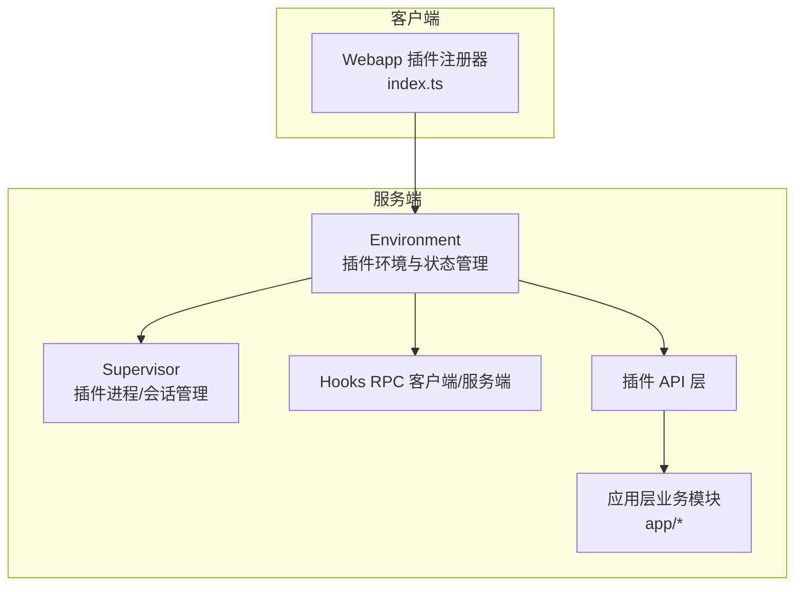
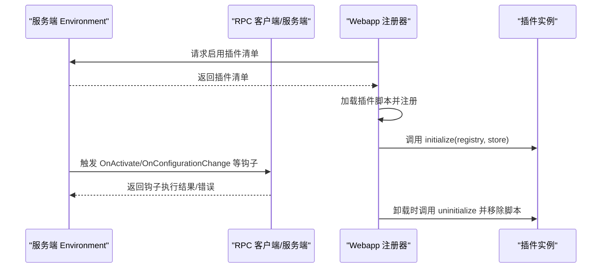
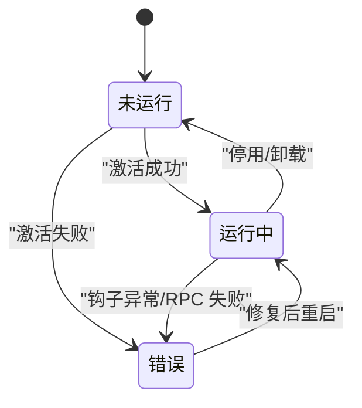
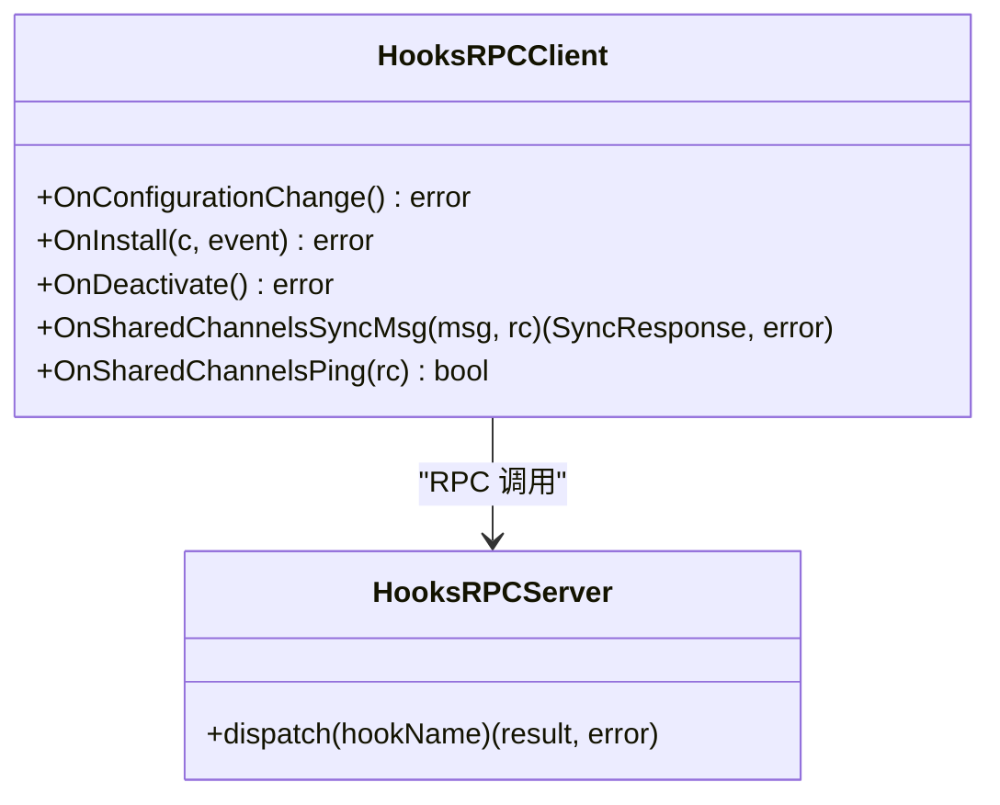
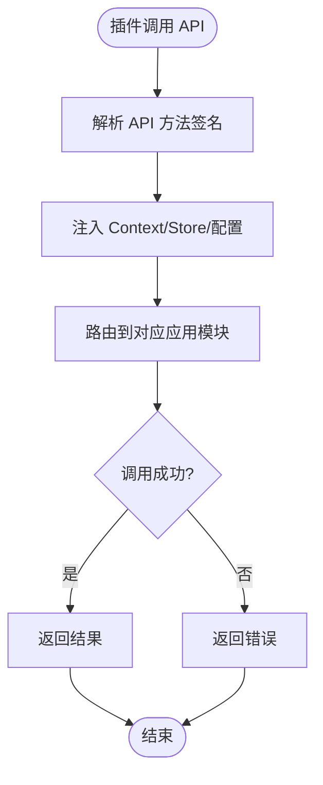
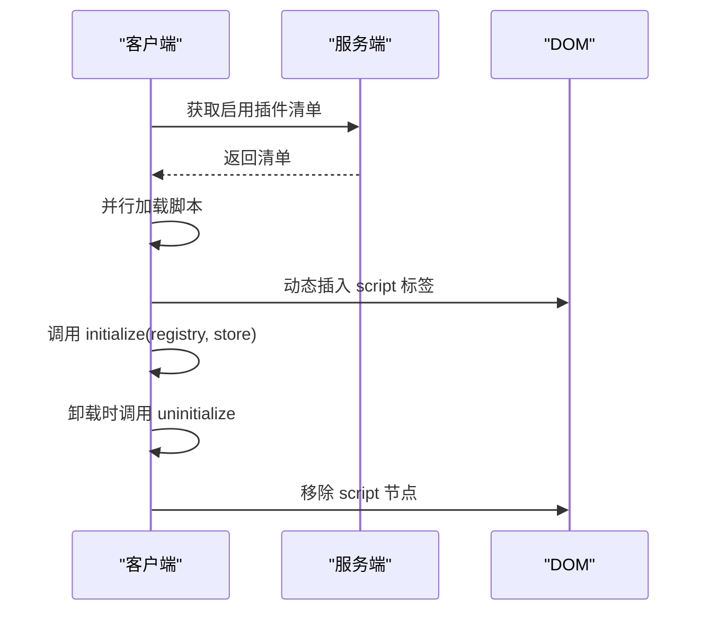
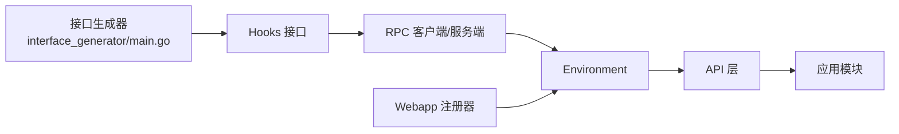

# 插件架构设计

<cite>
**本文引用的文件**
- [environment.go](file://server/public/plugin/environment.go)
- [client_rpc_generated.go](file://server/public/plugin/client_rpc_generated.go)
- [hooks.go](file://server/public/plugin/hooks.go)
- [api.go](file://server/public/plugin/api.go)
- [supervisor.go](file://server/public/plugin/supervisor.go)
- [index.ts](file://webapp/channels/src/plugins/index.ts)
- [interface_generator/main.go](file://server/public/plugin/interface_generator/main.go)
- [plugin.go](file://server/channels/api4/plugin.go)
- [plugin_local.go](file://server/channels/api4/plugin_local.go)
- [plugin_test.go](file://server/channels/api4/plugin_test.go)
- [app.go](file://server/channels/app/app.go)
- [context.go](file://server/channels/app/context.go)
- [audit.go](file://server/channels/app/audit.go)
- [authentication.go](file://server/channels/app/authentication.go)
- [authorization.go](file://server/channels/app/authorization.go)
- [board.go](file://server/channels/app/board.go)
- [command.go](file://server/channels/app/command.go)
- [team.go](file://server/channels/app/team.go)
- [user.go](file://server/channels/app/user.go)
- [post.go](file://server/channels/app/post.go)
- [channel.go](file://server/channels/app/channel.go)
- [file.go](file://server/channels/app/file.go)
- [webhook.go](file://server/channels/app/webhook.go)
- [websocket.go](file://server/channels/app/websocket.go)
- [job.go](file://server/channels/app/job.go)
- [ldap.go](file://server/channels/app/ldap.go)
- [saml.go](file://server/channels/app/saml.go)
- [oauth.go](file://server/channels/app/oauth.go)
- [cloud.go](file://server/channels/app/cloud.go)
- [cluster.go](file://server/channels/app/cluster.go)
- [metrics.go](file://server/channels/app/metrics.go)
- [system.go](file://server/channels/app/system.go)
- [brand.go](file://server/channels/app/brand.go)
- [emoji.go](file://server/channels/app/emoji.go)
- [preferences.go](file://server/channels/app/preferences.go)
- [status.go](file://server/channels/app/status.go)
- [reaction.go](file://server/channels/app/reaction.go)
- [upload.go](file://server/channels/app/upload.go)
- [export.go](file://server/channels/app/export.go)
- [import.go](file://server/channels/app/import.go)
- [content_flagging.go](file://server/channels/app/content_flagging.go)
- [data_retention.go](file://server/channels/app/data_retention.go)
- [ip_filtering.go](file://server/channels/app/ip_filtering.go)
- [limits.go](file://server/channels/app/limits.go)
- [compliance.go](file://server/channels/app/compliance.go)
- [custom_profile_attributes.go](file://server/channels/app/custom_profile_attributes.go)
- [shared_channel.go](file://server/channels/app/shared_channel.go)
- [remote_cluster.go](file://server/channels/app/remote_cluster.go)
- [integration_action.go](file://server/channels/app/integration_action.go)
- [outgoing_oauth_connection.go](file://server/channels/app/outgoing_oauth_connection.go)
- [role.go](file://server/channels/app/role.go)
- [scheme.go](file://server/channels/app/scheme.go)
- [permission.go](file://server/channels/app/permission.go)
- [access_control.go](file://server/channels/app/access_control.go)
- [view.go](file://server/channels/app/view.go)
- [drafts.go](file://server/channels/app/drafts.go)
- [bookmarks.go](file://server/channels/app/bookmarks.go)
- [recap.go](file://server/channels/app/recap.go)
- [reports.go](file://server/channels/app/reports.go)
- [usage.go](file://server/channels/app/usage.go)
- [jobs.go](file://server/jobs/jobs.go)
- [platform.go](file://server/platform/services/platform.go)
- [shared.go](file://server/platform/shared/shared.go)
</cite>

## 目录
1. [引言](#引言)
2. [项目结构](#项目结构)
3. [核心组件](#核心组件)
4. [架构总览](#架构总览)
5. [详细组件分析](#详细组件分析)
6. [依赖关系分析](#依赖关系分析)
7. [性能考虑](#性能考虑)
8. [故障排查指南](#故障排查指南)
9. [结论](#结论)
10. [附录](#附录)

## 引言
本文件系统性阐述 Mattermost 插件架构的设计与实现，覆盖插件生命周期管理、接口与钩子机制、RPC 调用、事件驱动与状态同步、插件环境管理（运行时配置、依赖注入、资源管理）、加载与卸载流程（初始化顺序、错误处理与清理）、以及最佳实践（性能优化、内存管理、并发安全）。文档以源码为依据，结合图示帮助读者从高层到细节全面理解插件系统。

## 项目结构
Mattermost 插件体系由服务端 Go 核心、客户端 Webapp 注册器、以及插件 API 与钩子生成器构成。服务端负责插件生命周期、RPC 通信、状态管理；客户端负责插件脚本加载、注册与卸载；插件通过标准接口与钩子与核心交互。

图表来源
- [environment.go:119-201](file://server/public/plugin/environment.go#L119-L201)
- [supervisor.go](file://server/public/plugin/supervisor.go)
- [client_rpc_generated.go:45-1279](file://server/public/plugin/client_rpc_generated.go#L45-L1279)
- [api.go](file://server/public/plugin/api.go)
- [index.ts:65-287](file://webapp/channels/src/plugins/index.ts#L65-L287)

章节来源
- [environment.go:119-201](file://server/public/plugin/environment.go#L119-L201)
- [index.ts:65-287](file://webapp/channels/src/plugins/index.ts#L65-L287)

## 核心组件
- 环境管理（Environment）
  - 维护已注册插件列表、活跃状态、错误信息与预打包插件集合。
  - 提供查询活跃插件、判断激活状态、设置/获取插件状态与错误等能力。
- Supervisor
  - 管理插件进程或会话，协调生命周期钩子调用与 RPC 通道。
- RPC 钩子（HooksWithRPCErr/Hooks）
  - 自动生成 RPC 客户端/服务端桩，封装插件钩子调用与传输错误处理。
- 插件 API（API）
  - 暴露给插件调用的核心系统能力，如用户、团队、频道、文件、作业等操作。
- Webapp 注册器（index.ts）
  - 服务端下发启用插件清单后，客户端异步加载对应脚本并注册插件实例。

章节来源
- [environment.go:119-201](file://server/public/plugin/environment.go#L119-L201)
- [supervisor.go](file://server/public/plugin/supervisor.go)
- [client_rpc_generated.go:45-1279](file://server/public/plugin/client_rpc_generated.go#L45-L1279)
- [api.go](file://server/public/plugin/api.go)
- [index.ts:65-287](file://webapp/channels/src/plugins/index.ts#L65-L287)

## 架构总览
下图展示了服务端与客户端在插件生命周期中的交互：服务端维护插件状态并通过 RPC 触发钩子；客户端按需加载与卸载插件脚本，并在注册后初始化插件。

图表来源
- [environment.go:585-610](file://server/public/plugin/environment.go#L585-L610)
- [client_rpc_generated.go:45-1279](file://server/public/plugin/client_rpc_generated.go#L45-L1279)
- [index.ts:90-111](file://webapp/channels/src/plugins/index.ts#L90-L111)

## 详细组件分析

### 生命周期管理与状态同步
- 状态模型
  - 插件状态包括未运行、禁用、运行中、错误等。Environment 提供状态查询与更新方法。
- 激活/停用
  - 通过 Environment 的 IsActive 与状态切换方法控制插件运行。
- 错误传播
  - 插件错误通过 Environment.SetPluginError 记录，便于诊断与状态反馈。

图表来源
- [environment.go:162-201](file://server/public/plugin/environment.go#L162-L201)

章节来源
- [environment.go:162-201](file://server/public/plugin/environment.go#L162-L201)

### 钩子机制与 RPC 调用
- 钩子接口
  - 通过接口生成器扫描插件实现的 Hooks 接口，自动生成 RPC 客户端/服务端桩。
- RPC 客户端/服务端
  - 客户端封装 Call 调用并在失败时记录日志与重置返回值，确保传输错误不影响后续处理。
  - 服务端根据实现动态分派到具体钩子函数。
- 常见钩子类型
  - OnConfigurationChange、OnInstall、OnDeactivate、OnSharedChannelsSyncMsg、OnSharedChannelsPing 等。

图表来源
- [client_rpc_generated.go:45-1279](file://server/public/plugin/client_rpc_generated.go#L45-L1279)
- [client_rpc_generated.go:1613-1677](file://server/public/plugin/client_rpc_generated.go#L1613-L1677)

章节来源
- [client_rpc_generated.go:45-1279](file://server/public/plugin/client_rpc_generated.go#L45-L1279)
- [client_rpc_generated.go:1613-1677](file://server/public/plugin/client_rpc_generated.go#L1613-L1677)
- [interface_generator/main.go:290-341](file://server/public/plugin/interface_generator/main.go#L290-L341)

### 插件 API 与依赖注入
- API 层职责
  - 将核心系统能力以受控方式暴露给插件，避免直接耦合。
- 依赖注入
  - 通过 Context 与 Store 注入插件运行所需的上下文与状态。
- 典型 API 能力
  - 用户、团队、频道、帖子、文件、作业、OAuth/SAML/LDAP、集群/云、指标、品牌、表情包、偏好、状态、反应、导出/导入、内容标记、数据保留、IP 过滤、限制、合规、自定义属性、共享频道、集成动作、权限/授权/方案/访问控制、视图/草稿/书签/周报/报表/用量等。

图表来源
- [api.go](file://server/public/plugin/api.go)
- [context.go](file://server/channels/app/context.go)
- [app.go](file://server/channels/app/app.go)

章节来源
- [api.go](file://server/public/plugin/api.go)
- [context.go](file://server/channels/app/context.go)
- [app.go](file://server/channels/app/app.go)

### 客户端插件加载与卸载
- 启用检测
  - 客户端根据全局配置与性能调试开关决定是否启用插件。
- 初始化流程
  - 获取启用插件清单 -> 并行加载各插件脚本 -> 注册插件并调用 initialize。
- 卸载流程
  - 调用 uninitialize/deinitialize -> 取消 WebSocket 事件监听 -> 移除脚本节点。

图表来源
- [index.ts:90-111](file://webapp/channels/src/plugins/index.ts#L90-L111)
- [index.ts:178-187](file://webapp/channels/src/plugins/index.ts#L178-L187)
- [index.ts:200-231](file://webapp/channels/src/plugins/index.ts#L200-L231)

章节来源
- [index.ts:65-287](file://webapp/channels/src/plugins/index.ts#L65-L287)

### 事件驱动与状态同步
- 事件来源
  - 插件安装/升级、配置变更、共享频道消息/心跳、系统事件等。
- 同步策略
  - 通过钩子回调与 RPC 通道进行单向/双向同步，确保插件与核心状态一致。
- 典型事件
  - OnInstall、OnConfigurationChange、OnSharedChannelsSyncMsg、OnSharedChannelsPing。

章节来源
- [client_rpc_generated.go:1254-1270](file://server/public/plugin/client_rpc_generated.go#L1254-L1270)
- [client_rpc_generated.go:1623-1639](file://server/public/plugin/client_rpc_generated.go#L1623-L1639)
- [client_rpc_generated.go:1665-1677](file://server/public/plugin/client_rpc_generated.go#L1665-L1677)

### 插件环境管理
- 运行时环境
  - 通过 Environment 管理插件注册表、活跃状态、错误信息与预打包插件。
- 依赖注入
  - API 层通过 Context 注入插件所需依赖，避免硬编码与全局污染。
- 资源管理
  - 客户端通过移除脚本节点与取消事件监听释放资源；服务端通过 Supervisor 管理会话与进程。

章节来源
- [environment.go:119-201](file://server/public/plugin/environment.go#L119-L201)
- [api.go](file://server/public/plugin/api.go)
- [index.ts:200-231](file://webapp/channels/src/plugins/index.ts#L200-L231)

### 加载与卸载流程
- 初始化顺序
  - 服务端：注册插件 -> 设置状态为运行中 -> 触发 OnConfigurationChange/OnActivate 等钩子。
  - 客户端：获取清单 -> 并行加载脚本 -> 注册插件 -> initialize。
- 错误处理
  - RPC 失败时记录日志并返回可识别的错误；客户端捕获加载异常并输出错误。
- 清理机制
  - 客户端卸载时移除脚本节点与事件监听；服务端设置状态为未运行并清理错误。

章节来源
- [environment.go:585-610](file://server/public/plugin/environment.go#L585-L610)
- [client_rpc_generated.go:45-1279](file://server/public/plugin/client_rpc_generated.go#L45-L1279)
- [index.ts:200-231](file://webapp/channels/src/plugins/index.ts#L200-L231)

## 依赖关系分析
- 低耦合高内聚
  - 插件通过标准化钩子与 API 与核心交互，减少直接依赖。
- RPC 解耦
  - 服务端与插件之间通过 RPC 通道解耦，支持跨语言/进程扩展。
- 生成器驱动
  - 接口生成器自动扫描插件实现，降低手工维护成本。

图表来源
- [interface_generator/main.go:290-341](file://server/public/plugin/interface_generator/main.go#L290-L341)
- [client_rpc_generated.go:45-1279](file://server/public/plugin/client_rpc_generated.go#L45-L1279)
- [environment.go:119-201](file://server/public/plugin/environment.go#L119-L201)
- [api.go](file://server/public/plugin/api.go)
- [index.ts:65-287](file://webapp/channels/src/plugins/index.ts#L65-L287)

章节来源
- [interface_generator/main.go:290-341](file://server/public/plugin/interface_generator/main.go#L290-L341)
- [client_rpc_generated.go:45-1279](file://server/public/plugin/client_rpc_generated.go#L45-L1279)
- [environment.go:119-201](file://server/public/plugin/environment.go#L119-L201)
- [api.go](file://server/public/plugin/api.go)
- [index.ts:65-287](file://webapp/channels/src/plugins/index.ts#L65-L287)

## 性能考虑
- 并行加载
  - 客户端对多个插件脚本采用并行加载，缩短初始化时间。
- RPC 批量与去抖
  - 对高频事件（如共享频道同步）建议在插件侧做批量与去抖处理，减少 RPC 压力。
- 内存管理
  - 插件应主动释放事件监听与定时器；客户端卸载时移除脚本节点，避免内存泄漏。
- 并发安全
  - 插件内部对共享资源使用互斥锁；服务端通过只读快照与写锁保护注册表。

## 故障排查指南
- 常见问题定位
  - RPC 调用失败：检查插件是否实现对应钩子、日志中是否有“RPC 调用失败”记录。
  - 插件未激活：确认 Environment 状态、错误信息与依赖项（如配置/权限）。
  - 客户端加载异常：查看控制台错误与脚本加载失败提示。
- 关键排查路径
  - 服务端：Environment 状态与错误记录、RPC 客户端日志。
  - 客户端：插件注册器的加载/卸载流程与错误输出。

章节来源
- [environment.go:162-201](file://server/public/plugin/environment.go#L162-L201)
- [client_rpc_generated.go:45-1279](file://server/public/plugin/client_rpc_generated.go#L45-L1279)
- [index.ts:200-231](file://webapp/channels/src/plugins/index.ts#L200-L231)

## 结论
Mattermost 插件架构通过标准化钩子、RPC 通信与严格的生命周期管理，实现了服务端与插件之间的松耦合与高扩展性。配合客户端的动态加载与卸载机制，插件可在不重启核心系统的情况下完成部署与更新。遵循本文的最佳实践与排障建议，可显著提升插件性能、稳定性与可维护性。

## 附录
- API 能力概览（节选）
  - 用户：创建/更新/查询、登录/鉴权、权限与角色、状态、反应、偏好、自定义属性等。
  - 团队/频道：加入/离开、可见性、成员管理、书签、视图、草稿等。
  - 内容：帖子、文件、上传、表情包、品牌、导出/导入、内容标记、数据保留、合规、用量等。
  - 集成：Webhook、OAuth/SAML/LDAP、集群/云、指标、报告、周报、报表等。
- 最佳实践清单
  - 使用钩子而非直接调用核心模块。
  - 在插件内对共享资源加锁，避免竞态。
  - 控制 RPC 频率，必要时合并请求。
  - 卸载时清理所有事件与定时器，确保无残留。
  - 通过日志与错误码快速定位问题。