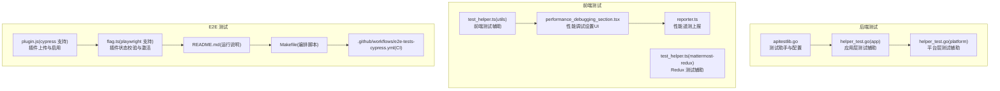
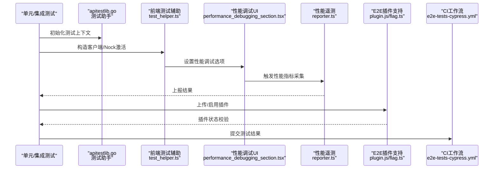
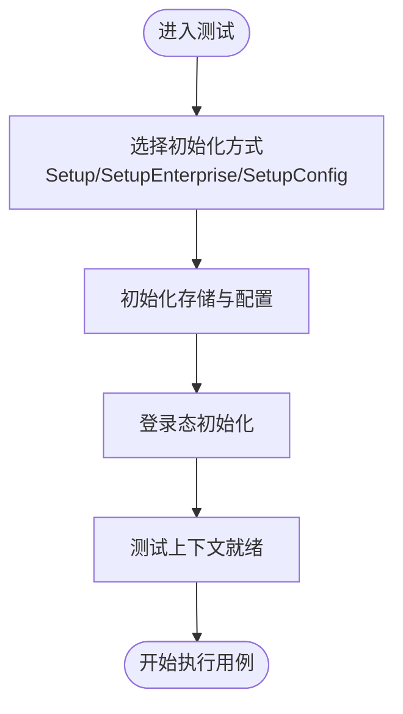
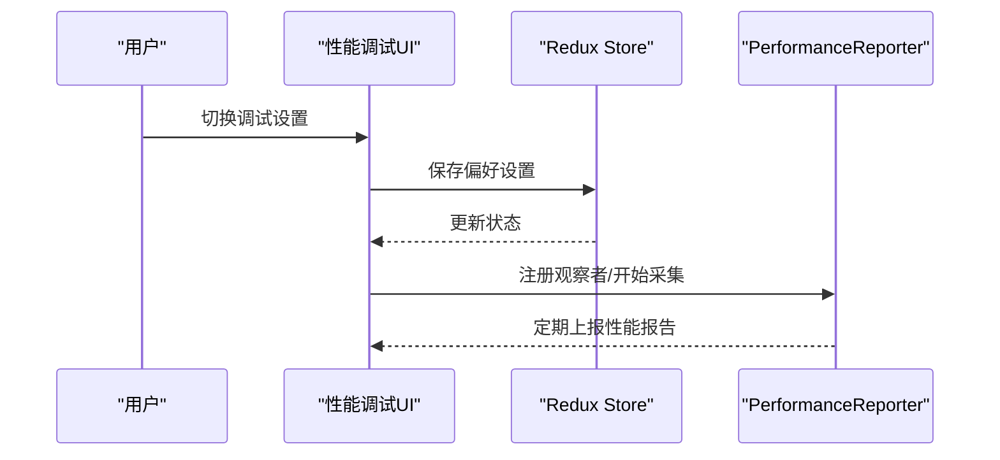
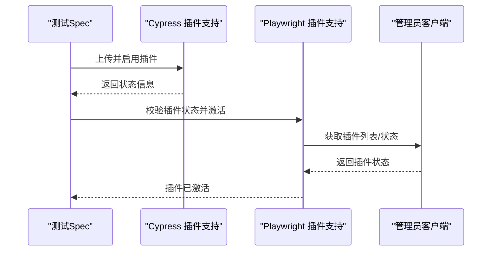
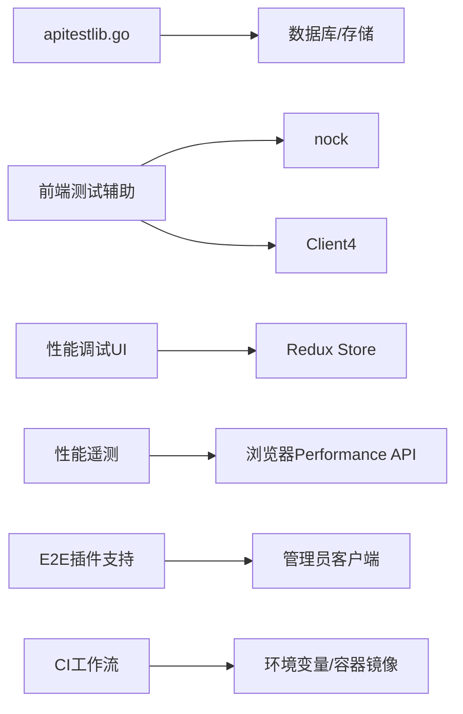

# 插件测试与调试

<cite>
**本文引用的文件**
- [apitestlib.go](file://server/channels/api4/apitestlib.go)
- [helper_test.go](file://server/channels/app/helper_test.go)
- [helper_test.go](file://server/channels/app/platform/helper_test.go)
- [test_helper.ts](file://webapp/channels/src/utils/test_helper.ts)
- [test_helper.ts](file://webapp/channels/src/packages/mattermost-redux/test/test_helper.ts)
- [performance_debugging_section.tsx](file://webapp/channels/src/components/user_settings/advanced/performance_debugging_section/performance_debugging_section.tsx)
- [reporter.ts](file://webapp/channels/src/utils/performance_telemetry/reporter.ts)
- [plugin.js](file://e2e-tests/cypress/tests/support/api/plugin.js)
- [flag.ts](file://e2e-tests/playwright/lib/src/flag.ts)
- [README.md](file://e2e-tests/README.md)
- [Makefile](file://e2e-tests/Makefile)
- [e2e-tests-cypress.yml](file://.github/workflows/e2e-tests-cypress.yml)
</cite>

## 目录
1. [简介](#简介)
2. [项目结构](#项目结构)
3. [核心组件](#核心组件)
4. [架构总览](#架构总览)
5. [详细组件分析](#详细组件分析)
6. [依赖关系分析](#依赖关系分析)
7. [性能考量](#性能考量)
8. [故障排查指南](#故障排查指南)
9. [结论](#结论)
10. [附录](#附录)

## 简介
本指南面向 Mattermost 插件开发者，系统化讲解插件测试与调试的策略与实践，覆盖单元测试、集成测试与端到端测试（E2E）的实施路径；详述测试环境搭建、测试数据准备、模拟服务配置与测试工具使用；提供日志记录、断点调试与性能分析等调试技巧；给出测试用例设计要点（边界条件、异常处理、回归测试）以及测试自动化的落地建议（CI 配置、测试报告与质量门禁）。文档中的所有技术细节均基于仓库现有实现进行归纳总结。

## 项目结构
围绕插件测试与调试，本仓库的关键测试相关目录与文件如下：
- 后端测试基础设施：server/channels/api4/apitestlib.go、server/channels/app/*_test.go 等
- 前端测试辅助：webapp/channels/src/utils/test_helper.ts、webapp/channels/src/packages/mattermost-redux/test/test_helper.ts
- 性能调试与遥测：webapp/channels/src/components/user_settings/advanced/performance_debugging_section/performance_debugging_section.tsx、webapp/channels/src/utils/performance_telemetry/reporter.ts
- E2E 测试与插件管理：e2e-tests/cypress/tests/support/api/plugin.js、e2e-tests/playwright/lib/src/flag.ts
- E2E 运行与编排：e2e-tests/README.md、e2e-tests/Makefile、.github/workflows/e2e-tests-cypress.yml

图表来源
- [apitestlib.go](file://server/channels/api4/apitestlib.go)
- [helper_test.go](file://server/channels/app/helper_test.go)
- [helper_test.go](file://server/channels/app/platform/helper_test.go)
- [test_helper.ts](file://webapp/channels/src/utils/test_helper.ts)
- [test_helper.ts](file://webapp/channels/src/packages/mattermost-redux/test/test_helper.ts)
- [performance_debugging_section.tsx](file://webapp/channels/src/components/user_settings/advanced/performance_debugging_section/performance_debugging_section.tsx)
- [reporter.ts](file://webapp/channels/src/utils/performance_telemetry/reporter.ts)
- [plugin.js](file://e2e-tests/cypress/tests/support/api/plugin.js)
- [flag.ts](file://e2e-tests/playwright/lib/src/flag.ts)
- [README.md](file://e2e-tests/README.md)
- [Makefile](file://e2e-tests/Makefile)
- [.github/workflows/e2e-tests-cypress.yml](file://.github/workflows/e2e-tests-cypress.yml)

章节来源
- [apitestlib.go](file://server/channels/api4/apitestlib.go)
- [helper_test.go](file://server/channels/app/helper_test.go)
- [helper_test.go](file://server/channels/app/platform/helper_test.go)
- [test_helper.ts](file://webapp/channels/src/utils/test_helper.ts)
- [test_helper.ts](file://webapp/channels/src/packages/mattermost-redux/test/test_helper.ts)
- [performance_debugging_section.tsx](file://webapp/channels/src/components/user_settings/advanced/performance_debugging_section/performance_debugging_section.tsx)
- [reporter.ts](file://webapp/channels/src/utils/performance_telemetry/reporter.ts)
- [plugin.js](file://e2e-tests/cypress/tests/support/api/plugin.js)
- [flag.ts](file://e2e-tests/playwright/lib/src/flag.ts)
- [README.md](file://e2e-tests/README.md)
- [Makefile](file://e2e-tests/Makefile)
- [.github/workflows/e2e-tests-cypress.yml](file://.github/workflows/e2e-tests-cypress.yml)

## 核心组件
- 后端测试助手与配置
  - 提供统一的测试初始化流程、数据库与存储层配置、企业版开关、登录态初始化等能力，便于在测试中快速构建可复用的上下文。
- 前端测试辅助
  - 提供 Nock 激活、客户端实例构造、随机用户与资源生成、Redux 测试工具等，支撑前端接口与组件的单元测试与集成测试。
- 性能调试与遥测
  - 提供性能调试设置项与前端性能指标采集与上报机制，便于定位前端性能瓶颈。
- E2E 插件管理
  - 在 Cypress 与 Playwright 中提供插件上传、安装、启用与状态校验的封装，确保测试前插件处于预期状态。
- E2E 运行与编排
  - 提供本地一键启动测试服务器、容器编排、测试执行与报告收集的 Makefile 脚本，以及 GitHub Actions 的 E2E 工作流定义。

章节来源
- [apitestlib.go](file://server/channels/api4/apitestlib.go)
- [helper_test.go](file://server/channels/app/helper_test.go)
- [helper_test.go](file://server/channels/app/platform/helper_test.go)
- [test_helper.ts](file://webapp/channels/src/utils/test_helper.ts)
- [test_helper.ts](file://webapp/channels/src/packages/mattermost-redux/test/test_helper.ts)
- [performance_debugging_section.tsx](file://webapp/channels/src/components/user_settings/advanced/performance_debugging_section/performance_debugging_section.tsx)
- [reporter.ts](file://webapp/channels/src/utils/performance_telemetry/reporter.ts)
- [plugin.js](file://e2e-tests/cypress/tests/support/api/plugin.js)
- [flag.ts](file://e2e-tests/playwright/lib/src/flag.ts)
- [README.md](file://e2e-tests/README.md)
- [Makefile](file://e2e-tests/Makefile)
- [.github/workflows/e2e-tests-cypress.yml](file://.github/workflows/e2e-tests-cypress.yml)

## 架构总览
下图展示了从测试用例到被测系统的调用链路，涵盖后端 API 测试助手、前端测试辅助、E2E 插件管理与 CI 编排：

图表来源
- [apitestlib.go](file://server/channels/api4/apitestlib.go)
- [test_helper.ts](file://webapp/channels/src/utils/test_helper.ts)
- [performance_debugging_section.tsx](file://webapp/channels/src/components/user_settings/advanced/performance_debugging_section/performance_debugging_section.tsx)
- [reporter.ts](file://webapp/channels/src/utils/performance_telemetry/reporter.ts)
- [plugin.js](file://e2e-tests/cypress/tests/support/api/plugin.js)
- [flag.ts](file://e2e-tests/playwright/lib/src/flag.ts)
- [.github/workflows/e2e-tests-cypress.yml](file://.github/workflows/e2e-tests-cypress.yml)

## 详细组件分析

### 后端测试助手与配置（apitestlib.go）
- 能力概览
  - 提供 Setup、SetupEnterprise、SetupConfig 等多类初始化入口，支持短时测试跳过、配置更新、登录态初始化等。
  - 提供基于内存存储的 Mock Store 与特定场景下的 Store 重载，便于隔离数据库依赖。
- 关键流程
  - 初始化数据库与搜索引擎存储，设置 SiteURL 等必要配置，随后完成登录态初始化，返回可直接使用的 TestHelper。
- 使用建议
  - 单元测试优先使用 Mock Store；需要真实数据库行为时再切换到真实存储。
  - 对于企业版特性测试，使用 Enterprise 初始化入口以启用相应开关。

图表来源
- [apitestlib.go](file://server/channels/api4/apitestlib.go)

章节来源
- [apitestlib.go](file://server/channels/api4/apitestlib.go)

### 应用层测试辅助（helper_test.go）
- 能力概览
  - 提供 Setup、SetupEnterprise、SetupConfig 等便捷入口，支持无预加载迁移、Store Mock 等特殊场景。
- 使用建议
  - 需要最小化依赖时使用 WithoutPreloadMigrations；需要验证存储层行为时使用真实 Store。

章节来源
- [helper_test.go](file://server/channels/app/helper_test.go)

### 平台层测试辅助（helper_test.go）
- 能力概览
  - 提供集群与缓存层测试辅助，支持在测试中注入 ClusterInterface 与内存配置存储。
- 使用建议
  - 集成测试中通过该辅助注入外部依赖，确保测试隔离性与可控性。

章节来源
- [helper_test.go](file://server/channels/app/platform/helper_test.go)

### 前端测试辅助（webapp 测试工具）
- mattermost-redux 测试辅助
  - 提供 Nock 激活、Client4 实例构造、随机邮箱与用户生成、基础用户/团队/频道/帖子对象构造等。
- utils 测试辅助
  - 提供前端通用测试工具与模型构造器，便于快速生成测试数据与断言。

章节来源
- [test_helper.ts](file://webapp/channels/src/packages/mattermost-redux/test/test_helper.ts)
- [test_helper.ts](file://webapp/channels/src/utils/test_helper.ts)

### 性能调试与遥测（前端）
- 性能调试设置 UI
  - 提供“性能调试”设置项，支持禁用客户端插件、禁用输入中提示等，便于隔离前端性能影响因素。
- 性能遥测上报
  - 通过 PerformanceObserver 订阅 mark/measure，周期性生成并上报性能报告，包含计数器与直方图指标。

图表来源
- [performance_debugging_section.tsx](file://webapp/channels/src/components/user_settings/advanced/performance_debugging_section/performance_debugging_section.tsx)
- [reporter.ts](file://webapp/channels/src/utils/performance_telemetry/reporter.ts)

章节来源
- [performance_debugging_section.tsx](file://webapp/channels/src/components/user_settings/advanced/performance_debugging_section/performance_debugging_section.tsx)
- [reporter.ts](file://webapp/channels/src/utils/performance_telemetry/reporter.ts)

### E2E 插件管理（Cypress 与 Playwright）
- Cypress 插件支持
  - 提供 apiUploadPlugin、apiUploadAndEnablePlugin 等命令，支持按版本精确匹配与启用逻辑。
- Playwright 插件支持
  - 提供 ensurePluginsLoaded，确保插件已安装并激活，否则断言失败。

图表来源
- [plugin.js](file://e2e-tests/cypress/tests/support/api/plugin.js)
- [flag.ts](file://e2e-tests/playwright/lib/src/flag.ts)

章节来源
- [plugin.js](file://e2e-tests/cypress/tests/support/api/plugin.js)
- [flag.ts](file://e2e-tests/playwright/lib/src/flag.ts)

### E2E 运行与编排
- 运行说明
  - 提供 SERVER、TEST、ENABLED_DOCKER_SERVICES、TEST_FILTER 等变量配置，支持 on-prem/cloud、Cypress/Playwright/none 三种模式。
- Makefile 编排
  - 提供 generate-server/start-server/stop-server/run-test 等目标，串联容器编排与测试执行。
- CI 工作流
  - 定义 E2E 测试工作流，支持分支、构建号、许可证、报告钩子等参数化配置。

章节来源
- [README.md](file://e2e-tests/README.md)
- [Makefile](file://e2e-tests/Makefile)
- [.github/workflows/e2e-tests-cypress.yml](file://.github/workflows/e2e-tests-cypress.yml)

## 依赖关系分析
- 组件耦合
  - 后端测试助手对数据库与配置有强依赖，但通过 Mock Store 与内存配置可降低耦合度。
  - 前端测试辅助依赖 nock 与 Client4，需注意网络拦截与时间戳一致性。
  - E2E 插件支持依赖管理员客户端与测试服务器，需保证测试前插件状态一致。
- 外部依赖
  - CI 工作流依赖容器镜像、许可证与报告钩子，需在流水线中正确注入环境变量。

图表来源
- [apitestlib.go](file://server/channels/api4/apitestlib.go)
- [test_helper.ts](file://webapp/channels/src/utils/test_helper.ts)
- [performance_debugging_section.tsx](file://webapp/channels/src/components/user_settings/advanced/performance_debugging_section/performance_debugging_section.tsx)
- [reporter.ts](file://webapp/channels/src/utils/performance_telemetry/reporter.ts)
- [plugin.js](file://e2e-tests/cypress/tests/support/api/plugin.js)
- [.github/workflows/e2e-tests-cypress.yml](file://.github/workflows/e2e-tests-cypress.yml)

章节来源
- [apitestlib.go](file://server/channels/api4/apitestlib.go)
- [test_helper.ts](file://webapp/channels/src/utils/test_helper.ts)
- [performance_debugging_section.tsx](file://webapp/channels/src/components/user_settings/advanced/performance_debugging_section/performance_debugging_section.tsx)
- [reporter.ts](file://webapp/channels/src/utils/performance_telemetry/reporter.ts)
- [plugin.js](file://e2e-tests/cypress/tests/support/api/plugin.js)
- [.github/workflows/e2e-tests-cypress.yml](file://.github/workflows/e2e-tests-cypress.yml)

## 性能考量
- 前端性能调试
  - 使用性能调试设置项隔离客户端插件与输入中提示，减少前端渲染与事件开销。
  - 通过性能遥测上报周期性采集关键指标，结合浏览器性能面板定位热点。
- 后端测试性能
  - 使用 Mock Store 与内存配置避免数据库与磁盘 IO；仅在必要时启用真实存储。
  - 控制测试并发与容器资源，避免竞争与超时。

## 故障排查指南
- 插件未安装或未激活
  - 在 E2E 中先检查插件状态，若未安装则上传并启用，若已安装但未激活则触发启用流程。
- 测试环境变量缺失
  - 确认 SERVER、TEST、MM_LICENSE、CWS_URL 等变量是否按运行模式正确设置。
- CI 报告与钩子
  - 检查 REPORT_WEBHOOK_URL、AUTOMATION_DASHBOARD_* 等变量是否注入，确保报告可正常发布。
- 日志与断点
  - 后端测试可通过标准日志输出定位问题；前端测试可利用 nock 的请求拦截与响应断言。
  - 前端性能问题可借助性能调试 UI 与遥测上报进行定位。

章节来源
- [plugin.js](file://e2e-tests/cypress/tests/support/api/plugin.js)
- [flag.ts](file://e2e-tests/playwright/lib/src/flag.ts)
- [README.md](file://e2e-tests/README.md)
- [.github/workflows/e2e-tests-cypress.yml](file://.github/workflows/e2e-tests-cypress.yml)

## 结论
本指南基于仓库现有实现，给出了插件测试与调试的系统化方法论：以 apitestlib 与前端测试辅助为基座，结合 E2E 插件管理与 CI 编排，形成从单元到端到端的完整测试闭环。通过性能调试与遥测工具，能够有效定位前端性能瓶颈；通过规范的测试用例设计与自动化流程，保障插件质量与稳定性。

## 附录
- 测试用例编写要点
  - 边界条件：空值、超长字符串、非法字符、权限不足等。
  - 异常处理：网络错误、服务不可用、插件冲突等。
  - 回归测试：对关键路径与历史缺陷进行回归覆盖。
- 测试自动化建议
  - 在 CI 中固定 SERVER 与 TEST 模式，确保环境一致性。
  - 使用 TEST_FILTER 精准筛选用例，提升执行效率。
  - 将报告与质量门禁集成至流水线，确保每次提交均通过测试。