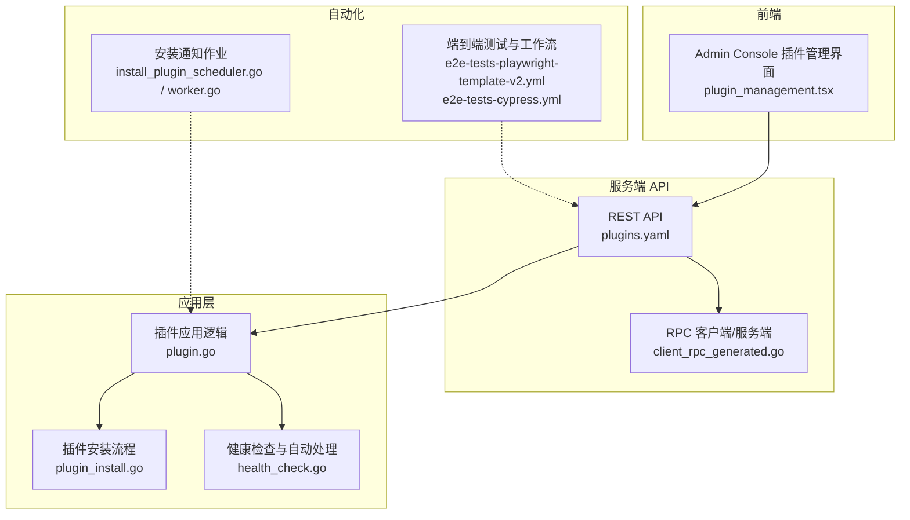
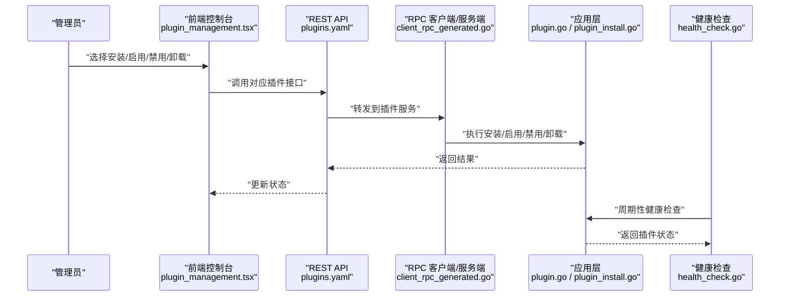
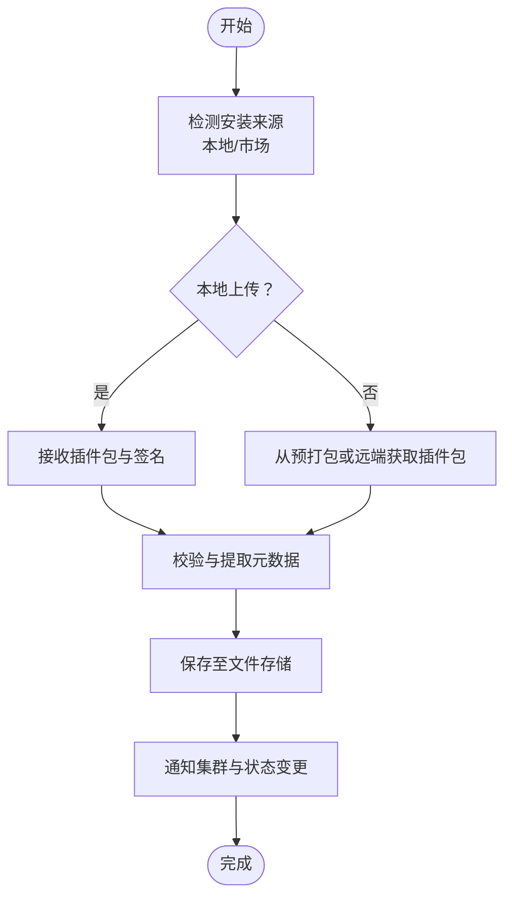
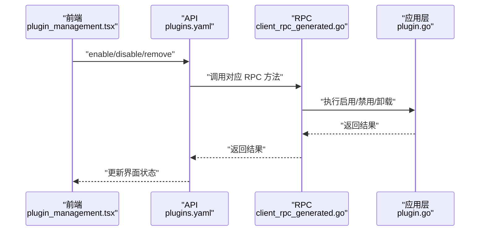
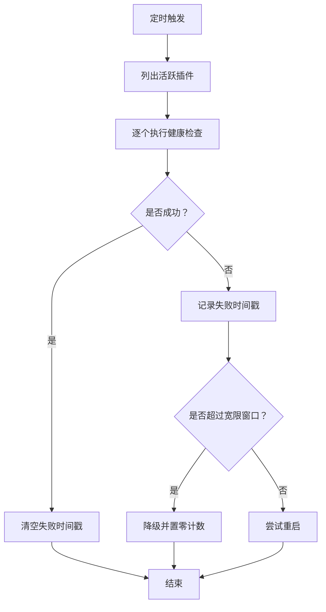
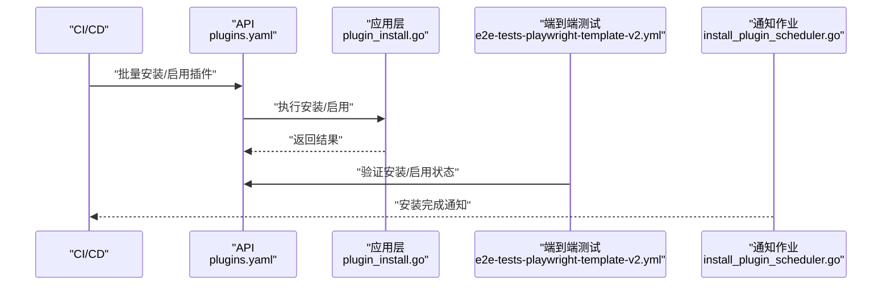
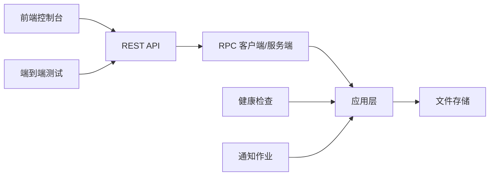

# 插件部署与管理

<cite>
**本文引用的文件**
- [plugin_install.go](file://server/channels/app/plugin_install.go)
- [plugin.go（应用层）](file://server/channels/app/plugin.go)
- [plugin_api.go](file://server/channels/app/plugin_api.go)
- [plugin.tsx（前端插件管理界面）](file://webapp/channels/src/components/admin_console/plugin_management/plugin_management.tsx)
- [health_check.go（插件健康检查）](file://server/public/plugin/health_check.go)
- [client_rpc.go（RPC 客户端）](file://server/public/plugin/client_rpc_generated.go)
- [plugin.ts（Playwright 插件辅助）](file://e2e-tests/playwright/lib/src/server/plugin.ts)
- [client4.go（客户端 SDK）](file://server/public/model/client4.go)
- [plugin.yaml（API 定义）](file://api/v4/source/plugins.yaml)
- [install_plugin_scheduler.go](file://server/channels/jobs/notify_admin/install_plugin_scheduler.go)
- [worker.go](file://server/channels/jobs/notify_admin/worker.go)
- [e2e-tests-playwright-template-v2.yml](file://.github/workflows/e2e-tests-playwright-template-v2.yml)
- [e2e-tests-cypress.yml](file://.github/workflows/e2e-tests-cypress.yml)
</cite>

## 目录
1. [简介](#简介)
2. [项目结构](#项目结构)
3. [核心组件](#核心组件)
4. [架构总览](#架构总览)
5. [详细组件分析](#详细组件分析)
6. [依赖关系分析](#依赖关系分析)
7. [性能考量](#性能考量)
8. [故障排除指南](#故障排除指南)
9. [结论](#结论)
10. [附录](#附录)

## 简介
本指南面向 Mattermost 管理员与运维工程师，系统阐述插件的安装、启用/禁用、更新与卸载的全生命周期管理；覆盖本地安装、远程安装与批量部署；解释插件包管理中的版本控制、依赖与兼容性检查；提供健康检查、性能监控与故障诊断方法；总结备份、回滚与升级的最佳实践，并给出可落地的自动化方案（CI/CD 集成、配置管理与批量操作），最后提供常见问题排查清单。

## 项目结构
围绕插件管理的关键代码分布在以下模块：
- 应用层：负责插件安装、启用/禁用、卸载与集群事件通知
- API 层：提供 REST 接口与 RPC 调用
- 前端控制台：提供图形化插件管理界面
- 健康检查与重启：内置插件健康检查与自动降级策略
- 自动化测试与工作流：提供端到端测试与 CI/CD 参考

图表来源
- [plugin_management.tsx](file://webapp/channels/src/components/admin_console/plugin_management/plugin_management.tsx)
- [plugins.yaml](file://api/v4/source/plugins.yaml)
- [client_rpc_generated.go](file://server/public/plugin/client_rpc_generated.go)
- [plugin.go](file://server/channels/app/plugin.go)
- [plugin_install.go](file://server/channels/app/plugin_install.go)
- [health_check.go](file://server/public/plugin/health_check.go)
- [install_plugin_scheduler.go](file://server/channels/jobs/notify_admin/install_plugin_scheduler.go)
- [worker.go](file://server/channels/jobs/notify_admin/worker.go)
- [e2e-tests-playwright-template-v2.yml](file://.github/workflows/e2e-tests-playwright-template-v2.yml)
- [e2e-tests-cypress.yml](file://.github/workflows/e2e-tests-cypress.yml)

章节来源
- [plugin_management.tsx](file://webapp/channels/src/components/admin_console/plugin_management/plugin_management.tsx)
- [plugins.yaml](file://api/v4/source/plugins.yaml)
- [client_rpc_generated.go](file://server/public/plugin/client_rpc_generated.go)
- [plugin.go](file://server/channels/app/plugin.go)
- [plugin_install.go](file://server/channels/app/plugin_install.go)
- [health_check.go](file://server/public/plugin/health_check.go)
- [install_plugin_scheduler.go](file://server/channels/jobs/notify_admin/install_plugin_scheduler.go)
- [worker.go](file://server/channels/jobs/notify_admin/worker.go)
- [e2e-tests-playwright-template-v2.yml](file://.github/workflows/e2e-tests-playwright-template-v2.yml)
- [e2e-tests-cypress.yml](file://.github/workflows/e2e-tests-cypress.yml)

## 核心组件
- 插件安装器：支持本地上传与市场安装，持久化到文件存储并广播集群事件
- 启用/禁用/卸载：通过应用层统一入口，结合 RPC 与前端交互
- 健康检查：周期性检查活跃插件状态，失败时自动重启或降级
- 批量与自动化：提供批量安装、启用与端到端测试工作流

章节来源
- [plugin_install.go](file://server/channels/app/plugin_install.go)
- [plugin.go](file://server/channels/app/plugin.go)
- [client_rpc_generated.go](file://server/public/plugin/client_rpc_generated.go)
- [health_check.go](file://server/public/plugin/health_check.go)

## 架构总览
下图展示从用户操作到服务端执行再到健康检查的整体流程。

图表来源
- [plugin_management.tsx](file://webapp/channels/src/components/admin_console/plugin_management/plugin_management.tsx)
- [plugins.yaml](file://api/v4/source/plugins.yaml)
- [client_rpc_generated.go](file://server/public/plugin/client_rpc_generated.go)
- [plugin.go](file://server/channels/app/plugin.go)
- [plugin_install.go](file://server/channels/app/plugin_install.go)
- [health_check.go](file://server/public/plugin/health_check.go)

## 详细组件分析

### 组件一：插件安装流程（本地与远程）
- 本地安装：接收二进制包与签名，校验后写入文件存储，广播集群事件
- 远程安装：优先从预打包目录获取，否则从远端市场下载，再进行本地安装
- 升级策略：根据安装策略决定覆盖或保留旧版本

图表来源
- [plugin_install.go](file://server/channels/app/plugin_install.go)

章节来源
- [plugin_install.go](file://server/channels/app/plugin_install.go)

### 组件二：启用/禁用/卸载
- 启用/禁用：通过 RPC 调用应用层实现，前端触发后由 API 层转发
- 卸载：删除插件并清理相关资源，同时广播集群事件

图表来源
- [plugin_management.tsx](file://webapp/channels/src/components/admin_console/plugin_management/plugin_management.tsx)
- [plugins.yaml](file://api/v4/source/plugins.yaml)
- [client_rpc_generated.go](file://server/public/plugin/client_rpc_generated.go)
- [plugin.go](file://server/channels/app/plugin.go)

章节来源
- [plugin_management.tsx](file://webapp/channels/src/components/admin_console/plugin_management/plugin_management.tsx)
- [client_rpc_generated.go](file://server/public/plugin/client_rpc_generated.go)
- [plugin.go](file://server/channels/app/plugin.go)

### 组件三：健康检查与自动处理
- 周期性检查：定时扫描活跃插件，执行 RPC Ping
- 失败判定：在时间窗口内累计失败次数达到阈值则降级
- 自动重启：未达降级阈值时尝试重启插件

图表来源
- [health_check.go](file://server/public/plugin/health_check.go)

章节来源
- [health_check.go](file://server/public/plugin/health_check.go)

### 组件四：批量部署与自动化
- 批量安装：通过 API 批量安装多个插件，或先安装后启用
- 端到端测试：提供 Playwright/Cypress 工作流，验证安装与启用流程
- 通知作业：安装完成后向管理员发送通知

图表来源
- [plugins.yaml](file://api/v4/source/plugins.yaml)
- [plugin_install.go](file://server/channels/app/plugin_install.go)
- [e2e-tests-playwright-template-v2.yml](file://.github/workflows/e2e-tests-playwright-template-v2.yml)
- [install_plugin_scheduler.go](file://server/channels/jobs/notify_admin/install_plugin_scheduler.go)

章节来源
- [plugin_install.go](file://server/channels/app/plugin_install.go)
- [e2e-tests-playwright-template-v2.yml](file://.github/workflows/e2e-tests-playwright-template-v2.yml)
- [install_plugin_scheduler.go](file://server/channels/jobs/notify_admin/install_plugin_scheduler.go)

## 依赖关系分析
- 前端控制台依赖 REST API 提供的插件管理能力
- API 层通过 RPC 将请求转发给应用层
- 应用层负责实际的安装、启用/禁用、卸载与文件存储
- 健康检查独立运行，不依赖业务请求路径
- 自动化测试与 CI/CD 工作流依赖 API 与前端状态

图表来源
- [plugin_management.tsx](file://webapp/channels/src/components/admin_console/plugin_management/plugin_management.tsx)
- [plugins.yaml](file://api/v4/source/plugins.yaml)
- [client_rpc_generated.go](file://server/public/plugin/client_rpc_generated.go)
- [plugin.go](file://server/channels/app/plugin.go)
- [health_check.go](file://server/public/plugin/health_check.go)
- [install_plugin_scheduler.go](file://server/channels/jobs/notify_admin/install_plugin_scheduler.go)

章节来源
- [plugin_management.tsx](file://webapp/channels/src/components/admin_console/plugin_management/plugin_management.tsx)
- [plugins.yaml](file://api/v4/source/plugins.yaml)
- [client_rpc_generated.go](file://server/public/plugin/client_rpc_generated.go)
- [plugin.go](file://server/channels/app/plugin.go)
- [health_check.go](file://server/public/plugin/health_check.go)
- [install_plugin_scheduler.go](file://server/channels/jobs/notify_admin/install_plugin_scheduler.go)

## 性能考量
- 健康检查频率与失败阈值：需平衡检查开销与故障响应速度
- 插件重启次数限制：避免频繁重启造成抖动
- 文件存储写入：批量安装时注意磁盘 IO 与网络带宽
- RPC 调用超时与重试：结合渐进式重试策略提升稳定性

## 故障排除指南
- 安装失败
  - 检查签名与包完整性
  - 查看文件存储权限与空间
  - 关注集群事件广播是否成功
- 启用失败
  - 检查插件依赖与兼容性
  - 查看健康检查日志与重启记录
- 卸载残留
  - 确认已禁用后再卸载
  - 清理相关配置与缓存
- 健康检查频繁重启
  - 分析失败时间戳与错误类型
  - 调整失败阈值与重启上限
- CI/CD 失败
  - 校验 API 权限与令牌
  - 对照端到端测试输出定位问题

章节来源
- [plugin_install.go](file://server/channels/app/plugin_install.go)
- [health_check.go](file://server/public/plugin/health_check.go)
- [e2e-tests-playwright-template-v2.yml](file://.github/workflows/e2e-tests-playwright-template-v2.yml)

## 结论
Mattermost 的插件体系以清晰的分层设计实现了从安装到启停、从健康检查到自动处理的闭环管理。通过 REST API 与 RPC 的配合，管理员可在前端控制台或命令行工具中完成日常运维；借助健康检查与自动化测试，系统具备了较强的自愈与验证能力。建议在生产环境中结合备份与回滚策略、严格的版本与兼容性管控以及完善的监控告警，确保插件生态的稳定与可追溯。

## 附录

### 最佳实践清单
- 版本与兼容性
  - 使用受支持的 Mattermost 版本与插件版本
  - 在测试环境先行验证
- 备份与回滚
  - 安装前备份配置与数据
  - 记录当前插件清单与版本
  - 出现问题时按清单回滚
- 升级计划
  - 制定灰度发布策略
  - 逐步替换并观察健康检查指标
- 自动化
  - 将插件安装/启用纳入 CI/CD 流水线
  - 使用端到端测试保障关键路径可用

### 快速参考：常用接口与职责
- 安装
  - 本地安装：接收包与签名，持久化并广播
  - 远程安装：预打包优先，否则远端获取
- 启用/禁用/卸载
  - 通过 RPC 调用应用层实现
- 健康检查
  - 周期性检查，失败时重启或降级

章节来源
- [plugin_install.go](file://server/channels/app/plugin_install.go)
- [plugin.go](file://server/channels/app/plugin.go)
- [client_rpc_generated.go](file://server/public/plugin/client_rpc_generated.go)
- [health_check.go](file://server/public/plugin/health_check.go)