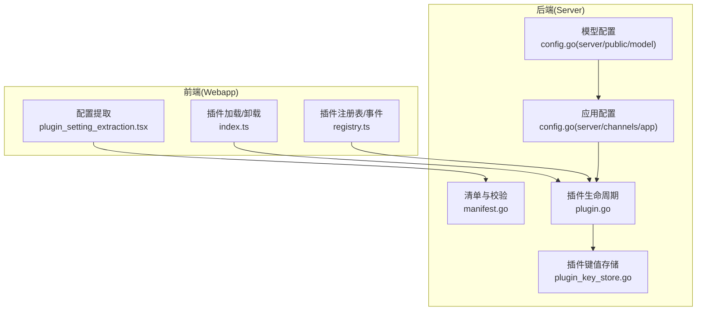
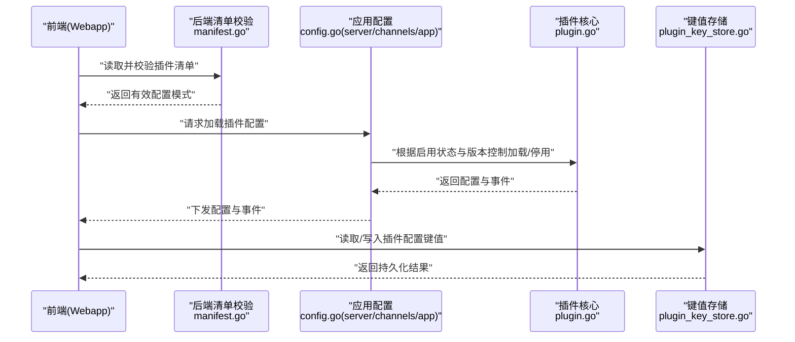
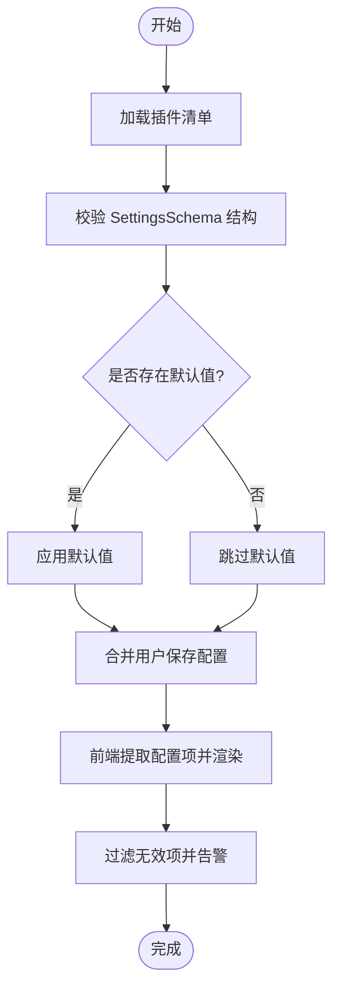
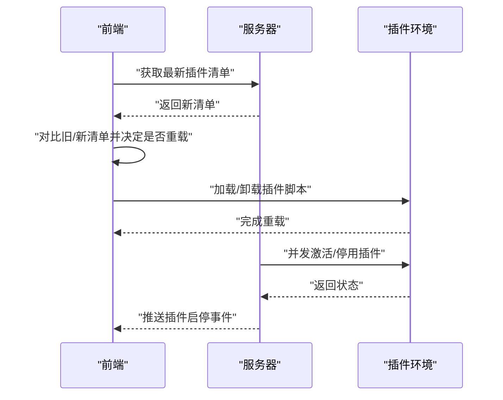
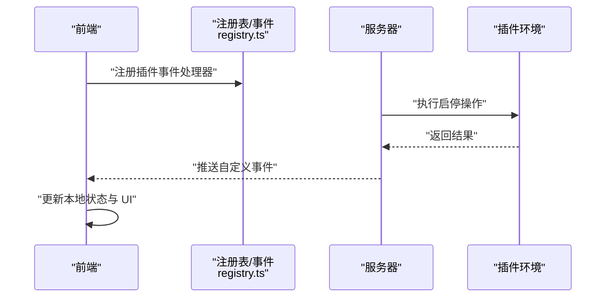
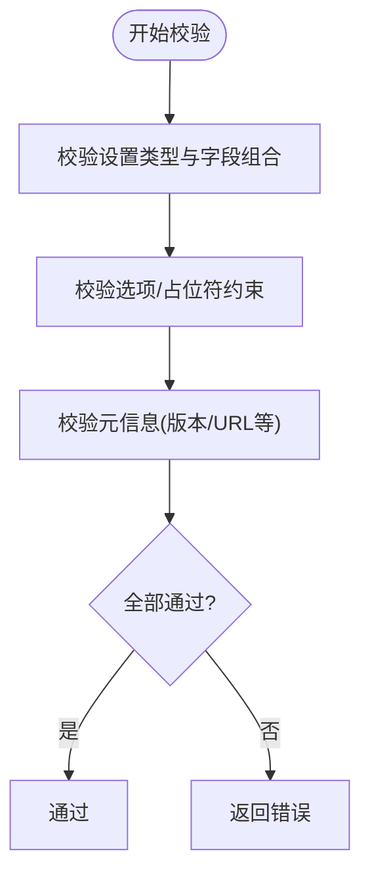
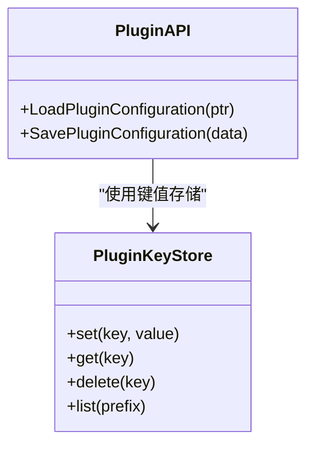
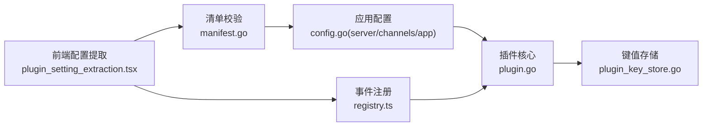

# 插件配置管理

<cite>
**本文引用的文件**
- [manifest.go](file://server/public/model/manifest.go)
- [plugin_setting_extraction.tsx](file://webapp/channels/src/utils/plugins/plugin_setting_extraction.tsx)
- [plugin_setting_extraction.test.tsx](file://webapp/channels/src/utils/plugins/plugin_setting_extraction.test.tsx)
- [plugin_api_test.go](file://server/channels/app/plugin_api_test.go)
- [plugin.go](file://server/channels/app/plugin.go)
- [index.ts](file://webapp/channels/src/plugins/index.ts)
- [registry.ts](file://webapp/channels/src/plugins/registry.ts)
- [plugin_key_store_test.go](file://server/channels/app/plugin_key_store_test.go)
- [plugin_key_store.go](file://server/channels/app/plugin_key_store.go)
- [plugin_api.go](file://server/channels/app/plugin_api.go)
- [config.go](file://server/channels/app/config.go)
- [config.go](file://server/public/model/config.go)
</cite>

## 目录
1. [引言](#引言)
2. [项目结构](#项目结构)
3. [核心组件](#核心组件)
4. [架构总览](#架构总览)
5. [详细组件分析](#详细组件分析)
6. [依赖分析](#依赖分析)
7. [性能考虑](#性能考虑)
8. [故障排查指南](#故障排查指南)
9. [结论](#结论)
10. [附录](#附录)

## 引言
本指南围绕 Mattermost 插件配置管理进行系统化阐述，覆盖配置项定义与校验、默认值与用户自定义配置、动态更新与热重载、变更监听与状态同步、存储与持久化策略、以及最佳实践（分组、版本管理与向后兼容）。内容基于仓库中实际实现文件，结合前端配置提取、后端清单与校验、插件生命周期与键值存储等模块，帮助开发者在插件中正确设计与实现配置管理。

## 项目结构
插件配置管理涉及前后端协同：前端负责从插件清单中提取并渲染配置 UI；后端负责校验清单、加载默认值、持久化与变更通知；插件运行时通过 API 访问配置与键值存储。

图表来源
- [plugin_setting_extraction.tsx:40-221](file://webapp/channels/src/utils/plugins/plugin_setting_extraction.tsx#L40-L221)
- [index.ts:253-287](file://webapp/channels/src/plugins/index.ts#L253-L287)
- [registry.ts:853-891](file://webapp/channels/src/plugins/registry.ts#L853-L891)
- [manifest.go:313-367](file://server/public/model/manifest.go#L313-L367)
- [plugin.go:86-127](file://server/channels/app/plugin.go#L86-L127)
- [plugin_key_store.go](file://server/channels/app/plugin_key_store.go)

章节来源
- [plugin_setting_extraction.tsx:40-221](file://webapp/channels/src/utils/plugins/plugin_setting_extraction.tsx#L40-L221)
- [index.ts:253-287](file://webapp/channels/src/plugins/index.ts#L253-L287)
- [registry.ts:853-891](file://webapp/channels/src/plugins/registry.ts#L853-L891)
- [manifest.go:313-367](file://server/public/model/manifest.go#L313-L367)
- [plugin.go:86-127](file://server/channels/app/plugin.go#L86-L127)
- [plugin_key_store.go](file://server/channels/app/plugin_key_store.go)

## 核心组件
- 清单与配置模式
  - 后端对插件清单进行严格校验，确保 SettingsSchema 的结构与字段合法。
  - 前端从插件清单中提取配置项，构建可渲染的配置 UI，并过滤无效项。
- 默认值与用户自定义配置
  - 后端支持“顶层默认值”和“分节默认值”，用户保存的配置优先于默认值。
- 动态更新与热重载
  - 插件启用/禁用、版本变化触发前端重新加载；后端并发激活/停用插件并广播事件。
- 键值存储与持久化
  - 插件通过键值存储 API 持久化配置片段，支持按插件隔离的读写。
- 变更监听与状态同步
  - 前端注册插件 WebSocket 事件处理器，后端在启停时发送事件，保持状态一致。

章节来源
- [manifest.go:358-414](file://server/public/model/manifest.go#L358-L414)
- [plugin_setting_extraction.tsx:40-221](file://webapp/channels/src/utils/plugins/plugin_setting_extraction.tsx#L40-L221)
- [plugin_api_test.go:1003-1046](file://server/channels/app/plugin_api_test.go#L1003-L1046)
- [plugin.go:86-127](file://server/channels/app/plugin.go#L86-L127)
- [plugin_key_store.go](file://server/channels/app/plugin_key_store.go)

## 架构总览
下图展示了插件配置从清单到运行时的关键交互路径：前端提取配置、后端校验与加载默认值、插件读取配置、键值存储持久化、事件驱动的状态同步。

图表来源
- [manifest.go:313-367](file://server/public/model/manifest.go#L313-L367)
- [plugin.go:86-127](file://server/channels/app/plugin.go#L86-L127)
- [plugin_key_store.go](file://server/channels/app/plugin_key_store.go)

## 详细组件分析

### 组件A：配置项定义与默认值
- 清单校验
  - 对 SettingsSchema 与各 Section/Setting 进行字段合法性检查，如 Key 非空、类型匹配、占位符与选项的组合约束等。
- 默认值策略
  - 支持“顶层默认值”和“分节默认值”。若用户已保存配置，则优先使用保存值；否则回退到对应层级的默认值。
- 前端提取与过滤
  - 前端仅保留有效的 Section 与 Setting，忽略无效项并输出警告日志，保证 UI 稳定性。

图表来源
- [manifest.go:358-414](file://server/public/model/manifest.go#L358-L414)
- [plugin_setting_extraction.tsx:40-221](file://webapp/channels/src/utils/plugins/plugin_setting_extraction.tsx#L40-L221)
- [plugin_api_test.go:1003-1046](file://server/channels/app/plugin_api_test.go#L1003-L1046)

章节来源
- [manifest.go:358-414](file://server/public/model/manifest.go#L358-L414)
- [plugin_setting_extraction.tsx:40-221](file://webapp/channels/src/utils/plugins/plugin_setting_extraction.tsx#L40-L221)
- [plugin_api_test.go:1003-1046](file://server/channels/app/plugin_api_test.go#L1003-L1046)

### 组件B：动态配置更新与热重载
- 前端热重载
  - 当服务器返回的新清单与旧清单存在差异（如版本变化或新增插件），前端会重新加载插件脚本并移除旧插件。
- 后端并发启停
  - 根据系统配置决定插件启用状态，使用并发方式批量激活/停用插件，并在停用时广播事件，通知前端更新 UI。

图表来源
- [index.ts:253-287](file://webapp/channels/src/plugins/index.ts#L253-L287)
- [plugin.go:86-127](file://server/channels/app/plugin.go#L86-L127)

章节来源
- [index.ts:253-287](file://webapp/channels/src/plugins/index.ts#L253-L287)
- [plugin.go:86-127](file://server/channels/app/plugin.go#L86-L127)

### 组件C：变更监听与状态同步
- WebSocket 事件
  - 前端为插件注册 WebSocket 事件处理器，用于接收来自后端的自定义事件（如启停事件）。
- 事件广播
  - 后端在插件启停时发送事件，前端据此更新本地状态，确保 UI 与服务端一致。

图表来源
- [registry.ts:853-891](file://webapp/channels/src/plugins/registry.ts#L853-L891)
- [plugin.go:118-127](file://server/channels/app/plugin.go#L118-L127)

章节来源
- [registry.ts:853-891](file://webapp/channels/src/plugins/registry.ts#L853-L891)
- [plugin.go:118-127](file://server/channels/app/plugin.go#L118-L127)

### 组件D：配置验证与约束检查
- 类型与组合约束
  - 不同设置类型对占位符、选项、帮助文本等字段有严格限制；例如生成类设置不应设置占位符，单选/下拉必须提供选项列表。
- 清单整体校验
  - 对插件 ID、名称、版本、最小服务器版本等进行格式与语义校验，确保清单完整性与一致性。

图表来源
- [manifest.go:390-414](file://server/public/model/manifest.go#L390-L414)
- [manifest.go:313-367](file://server/public/model/manifest.go#L313-L367)

章节来源
- [manifest.go:390-414](file://server/public/model/manifest.go#L390-L414)
- [manifest.go:313-367](file://server/public/model/manifest.go#L313-L367)

### 组件E：配置存储与持久化
- 键值存储 API
  - 插件可通过键值存储接口读写配置片段，键名建议使用哈希后的安全标识，避免冲突。
- 存储策略
  - 建议将敏感配置与非敏感配置分离存储；对频繁读取的配置采用内存缓存，写入时异步落盘以提升吞吐。

图表来源
- [plugin_key_store.go](file://server/channels/app/plugin_key_store.go)
- [plugin_api.go](file://server/channels/app/plugin_api.go)

章节来源
- [plugin_key_store.go](file://server/channels/app/plugin_key_store.go)
- [plugin_key_store_test.go](file://server/channels/app/plugin_key_store_test.go)
- [plugin_api.go](file://server/channels/app/plugin_api.go)

### 组件F：配置示例与实现要点
- 示例场景
  - 分节配置：字符串、整数、布尔三类设置，分别演示默认值与用户覆盖行为。
- 实现要点
  - 清单中定义 SettingsSchema；前端提取并渲染；后端加载配置时优先用户保存值，再回退到默认值；插件通过 API 读取最终生效配置。

章节来源
- [plugin_api_test.go:1003-1046](file://server/channels/app/plugin_api_test.go#L1003-L1046)
- [plugin_setting_extraction.tsx:40-221](file://webapp/channels/src/utils/plugins/plugin_setting_extraction.tsx#L40-L221)

## 依赖分析
- 前端依赖后端清单校验与配置加载流程；插件启停事件由后端驱动，前端通过注册表订阅。
- 后端依赖配置模型与插件环境；键值存储为插件提供持久化能力。
- 测试覆盖了默认值合并、无效配置过滤、事件广播等关键路径。

图表来源
- [plugin_setting_extraction.tsx:40-221](file://webapp/channels/src/utils/plugins/plugin_setting_extraction.tsx#L40-L221)
- [manifest.go:313-367](file://server/public/model/manifest.go#L313-L367)
- [registry.ts:853-891](file://webapp/channels/src/plugins/registry.ts#L853-L891)
- [plugin.go:86-127](file://server/channels/app/plugin.go#L86-L127)
- [plugin_key_store.go](file://server/channels/app/plugin_key_store.go)

章节来源
- [plugin_setting_extraction.tsx:40-221](file://webapp/channels/src/utils/plugins/plugin_setting_extraction.tsx#L40-L221)
- [manifest.go:313-367](file://server/public/model/manifest.go#L313-L367)
- [registry.ts:853-891](file://webapp/channels/src/plugins/registry.ts#L853-L891)
- [plugin.go:86-127](file://server/channels/app/plugin.go#L86-L127)
- [plugin_key_store.go](file://server/channels/app/plugin_key_store.go)

## 性能考虑
- 并发启停：后端使用并发方式批量激活/停用插件，减少启停时延。
- 前端增量更新：仅在版本或清单变化时触发重载，降低资源消耗。
- 缓存策略：对高频读取的配置采用内存缓存，写入采用异步批处理，平衡延迟与一致性。
- 事件驱动：通过 WebSocket 事件实现状态同步，避免轮询带来的开销。

## 故障排查指南
- 清单无效
  - 现象：前端显示无效配置或警告。
  - 排查：检查 SettingsSchema 中 Key、类型与占位符/选项组合是否满足约束；确认清单元信息格式正确。
- 默认值未生效
  - 现象：用户保存的配置未被覆盖。
  - 排查：确认用户保存值优先级高于默认值；检查分节默认值与顶层默认值的合并逻辑。
- 插件未重载
  - 现象：更新后前端未反映新配置。
  - 排查：确认版本号变化或新增插件导致前端触发重载；检查插件启停事件是否正常广播。
- 键值存储异常
  - 现象：读写失败或数据丢失。
  - 排查：核对键名命名规范与权限；确认存储后端可用；必要时增加重试与降级策略。

章节来源
- [plugin_setting_extraction.test.tsx:318-346](file://webapp/channels/src/utils/plugins/plugin_setting_extraction.test.tsx#L318-L346)
- [plugin_api_test.go:1003-1046](file://server/channels/app/plugin_api_test.go#L1003-L1046)
- [plugin.go:86-127](file://server/channels/app/plugin.go#L86-L127)
- [plugin_key_store.go](file://server/channels/app/plugin_key_store.go)

## 结论
Mattermost 的插件配置管理以“清单校验—默认值合并—前端渲染—后端启停—事件同步—键值持久化”为主线，形成闭环的配置生命周期。通过严格的类型与组合约束、灵活的默认值策略、并发的启停机制与事件驱动的状态同步，实现了高可靠与易维护的配置体系。建议在实际插件开发中遵循本文的最佳实践，确保配置管理的安全、稳定与可扩展。

## 附录
- 最佳实践摘要
  - 配置分组：按功能域拆分 Section，明确职责边界。
  - 版本管理：每次修改 SettingsSchema 时递增版本号，配合前端增量重载。
  - 向后兼容：新增字段保留默认值，避免破坏既有配置。
  - 安全存储：敏感配置使用独立键空间与加密存储；键名使用哈希避免冲突。
  - 监听与回退：注册事件处理器并准备回退策略，确保网络抖动下的稳定性。