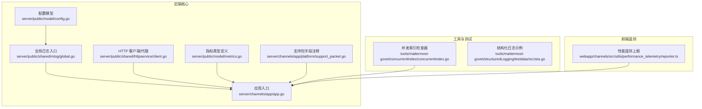
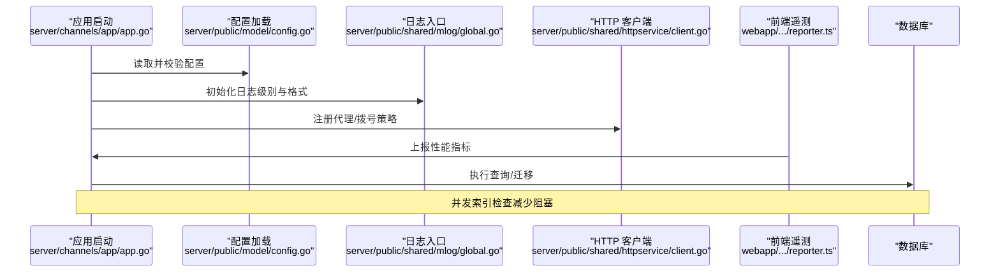
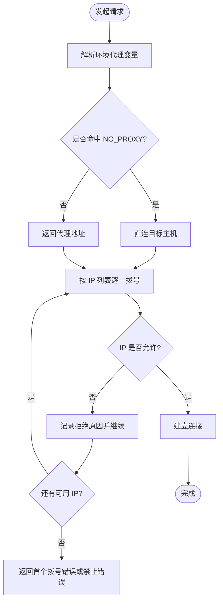
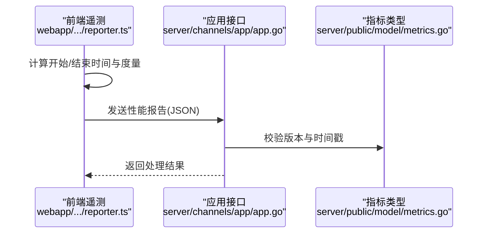
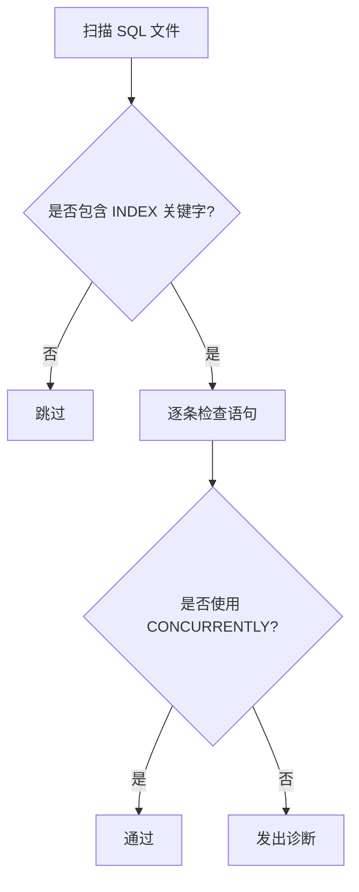
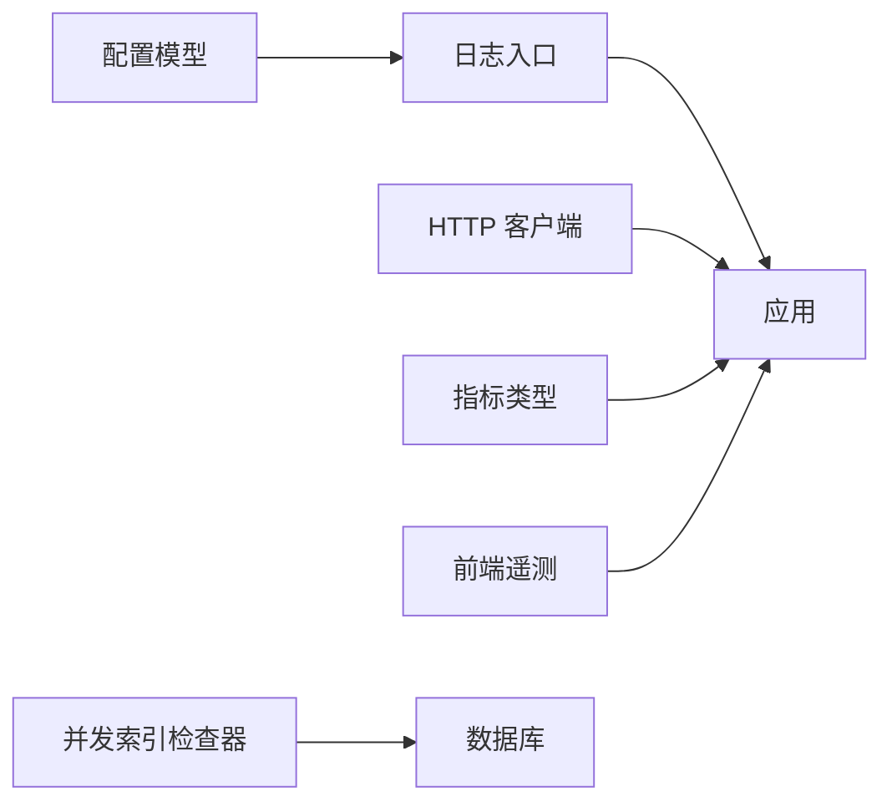

# 故障排除与调试

<cite>
**本文引用的文件**
- [config.go](file://server/public/model/config.go)
- [global.go](file://server/public/shared/mlog/global.go)
- [client.go](file://server/public/shared/httpservice/client.go)
- [client_test.go](file://server/public/shared/httpservice/client_test.go)
- [concurrentIndex.go](file://tools/mattermost-govet/concurrentIndex/concurrentIndex.go)
- [concurrentIndex_test.go](file://tools/mattermost-govet/concurrentIndex/concurrentIndex_test.go)
- [support_packet.go](file://server/channels/app/platform/support_packet.go)
- [metrics.go](file://server/public/model/metrics.go)
- [metrics_test.go](file://server/channels/app/metrics_test.go)
- [reporter.ts](file://webapp/channels/src/utils/performance_telemetry/reporter.ts)
- [proxy-support.md](file://.agents/skills/agent-browser/references/proxy-support.md)
- [logs.yaml](file://api/v4/source/logs.yaml)
- [metrics.yaml](file://api/v4/source/metrics.yaml)
- [system.yaml](file://api/v4/source/system.yaml)
- [app.go](file://server/channels/app/app.go)
- [system.go](file://server/channels/api4/system.go)
- [a.go](file://tools/mattermost-govet/structuredLogging/testdata/src/a/a.go)
</cite>

## 目录
1. 引言
2. 项目结构
3. 核心组件
4. 架构总览
5. 详细组件分析
6. 依赖关系分析
7. 性能注意事项
8. 故障排除指南
9. 结论
10. 附录

## 引言
本指南面向 Mattermost 运维与开发人员，聚焦于“故障排除与调试”的实战方法。内容覆盖启动失败、连接问题、性能瓶颈、功能异常等常见场景；系统讲解日志分析（级别、关键路径、错误解读）、调试技巧（断点、变量、调用栈）、性能排查（CPU/内存/数据库）、网络诊断（超时/代理/防火墙）、数据问题（不一致/索引/迁移）、用户反馈处理流程、监控告警响应以及紧急故障处置。所有结论均基于仓库中现有实现与文档，确保可操作性与可追溯性。

## 项目结构
Mattermost 后端采用模块化分层：公共模型与日志在 server/public 下，应用逻辑在 server/channels/app，网络与服务封装在 server/public/shared，工具链在 tools，前端性能遥测在 webapp。API 定义位于 api/v4/source，便于定位可观测性与系统接口。

**图表来源**
- [config.go:1621-1686](file://server/public/model/config.go#L1621-L1686)
- [global.go:48-129](file://server/public/shared/mlog/global.go#L48-L129)
- [client.go:143-189](file://server/public/shared/httpservice/client.go#L143-L189)
- [app.go:1-200](file://server/channels/app/app.go#L1-L200)
- [metrics.go:33-53](file://server/public/model/metrics.go#L33-L53)
- [support_packet.go:56-67](file://server/channels/app/platform/support_packet.go#L56-L67)
- [concurrentIndex.go:1-155](file://tools/mattermost-govet/concurrentIndex/concurrentIndex.go#L1-L155)
- [reporter.ts:338-380](file://webapp/channels/src/utils/performance_telemetry/reporter.ts#L338-L380)

**章节来源**
- [config.go:1621-1686](file://server/public/model/config.go#L1621-L1686)
- [global.go:48-129](file://server/public/shared/mlog/global.go#L48-L129)
- [client.go:143-189](file://server/public/shared/httpservice/client.go#L143-L189)
- [app.go:1-200](file://server/channels/app/app.go#L1-L200)
- [metrics.go:33-53](file://server/public/model/metrics.go#L33-L53)
- [support_packet.go:56-67](file://server/channels/app/platform/support_packet.go#L56-L67)
- [concurrentIndex.go:1-155](file://tools/mattermost-govet/concurrentIndex/concurrentIndex.go#L1-L155)
- [reporter.ts:338-380](file://webapp/channels/src/utils/performance_telemetry/reporter.ts#L338-L380)

## 核心组件
- 配置与日志
  - 日志配置项包含控制台/文件输出、颜色、JSON 格式、高级日志、诊断开关、Sentry 等，提供默认值与校验，便于按需提升排障能力。
  - 全局日志入口提供 Trace/Debug/Info/Warn/Error/Fatal 等级别方法，统一记录路径。
- 网络与代理
  - HTTP 客户端从环境变量解析代理，支持 NO_PROXY 白名单；对 IPv6 地址进行合法性校验；拨号阶段对 IP 进行允许性过滤并聚合拒绝原因。
- 指标与遥测
  - 定义移动端/桌面端性能指标类型；应用侧注册性能报告；前端通过遥测上报组件发送指标。
- 数据与迁移
  - 工具链静态检查强制使用 CONCURRENTLY 创建/删除索引，避免阻塞 DML；支持迁移版本阈值过滤。
- 支持包
  - 支持包 YAML 字段注释涵盖数据库连接池等待、关闭统计、PostgreSQL 特有统计等，便于采集关键运行态。

**章节来源**
- [config.go:1621-1686](file://server/public/model/config.go#L1621-L1686)
- [global.go:48-129](file://server/public/shared/mlog/global.go#L48-L129)
- [client.go:143-189](file://server/public/shared/httpservice/client.go#L143-L189)
- [metrics.go:33-53](file://server/public/model/metrics.go#L33-L53)
- [concurrentIndex.go:19-55](file://tools/mattermost-govet/concurrentIndex/concurrentIndex.go#L19-L55)
- [support_packet.go:56-67](file://server/channels/app/platform/support_packet.go#L56-L67)

## 架构总览
下图展示故障排查相关的关键交互：应用启动加载配置与日志；网络请求经由 HTTP 客户端解析代理；性能指标在客户端侧采集并通过应用接口上报；数据库层面通过并发索引检查降低阻塞风险。

**图表来源**
- [app.go:1-200](file://server/channels/app/app.go#L1-L200)
- [config.go:1621-1686](file://server/public/model/config.go#L1621-L1686)
- [global.go:48-129](file://server/public/shared/mlog/global.go#L48-L129)
- [client.go:143-189](file://server/public/shared/httpservice/client.go#L143-L189)
- [reporter.ts:338-380](file://webapp/channels/src/utils/performance_telemetry/reporter.ts#L338-L380)
- [concurrentIndex.go:19-55](file://tools/mattermost-govet/concurrentIndex/concurrentIndex.go#L19-L55)

## 详细组件分析

### 日志系统与排障
- 配置要点
  - 控制台/文件输出、级别、颜色、JSON、高级日志、诊断与 Sentry 开关均有默认值，便于快速启用更详细的日志。
  - 高级日志 JSON 默认非空，避免解析异常。
- 使用建议
  - 在问题复现期临时提升日志级别，结合 JSON 字段定位上下文键值。
  - 关注错误链路包装与状态码，有助于快速映射到具体模块。
- 示例参考
  - 全局日志入口方法族覆盖 Trace/Debug/Info/Warn/Error/Fatal，便于按严重程度分级。

**章节来源**
- [config.go:1621-1686](file://server/public/model/config.go#L1621-L1686)
- [global.go:48-129](file://server/public/shared/mlog/global.go#L48-L129)

### 网络与代理诊断
- 代理解析
  - 从环境变量读取 HTTP_PROXY/HTTPS_PROXY/NO_PROXY，并根据目标主机名决定是否绕过代理。
  - 对 IPv6 带区域标识的地址进行显式校验，避免无效地址导致的连接失败。
- 拨号与限制
  - 解析目标 IP 列表后逐一尝试拨号；若存在 IP 白名单/黑名单回调，则逐个校验；聚合拒绝原因以辅助定位。
- 测试用例
  - 单元测试覆盖了代理解析、主机名白名单、IPv6 地址等边界情况，可作为自测清单。
- 实操建议
  - 使用 curl 或浏览器访问 httpbin.org/ip 验证代理生效与出口 IP。
  - 对企业内网站点设置 NO_PROXY，避免本地流量误走代理。

**图表来源**
- [client.go:143-189](file://server/public/shared/httpservice/client.go#L143-L189)
- [client_test.go:293-327](file://server/public/shared/httpservice/client_test.go#L293-L327)

**章节来源**
- [client.go:143-189](file://server/public/shared/httpservice/client.go#L143-L189)
- [client_test.go:293-327](file://server/public/shared/httpservice/client_test.go#L293-L327)
- [proxy-support.md:1-195](file://.agents/skills/agent-browser/references/proxy-support.md#L1-L195)

### 性能指标与遥测上报
- 指标类型
  - 定义移动端/桌面端 CPU/内存、网络请求速度/延迟/大小/请求数等指标类型，便于端到端观测。
- 应用侧注册
  - 应用层接收性能报告，包含时间窗口、标签、样本等，用于后续分析。
- 前端上报
  - 前端遥测组件计算开始/结束时间、计数器与直方图度量，并通过客户端路由发送。
- 质量门禁
  - 性能报告结构体包含版本、时间戳有效性校验，防止过期或格式错误数据进入分析链路。

**图表来源**
- [reporter.ts:338-380](file://webapp/channels/src/utils/performance_telemetry/reporter.ts#L338-L380)
- [metrics.go:33-53](file://server/public/model/metrics.go#L33-L53)
- [metrics_test.go:42-85](file://server/channels/app/metrics_test.go#L42-L85)

**章节来源**
- [metrics.go:33-53](file://server/public/model/metrics.go#L33-L53)
- [metrics_test.go:42-85](file://server/channels/app/metrics_test.go#L42-L85)
- [reporter.ts:338-380](file://webapp/channels/src/utils/performance_telemetry/reporter.ts#L338-L380)

### 数据库索引与迁移问题
- 并发索引检查
  - 工具通过正则匹配 SQL 语句，要求 CREATE/DROP INDEX 使用 CONCURRENTLY，避免阻塞 DML。
  - 支持扫描指定目录与迁移编号阈值过滤，便于增量检查。
- 迁移测试
  - 单元测试覆盖正反例，确保仅对未使用 CONCURRENTLY 的语句发出诊断。
- 实操建议
  - 在执行大规模索引变更前，先用该工具扫描历史与待提交 SQL，修正为 CONCURRENTLY。
  - 结合支持包注释关注连接池等待与关闭统计，定位数据库瓶颈。

**图表来源**
- [concurrentIndex.go:47-75](file://tools/mattermost-govet/concurrentIndex/concurrentIndex.go#L47-L75)
- [concurrentIndex_test.go:127-144](file://tools/mattermost-govet/concurrentIndex/concurrentIndex_test.go#L127-L144)

**章节来源**
- [concurrentIndex.go:19-55](file://tools/mattermost-govet/concurrentIndex/concurrentIndex.go#L19-L55)
- [concurrentIndex_test.go:96-144](file://tools/mattermost-govet/concurrentIndex/concurrentIndex_test.go#L96-L144)
- [support_packet.go:56-67](file://server/channels/app/platform/support_packet.go#L56-L67)

### 结构化日志与调试技巧
- 结构化日志
  - 使用 mlog.String(key, val) 组织字段，避免在日志函数中使用 fmt.Sprintf，保持可搜索性与性能。
  - 提供有效/无效示例，便于团队规范落地。
- 调试建议
  - 在关键路径增加 Debug/Info 级别日志，携带用户 ID、请求 ID、资源路径等上下文键。
  - 使用 Fatal/Critical 记录不可恢复错误，确保告警通道可见。

**章节来源**
- [a.go:19-40](file://tools/mattermost-govet/structuredLogging/testdata/src/a/a.go#L19-L40)
- [global.go:48-129](file://server/public/shared/mlog/global.go#L48-L129)

## 依赖关系分析
- 配置与日志
  - 配置模型为日志系统提供参数来源；日志入口贯穿应用各层。
- 网络与应用
  - HTTP 客户端为应用提供统一网络访问；应用负责业务编排与指标上报。
- 指标与前端
  - 前端遥测组件与应用接口形成闭环，指标类型定义保证数据一致性。
- 工具与数据库
  - 并发索引检查器在构建期介入，降低运行期阻塞风险。

**图表来源**
- [config.go:1621-1686](file://server/public/model/config.go#L1621-L1686)
- [global.go:48-129](file://server/public/shared/mlog/global.go#L48-L129)
- [client.go:143-189](file://server/public/shared/httpservice/client.go#L143-L189)
- [metrics.go:33-53](file://server/public/model/metrics.go#L33-L53)
- [reporter.ts:338-380](file://webapp/channels/src/utils/performance_telemetry/reporter.ts#L338-L380)
- [concurrentIndex.go:19-55](file://tools/mattermost-govet/concurrentIndex/concurrentIndex.go#L19-L55)

**章节来源**
- [config.go:1621-1686](file://server/public/model/config.go#L1621-L1686)
- [global.go:48-129](file://server/public/shared/mlog/global.go#L48-L129)
- [client.go:143-189](file://server/public/shared/httpservice/client.go#L143-L189)
- [metrics.go:33-53](file://server/public/model/metrics.go#L33-L53)
- [reporter.ts:338-380](file://webapp/channels/src/utils/performance_telemetry/reporter.ts#L338-L380)
- [concurrentIndex.go:19-55](file://tools/mattermost-govet/concurrentIndex/concurrentIndex.go#L19-L55)

## 性能注意事项
- CPU/内存
  - 通过指标类型定义与前端遥测上报，可观察移动端/桌面端 CPU/内存使用趋势。
- 数据库
  - 使用 CONCURRENTLY 创建/删除索引，降低 DDL 阻塞；关注连接池等待与关闭统计，识别连接泄漏或峰值。
- 网络
  - 合理配置代理与 NO_PROXY，避免不必要的转发；对慢代理进行轮换与降级。

[本节为通用指导，无需特定文件引用]

## 故障排除指南

### 启动失败
- 快速检查
  - 查看日志初始化是否成功，确认控制台/文件输出已启用且级别合理。
  - 校验配置文件是否通过 IsValid 校验，特别是日志与诊断相关字段。
- 处理步骤
  - 临时提升日志级别至 DEBUG/TRACE，重放启动过程，定位首错。
  - 若涉及外部服务（ES/数据库），先验证连通性与凭据。

**章节来源**
- [config.go:1621-1686](file://server/public/model/config.go#L1621-L1686)
- [global.go:48-129](file://server/public/shared/mlog/global.go#L48-L129)

### 连接问题
- 代理与防火墙
  - 检查 HTTP_PROXY/HTTPS_PROXY/NO_PROXY 设置，使用 curl 或浏览器验证出口 IP。
  - 对 IPv6 地址进行合法性校验，避免无效地址导致的拨号失败。
- 端口与白名单
  - 确认目标主机 IP 在允许列表内；查看拒绝原因聚合，定位具体限制。
- 建议
  - 为内网站点设置 NO_PROXY，减少不必要的代理转发。

**章节来源**
- [client.go:143-189](file://server/public/shared/httpservice/client.go#L143-L189)
- [client_test.go:293-327](file://server/public/shared/httpservice/client_test.go#L293-L327)
- [proxy-support.md:1-195](file://.agents/skills/agent-browser/references/proxy-support.md#L1-L195)

### 性能瓶颈
- 指标采集
  - 启用移动端/桌面端指标上报，观察 CPU/内存/网络请求异常时段。
  - 校验性能报告的时间戳与版本，避免过期数据干扰。
- 数据库优化
  - 使用并发索引检查器扫描 SQL，确保索引变更使用 CONCURRENTLY。
  - 关注连接池等待与关闭统计，识别连接池配置或泄漏问题。
- 建议
  - 在高负载时段开启更高日志级别，配合指标与日志交叉验证。

**章节来源**
- [metrics.go:33-53](file://server/public/model/metrics.go#L33-L53)
- [metrics_test.go:42-85](file://server/channels/app/metrics_test.go#L42-L85)
- [reporter.ts:338-380](file://webapp/channels/src/utils/performance_telemetry/reporter.ts#L338-L380)
- [concurrentIndex.go:47-75](file://tools/mattermost-govet/concurrentIndex/concurrentIndex.go#L47-L75)
- [support_packet.go:56-67](file://server/channels/app/platform/support_packet.go#L56-L67)

### 功能异常
- 结构化日志
  - 在关键路径增加字段化日志，携带用户 ID、请求 ID、资源路径等。
  - 避免在日志函数中使用字符串拼接，保持可检索性。
- 调试技巧
  - 断点调试时优先查看变量上下文与调用栈，结合日志定位问题根因。
- 建议
  - 对异常路径使用 Error/Fatal/Critical 记录，确保告警通道可见。

**章节来源**
- [a.go:19-40](file://tools/mattermost-govet/structuredLogging/testdata/src/a/a.go#L19-L40)
- [global.go:48-129](file://server/public/shared/mlog/global.go#L48-L129)

### 数据问题
- 不一致与索引失效
  - 使用并发索引检查器扫描 SQL，确保索引变更使用 CONCURRENTLY。
  - 关注数据库统计字段（如缓存命中比、死锁次数、临时文件数）辅助判断。
- 迁移错误
  - 通过工具扫描迁移脚本，确保只对未使用 CONCURRENTLY 的语句发出诊断。
  - 对迁移编号设置阈值，仅检查目标范围内的变更。

**章节来源**
- [concurrentIndex.go:47-75](file://tools/mattermost-govet/concurrentIndex/concurrentIndex.go#L47-L75)
- [concurrentIndex_test.go:127-144](file://tools/mattermost-govet/concurrentIndex/concurrentIndex_test.go#L127-L144)
- [support_packet.go:56-67](file://server/channels/app/platform/support_packet.go#L56-L67)

### 用户反馈处理
- 重现与信息收集
  - 要求用户提供环境信息（平台、版本、网络环境、代理配置）。
  - 在问题复现期间临时提升日志级别，收集关键字段与错误链路。
- 修复验证
  - 通过前端遥测上报验证修复后的指标变化，确认回归问题不再出现。

**章节来源**
- [reporter.ts:338-380](file://webapp/channels/src/utils/performance_telemetry/reporter.ts#L338-L380)
- [metrics.go:33-53](file://server/public/model/metrics.go#L33-L53)

### 监控告警响应
- 告警分析
  - 结合日志级别与指标类型，定位异常时段与热点资源。
- 根因分析
  - 使用并发索引检查器与支持包统计字段，缩小到数据库/网络/配置层面。
- 预防措施
  - 将并发索引检查纳入 CI，规范 SQL 变更流程。

**章节来源**
- [concurrentIndex.go:47-75](file://tools/mattermost-govet/concurrentIndex/concurrentIndex.go#L47-L75)
- [support_packet.go:56-67](file://server/channels/app/platform/support_packet.go#L56-L67)

### 紧急故障应急
- 快速修复
  - 临时调整日志级别与诊断开关，快速获取上下文。
  - 回滚最近一次数据库索引变更，使用 CONCURRENTLY 替代阻塞式操作。
- 业务影响最小化
  - 通过 NO_PROXY 规避代理问题；必要时切换备用代理或直连。
  - 通过前端遥测持续观测指标，确认修复生效。

**章节来源**
- [config.go:1621-1686](file://server/public/model/config.go#L1621-L1686)
- [client.go:143-189](file://server/public/shared/httpservice/client.go#L143-L189)
- [concurrentIndex.go:47-75](file://tools/mattermost-govet/concurrentIndex/concurrentIndex.go#L47-L75)

## 结论
本指南将 Mattermost 的配置、日志、网络、指标、数据库与工具链整合为一套可执行的故障排除流程。通过结构化日志、代理与拨号策略、并发索引检查、性能遥测与支持包统计，能够在启动失败、连接问题、性能瓶颈与数据异常等场景中快速定位根因并实施修复。建议将本文方法纳入日常运维与开发流程，持续优化可观测性与稳定性。

## 附录
- API 参考（可观测性）
  - 日志接口定义：[logs.yaml](file://api/v4/source/logs.yaml)
  - 指标接口定义：[metrics.yaml](file://api/v4/source/metrics.yaml)
  - 系统接口定义：[system.yaml](file://api/v4/source/system.yaml)
- 关键实现参考
  - 应用系统接口：[system.go:1-200](file://server/channels/api4/system.go#L1-L200)
  - 应用入口：[app.go:1-200](file://server/channels/app/app.go#L1-L200)