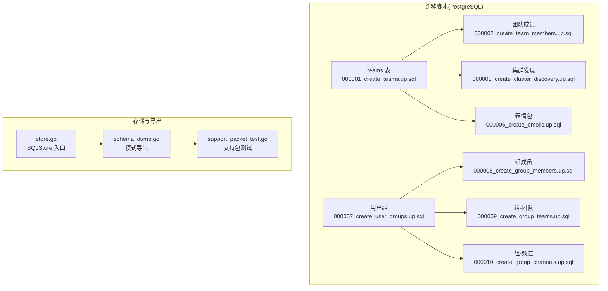
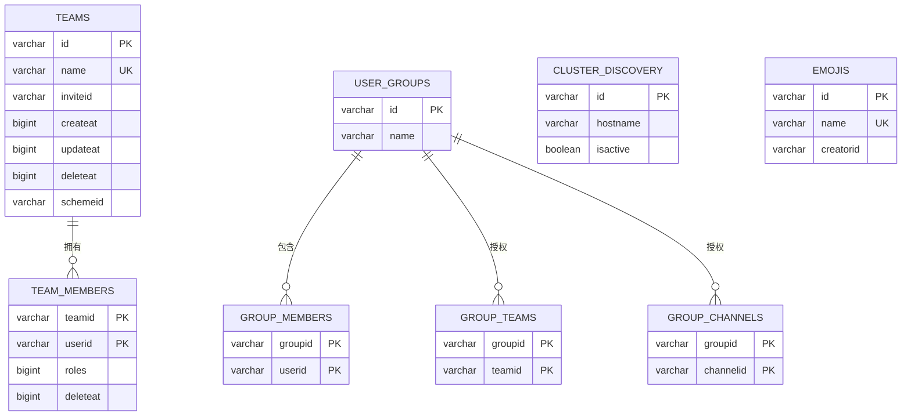
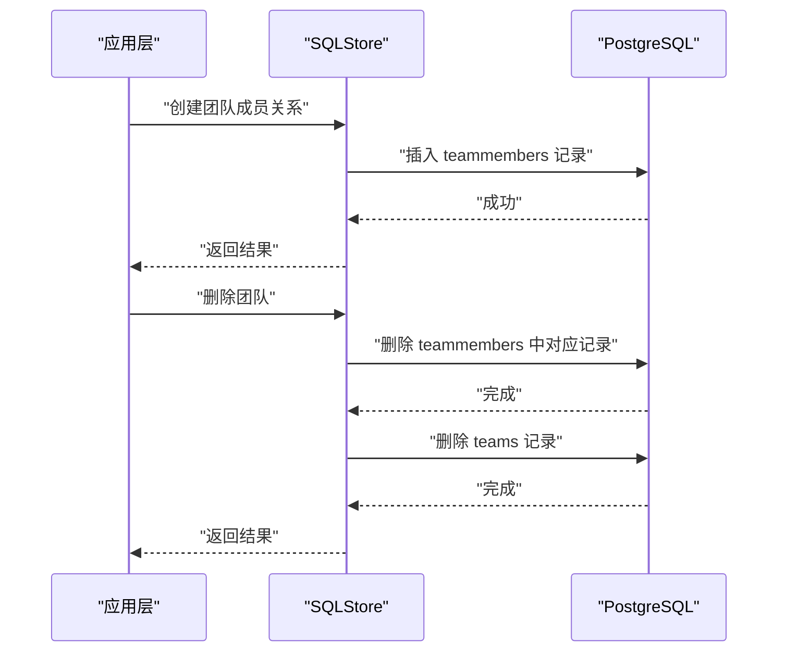
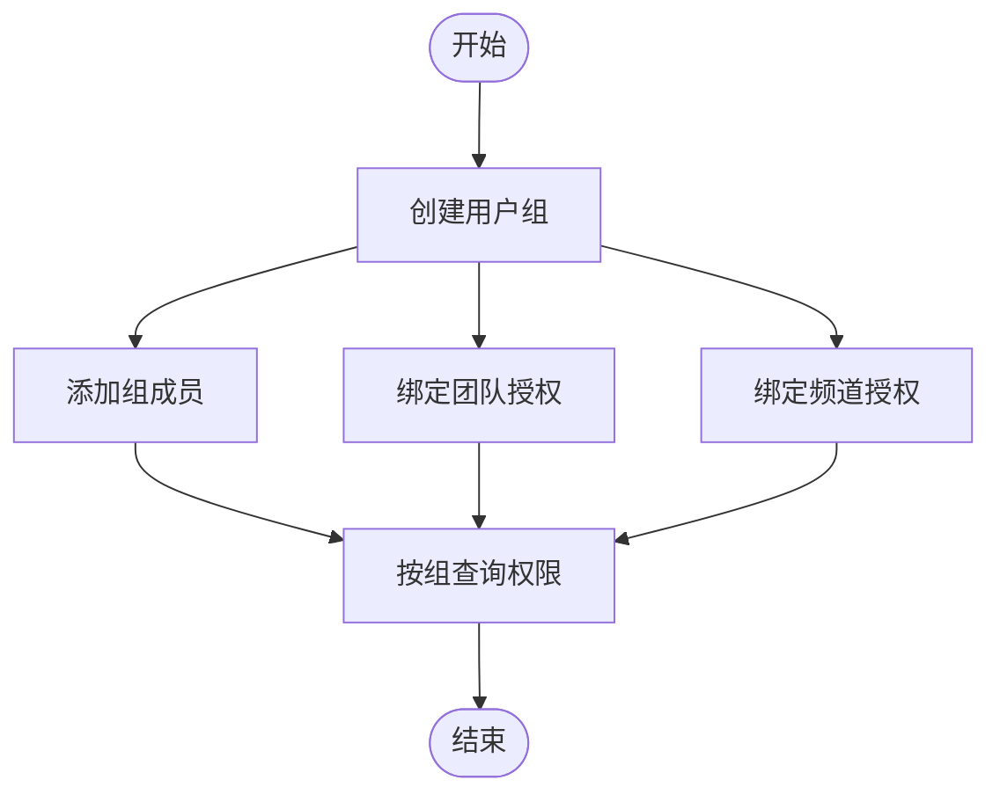
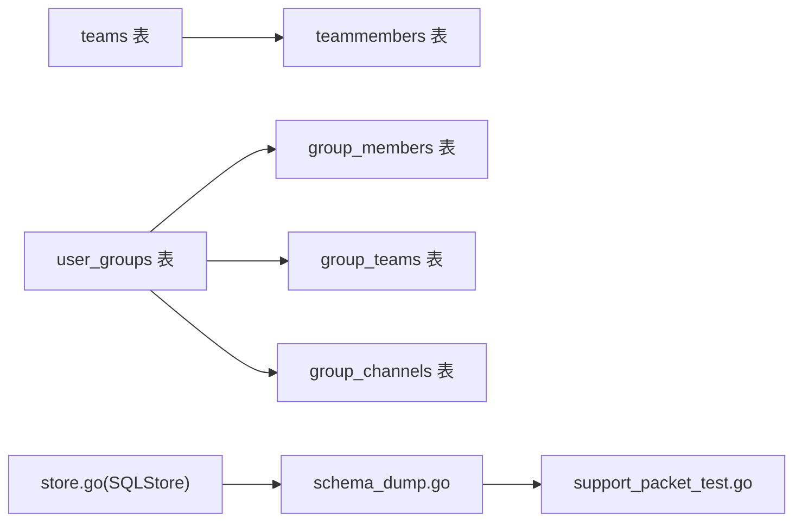

# 关系设计与约束

<cite>
**本文档引用的文件**
- [000001_create_teams.up.sql](file://server/channels/db/migrations/postgres/000001_create_teams.up.sql)
- [000001_create_teams.down.sql](file://server/channels/db/migrations/postgres/000001_create_teams.down.sql)
- [000002_create_team_members.up.sql](file://server/channels/db/migrations/postgres/000002_create_team_members.up.sql)
- [000002_create_team_members.down.sql](file://server/channels/db/migrations/postgres/000002_create_team_members.down.sql)
- [000003_create_cluster_discovery.up.sql](file://server/channels/db/migrations/postgres/000003_create_cluster_discovery.up.sql)
- [000006_create_emojis.up.sql](file://server/channels/db/migrations/postgres/000006_create_emojis.up.sql)
- [000007_create_user_groups.up.sql](file://server/channels/db/migrations/postgres/000007_create_user_groups.up.sql)
- [000008_create_group_members.up.sql](file://server/channels/db/migrations/postgres/000008_create_group_members.up.sql)
- [000009_create_group_teams.up.sql](file://server/channels/db/migrations/postgres/000009_create_group_teams.up.sql)
- [000010_create_group_channels.up.sql](file://server/channels/db/migrations/postgres/000010_create_group_channels.up.sql)
- [schema_dump.go](file://server/channels/store/sqlstore/schema_dump.go)
- [support_packet_test.go](file://server/channels/app/support_packet_test.go)
- [store.go](file://server/channels/store/sqlstore/store.go)
- [store.go](file://server/channels/store/store.go)
</cite>

## 目录
1. 引言
2. 项目结构
3. 核心组件
4. 架构总览
5. 详细组件分析
6. 依赖分析
7. 性能考量
8. 故障排查指南
9. 结论
10. 附录

## 引言
本文件系统性梳理 Mattermost 的数据库关系设计与约束，聚焦以下主题：实体关系（一对一、一对多、多对多）、主键与外键设计原则、引用完整性与级联策略、复合主键与唯一约束、索引与性能影响、关系图与约束图示例、数据完整性与业务规则校验、最佳实践与常见陷阱，以及关系变更的迁移策略。内容基于仓库中实际存在的迁移脚本、存储层导出工具与测试用例进行归纳总结。

## 项目结构
Mattermost 的数据库模式通过“迁移脚本”在 PostgreSQL 上逐步演进，核心表围绕团队、频道、用户、帖子等组织；同时通过“模式导出工具”生成数据库结构快照，用于支持包与一致性校验。下图展示与本文相关的关键文件与职责映射：

图表来源
- [000001_create_teams.up.sql:0-30](file://server/channels/db/migrations/postgres/000001_create_teams.up.sql#L0-L30)
- [000002_create_team_members.up.sql:0-20](file://server/channels/db/migrations/postgres/000002_create_team_members.up.sql#L0-L20)
- [000003_create_cluster_discovery.up.sql:0-20](file://server/channels/db/migrations/postgres/000003_create_cluster_discovery.up.sql#L0-L20)
- [000006_create_emojis.up.sql:0-20](file://server/channels/db/migrations/postgres/000006_create_emojis.up.sql#L0-L20)
- [000007_create_user_groups.up.sql:0-20](file://server/channels/db/migrations/postgres/000007_create_user_groups.up.sql#L0-L20)
- [000008_create_group_members.up.sql:0-20](file://server/channels/db/migrations/postgres/000008_create_group_members.up.sql#L0-L20)
- [000009_create_group_teams.up.sql:0-20](file://server/channels/db/migrations/postgres/000009_create_group_teams.up.sql#L0-L20)
- [000010_create_group_channels.up.sql:0-20](file://server/channels/db/migrations/postgres/000010_create_group_channels.up.sql#L0-L20)
- [schema_dump.go:1-200](file://server/channels/store/sqlstore/schema_dump.go#L1-L200)
- [store.go:1-200](file://server/channels/store/sqlstore/store.go#L1-L200)
- [support_packet_test.go:715-792](file://server/channels/app/support_packet_test.go#L715-L792)

章节来源
- [000001_create_teams.up.sql:0-30](file://server/channels/db/migrations/postgres/000001_create_teams.up.sql#L0-L30)
- [000002_create_team_members.up.sql:0-20](file://server/channels/db/migrations/postgres/000002_create_team_members.up.sql#L0-L20)
- [schema_dump.go:1-200](file://server/channels/store/sqlstore/schema_dump.go#L1-L200)
- [support_packet_test.go:715-792](file://server/channels/app/support_packet_test.go#L715-L792)

## 核心组件
- 团队与成员关系：团队表定义主键与唯一约束；团队成员表采用复合主键实现多对多关系。
- 用户组与成员/关联表：用户组表与组成员、组-团队、组-频道之间形成多对多扩展关系。
- 索引策略：为常用查询列建立索引，支撑高并发场景下的读写性能。
- 模式导出与校验：通过存储层导出数据库结构，配合测试用例验证核心表与关键列的存在性与完整性。

章节来源
- [000001_create_teams.up.sql:0-30](file://server/channels/db/migrations/postgres/000001_create_teams.up.sql#L0-L30)
- [000002_create_team_members.up.sql:0-20](file://server/channels/db/migrations/postgres/000002_create_team_members.up.sql#L0-L20)
- [000007_create_user_groups.up.sql:0-20](file://server/channels/db/migrations/postgres/000007_create_user_groups.up.sql#L0-L20)
- [000008_create_group_members.up.sql:0-20](file://server/channels/db/migrations/postgres/000008_create_group_members.up.sql#L0-L20)
- [000009_create_group_teams.up.sql:0-20](file://server/channels/db/migrations/postgres/000009_create_group_teams.up.sql#L0-L20)
- [000010_create_group_channels.up.sql:0-20](file://server/channels/db/migrations/postgres/000010_create_group_channels.up.sql#L0-L20)
- [schema_dump.go:1-200](file://server/channels/store/sqlstore/schema_dump.go#L1-L200)
- [support_packet_test.go:715-792](file://server/channels/app/support_packet_test.go#L715-L792)

## 架构总览
下图从“关系设计”角度抽象展示核心实体与约束关系，帮助理解一对多与多对多的建模方式及索引策略。

图表来源
- [000001_create_teams.up.sql:0-30](file://server/channels/db/migrations/postgres/000001_create_teams.up.sql#L0-L30)
- [000002_create_team_members.up.sql:0-20](file://server/channels/db/migrations/postgres/000002_create_team_members.up.sql#L0-L20)
- [000007_create_user_groups.up.sql:0-20](file://server/channels/db/migrations/postgres/000007_create_user_groups.up.sql#L0-L20)
- [000008_create_group_members.up.sql:0-20](file://server/channels/db/migrations/postgres/000008_create_group_members.up.sql#L0-L20)
- [000009_create_group_teams.up.sql:0-20](file://server/channels/db/migrations/postgres/000009_create_group_teams.up.sql#L0-L20)
- [000010_create_group_channels.up.sql:0-20](file://server/channels/db/migrations/postgres/000010_create_group_channels.up.sql#L0-L20)
- [000003_create_cluster_discovery.up.sql:0-20](file://server/channels/db/migrations/postgres/000003_create_cluster_discovery.up.sql#L0-L20)
- [000006_create_emojis.up.sql:0-20](file://server/channels/db/migrations/postgres/000006_create_emojis.up.sql#L0-L20)

## 详细组件分析

### 团队与团队成员：一对多与多对多
- 设计要点
  - 团队表以字符串主键标识，同时对名称字段施加唯一约束，确保名称全局唯一。
  - 团队成员表采用复合主键（团队ID+用户ID），天然表达“一个用户在一个团队内的唯一角色记录”，并可扩展角色字段。
  - 常用查询列（如团队ID、用户ID、删除时间）均建立索引，提升读写效率。
- 外键与引用完整性
  - 迁移脚本未显式声明外键约束；引用完整性由应用层或数据库层触发器保证。若需强一致，可在现有基础上补充外键约束与级联策略。
- 级联策略建议
  - 删除团队时，建议先清理成员记录再删除团队（避免悬挂数据）。
  - 删除用户时，建议设置“RESTRICT”或“SET NULL”策略，防止误删导致的数据不一致。
- 索引与性能
  - 对团队名、邀请ID、时间戳等列建立索引，有助于筛选、排序与范围查询。
  - 复合主键已覆盖“团队-用户”的唯一性，无需额外唯一索引。

图表来源
- [000001_create_teams.up.sql:0-30](file://server/channels/db/migrations/postgres/000001_create_teams.up.sql#L0-L30)
- [000002_create_team_members.up.sql:0-20](file://server/channels/db/migrations/postgres/000002_create_team_members.up.sql#L0-L20)
- [store.go:1-200](file://server/channels/store/sqlstore/store.go#L1-L200)

章节来源
- [000001_create_teams.up.sql:0-30](file://server/channels/db/migrations/postgres/000001_create_teams.up.sql#L0-L30)
- [000002_create_team_members.up.sql:0-20](file://server/channels/db/migrations/postgres/000002_create_team_members.up.sql#L0-L20)
- [000001_create_teams.down.sql:0-20](file://server/channels/db/migrations/postgres/000001_create_teams.down.sql#L0-L20)
- [000002_create_team_members.down.sql:0-20](file://server/channels/db/migrations/postgres/000002_create_team_members.down.sql#L0-L20)

### 用户组与扩展关系：多对多扩展
- 设计要点
  - 用户组表作为中心实体，分别与组成员、组-团队、组-频道建立多对多关系，复合主键确保关系唯一性。
  - 该设计便于权限与访问控制的集中管理与灵活扩展。
- 索引策略
  - 建议对组ID与目标对象ID建立索引，优化授权查询路径。
- 变更注意事项
  - 删除组时应先清理所有扩展关系，再删除组本身。

图表来源
- [000007_create_user_groups.up.sql:0-20](file://server/channels/db/migrations/postgres/000007_create_user_groups.up.sql#L0-L20)
- [000008_create_group_members.up.sql:0-20](file://server/channels/db/migrations/postgres/000008_create_group_members.up.sql#L0-L20)
- [000009_create_group_teams.up.sql:0-20](file://server/channels/db/migrations/postgres/000009_create_group_teams.up.sql#L0-L20)
- [000010_create_group_channels.up.sql:0-20](file://server/channels/db/migrations/postgres/000010_create_group_channels.up.sql#L0-L20)

章节来源
- [000007_create_user_groups.up.sql:0-20](file://server/channels/db/migrations/postgres/000007_create_user_groups.up.sql#L0-L20)
- [000008_create_group_members.up.sql:0-20](file://server/channels/db/migrations/postgres/000008_create_group_members.up.sql#L0-L20)
- [000009_create_group_teams.up.sql:0-20](file://server/channels/db/migrations/postgres/000009_create_group_teams.up.sql#L0-L20)
- [000010_create_group_channels.up.sql:0-20](file://server/channels/db/migrations/postgres/000010_create_group_channels.up.sql#L0-L20)

### 集群发现与表情包：辅助实体
- 集群发现表用于节点注册与状态维护，主键唯一标识节点。
- 表情包表对名称施加唯一约束，避免重复命名引发歧义。
- 建议对活跃状态、主机名等列建立索引，提升筛选效率。

章节来源
- [000003_create_cluster_discovery.up.sql:0-20](file://server/channels/db/migrations/postgres/000003_create_cluster_discovery.up.sql#L0-L20)
- [000006_create_emojis.up.sql:0-20](file://server/channels/db/migrations/postgres/000006_create_emojis.up.sql#L0-L20)

### 模式导出与一致性校验
- 存储层导出工具会抓取数据库当前结构，生成支持包中的数据库模式文件，供问题排查与一致性核验。
- 测试用例验证核心表（如 users、channels、teams、posts）存在且关键列齐全，确保迁移后结构符合预期。

章节来源
- [schema_dump.go:1-200](file://server/channels/store/sqlstore/schema_dump.go#L1-L200)
- [support_packet_test.go:715-792](file://server/channels/app/support_packet_test.go#L715-L792)

## 依赖分析
- 组件耦合
  - 团队成员关系依赖团队表；用户组扩展关系依赖用户组表。
  - 存储层导出工具依赖数据库驱动与连接配置，测试用例依赖导出结果进行断言。
- 外部依赖
  - PostgreSQL 驱动与版本特性影响索引与约束的可用性。
- 循环依赖
  - 当前结构未见循环依赖；如引入外键，需谨慎设计以避免循环引用。

图表来源
- [000001_create_teams.up.sql:0-30](file://server/channels/db/migrations/postgres/000001_create_teams.up.sql#L0-L30)
- [000002_create_team_members.up.sql:0-20](file://server/channels/db/migrations/postgres/000002_create_team_members.up.sql#L0-L20)
- [000007_create_user_groups.up.sql:0-20](file://server/channels/db/migrations/postgres/000007_create_user_groups.up.sql#L0-L20)
- [000008_create_group_members.up.sql:0-20](file://server/channels/db/migrations/postgres/000008_create_group_members.up.sql#L0-L20)
- [000009_create_group_teams.up.sql:0-20](file://server/channels/db/migrations/postgres/000009_create_group_teams.up.sql#L0-L20)
- [000010_create_group_channels.up.sql:0-20](file://server/channels/db/migrations/postgres/000010_create_group_channels.up.sql#L0-L20)
- [schema_dump.go:1-200](file://server/channels/store/sqlstore/schema_dump.go#L1-L200)
- [store.go:1-200](file://server/channels/store/sqlstore/store.go#L1-L200)
- [support_packet_test.go:715-792](file://server/channels/app/support_packet_test.go#L715-L792)

章节来源
- [store.go:1-200](file://server/channels/store/sqlstore/store.go#L1-L200)
- [store.go:1-200](file://server/channels/store/store.go#L1-L200)

## 性能考量
- 主键选择
  - 使用短字符串主键（长度约26字符）兼顾可读性与索引开销；确保全局唯一性。
- 复合主键
  - 在多对多关系中使用复合主键，避免额外唯一索引，减少写入成本。
- 唯一约束
  - 对名称类字段施加唯一约束，避免重复；结合索引提升查询效率。
- 索引策略
  - 为高频过滤与排序列建立索引；注意维护成本与写入放大。
- 级联策略
  - 明确删除与更新行为，避免级联风暴；必要时采用延迟删除或软删除。

## 故障排查指南
- 常见问题
  - 唯一约束冲突：检查名称重复或复合主键重复。
  - 查询性能下降：确认相关列是否具备合适索引。
  - 迁移失败：核对迁移脚本顺序与依赖关系。
- 定位手段
  - 使用模式导出工具生成结构快照，比对前后差异。
  - 通过测试用例验证核心表与关键列是否存在。

章节来源
- [schema_dump.go:1-200](file://server/channels/store/sqlstore/schema_dump.go#L1-L200)
- [support_packet_test.go:715-792](file://server/channels/app/support_packet_test.go#L715-L792)

## 结论
Mattermost 的数据库关系设计以“团队-成员”和“用户组-扩展”为核心，采用复合主键与唯一约束实现清晰的一对多与多对多关系；通过索引提升查询性能。建议在保持现有结构的基础上，补充外键与明确的级联策略，进一步强化引用完整性与数据一致性。

## 附录

### 关系图与约束图示例
- 关系图（ER）
  - 参考“架构总览”中的 ER 图，展示主键、唯一约束与多对多关系。
- 约束图（DDL）
  - 团队表：主键、唯一约束、索引列。
  - 团队成员表：复合主键、索引列。
  - 用户组扩展表：复合主键、索引列。

章节来源
- [000001_create_teams.up.sql:0-30](file://server/channels/db/migrations/postgres/000001_create_teams.up.sql#L0-L30)
- [000002_create_team_members.up.sql:0-20](file://server/channels/db/migrations/postgres/000002_create_team_members.up.sql#L0-L20)
- [000007_create_user_groups.up.sql:0-20](file://server/channels/db/migrations/postgres/000007_create_user_groups.up.sql#L0-L20)
- [000008_create_group_members.up.sql:0-20](file://server/channels/db/migrations/postgres/000008_create_group_members.up.sql#L0-L20)
- [000009_create_group_teams.up.sql:0-20](file://server/channels/db/migrations/postgres/000009_create_group_teams.up.sql#L0-L20)
- [000010_create_group_channels.up.sql:0-20](file://server/channels/db/migrations/postgres/000010_create_group_channels.up.sql#L0-L20)

### 数据完整性与业务规则
- 唯一性：名称、邀请ID、表情包名等字段通过唯一约束保障。
- 复合唯一性：团队-用户、组-成员、组-团队、组-频道通过复合主键保证关系唯一。
- 约束与索引：迁移脚本中显式创建索引，支撑高频查询。

章节来源
- [000001_create_teams.up.sql:0-30](file://server/channels/db/migrations/postgres/000001_create_teams.up.sql#L0-L30)
- [000002_create_team_members.up.sql:0-20](file://server/channels/db/migrations/postgres/000002_create_team_members.up.sql#L0-L20)
- [000006_create_emojis.up.sql:0-20](file://server/channels/db/migrations/postgres/000006_create_emojis.up.sql#L0-L20)

### 最佳实践与常见陷阱
- 最佳实践
  - 明确主外键关系与级联策略；在需要时补充外键约束。
  - 为热点列建立索引，定期评估索引使用情况。
  - 使用复合主键表达多对多关系，避免冗余唯一索引。
- 常见陷阱
  - 忽视删除顺序导致的外键约束失败。
  - 过度索引造成写入性能下降。
  - 复合主键设计不当导致查询条件无法命中索引。

### 关系变更的迁移策略
- 原则
  - 保持向后兼容：新增列/索引时避免破坏现有数据。
  - 分步迁移：先添加列与索引，再回填数据，最后启用约束。
  - 回滚策略：为关键步骤提供 down 脚本，确保失败可恢复。
- 示例
  - 新增索引：先 up 脚本创建索引，再 down 脚本删除索引。
  - 新增唯一约束：先 up 脚本添加约束，再 down 脚本删除约束。

章节来源
- [000001_create_teams.down.sql:0-20](file://server/channels/db/migrations/postgres/000001_create_teams.down.sql#L0-L20)
- [000002_create_team_members.down.sql:0-20](file://server/channels/db/migrations/postgres/000002_create_team_members.down.sql#L0-L20)