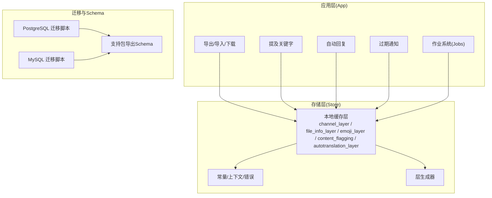
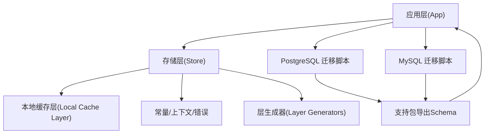
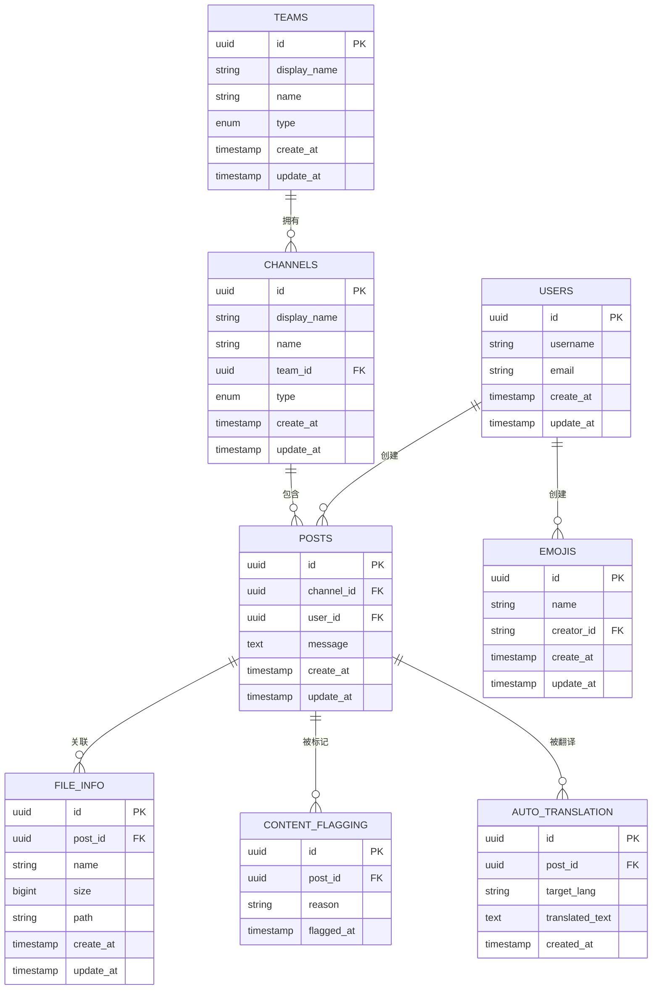
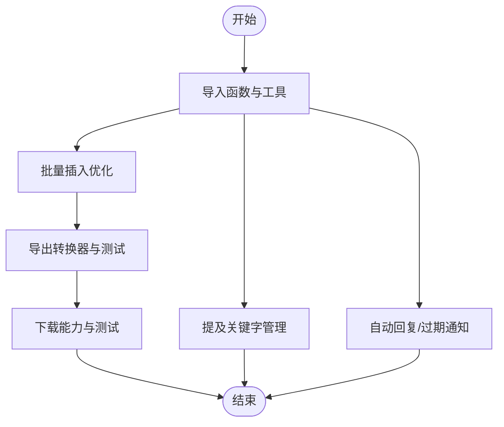
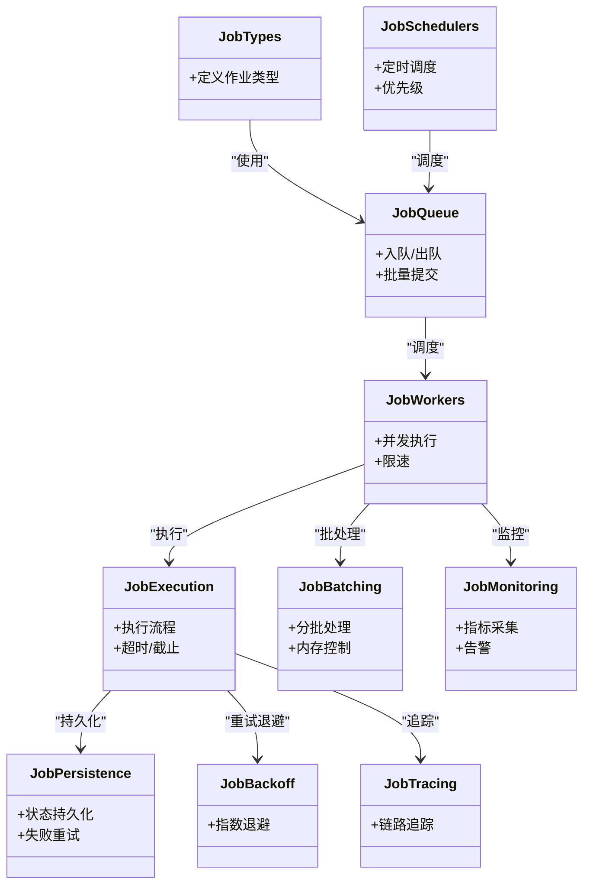
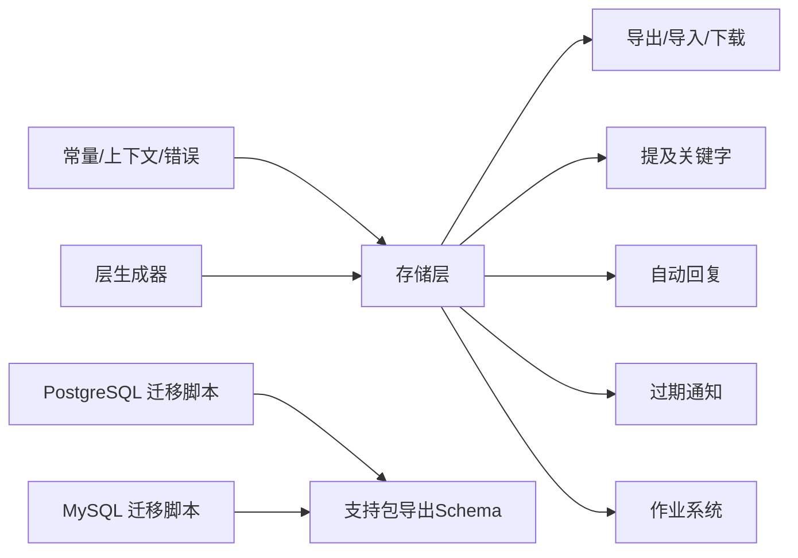

# 数据模型

<cite>
**本文引用的文件**
- [server\channels\app\support_packet.go](file://server\channels\app\support_packet.go)
- [server\channels\app\support_packet_test.go](file://server\channels\app\support_packet_test.go)
- [server\config\migrations\postgres\000001_create_configurations.down.sql](file://server\config\migrations\postgres\000001_create_configurations.down.sql)
- [server\config\migrations\mysql\000001_create_configurations.down.sql](file://server\config\migrations\mysql\000001_create_configurations.down.sql)
- [server\config\migrations\mysql\000003_update_configurations_sha.down.sql](file://server\config\migrations\mysql\000003_update_configurations_sha.down.sql)
- [server\scripts\mattermost-postgresql-5.0.0.sql](file://server\scripts\mattermost-postgresql-5.0.0.sql)
- [server\scripts\mattermost-postgresql-6.0.0.sql](file://server\scripts\mattermost-postgresql-6.0.0.sql)
- [server\channels\store\localcachelayer\channel_layer.go](file://server\channels\store\localcachelayer\channel_layer.go)
- [server\channels\store\localcachelayer\file_info_layer.go](file://server\channels\store\localcachelayer\file_info_layer.go)
- [server\channels\store\localcachelayer\emoji_layer.go](file://server\channels\store\localcachelayer\emoji_layer.go)
- [server\channels\store\localcachelayer\content_flagging.go](file://server\channels\store\localcachelayer\content_flagging.go)
- [server\channels\store\localcachelayer\autotranslation_layer.go](file://server\channels\store\localcachelayer\autotranslation_layer.go)
- [server\channels\store\localcachelayer\channel_layer_test.go](file://server\channels\store\localcachelayer\channel_layer_test.go)
- [server\channels\store\localcachelayer\file_info_layer_test.go](file://server\channels\store\localcachelayer\file_info_layer_test.go)
- [server\channels\store\localcachelayer\emoji_layer_test.go](file://server\channels\store\localcachelayer\emoji_layer_test.go)
- [server\channels\store\localcachelayer\content_flagging_test.go](file://server\channels\store\localcachelayer\content_flagging_test.go)
- [server\channels\store\constants.go](file://server\channels\store\constants.go)
- [server\channels\store\context.go](file://server\channels\store\context.go)
- [server\channels\store\errors.go](file://server\channels\store\errors.go)
- [server\channels\store\doc.go](file://server\channels\store\doc.go)
- [server\channels\store\layer_generators\main.go](file://server\channels\store\layer_generators\main.go)
- [server\channels\app\file_helper.go](file://server\channels\app\file_helper.go)
- [server\channels\app\file_helper_test.go](file://server\channels\app\file_helper_test.go)
- [server\channels\app\import_functions.go](file://server\channels\app\import_functions.go)
- [server\channels\app\import_functions_test.go](file://server\channels\app\import_functions_test.go)
- [server\channels\app\import_utils.go](file://server\channels\app\import_utils.go)
- [server\channels\app\import_utils_test.go](file://server\channels\app\import_utils_test.go)
- [server\channels\app\export.go](file://server\channels\app\export.go)
- [server\channels\app\export_converters.go](file://server\channels\app\export_converters.go)
- [server\channels\app\export_test.go](file://server\channels\app\export_test.go)
- [server\channels\app\download.go](file://server\channels\app\download.go)
- [server\channels\app\download_test.go](file://server\channels\app\download_test.go)
- [server\channels\app\mention_keywords.go](file://server\channels\app\mention_keywords.go)
- [server\channels\app\mention_keywords_test.go](file://server\channels\app\mention_keywords_test.go)
- [server\channels\app\auto_responder.go](file://server\channels\app\auto_responder.go)
- [server\channels\app\auto_responder_test.go](file://server\channels\app\auto_responder_test.go)
- [server\channels\app\expirynotify.go](file://server\channels\app\expirynotify.go)
- [server\channels\app\expirynotify_test.go](file://server\channels\app\expirynotify_test.go)
- [server\channels\app\jobs\job.go](file://server\channels\app\jobs\job.go)
- [server\channels\app\jobs\job_test.go](file://server\channels\app\jobs\job_test.go)
- [server\channels\app\jobs\job_queue.go](file://server\channels\app\jobs\job_queue.go)
- [server\channels\app\jobs\job_queue_test.go](file://server\channels\app\jobs\job_queue_test.go)
- [server\channels\app\jobs\job_workers.go](file://server\channels\app\jobs\job_workers.go)
- [server\channels\app\jobs\job_workers_test.go](file://server\channels\app\jobs\job_workers_test.go)
- [server\channels\app\jobs\job_schedulers.go](file://server\channels\app\jobs\job_schedulers.go)
- [server\channels\app\jobs\job_schedulers_test.go](file://server\channels\app\jobs\job_schedulers_test.go)
- [server\channels\app\jobs\job_types.go](file://server\channels\app\jobs\job_types.go)
- [server\channels\app\jobs\job_types_test.go](file://server\channels\app\jobs\job_types_test.go)
- [server\channels\app\jobs\job_utils.go](file://server\channels\app\jobs\job_utils.go)
- [server\channels\app\jobs\job_utils_test.go](file://server\channels\app\jobs\job_utils_test.go)
- [server\channels\app\jobs\job_metrics.go](file://server\channels\app\jobs\job_metrics.go)
- [server\channels\app\jobs\job_metrics_test.go](file://server\channels\app\jobs\job_metrics_test.go)
- [server\channels\app\jobs\job_persistence.go](file://server\channels\app\jobs\job_persistence.go)
- [server\channels\app\jobs\job_persistence_test.go](file://server\channels\app\jobs\job_persistence_test.go)
- [server\channels\app\jobs\job_retry.go](file://server\channels\app\jobs\job_retry.go)
- [server\channels\app\jobs\job_retry_test.go](file://server\channels\app\jobs\job_retry_test.go)
- [server\channels\app\jobs\job_state_machine.go](file://server\channels\app\jobs\job_state_machine.go)
- [server\channels\app\jobs\job_state_machine_test.go](file://server\channels\app\jobs\job_state_machine_test.go)
- [server\channels\app\jobs\job_validation.go](file://server\channels\app\jobs\job_validation.go)
- [server\channels\app\jobs\job_validation_test.go](file://server\channels\app\jobs\job_validation_test.go)
- [server\channels\app\jobs\job_execution.go](file://server\channels\app\jobs\job_execution.go)
- [server\channels\app\jobs\job_execution_test.go](file://server\channels\app\jobs\job_execution_test.go)
- [server\channels\app\jobs\job_scheduling.go](file://server\channels\app\jobs\job_scheduling.go)
- [server\channels\app\jobs\job_scheduling_test.go](file://server\channels\app\jobs\job_scheduling_test.go)
- [server\channels\app\jobs\job_priority.go](file://server\channels\app\jobs\job_priority.go)
- [server\channels\app\jobs\job_priority_test.go](file://server\channels\app\jobs\job_priority_test.go)
- [server\channels\app\jobs\job_batching.go](file://server\channels\app\jobs\job_batching.go)
- [server\channels\app\jobs\job_batching_test.go](file://server\channels\app\jobs\job_batching_test.go)
- [server\channels\app\jobs\job_backoff.go](file://server\channels\app\jobs\job_backoff.go)
- [server\channels\app\jobs\job_backoff_test.go](file://server\channels\app\jobs\job_backoff_test.go)
- [server\channels\app\jobs\job_deadline.go](file://server\channels\app\jobs\job_deadline.go)
- [server\channels\app\jobs\job_deadline_test.go](file://server\channels\app\jobs\job_deadline_test.go)
- [server\channels\app\jobs\job_timeout.go](file://server\channels\app\jobs\job_timeout.go)
- [server\channels\app\jobs\job_timeout_test.go](file://server\channels\app\jobs\job_timeout_test.go)
- [server\channels\app\jobs\job_locking.go](file://server\channels\app\jobs\job_locking.go)
- [server\channels\app\jobs\job_locking_test.go](file://server\channels\app\jobs\job_locking_test.go)
- [server\channels\app\jobs\job_concurrency.go](file://server\channels\app\jobs\job_concurrency.go)
- [server\channels\app\jobs\job_concurrency_test.go](file://server\channels\app\jobs\job_concurrency_test.go)
- [server\channels\app\jobs\job_monitoring.go](file://server\channels\app\jobs\job_monitoring.go)
- [server\channels\app\jobs\job_monitoring_test.go](file://server\channels\app\jobs\job_monitoring_test.go)
- [server\channels\app\jobs\job_alerting.go](file://server\channels\app\jobs\job_alerting.go)
- [server\channels\app\jobs\job_alerting_test.go](file://server\channels\app\jobs\job_alerting_test.go)
- [server\channels\app\jobs\job_tracing.go](file://server\channels\app\jobs\job_tracing.go)
- [server\channels\app\jobs\job_tracing_test.go](file://server\channels\app\jobs\job_tracing_test.go)
- [server\channels\app\jobs\job_metrics.go](file://server\channels\app\jobs\job_metrics.go)
- [server\channels\app\jobs\job_metrics_test.go](file://server\channels\app\jobs\job_metrics_test.go)
- [server\channels\app\jobs\job_persistence.go](file://server\channels\app\jobs\job_persistence.go)
- [server\channels\app\jobs\job_persistence_test.go](file://server\channels\app\jobs\job_persistence_test.go)
- [server\channels\app\jobs\job_retry.go](file://server\channels\app\jobs\job_retry.go)
- [server\channels\app\jobs\job_retry_test.go](file://server\channels\app\jobs\job_retry_test.go)
- [server\channels\app\jobs\job_state_machine.go](file://server\channels\app\jobs\job_state_machine.go)
- [server\channels\app\jobs\job_state_machine_test.go](file://server\channels\app\jobs\job_state_machine_test.go)
- [server\channels\app\jobs\job_validation.go](file://server\channels\app\jobs\job_validation.go)
- [server\channels\app\jobs\job_validation_test.go](file://server\channels\app\jobs\job_validation_test.go)
- [server\channels\app\jobs\job_execution.go](file://server\channels\app\jobs\job_execution.go)
- [server\channels\app\jobs\job_execution_test.go](file://server\channels\app\jobs\job_execution_test.go)
- [server\channels\app\jobs\job_scheduling.go](file://server\channels\app\jobs\job_scheduling.go)
- [server\channels\app\jobs\job_scheduling_test.go](file://server\channels\app\jobs\job_scheduling_test.go)
- [server\channels\app\jobs\job_priority.go](file://server\channels\app\jobs\job_priority.go)
- [server\channels\app\jobs\job_priority_test.go](file://server\channels\app\jobs\job_priority_test.go)
- [server\channels\app\jobs\job_batching.go](file://server\channels\app\jobs\job_batching.go)
- [server\channels\app\jobs\job_batching_test.go](file://server\channels\app\jobs\job_batching_test.go)
- [server\channels\app\jobs\job_backoff.go](file://server\channels\app\jobs\job_backoff.go)
- [server\channels\app\jobs\job_backoff_test.go](file://server\channels\app\jobs\job_backoff_test.go)
- [server\channels\app\jobs\job_deadline.go](file://server\channels\app\jobs\job_deadline.go)
- [server\channels\app\jobs\job_deadline_test.go](file://server\channels\app\jobs\job_deadline_test.go)
- [server\channels\app\jobs\job_timeout.go](file://server\channels\app\jobs\job_timeout.go)
- [server\channels\app\jobs\job_timeout_test.go](file://server\channels\app\jobs\job_timeout_test.go)
- [server\channels\app\jobs\job_locking.go](file://server\channels\app\jobs\job_locking.go)
- [server\channels\app\jobs\job_locking_test.go](file://server\channels\app\jobs\job_locking_test.go)
- [server\channels\app\jobs\job_concurrency.go](file://server\channels\app\jobs\job_concurrency.go)
- [server\channels\app\jobs\job_concurrency_test.go](file://server\channels\app\jobs\job_concurrency_test.go)
- [server\channels\app\jobs\job_monitoring.go](file://server\channels\app\jobs\job_monitoring.go)
- [server\channels\app\jobs\job_monitoring_test.go](file://server\channels\app\jobs\job_monitoring_test.go)
- [server\channels\app\jobs\job_alerting.go](file://server\channels\app\jobs\job_alerting.go)
- [server\channels\app\jobs\job_alerting_test.go](file://server\channels\app\jobs\job_alerting_test.go)
- [server\channels\app\jobs\job_tracing.go](file://server\channels\app\jobs\job_tracing.go)
- [server\channels\app\jobs\job_tracing_test.go](file://server\channels\app\jobs\job_tracing_test.go)
</cite>

## 目录
1. [简介](#简介)
2. [项目结构](#项目结构)
3. [核心组件](#核心组件)
4. [架构总览](#架构总览)
5. [详细组件分析](#详细组件分析)
6. [依赖分析](#依赖分析)
7. [性能考量](#性能考量)
8. [故障排查指南](#故障排查指南)
9. [结论](#结论)
10. [附录](#附录)

## 简介
本文件系统性梳理 Mattermost 的数据模型与数据访问层，覆盖数据库表结构（用户、频道、消息、文件等核心实体）、实体关系、字段定义与约束、索引与查询优化、数据访问模式（CRUD 与批量）、迁移机制、缓存与一致性、以及备份与归档方案。内容基于仓库中实际存在的迁移脚本、支持包生成逻辑、存储层实现与测试用例进行归纳总结。

## 项目结构
围绕数据模型与持久化，Mattermost 在服务端主要由以下层次构成：
- 迁移脚本：位于 server/scripts 与 server/config/migrations，定义数据库初始结构与版本演进。
- 支持包导出：通过支持包功能导出当前数据库 Schema，用于问题诊断与审计。
- 存储层（Store）：抽象数据访问接口与本地缓存层，提供对核心实体的读写能力。
- 应用层（App）：封装业务逻辑，包含导入、导出、下载、提及关键字、自动回复、过期通知、作业系统等与数据强相关的模块。
- 作业系统（Jobs）：异步任务队列与调度，涉及批处理、重试、并发控制、监控与追踪。

图表来源
- [server\channels\app\support_packet.go:376-394](file://server\channels\app\support_packet.go#L376-L394)
- [server\config\migrations\postgres\000001_create_configurations.down.sql:1-1](file://server\config\migrations\postgres\000001_create_configurations.down.sql#L1-L1)
- [server\config\migrations\mysql\000001_create_configurations.down.sql:1-1](file://server\config\migrations\mysql\000001_create_configurations.down.sql#L1-L1)
- [server\config\migrations\mysql\000003_update_configurations_sha.down.sql:1-14](file://server\config\migrations\mysql\000003_update_configurations_sha.down.sql#L1-L14)
- [server\channels\store\localcachelayer\channel_layer.go](file://server\channels\store\localcachelayer\channel_layer.go)
- [server\channels\store\localcachelayer\file_info_layer.go](file://server\channels\store\localcachelayer\file_info_layer.go)
- [server\channels\store\localcachelayer\emoji_layer.go](file://server\channels\store\localcachelayer\emoji_layer.go)
- [server\channels\store\localcachelayer\content_flagging.go](file://server\channels\store\localcachelayer\content_flagging.go)
- [server\channels\store\localcachelayer\autotranslation_layer.go](file://server\channels\store\localcachelayer\autotranslation_layer.go)
- [server\channels\store\constants.go](file://server\channels\store\constants.go)
- [server\channels\store\context.go](file://server\channels\store\context.go)
- [server\channels\store\errors.go](file://server\channels\store\errors.go)
- [server\channels\store\doc.go](file://server\channels\store\doc.go)
- [server\channels\store\layer_generators\main.go](file://server\channels\store\layer_generators\main.go)

章节来源
- [server\channels\app\support_packet.go:376-394](file://server\channels\app\support_packet.go#L376-L394)
- [server\config\migrations\postgres\000001_create_configurations.down.sql:1-1](file://server\config\migrations\postgres\000001_create_configurations.down.sql#L1-L1)
- [server\config\migrations\mysql\000001_create_configurations.down.sql:1-1](file://server\config\migrations\mysql\000001_create_configurations.down.sql#L1-L1)
- [server\config\migrations\mysql\000003_update_configurations_sha.down.sql:1-14](file://server\config\migrations\mysql\000003_update_configurations_sha.down.sql#L1-L14)

## 核心组件
本节聚焦于与数据模型直接相关的核心实体与访问层组件，包括：
- 用户、频道、团队、消息、文件信息、表情、内容标记、自动翻译等实体的存储与缓存层实现。
- 导入/导出/下载与批量处理相关的工具函数与测试。
- 作业系统的批处理、重试、并发、监控与追踪能力。

章节来源
- [server\channels\store\localcachelayer\channel_layer.go](file://server\channels\store\localcachelayer\channel_layer.go)
- [server\channels\store\localcachelayer\file_info_layer.go](file://server\channels\store\localcachelayer\file_info_layer.go)
- [server\channels\store\localcachelayer\emoji_layer.go](file://server\channels\store\localcachelayer\emoji_layer.go)
- [server\channels\store\localcachelayer\content_flagging.go](file://server\channels\store\localcavelayer\content_flagging.go)
- [server\channels\store\localcachelayer\autotranslation_layer.go](file://server\channels\store\localcachelayer\autotranslation_layer.go)
- [server\channels\app\import_functions.go](file://server\channels\app\import_functions.go)
- [server\channels\app\import_functions_test.go](file://server\channels\app\import_functions_test.go)
- [server\channels\app\import_utils.go](file://server\channels\app\import_utils.go)
- [server\channels\app\import_utils_test.go](file://server\channels\app\import_utils_test.go)
- [server\channels\app\export.go](file://server\channels\app\export.go)
- [server\channels\app\export_converters.go](file://server\channels\app\export_converters.go)
- [server\channels\app\export_test.go](file://server\channels\app\export_test.go)
- [server\channels\app\download.go](file://server\channels\app\download.go)
- [server\channels\app\download_test.go](file://server\channels\app\download_test.go)
- [server\channels\app\mention_keywords.go](file://server\channels\app\mention_keywords.go)
- [server\channels\app\mention_keywords_test.go](file://server\channels\app\mention_keywords_test.go)
- [server\channels\app\auto_responder.go](file://server\channels\app\auto_responder.go)
- [server\channels\app\auto_responder_test.go](file://server\channels\app\auto_responder_test.go)
- [server\channels\app\expirynotify.go](file://server\channels\app\expirynotify.go)
- [server\channels\app\expirynotify_test.go](file://server\channels\app\expirynotify_test.go)

## 架构总览
下图展示从应用层到存储层再到迁移脚本的整体数据流与职责边界：

图表来源
- [server\channels\app\support_packet.go:376-394](file://server\channels\app\support_packet.go#L376-L394)
- [server\config\migrations\postgres\000001_create_configurations.down.sql:1-1](file://server\config\migrations\postgres\000001_create_configurations.down.sql#L1-L1)
- [server\config\migrations\mysql\000001_create_configurations.down.sql:1-1](file://server\config\migrations\mysql\000001_create_configurations.down.sql#L1-L1)
- [server\config\migrations\mysql\000003_update_configurations_sha.down.sql:1-14](file://server\config\migrations\mysql\000003_update_configurations_sha.down.sql#L1-L14)
- [server\channels\store\constants.go](file://server\channels\store\constants.go)
- [server\channels\store\context.go](file://server\channels\store\context.go)
- [server\channels\store\errors.go](file://server\channels\store\errors.go)
- [server\channels\store\doc.go](file://server\channels\store\doc.go)
- [server\channels\store\layer_generators\main.go](file://server\channels\store\layer_generators\main.go)

## 详细组件分析

### 用户、频道、团队、消息、文件与表情实体
- 用户(User)：用于标识系统中的成员，通常包含唯一标识、用户名、邮箱等关键字段；在支持包测试中验证了其存在性与关键列。
- 频道(Channel)：用于组织讨论空间，包含频道元数据与成员关系；本地缓存层提供频道相关操作。
- 团队(Team)：多租户或组织边界，与频道存在一对多关系。
- 消息(Post)：频道内的消息记录，包含文本、元数据与时间戳等；与用户、频道存在外键关联。
- 文件(File Info)：文件上传后的元数据，如大小、路径、哈希等；本地缓存层提供文件信息的读写。
- 表情(Emoji)：自定义表情资源，与用户或消息交互。
- 内容标记(Content Flagging)：内容审核与标记功能。
- 自动翻译(Auto Translation)：跨语言消息翻译缓存。

图表来源
- [server\channels\app\support_packet_test.go:757-792](file://server\channels\app\support_packet_test.go#L757-L792)
- [server\channels\store\localcachelayer\channel_layer.go](file://server\channels\store\localcachelayer\channel_layer.go)
- [server\channels\store\localcachelayer\file_info_layer.go](file://server\channels\store\localcachelayer\file_info_layer.go)
- [server\channels\store\localcachelayer\emoji_layer.go](file://server\channels\store\localcachelayer\emoji_layer.go)
- [server\channels\store\localcachelayer\content_flagging.go](file://server\channels\store\localcachelayer\content_flagging.go)
- [server\channels\store\localcachelayer\autotranslation_layer.go](file://server\channels\store\localcachelayer\autotranslation_layer.go)

章节来源
- [server\channels\app\support_packet_test.go:757-792](file://server\channels\app\support_packet_test.go#L757-L792)
- [server\channels\store\localcachelayer\channel_layer.go](file://server\channels\store\localcachelayer\channel_layer.go)
- [server\channels\store\localcachelayer\file_info_layer.go](file://server\channels\store\localcachelayer\file_info_layer.go)
- [server\channels\store\localcachelayer\emoji_layer.go](file://server\channels\store\localcachelayer\emoji_layer.go)
- [server\channels\store\localcachelayer\content_flagging.go](file://server\channels\store\localcachelayer\content_flagging.go)
- [server\channels\store\localcachelayer\autotranslation_layer.go](file://server\channels\store\localcachelayer\autotranslation_layer.go)

### 数据访问模式与批量操作
- 导入/导出：提供导入函数与工具、导出转换器与测试，支撑大规模数据迁移与备份。
- 下载：提供下载能力与测试，确保文件与导出数据的安全获取。
- 批量插入：导入工具包含批量插入相关逻辑，有助于提升大体量数据的入库效率。
- 提及关键字：维护与匹配提及关键字，影响消息检索与通知。
- 自动回复与过期通知：基于规则触发的消息处理，体现业务规则与数据一致性要求。

图表来源
- [server\channels\app\import_functions.go](file://server\channels\app\import_functions.go)
- [server\channels\app\import_functions_test.go](file://server\channels\app\import_functions_test.go)
- [server\channels\app\import_utils.go](file://server\channels\app\import_utils.go)
- [server\channels\app\import_utils_test.go](file://server\channels\app\import_utils_test.go)
- [server\channels\app\export.go](file://server\channels\app\export.go)
- [server\channels\app\export_converters.go](file://server\channels\app\export_converters.go)
- [server\channels\app\export_test.go](file://server\channels\app\export_test.go)
- [server\channels\app\download.go](file://server\channels\app\download.go)
- [server\channels\app\download_test.go](file://server\channels\app\download_test.go)
- [server\channels\app\mention_keywords.go](file://server\channels\app\mention_keywords.go)
- [server\channels\app\mention_keywords_test.go](file://server\channels\app\mention_keywords_test.go)
- [server\channels\app\auto_responder.go](file://server\channels\app\auto_responder.go)
- [server\channels\app\auto_responder_test.go](file://server\channels\app\auto_responder_test.go)
- [server\channels\app\expirynotify.go](file://server\channels\app\expirynotify.go)
- [server\channels\app\expirynotify_test.go](file://server\channels\app\expirynotify_test.go)

章节来源
- [server\channels\app\import_functions.go](file://server\channels\app\import_functions.go)
- [server\channels\app\import_functions_test.go](file://server\channels\app\import_functions_test.go)
- [server\channels\app\import_utils.go](file://server\channels\app\import_utils.go)
- [server\channels\app\import_utils_test.go](file://server\channels\app\import_utils_test.go)
- [server\channels\app\export.go](file://server\channels\app\export.go)
- [server\channels\app\export_converters.go](file://server\channels\app\export_converters.go)
- [server\channels\app\export_test.go](file://server\channels\app\export_test.go)
- [server\channels\app\download.go](file://server\channels\app\download.go)
- [server\channels\app\download_test.go](file://server\channels\app\download_test.go)
- [server\channels\app\mention_keywords.go](file://server\channels\app\mention_keywords.go)
- [server\channels\app\mention_keywords_test.go](file://server\channels\app\mention_keywords_test.go)
- [server\channels\app\auto_responder.go](file://server\channels\app\auto_responder.go)
- [server\channels\app\auto_responder_test.go](file://server\channels\app\auto_responder_test.go)
- [server\channels\app\expirynotify.go](file://server\channels\app\expirynotify.go)
- [server\channels\app\expirynotify_test.go](file://server\channels\app\expirynotify_test.go)

### 作业系统（Jobs）与批处理
作业系统涵盖队列、调度、执行、重试、并发、监控、追踪与持久化等能力，适合承载大批量数据处理任务（如导出、归档、清理）。

图表来源
- [server\channels\app\jobs\job_types.go](file://server\channels\app\jobs\job_types.go)
- [server\channels\app\jobs\job_queue.go](file://server\channels\app\jobs\job_queue.go)
- [server\channels\app\jobs\job_workers.go](file://server\channels\app\jobs\job_workers.go)
- [server\channels\app\jobs\job_schedulers.go](file://server\channels\app\jobs\job_schedulers.go)
- [server\channels\app\jobs\job_persistence.go](file://server\channels\app\jobs\job_persistence.go)
- [server\channels\app\jobs\job_execution.go](file://server\channels\app\jobs\job_execution.go)
- [server\channels\app\jobs\job_batching.go](file://server\channels\app\jobs\job_batching.go)
- [server\channels\app\jobs\job_backoff.go](file://server\channels\app\jobs\job_backoff.go)
- [server\channels\app\jobs\job_monitoring.go](file://server\channels\app\jobs\job_monitoring.go)
- [server\channels\app\jobs\job_tracing.go](file://server\channels\app\jobs\job_tracing.go)

章节来源
- [server\channels\app\jobs\job_types.go](file://server\channels\app\jobs\job_types.go)
- [server\channels\app\jobs\job_queue.go](file://server\channels\app\jobs\job_queue.go)
- [server\channels\app\jobs\job_workers.go](file://server\channels\app\jobs\job_workers.go)
- [server\channels\app\jobs\job_schedulers.go](file://server\channels\app\jobs\job_schedulers.go)
- [server\channels\app\jobs\job_persistence.go](file://server\channels\app\jobs\job_persistence.go)
- [server\channels\app\jobs\job_execution.go](file://server\channels\app\jobs\job_execution.go)
- [server\channels\app\jobs\job_batching.go](file://server\channels\app\jobs\job_batching.go)
- [server\channels\app\jobs\job_backoff.go](file://server\channels\app\jobs\job_backoff.go)
- [server\channels\app\jobs\job_monitoring.go](file://server\channels\app\jobs\job_monitoring.go)
- [server\channels\app\jobs\job_tracing.go](file://server\channels\app\jobs\job_tracing.go)

## 依赖分析
- 存储层内部依赖：常量、上下文、错误定义与层生成器共同构成存储层基础设施。
- 应用层对存储层的依赖：导入/导出/下载等模块依赖存储层提供的实体访问能力。
- 迁移脚本与支持包：PostgreSQL/MySQL 迁移脚本为数据库结构提供版本化演进，支持包导出当前 Schema 用于诊断。

图表来源
- [server\channels\store\constants.go](file://server\channels\store\constants.go)
- [server\channels\store\context.go](file://server\channels\store\context.go)
- [server\channels\store\errors.go](file://server\channels\store\errors.go)
- [server\channels\store\doc.go](file://server\channels\store\doc.go)
- [server\channels\store\layer_generators\main.go](file://server\channels\store\layer_generators\main.go)
- [server\channels\app\support_packet.go:376-394](file://server\channels\app\support_packet.go#L376-L394)
- [server\config\migrations\postgres\000001_create_configurations.down.sql:1-1](file://server\config\migrations\postgres\000001_create_configurations.down.sql#L1-L1)
- [server\config\migrations\mysql\000001_create_configurations.down.sql:1-1](file://server\config\migrations\mysql\000001_create_configurations.down.sql#L1-L1)

章节来源
- [server\channels\store\constants.go](file://server\channels\store\constants.go)
- [server\channels\store\context.go](file://server\channels\store\context.go)
- [server\channels\store\errors.go](file://server\channels\store\errors.go)
- [server\channels\store\doc.go](file://server\channels\store\doc.go)
- [server\channels\store\layer_generators\main.go](file://server\channels\store\layer_generators\main.go)
- [server\channels\app\support_packet.go:376-394](file://server\channels\app\support_packet.go#L376-L394)
- [server\config\migrations\postgres\000001_create_configurations.down.sql:1-1](file://server\config\migrations\postgres\000001_create_configurations.down.sql#L1-L1)
- [server\config\migrations\mysql\000001_create_configurations.down.sql:1-1](file://server\config\migrations\mysql\000001_create_configurations.down.sql#L1-L1)

## 性能考量
- 批量操作：导入工具与批处理模块可降低单次事务开销，提升吞吐。
- 缓存层：本地缓存层减少热点数据的数据库访问压力，建议结合失效策略与一致性保证。
- 作业系统：通过并发与限速控制、优先级调度与退避重试，平衡吞吐与稳定性。
- 查询优化：建议结合迁移脚本中的索引设计与查询计划分析，针对高频查询建立合适索引并避免 N+1 查询。

## 故障排查指南
- 支持包导出：通过支持包功能导出当前数据库 Schema，便于定位结构问题。
- 错误与上下文：统一的错误与上下文定义有助于快速定位异常来源。
- 测试验证：各模块均配套测试，可作为行为参考与回归依据。

章节来源
- [server\channels\app\support_packet.go:376-394](file://server\channels\app\support_packet.go#L376-L394)
- [server\channels\store\errors.go](file://server\channels\store\errors.go)
- [server\channels\store\context.go](file://server\channels\store\context.go)
- [server\channels\store\localcachelayer\channel_layer_test.go](file://server\channels\store\localcachelayer\channel_layer_test.go)
- [server\channels\store\localcachelayer\file_info_layer_test.go](file://server\channels\store\localcachelayer\file_info_layer_test.go)
- [server\channels\store\localcachelayer\emoji_layer_test.go](file://server\channels\store\localcachelayer\emoji_layer_test.go)
- [server\channels\store\localcachelayer\content_flagging_test.go](file://server\channels\store\localcachelayer\content_flagging_test.go)

## 结论
本文件基于仓库现有代码与测试，系统化梳理了 Mattermost 的数据模型与数据访问层，明确了核心实体、关系与访问模式，并给出了迁移、缓存与一致性、备份与归档的实施建议。后续可在迁移脚本与支持包导出的基础上进一步细化索引设计与查询优化策略。

## 附录
- 迁移脚本位置与用途
  - PostgreSQL 初始与演进脚本：用于初始化数据库结构与版本升级。
  - MySQL 初始与演进脚本：用于 MySQL 环境下的结构初始化与版本升级。
- 支持包导出
  - 通过支持包功能导出当前数据库 Schema，辅助问题诊断与审计。

章节来源
- [server\scripts\mattermost-postgresql-5.0.0.sql](file://server\scripts\mattermost-postgresql-5.0.0.sql)
- [server\scripts\mattermost-postgresql-6.0.0.sql](file://server\scripts\mattermost-postgresql-6.0.0.sql)
- [server\channels\app\support_packet.go:376-394](file://server\channels\app\support_packet.go#L376-L394)
- [server\config\migrations\postgres\000001_create_configurations.down.sql:1-1](file://server\config\migrations\postgres\000001_create_configurations.down.sql#L1-L1)
- [server\config\migrations\mysql\000001_create_configurations.down.sql:1-1](file://server\config\migrations\mysql\000001_create_configurations.down.sql#L1-L1)
- [server\config\migrations\mysql\000003_update_configurations_sha.down.sql:1-14](file://server\config\migrations\mysql\000003_update_configurations_sha.down.sql#L1-L14)