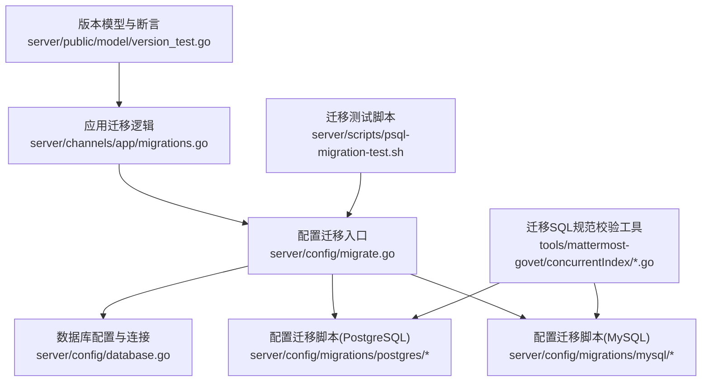
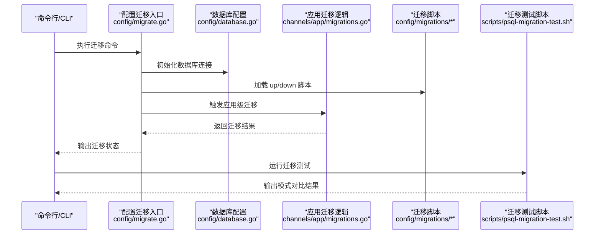
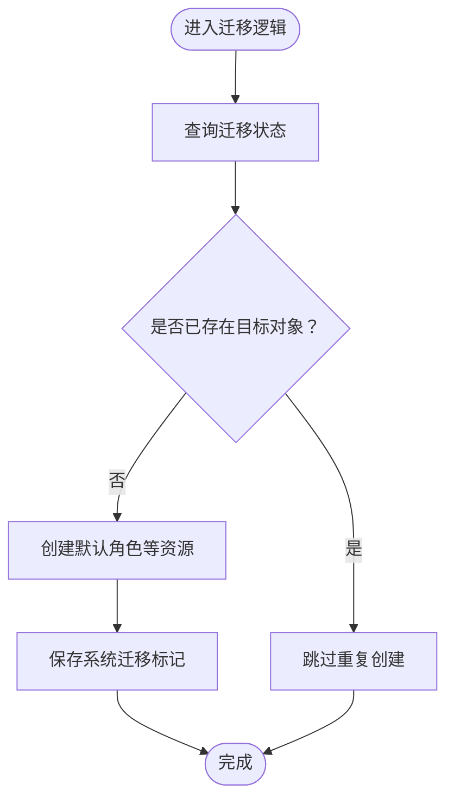
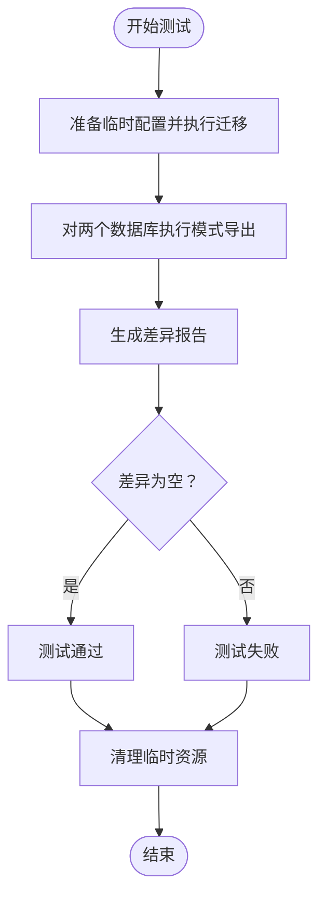
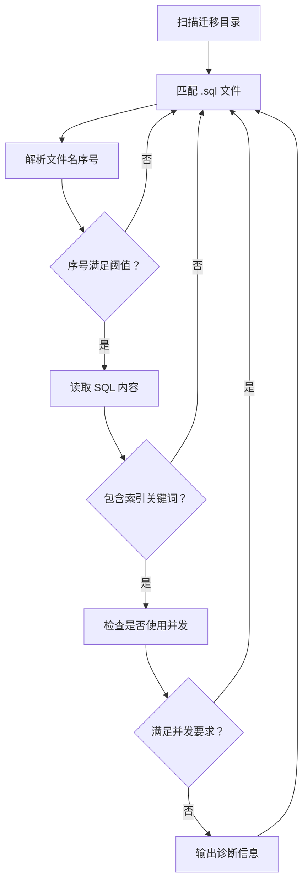
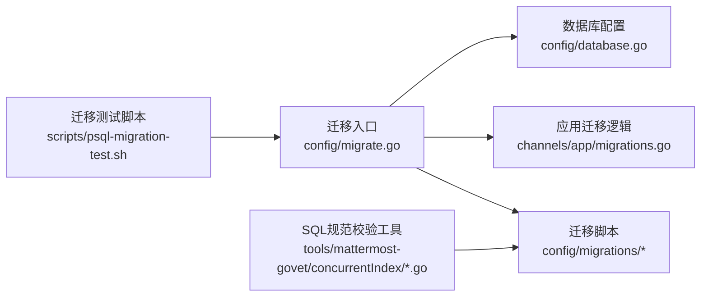

# 数据迁移与版本管理

<cite>
**本文引用的文件**
- [migrations.go](file://server/channels/app/migrations.go)
- [migrate.go](file://server/config/migrate.go)
- [database.go](file://server/config/database.go)
- [psql-migration-test.sh](file://server/scripts/psql-migration-test.sh)
- [concurrentIndex.go](file://tools/mattermost-govet/concurrentIndex/concurrentIndex.go)
- [concurrentIndex_test.go](file://tools/mattermost-govet/concurrentIndex/concurrentIndex_test.go)
- [000001_create_configurations.down.sql](file://server/config/migrations/postgres/000001_create_configurations.down.sql)
- [000002_create_configuration_files.down.sql](file://server/config/migrations/mysql/000002_create_configuration_files.down.sql)
- [version_test.go](file://server/public/model/version_test.go)
</cite>

## 目录
1. [引言](#引言)
2. [项目结构](#项目结构)
3. [核心组件](#核心组件)
4. [架构总览](#架构总览)
5. [详细组件分析](#详细组件分析)
6. [依赖关系分析](#依赖关系分析)
7. [性能考虑](#性能考虑)
8. [故障排查指南](#故障排查指南)
9. [结论](#结论)
10. [附录](#附录)

## 引言
本文件系统性阐述 Mattermost 的数据库迁移与版本管理机制，覆盖迁移框架设计、迁移脚本编写规范、版本控制策略、执行流程（向前迁移与向后回滚）、数据转换与格式升级、大表与在线迁移策略、失败恢复与回滚方案、性能优化与并发处理、迁移测试与验证流程，以及生产环境迁移的安全措施与最佳实践。内容基于仓库中现有实现进行归纳总结，帮助开发者在不直接阅读源码的情况下理解并正确使用迁移体系。

## 项目结构
Mattermost 的迁移相关能力主要分布在以下位置：
- 应用层迁移逻辑：server/channels/app/migrations.go
- 配置层迁移入口：server/config/migrate.go
- 数据库连接与配置：server/config/database.go
- 迁移测试脚本：server/scripts/psql-migration-test.sh
- 迁移 SQL 规范校验工具：tools/mattermost-govet/concurrentIndex/*.go
- 配置迁移脚本示例（PostgreSQL/MySQL）：server/config/migrations/postgres 与 server/config/migrations/mysql
- 版本模型与断言：server/public/model/version_test.go

图表来源
- [migrations.go](file://server/channels/app/migrations.go)
- [migrate.go](file://server/config/migrate.go)
- [database.go](file://server/config/database.go)
- [psql-migration-test.sh](file://server/scripts/psql-migration-test.sh)
- [concurrentIndex.go](file://tools/mattermost-govet/concurrentIndex/concurrentIndex.go)
- [000001_create_configurations.down.sql](file://server/config/migrations/postgres/000001_create_configurations.down.sql)
- [000002_create_configuration_files.down.sql](file://server/config/migrations/mysql/000002_create_configuration_files.down.sql)
- [version_test.go](file://server/public/model/version_test.go)

章节来源
- [migrations.go](file://server/channels/app/migrations.go)
- [migrate.go](file://server/config/migrate.go)
- [database.go](file://server/config/database.go)
- [psql-migration-test.sh](file://server/scripts/psql-migration-test.sh)
- [concurrentIndex.go](file://tools/mattermost-govet/concurrentIndex/concurrentIndex.go)
- [000001_create_configurations.down.sql](file://server/config/migrations/postgres/000001_create_configurations.down.sql)
- [000002_create_configuration_files.down.sql](file://server/config/migrations/mysql/000002_create_configuration_files.down.sql)
- [version_test.go](file://server/public/model/version_test.go)

## 核心组件
- 应用迁移逻辑：负责在应用启动或特定场景下执行迁移任务，确保数据库结构与业务模型一致；包含默认角色创建等关键迁移步骤。
- 配置迁移入口：统一管理迁移命令与流程，协调数据库连接与迁移脚本加载。
- 数据库配置：提供数据库连接参数与驱动选择，支撑迁移执行。
- 迁移测试脚本：通过对比“新装数据库”与“已迁移数据库”的模式导出差异，验证迁移结果一致性。
- 迁移 SQL 规范校验工具：强制要求索引变更使用并发方式，避免阻塞写入。
- 配置迁移脚本：以 up/down 脚本形式提供数据库结构变更与回滚策略。
- 版本模型与断言：定义当前版本、前一版本与支持范围，保障迁移兼容性。

章节来源
- [migrations.go](file://server/channels/app/migrations.go)
- [migrate.go](file://server/config/migrate.go)
- [database.go](file://server/config/database.go)
- [psql-migration-test.sh](file://server/scripts/psql-migration-test.sh)
- [concurrentIndex.go](file://tools/mattermost-govet/concurrentIndex/concurrentIndex.go)
- [000001_create_configurations.down.sql](file://server/config/migrations/postgres/000001_create_configurations.down.sql)
- [000002_create_configuration_files.down.sql](file://server/config/migrations/mysql/000002_create_configuration_files.down.sql)
- [version_test.go](file://server/public/model/version_test.go)

## 架构总览
下图展示了从命令触发到迁移执行、再到测试验证的整体流程：

图表来源
- [migrate.go](file://server/config/migrate.go)
- [database.go](file://server/config/database.go)
- [migrations.go](file://server/channels/app/migrations.go)
- [psql-migration-test.sh](file://server/scripts/psql-migration-test.sh)

## 详细组件分析

### 组件A：应用迁移逻辑（channels/app/migrations.go）
- 职责
  - 在系统启动或特定阶段执行迁移任务，保证数据库结构与业务模型一致。
  - 处理默认角色创建等关键迁移步骤，并持久化迁移状态。
- 关键点
  - 对迁移查询异常进行区分处理，非“未找到”错误直接返回。
  - 使用聚合错误收集器记录多个迁移步骤中的失败项，提升可观测性。
  - 将迁移完成状态写入系统表，作为后续迁移判断依据。
- 流程示意

图表来源
- [migrations.go](file://server/channels/app/migrations.go)

章节来源
- [migrations.go](file://server/channels/app/migrations.go)

### 组件B：配置迁移入口（config/migrate.go）
- 职责
  - 提供统一的迁移命令入口，协调数据库连接与迁移脚本加载。
  - 作为迁移执行的编排者，调用底层存储层执行 SQL。
- 关键点
  - 与数据库配置模块协作，确保连接参数正确。
  - 支持按需加载 up/down 脚本，实现向前与向后迁移。

章节来源
- [migrate.go](file://server/config/migrate.go)

### 组件C：数据库配置（config/database.go）
- 职责
  - 管理数据库连接参数与驱动选择，为迁移提供稳定的连接基础。
- 关键点
  - 与迁移入口配合，确保迁移过程中的连接可用性与稳定性。

章节来源
- [database.go](file://server/config/database.go)

### 组件D：迁移测试脚本（scripts/psql-migration-test.sh）
- 职责
  - 自动化执行迁移测试，比较“新装数据库”与“已迁移数据库”的模式导出差异，验证迁移一致性。
- 关键点
  - 通过容器内 PostgreSQL 实例执行迁移与模式导出。
  - 对特定历史差异进行兼容性处理，避免误报。
  - 输出差异报告并返回退出码，便于 CI 集成。

图表来源
- [psql-migration-test.sh](file://server/scripts/psql-migration-test.sh)

章节来源
- [psql-migration-test.sh](file://server/scripts/psql-migration-test.sh)

### 组件E：迁移 SQL 规范校验工具（tools/mattermost-govet/concurrentIndex/*.go）
- 职责
  - 强制迁移脚本中的索引变更使用并发方式，避免阻塞写入。
- 关键点
  - 解析迁移文件名中的序号，支持筛选最小迁移编号。
  - 检查 CREATE/DROP 索引语句是否包含并发关键字，未满足则发出诊断信息。

图表来源
- [concurrentIndex.go](file://tools/mattermost-govet/concurrentIndex/concurrentIndex.go)
- [concurrentIndex_test.go](file://tools/mattermost-govet/concurrentIndex/concurrentIndex_test.go)

章节来源
- [concurrentIndex.go](file://tools/mattermost-govet/concurrentIndex/concurrentIndex.go)
- [concurrentIndex_test.go](file://tools/mattermost-govet/concurrentIndex/concurrentIndex_test.go)

### 组件F：配置迁移脚本（config/migrations/postgres 与 mysql）
- 职责
  - 以 up/down 脚本形式提供数据库结构变更与回滚策略。
- 关键点
  - 部分脚本明确声明不提供回滚（如添加配置表），以降低回滚复杂度与风险。
  - 通过序号命名保证迁移顺序与幂等性。

章节来源
- [000001_create_configurations.down.sql](file://server/config/migrations/postgres/000001_create_configurations.down.sql)
- [000002_create_configuration_files.down.sql](file://server/config/migrations/mysql/000002_create_configuration_files.down.sql)

### 组件G：版本模型与断言（public/model/version_test.go）
- 职责
  - 定义当前版本、前一版本与支持范围，用于迁移兼容性判断。
- 关键点
  - 提供版本拆分与比较函数，确保迁移仅在允许范围内进行。

章节来源
- [version_test.go](file://server/public/model/version_test.go)

## 依赖关系分析
- 应用迁移逻辑依赖配置迁移入口与数据库配置，确保迁移在正确的上下文中执行。
- 配置迁移入口依赖数据库配置与迁移脚本目录，形成“命令—脚本—连接”的闭环。
- 迁移测试脚本独立于主流程，通过外部工具对比模式导出，验证迁移正确性。
- SQL 规范校验工具与迁移脚本目录耦合，约束索引变更方式，提升迁移安全性。

图表来源
- [migrate.go](file://server/config/migrate.go)
- [database.go](file://server/config/database.go)
- [migrations.go](file://server/channels/app/migrations.go)
- [psql-migration-test.sh](file://server/scripts/psql-migration-test.sh)
- [concurrentIndex.go](file://tools/mattermost-govet/concurrentIndex/concurrentIndex.go)

章节来源
- [migrate.go](file://server/config/migrate.go)
- [database.go](file://server/config/database.go)
- [migrations.go](file://server/channels/app/migrations.go)
- [psql-migration-test.sh](file://server/scripts/psql-migration-test.sh)
- [concurrentIndex.go](file://tools/mattermost-govet/concurrentIndex/concurrentIndex.go)

## 性能考虑
- 并发索引变更
  - 强制使用并发方式创建/删除索引，减少对写入操作的影响，适用于大表迁移场景。
- 分批处理与事务边界
  - 对大规模数据迁移建议采用分批更新与合理事务边界，避免长事务锁竞争。
- 连接池与超时
  - 合理设置数据库连接池大小与查询超时，避免迁移期间影响线上服务。
- 模式导出与差异比对
  - 使用模式导出进行一致性验证，避免全量数据比对带来的开销。

章节来源
- [concurrentIndex.go](file://tools/mattermost-govet/concurrentIndex/concurrentIndex.go)
- [psql-migration-test.sh](file://server/scripts/psql-migration-test.sh)

## 故障排查指南
- 迁移失败定位
  - 检查应用迁移逻辑中的错误聚合输出，确认具体失败步骤与原因。
  - 对“未找到”类错误进行特殊处理，避免误判为致命错误。
- 回滚策略
  - 优先使用 down 脚本进行回滚；若脚本声明不可回滚，则评估手动修复方案。
  - 对关键结构变更，建议在回滚前备份数据库。
- 测试验证
  - 使用迁移测试脚本生成模式导出并比对差异，快速发现不一致问题。
- 并发索引违规
  - 若出现并发索引相关告警，修正 SQL 语法并重新执行迁移。

章节来源
- [migrations.go](file://server/channels/app/migrations.go)
- [000001_create_configurations.down.sql](file://server/config/migrations/postgres/000001_create_configurations.down.sql)
- [000002_create_configuration_files.down.sql](file://server/config/migrations/mysql/000002_create_configuration_files.down.sql)
- [psql-migration-test.sh](file://server/scripts/psql-migration-test.sh)
- [concurrentIndex.go](file://tools/mattermost-govet/concurrentIndex/concurrentIndex.go)

## 结论
Mattermost 的迁移体系通过“配置入口 + 应用逻辑 + SQL 脚本 + 测试验证 + 规范校验”的组合，实现了可追踪、可回滚、可验证且具备性能约束的数据库演进机制。遵循本文档的规范与流程，可在保证线上稳定性的前提下安全地推进数据库版本升级与结构演进。

## 附录

### 迁移脚本编写规范与最佳实践
- 命名规范
  - 使用递增序号前缀，确保迁移顺序与幂等性。
- up/down 设计
  - up 脚本负责结构与数据变更；down 脚本提供回滚能力。
  - 对于不可回滚的结构变更，应在 down 脚本中明确注释说明。
- 并发约束
  - 索引创建/删除必须使用并发方式，避免阻塞写入。
- 事务与批处理
  - 大规模数据迁移应分批处理，控制单次事务时间。
- 测试与验证
  - 迁移完成后运行模式导出比对，确保一致性。

章节来源
- [concurrentIndex.go](file://tools/mattermost-govet/concurrentIndex/concurrentIndex.go)
- [000001_create_configurations.down.sql](file://server/config/migrations/postgres/000001_create_configurations.down.sql)
- [000002_create_configuration_files.down.sql](file://server/config/migrations/mysql/000002_create_configuration_files.down.sql)
- [psql-migration-test.sh](file://server/scripts/psql-migration-test.sh)

### 版本控制策略与迁移版本号管理
- 当前版本与前一版本
  - 使用版本模型提供的拆分与比较函数，确保迁移仅在允许范围内进行。
- 版本支持范围
  - 通过断言函数验证历史版本是否受支持，避免跨多主版本跳跃迁移。

章节来源
- [version_test.go](file://server/public/model/version_test.go)

### 分支处理与多环境迁移
- 开发/预发布分支
  - 在功能分支上进行迁移开发，合并前确保通过迁移测试脚本验证。
- 生产环境
  - 严格遵循“先备份、再迁移、后验证”的流程，必要时进行灰度发布。

章节来源
- [psql-migration-test.sh](file://server/scripts/psql-migration-test.sh)

### 数据迁移执行流程（向前迁移与向后回滚）
- 向前迁移
  - 由配置入口加载 up 脚本并执行；应用逻辑负责补充性迁移（如默认角色创建）。
- 向后回滚
  - 由配置入口加载对应 down 脚本并执行；对不可回滚的结构变更需制定替代方案。

章节来源
- [migrate.go](file://server/config/migrate.go)
- [migrations.go](file://server/channels/app/migrations.go)
- [000001_create_configurations.down.sql](file://server/config/migrations/postgres/000001_create_configurations.down.sql)
- [000002_create_configuration_files.down.sql](file://server/config/migrations/mysql/000002_create_configuration_files.down.sql)

### 数据转换与格式升级
- 字段类型与约束调整
  - 通过 up/down 脚本进行字段类型变更与约束调整，注意兼容性与默认值设置。
- 默认数据填充
  - 在应用迁移逻辑中补充默认角色等资源，确保系统初始状态一致。

章节来源
- [migrations.go](file://server/channels/app/migrations.go)

### 大表迁移与在线迁移策略
- 并发索引
  - 使用并发方式创建/删除索引，降低对写入的影响。
- 分批处理
  - 对大表数据迁移采用分批更新与事务切分，避免长时间锁竞争。
- 重试与幂等
  - 迁移步骤应具备幂等性，失败后可安全重试。

章节来源
- [concurrentIndex.go](file://tools/mattermost-govet/concurrentIndex/concurrentIndex.go)

### 迁移失败恢复与回滚方案
- 快速回滚
  - 优先使用 down 脚本；若不可用，评估手动修复与数据回滚。
- 备份与恢复
  - 迁移前进行数据库备份，回滚失败时可快速恢复。
- 错误聚合与日志
  - 利用聚合错误收集器定位失败步骤，结合日志进行根因分析。

章节来源
- [migrations.go](file://server/channels/app/migrations.go)
- [000001_create_configurations.down.sql](file://server/config/migrations/postgres/000001_create_configurations.down.sql)
- [000002_create_configuration_files.down.sql](file://server/config/migrations/mysql/000002_create_configuration_files.down.sql)

### 迁移性能优化与并发处理
- 并发索引与批处理
  - 并发索引与分批更新是降低迁移对线上服务影响的关键手段。
- 连接与超时
  - 合理设置连接池与超时，避免迁移拖垮线上请求。

章节来源
- [concurrentIndex.go](file://tools/mattermost-govet/concurrentIndex/concurrentIndex.go)

### 迁移测试与验证流程
- 模式导出比对
  - 使用迁移测试脚本生成模式导出并比对差异，确保迁移结果与预期一致。
- 历史差异兼容
  - 对已知的历史差异进行兼容性处理，避免误报。

章节来源
- [psql-migration-test.sh](file://server/scripts/psql-migration-test.sh)

### 生产环境迁移的安全措施与最佳实践
- 变更审批与灰度
  - 重要迁移需经过评审并在小范围灰度验证后再全量上线。
- 备份与回滚预案
  - 迁移前后均进行备份，制定详细的回滚预案与演练计划。
- 监控与告警
  - 迁移过程中监控数据库性能指标与迁移进度，异常时及时中断与回滚。

章节来源
- [psql-migration-test.sh](file://server/scripts/psql-migration-test.sh)