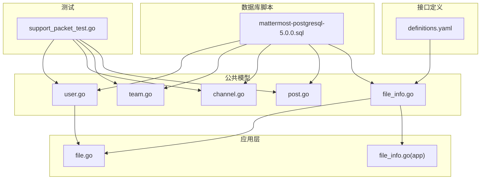
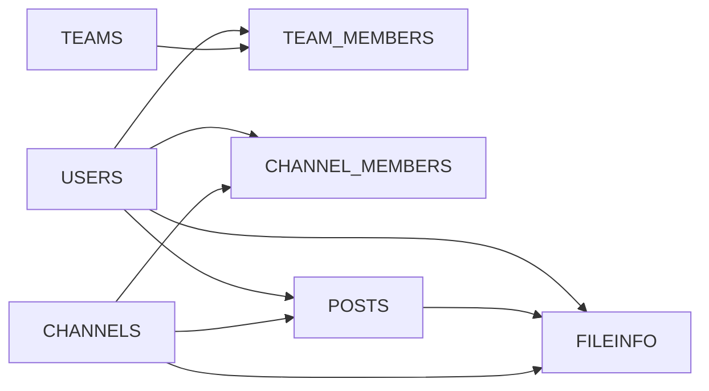

# 核心实体设计

<cite>
**本文档引用的文件**
- [mattermost-postgresql-5.0.0.sql](file://server/scripts/mattermost-postgresql-5.0.0.sql)
- [file_info.go](file://server/public/model/file_info.go)
- [file.go](file://server/channels/app/file.go)
- [definitions.yaml](file://api/v4/source/definitions.yaml)
- [support_packet_test.go](file://server/channels/app/support_packet_test.go)
- [user.go](file://server/public/model/user.go)
- [team.go](file://server/public/model/team.go)
- [channel.go](file://server/public/model/channel.go)
- [post.go](file://server/public/model/post.go)
- [file_info.go](file://server/channels/app/file_info.go)
</cite>

## 目录
1. [简介](#简介)
2. [项目结构](#项目结构)
3. [核心组件](#核心组件)
4. [架构总览](#架构总览)
5. [详细组件分析](#详细组件分析)
6. [依赖分析](#依赖分析)
7. [性能考虑](#性能考虑)
8. [故障排除指南](#故障排除指南)
9. [结论](#结论)
10. [附录](#附录)

## 简介
本文件系统性梳理 Mattermost 的核心实体设计，聚焦用户(User)、团队(Team)、频道(Channel)、消息(Post)与文件(FileInfo)五大实体的表结构、字段定义、约束与业务语义，并通过 ERD 展示实体间主外键关系与引用完整性。同时给出字段级注释说明、生命周期管理与状态变化、以及数据库表结构示例与字段清单，帮助开发者与 DBA 快速理解并正确使用这些核心数据模型。

## 项目结构
围绕核心实体的数据库脚本与模型定义主要分布在以下位置：
- 数据库初始化与迁移脚本：server/scripts/mattermost-postgresql-5.0.0.sql
- 公共模型定义：server/public/model/*.go
- 应用层模型与工具：server/channels/app/*.go
- OpenAPI 定义：api/v4/source/definitions.yaml
- 支持包测试（验证核心表存在）：server/channels/app/support_packet_test.go



图表来源
- [mattermost-postgresql-5.0.0.sql](file://server/scripts/mattermost-postgresql-5.0.0.sql)
- [user.go](file://server/public/model/user.go)
- [team.go](file://server/public/model/team.go)
- [channel.go](file://server/public/model/channel.go)
- [post.go](file://server/public/model/post.go)
- [file_info.go](file://server/public/model/file_info.go)
- [file.go](file://server/channels/app/file.go)
- [file_info.go](file://server/channels/app/file_info.go)
- [definitions.yaml](file://api/v4/source/definitions.yaml)
- [support_packet_test.go](file://server/channels/app/support_packet_test.go)

章节来源
- [mattermost-postgresql-5.0.0.sql](file://server/scripts/mattermost-postgresql-5.0.0.sql)
- [support_packet_test.go:770-773](file://server/channels/app/support_packet_test.go#L770-L773)

## 核心组件
本节概述五大核心实体的职责与在系统中的作用：
- 用户(User)：平台使用者，具备身份标识、认证凭据、个人资料与状态等属性。
- 团队(Team)：组织或工作空间的容器，包含成员、权限与配置。
- 频道(Channel)：团队内的消息通道，支持公开/私有/站内信等类型。
- 消息(Post)：频道内的文本、附件等内容载体，可带元数据与修订历史。
- 文件(FileInfo)：上传到系统的文件元数据，与用户、消息、频道相关联。

章节来源
- [user.go](file://server/public/model/user.go)
- [team.go](file://server/public/model/team.go)
- [channel.go](file://server/public/model/channel.go)
- [post.go](file://server/public/model/post.go)
- [file_info.go](file://server/public/model/file_info.go)

## 架构总览
下图展示核心实体的 ERD 关系，包括主键(PK)、外键(FK)与引用完整性约束。该图为基于数据库脚本与模型定义的映射结果。

```mermaid
erDiagram
USERS {
varchar id PK
varchar username
varchar email
bigint create_at
bigint update_at
bigint delete_at
}
TEAMS {
varchar id PK
varchar name
varchar display_name
varchar description
bigint create_at
bigint update_at
bigint delete_at
}
TEAM_MEMBERS {
varchar user_id FK
varchar team_id FK
varchar roles
bigint create_at
bigint update_at
bigint delete_at
PRIMARY KEY (user_id, team_id)
}
CHANNELS {
varchar id PK
varchar team_id FK
varchar name
varchar display_name
varchar type
bigint create_at
bigint update_at
bigint delete_at
}
CHANNEL_MEMBERS {
varchar user_id FK
varchar channel_id FK
varchar roles
bigint create_at
bigint update_at
bigint delete_at
PRIMARY KEY (user_id, channel_id)
}
POSTS {
varchar id PK
varchar channel_id FK
varchar user_id FK
text message
bigint create_at
bigint update_at
bigint delete_at
}
FILEINFO {
varchar id PK
varchar creator_id FK
varchar post_id FK
varchar channel_id FK
varchar name
varchar extension
bigint size
varchar mime_type
integer width
integer height
boolean has_preview_image
bigint create_at
bigint update_at
bigint delete_at
}
USERS ||--o{ TEAM_MEMBERS : "拥有"
TEAMS ||--o{ TEAM_MEMBERS : "拥有"
USERS ||--o{ CHANNEL_MEMBERS : "拥有"
CHANNELS ||--o{ CHANNEL_MEMBERS : "拥有"
USERS ||--o{ POSTS : "创建"
CHANNELS ||--o{ POSTS : "承载"
USERS ||--o{ FILEINFO : "上传"
POSTS ||--o{ FILEINFO : "附加"
CHANNELS ||--o{ FILEINFO : "归属"
```

图表来源
- [mattermost-postgresql-5.0.0.sql](file://server/scripts/mattermost-postgresql-5.0.0.sql)
- [user.go](file://server/public/model/user.go)
- [team.go](file://server/public/model/team.go)
- [channel.go](file://server/public/model/channel.go)
- [post.go](file://server/public/model/post.go)
- [file_info.go](file://server/public/model/file_info.go)

## 详细组件分析

### 用户(User)实体
- 表名与来源：users 表由数据库脚本定义；OpenAPI 定义中也包含用户相关字段。
- 主键：id
- 常用字段与约束：
  - id：字符型唯一标识符，主键
  - username：用户名，长度限制与唯一性约束见数据库脚本
  - email：邮箱，长度限制与唯一性约束见数据库脚本
  - create_at/update_at/delete_at：时间戳字段，用于审计与软删除
- 字段级注释与业务含义：
  - id：用户全局唯一标识，贯穿所有关联表
  - username：登录与提及使用的名称
  - email：登录凭据与通知接收地址
  - create_at/update_at/delete_at：记录创建、更新与删除时间，支持审计追踪
- 生命周期与状态：
  - 软删除：delete_at 非零表示已删除
  - 更新：update_at 记录最近变更时间
- 参考实现与定义：
  - 数据库表结构参考：[mattermost-postgresql-5.0.0.sql](file://server/scripts/mattermost-postgresql-5.0.0.sql)
  - OpenAPI 字段定义参考：[definitions.yaml](file://api/v4/source/definitions.yaml)

章节来源
- [mattermost-postgresql-5.0.0.sql](file://server/scripts/mattermost-postgresql-5.0.0.sql)
- [definitions.yaml](file://api/v4/source/definitions.yaml)

### 团队(Team)实体
- 表名与来源：teams 表由数据库脚本定义；OpenAPI 定义中包含团队相关字段。
- 主键：id
- 常用字段与约束：
  - id：字符型唯一标识符，主键
  - name/display_name/description：团队名称、显示名与描述
  - create_at/update_at/delete_at：时间戳字段
- 字段级注释与业务含义：
  - id：团队全局唯一标识
  - name/display_name：团队命名与展示用名
  - description：团队描述信息
  - create_at/update_at/delete_at：审计与软删除
- 生命周期与状态：
  - 软删除：delete_at 非零表示已删除
- 参考实现与定义：
  - 数据库表结构参考：[mattermost-postgresql-5.0.0.sql](file://server/scripts/mattermost-postgresql-5.0.0.sql)
  - OpenAPI 字段定义参考：[definitions.yaml](file://api/v4/source/definitions.yaml)

章节来源
- [mattermost-postgresql-5.0.0.sql](file://server/scripts/mattermost-postgresql-5.0.0.sql)
- [definitions.yaml](file://api/v4/source/definitions.yaml)

### 频道(Channel)实体
- 表名与来源：channels 表由数据库脚本定义；OpenAPI 定义中包含频道相关字段。
- 主键：id
- 常用字段与约束：
  - id：字符型唯一标识符，主键
  - team_id：所属团队，外键关联 teams.id
  - name/display_name/type：频道名称、显示名与类型（如公开/私有/站内信）
  - create_at/update_at/delete_at：时间戳字段
- 字段级注释与业务含义：
  - id：频道全局唯一标识
  - team_id：归属团队
  - name/display_name/type：频道命名与可见性
  - create_at/update_at/delete_at：审计与软删除
- 生命周期与状态：
  - 软删除：delete_at 非零表示已删除
- 参考实现与定义：
  - 数据库表结构参考：[mattermost-postgresql-5.0.0.sql](file://server/scripts/mattermost-postgresql-5.0.0.sql)
  - OpenAPI 字段定义参考：[definitions.yaml](file://api/v4/source/definitions.yaml)

章节来源
- [mattermost-postgresql-5.0.0.sql](file://server/scripts/mattermost-postgresql-5.0.0.sql)
- [definitions.yaml](file://api/v4/source/definitions.yaml)

### 消息(Post)实体
- 表名与来源：posts 表由数据库脚本定义；OpenAPI 定义中包含消息相关字段。
- 主键：id
- 常用字段与约束：
  - id：字符型唯一标识符，主键
  - channel_id：所属频道，外键关联 channels.id
  - user_id：作者，外键关联 users.id
  - message：消息内容（文本）
  - create_at/update_at/delete_at：时间戳字段
- 字段级注释与业务含义：
  - id：消息全局唯一标识
  - channel_id：消息所在频道
  - user_id：消息作者
  - message：消息正文
  - create_at/update_at/delete_at：审计与软删除
- 生命周期与状态：
  - 软删除：delete_at 非零表示已删除
- 参考实现与定义：
  - 数据库表结构参考：[mattermost-postgresql-5.0.0.sql](file://server/scripts/mattermost-postgresql-5.0.0.sql)
  - OpenAPI 字段定义参考：[definitions.yaml](file://api/v4/source/definitions.yaml)

章节来源
- [mattermost-postgresql-5.0.0.sql](file://server/scripts/mattermost-postgresql-5.0.0.sql)
- [definitions.yaml](file://api/v4/source/definitions.yaml)

### 文件(FileInfo)实体
- 表名与来源：fileinfo 表由数据库脚本定义；OpenAPI 定义中包含文件相关字段。
- 主键：id
- 常用字段与约束：
  - id：字符型唯一标识符，主键
  - creator_id：上传者，外键关联 users.id
  - post_id：所属消息，外键关联 posts.id（可空）
  - channel_id：所属频道，外键关联 channels.id（可空）
  - name/extension：文件名与扩展名
  - size：字节数
  - mime_type：MIME 类型
  - width/height：图片宽高（可空）
  - has_preview_image：是否存在预览图
  - create_at/update_at/delete_at：时间戳字段
- 字段级注释与业务含义：
  - id：文件元数据唯一标识
  - creator_id：上传用户
  - post_id：依附的消息（若为空则可能为独立上传）
  - channel_id：依附的频道（若为空则可能为独立上传）
  - name/extension/size/mime_type：文件基础属性
  - width/height：图像尺寸
  - has_preview_image：是否生成预览
  - create_at/update_at/delete_at：审计与软删除
- 生命周期与状态：
  - 软删除：delete_at 非零表示已删除
- 参考实现与定义：
  - 数据库表结构参考：[mattermost-postgresql-5.0.0.sql](file://server/scripts/mattermost-postgresql-5.0.0.sql)
  - OpenAPI 字段定义参考：[definitions.yaml](file://api/v4/source/definitions.yaml)
  - 应用层文件处理参考：[file.go:495-496](file://server/channels/app/file.go#L495-L496)

章节来源
- [mattermost-postgresql-5.0.0.sql](file://server/scripts/mattermost-postgresql-5.0.0.sql)
- [definitions.yaml](file://api/v4/source/definitions.yaml)
- [file.go:495-496](file://server/channels/app/file.go#L495-L496)

## 依赖分析
- 外键依赖链：
  - TEAM_MEMBERS.user_id → USERS.id
  - TEAM_MEMBERS.team_id → TEAMS.id
  - CHANNEL_MEMBERS.user_id → USERS.id
  - CHANNEL_MEMBERS.channel_id → CHANNELS.id
  - POSTS.user_id → USERS.id
  - POSTS.channel_id → CHANNELS.id
  - FILEINFO.creator_id → USERS.id
  - FILEINFO.post_id → POSTS.id
  - FILEINFO.channel_id → CHANNELS.id
- 引用完整性：
  - 所有外键均指向对应主键，保证引用一致性
  - 软删除通过 delete_at 字段实现，不影响外键完整性
- 循环依赖：
  - 未发现循环依赖，依赖方向清晰



图表来源
- [mattermost-postgresql-5.0.0.sql](file://server/scripts/mattermost-postgresql-5.0.0.sql)

章节来源
- [mattermost-postgresql-5.0.0.sql](file://server/scripts/mattermost-postgresql-5.0.0.sql)

## 性能考虑
- 索引建议（基于常见查询模式）：
  - users(username)：加速登录与提及查找
  - teams(name)：加速团队检索
  - channels(team_id, name)：加速按团队过滤频道
  - posts(channel_id, create_at)：加速频道消息分页
  - fileinfo(post_id)、fileinfo(channel_id)：加速消息/频道维度的文件查询
- 软删除字段 delete_at：
  - 建议对 delete_at 建立索引以支持快速筛选有效记录
- 大字段处理：
  - 图片宽高(width/height)与预览(has_preview_image)可用于前端懒加载与缩略图策略
- 批量操作：
  - 文件迁移与批量导入时注意事务与并发控制，避免重复上传与引用不一致

## 故障排除指南
- 常见问题与定位：
  - 外键约束失败：检查关联对象是否存在且未被软删除
  - 重复上传文件：确认 fileinfo.name 与 post_id/creator_id 组合是否唯一
  - 查询性能差：确认是否命中 delete_at、channel_id、post_id 等常用过滤字段的索引
- 测试验证：
  - 支持包测试会校验核心表存在，可作为数据库结构健康度的快速检查点
    - 示例断言：[support_packet_test.go:770-773](file://server/channels/app/support_packet_test.go#L770-L773)

章节来源
- [support_packet_test.go:770-773](file://server/channels/app/support_packet_test.go#L770-L773)

## 结论
本文档从数据库脚本与模型定义出发，系统化梳理了 Mattermost 的核心实体及其关系。通过 ERD 与字段级注释，明确了各实体的主外键关系、约束与业务语义，并给出了生命周期与性能优化建议。建议在生产环境中结合索引策略与软删除机制，确保数据一致性与查询效率。

## 附录

### 实际数据库表结构示例与字段定义清单
以下清单来源于数据库脚本与模型定义，涵盖五大核心实体的关键字段与约束：

- 用户(User)
  - 字段：id、username、email、create_at、update_at、delete_at
  - 约束：id 主键；username/email 唯一性约束（依据脚本）
  - 来源：[mattermost-postgresql-5.0.0.sql](file://server/scripts/mattermost-postgresql-5.0.0.sql)

- 团队(Team)
  - 字段：id、name、display_name、description、create_at、update_at、delete_at
  - 约束：id 主键
  - 来源：[mattermost-postgresql-5.0.0.sql](file://server/scripts/mattermost-postgresql-5.0.0.sql)

- 频道(Channel)
  - 字段：id、team_id、name、display_name、type、create_at、update_at、delete_at
  - 约束：id 主键；team_id 外键
  - 来源：[mattermost-postgresql-5.0.0.sql](file://server/scripts/mattermost-postgresql-5.0.0.sql)

- 消息(Post)
  - 字段：id、channel_id、user_id、message、create_at、update_at、delete_at
  - 约束：id 主键；channel_id、user_id 外键
  - 来源：[mattermost-postgresql-5.0.0.sql](file://server/scripts/mattermost-postgresql-5.0.0.sql)

- 文件(FileInfo)
  - 字段：id、creator_id、post_id、channel_id、name、extension、size、mime_type、width、height、has_preview_image、create_at、update_at、delete_at
  - 约束：id 主键；creator_id、post_id、channel_id 外键（均可为空）
  - 来源：[mattermost-postgresql-5.0.0.sql](file://server/scripts/mattermost-postgresql-5.0.0.sql)

### OpenAPI 字段定义参考
- 文件(FileInfo)字段说明（来自 OpenAPI 定义）：
  - id：文件唯一标识
  - user_id：上传用户ID
  - post_id：依附消息ID（可空）
  - create_at/update_at/delete_at：时间戳
  - name/extension/size：文件名、扩展名与大小
  - mime_type：MIME 类型
  - 来源：[definitions.yaml:1031-1064](file://api/v4/source/definitions.yaml#L1031-L1064)

章节来源
- [mattermost-postgresql-5.0.0.sql](file://server/scripts/mattermost-postgresql-5.0.0.sql)
- [definitions.yaml:1031-1064](file://api/v4/source/definitions.yaml#L1031-L1064)