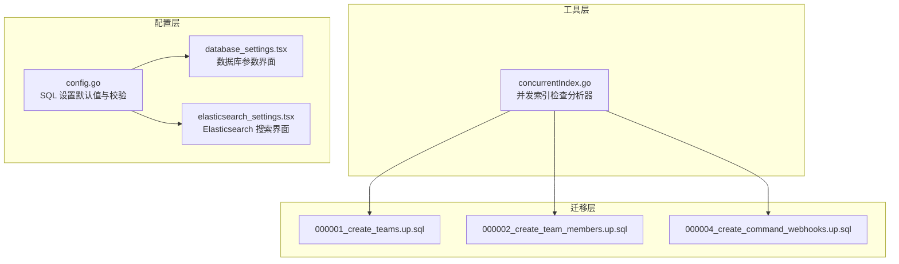
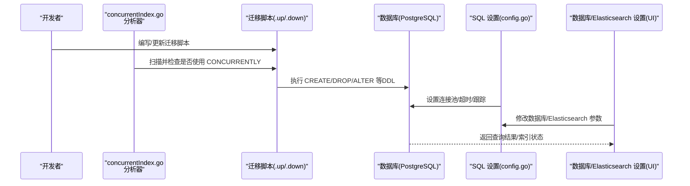
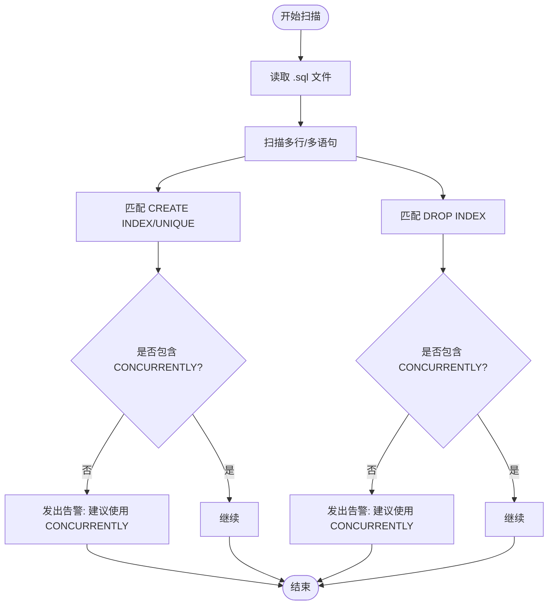
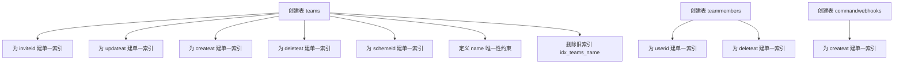
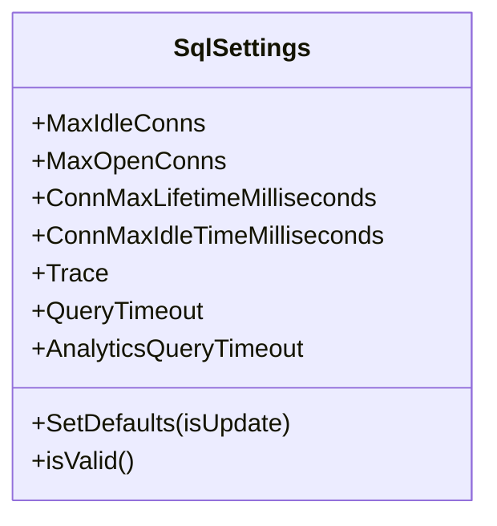
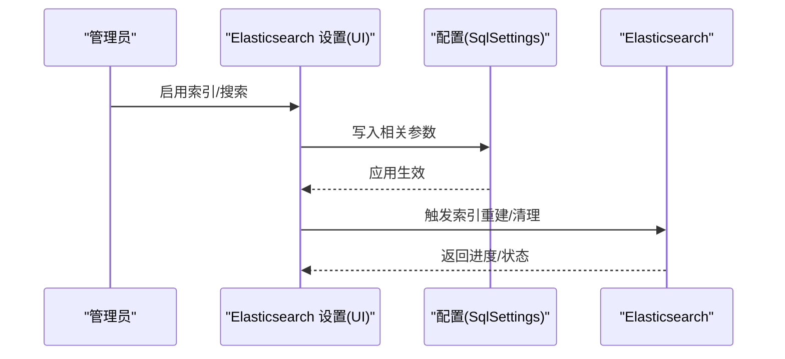
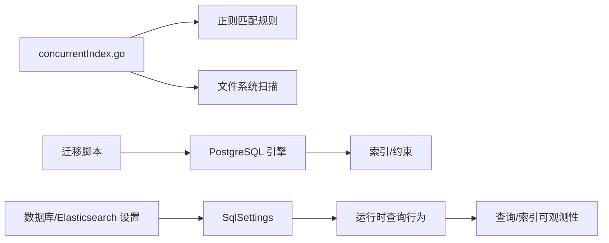

# 索引设计与性能优化

<cite>
**本文引用的文件**
- [concurrentIndex.go](file://tools/mattermost-govet/concurrentIndex/concurrentIndex.go)
- [000001_good.up.sql](file://tools/mattermost-govet/concurrentIndex/testdata/migrations/000001_good.up.sql)
- [000002_bad.up.sql](file://tools/mattermost-govet/concurrentIndex/testdata/migrations/000002_bad.up.sql)
- [000003_nested.up.sql](file://tools/mattermost-govet/concurrentIndex/testdata/migrations/sub/000003_nested.up.sql)
- [000004_multiline.up.sql](file://tools/mattermost-govet/concurrentIndex/testdata/migrations/000004_multiline.up.sql)
- [000005_multistmt.up.sql](file://tools/mattermost-govet/concurrentIndex/testdata/migrations/000005_multistmt.up.sql)
- [000001_create_teams.up.sql](file://server/channels/db/migrations/postgres/000001_create_teams.up.sql)
- [000002_create_team_members.up.sql](file://server/channels/db/migrations/postgres/000002_create_team_members.up.sql)
- [000004_create_command_webhooks.up.sql](file://server/channels/db/migrations/postgres/000004_create_command_webhooks.up.sql)
- [config.go](file://server/public/model/config.go)
- [database_settings.tsx](file://webapp/channels/src/components/admin_console/database_settings.tsx)
- [elasticsearch_settings.tsx](file://webapp/channels/src/components/admin_console/elasticsearch_settings.tsx)
</cite>

## 目录
1. [简介](#简介)
2. [项目结构](#项目结构)
3. [核心组件](#核心组件)
4. [架构总览](#架构总览)
5. [详细组件分析](#详细组件分析)
6. [依赖关系分析](#依赖关系分析)
7. [性能考量](#性能考量)
8. [故障排查指南](#故障排查指南)
9. [结论](#结论)
10. [附录](#附录)

## 简介
本文件面向 Mattermost 的数据库索引设计与性能优化，系统性阐述索引类型（单一、复合、唯一、部分）的设计原则与适用场景；解释查询性能分析与执行计划优化策略；给出索引设计原则与命名规范；覆盖全文搜索索引与地理位置索引的实现要点；提供索引维护策略与定期优化方案；说明索引对写入性能的影响与权衡；并结合仓库中的并发索引检查工具与配置项，给出可落地的监控指标与调优案例，以及索引失效的常见原因与解决方案。

## 项目结构
围绕索引主题，仓库中与之直接相关的关键位置包括：
- 工具层：并发索引检查分析器，用于在迁移脚本中强制使用并发建/删索引，避免阻塞 DML。
- 迁移层：PostgreSQL 迁移脚本中大量使用了 CREATE INDEX/CREATE UNIQUE INDEX/DROP INDEX，并通过 IF NOT EXISTS/IF EXISTS 做幂等处理。
- 配置层：后端服务的 SQL 设置与数据库连接参数，影响查询超时、连接池与跟踪等，间接影响索引使用效果。
- 前端控制台：数据库设置与 Elasticsearch 设置界面，体现索引与搜索能力的开关与可观测性。

**图示来源**
- [concurrentIndex.go:1-46](file://tools/mattermost-govet/concurrentIndex/concurrentIndex.go#L1-L46)
- [000001_create_teams.up.sql:1-90](file://server/channels/db/migrations/postgres/000001_create_teams.up.sql#L1-L90)
- [000002_create_team_members.up.sql:1-18](file://server/channels/db/migrations/postgres/000002_create_team_members.up.sql#L1-L18)
- [000004_create_command_webhooks.up.sql:1-13](file://server/channels/db/migrations/postgres/000004_create_command_webhooks.up.sql#L1-L13)
- [config.go:1519-1572](file://server/public/model/config.go#L1519-L1572)
- [database_settings.tsx:96-126](file://webapp/channels/src/components/admin_console/database_settings.tsx#L96-L126)
- [elasticsearch_settings.tsx:76-100](file://webapp/channels/src/components/admin_console/elasticsearch_settings.tsx#L76-L100)

**章节来源**
- [concurrentIndex.go:1-46](file://tools/mattermost-govet/concurrentIndex/concurrentIndex.go#L1-L46)
- [000001_create_teams.up.sql:1-90](file://server/channels/db/migrations/postgres/000001_create_teams.up.sql#L1-L90)
- [000002_create_team_members.up.sql:1-18](file://server/channels/db/migrations/postgres/000002_create_team_members.up.sql#L1-L18)
- [000004_create_command_webhooks.up.sql:1-13](file://server/channels/db/migrations/postgres/000004_create_command_webhooks.up.sql#L1-L13)
- [config.go:1519-1572](file://server/public/model/config.go#L1519-L1572)
- [database_settings.tsx:96-126](file://webapp/channels/src/components/admin_console/database_settings.tsx#L96-L126)
- [elasticsearch_settings.tsx:76-100](file://webapp/channels/src/components/admin_console/elasticsearch_settings.tsx#L76-L100)

## 核心组件
- 并发索引检查分析器：通过正则匹配检测迁移脚本中的 CREATE INDEX/DROP INDEX 是否使用 CONCURRENTLY，以避免阻塞 DML。
- PostgreSQL 迁移脚本：集中体现了索引的创建、唯一性约束与删除策略，是索引设计实践的直接来源。
- SQL 设置与连接参数：最大空闲/打开连接数、查询超时、连接生命周期、跟踪开关等，直接影响索引使用与查询性能。
- 前端数据库/Elasticsearch 设置：提供索引与搜索能力的开关与可观测性入口，便于运维侧进行性能调优。

**章节来源**
- [concurrentIndex.go:19-40](file://tools/mattermost-govet/concurrentIndex/concurrentIndex.go#L19-L40)
- [000001_create_teams.up.sql:18-22](file://server/channels/db/migrations/postgres/000001_create_teams.up.sql#L18-L22)
- [000002_create_team_members.up.sql:9-10](file://server/channels/db/migrations/postgres/000002_create_team_members.up.sql#L9-L10)
- [000004_create_command_webhooks.up.sql:12-12](file://server/channels/db/migrations/postgres/000004_create_command_webhooks.up.sql#L12-L12)
- [config.go:1519-1572](file://server/public/model/config.go#L1519-L1572)
- [database_settings.tsx:96-126](file://webapp/channels/src/components/admin_console/database_settings.tsx#L96-L126)
- [elasticsearch_settings.tsx:247-274](file://webapp/channels/src/components/admin_console/elasticsearch_settings.tsx#L247-L274)

## 架构总览
下图展示从迁移脚本到运行时配置与前端控制台的整体流程，以及并发索引检查如何贯穿其中：

**图示来源**
- [concurrentIndex.go:36-40](file://tools/mattermost-govet/concurrentIndex/concurrentIndex.go#L36-L40)
- [000001_good.up.sql:1-3](file://tools/mattermost-govet/concurrentIndex/testdata/migrations/000001_good.up.sql#L1-L3)
- [000002_bad.up.sql:1-3](file://tools/mattermost-govet/concurrentIndex/testdata/migrations/000002_bad.up.sql#L1-L3)
- [000003_nested.up.sql:1-2](file://tools/mattermost-govet/concurrentIndex/testdata/migrations/sub/000003_nested.up.sql#L1-L2)
- [000004_multiline.up.sql:1-4](file://tools/mattermost-govet/concurrentIndex/testdata/migrations/000004_multiline.up.sql#L1-L4)
- [000005_multistmt.up.sql:1-1](file://tools/mattermost-govet/concurrentIndex/testdata/migrations/000005_multistmt.up.sql#L1-L1)
- [config.go:1519-1572](file://server/public/model/config.go#L1519-L1572)
- [database_settings.tsx:96-126](file://webapp/channels/src/components/admin_console/database_settings.tsx#L96-L126)
- [elasticsearch_settings.tsx:247-274](file://webapp/channels/src/components/admin_console/elasticsearch_settings.tsx#L247-L274)

## 详细组件分析

### 组件A：并发索引检查分析器
- 设计目标：在迁移阶段强制使用 CONCURRENTLY，避免阻塞 DML，提升线上变更的安全性。
- 关键机制：
  - 正则匹配 CREATE INDEX/DROP INDEX 及其 CONCURRENTLY 变体。
  - 支持多行与多语句脚本扫描。
  - 通过命令行参数指定扫描路径与最小迁移号过滤。
- 使用建议：
  - 在 CI 中启用该分析器，确保所有迁移脚本遵循 CONCURRENTLY 规范。
  - 对于多语句脚本，需保证每条语句均符合规范，避免混合安全/非安全语句在同一事务内。

**图示来源**
- [concurrentIndex.go:19-40](file://tools/mattermost-govet/concurrentIndex/concurrentIndex.go#L19-L40)
- [000001_good.up.sql:1-3](file://tools/mattermost-govet/concurrentIndex/testdata/migrations/000001_good.up.sql#L1-L3)
- [000002_bad.up.sql:1-3](file://tools/mattermost-govet/concurrentIndex/testdata/migrations/000002_bad.up.sql#L1-L3)
- [000003_nested.up.sql:1-2](file://tools/mattermost-govet/concurrentIndex/testdata/migrations/sub/000003_nested.up.sql#L1-L2)
- [000004_multiline.up.sql:1-4](file://tools/mattermost-govet/concurrentIndex/testdata/migrations/000004_multiline.up.sql#L1-L4)
- [000005_multistmt.up.sql:1-1](file://tools/mattermost-govet/concurrentIndex/testdata/migrations/000005_multistmt.up.sql#L1-L1)

**章节来源**
- [concurrentIndex.go:19-40](file://tools/mattermost-govet/concurrentIndex/concurrentIndex.go#L19-L40)
- [000001_good.up.sql:1-3](file://tools/mattermost-govet/concurrentIndex/testdata/migrations/000001_good.up.sql#L1-L3)
- [000002_bad.up.sql:1-3](file://tools/mattermost-govet/concurrentIndex/testdata/migrations/000002_bad.up.sql#L1-L3)
- [000003_nested.up.sql:1-2](file://tools/mattermost-govet/concurrentIndex/testdata/migrations/sub/000003_nested.up.sql#L1-L2)
- [000004_multiline.up.sql:1-4](file://tools/mattermost-govet/concurrentIndex/testdata/migrations/000004_multiline.up.sql#L1-L4)
- [000005_multistmt.up.sql:1-1](file://tools/mattermost-govet/concurrentIndex/testdata/migrations/000005_multistmt.up.sql#L1-L1)

### 组件B：PostgreSQL 迁移脚本中的索引实践
- 单一索引：为高频过滤字段建立单一索引，如 teams 的 inviteid、updateat、createat、deleteat、schemeid；teammembers 的 userid、deleteat；commandwebhooks 的 createat。
- 唯一索引：通过 UNIQUE 或显式唯一索引保障业务唯一性（如 teams.name）。
- 删除与演进：通过 DROP INDEX IF EXISTS 清理过时索引，配合列类型变更与新增列，保持索引与表结构同步。
- 幂等性：使用 IF NOT EXISTS/IF EXISTS 保证重复执行的安全性。

**图示来源**
- [000001_create_teams.up.sql:1-90](file://server/channels/db/migrations/postgres/000001_create_teams.up.sql#L1-L90)
- [000002_create_team_members.up.sql:1-18](file://server/channels/db/migrations/postgres/000002_create_team_members.up.sql#L1-L18)
- [000004_create_command_webhooks.up.sql:1-13](file://server/channels/db/migrations/postgres/000004_create_command_webhooks.up.sql#L1-L13)

**章节来源**
- [000001_create_teams.up.sql:18-30](file://server/channels/db/migrations/postgres/000001_create_teams.up.sql#L18-L30)
- [000002_create_team_members.up.sql:9-17](file://server/channels/db/migrations/postgres/000002_create_team_members.up.sql#L9-L17)
- [000004_create_command_webhooks.up.sql:12-12](file://server/channels/db/migrations/postgres/000004_create_command_webhooks.up.sql#L12-L12)

### 组件C：SQL 设置与连接参数
- 默认连接池与生命周期：最大空闲/打开连接数、连接最大生命周期与空闲时间有明确默认值，有助于稳定查询吞吐与资源占用。
- 查询超时：提供普通查询与分析类查询的超时阈值，默认值合理，避免长事务阻塞。
- 跟踪开关：开启后便于定位慢查询与索引使用情况，但需注意对性能的影响。
- 与索引的关系：合理的连接池与超时设置能减少因锁等待或长事务导致的“索引无效”现象，提升整体稳定性。

**图示来源**
- [config.go:1519-1572](file://server/public/model/config.go#L1519-L1572)
- [config.go:4526-4555](file://server/public/model/config.go#L4526-L4555)

**章节来源**
- [config.go:1519-1572](file://server/public/model/config.go#L1519-L1572)
- [config.go:4526-4555](file://server/public/model/config.go#L4526-L4555)
- [database_settings.tsx:96-126](file://webapp/channels/src/components/admin_console/database_settings.tsx#L96-L126)

### 组件D：全文搜索与索引开关（Elasticsearch）
- 后端类型与连接：支持外部搜索后端类型配置，连接 URL、认证、嗅探等参数可配置。
- 索引开关：可独立启用索引构建与搜索功能，搜索结果可能不完整直到批量索引完成。
- 与数据库索引的协同：当启用数据库搜索时，应关注查询超时与连接池配置；当启用 Elasticsearch 时，需关注索引重建进度与忽略列表。

**图示来源**
- [elasticsearch_settings.tsx:247-274](file://webapp/channels/src/components/admin_console/elasticsearch_settings.tsx#L247-L274)
- [elasticsearch_settings.tsx:295-301](file://webapp/channels/src/components/admin_console/elasticsearch_settings.tsx#L295-L301)
- [elasticsearch_settings.tsx:520-528](file://webapp/channels/src/components/admin_console/elasticsearch_settings.tsx#L520-L528)
- [config.go:1519-1572](file://server/public/model/config.go#L1519-L1572)

**章节来源**
- [elasticsearch_settings.tsx:76-100](file://webapp/channels/src/components/admin_console/elasticsearch_settings.tsx#L76-L100)
- [elasticsearch_settings.tsx:247-274](file://webapp/channels/src/components/admin_console/elasticsearch_settings.tsx#L247-L274)
- [elasticsearch_settings.tsx:520-528](file://webapp/channels/src/components/admin_console/elasticsearch_settings.tsx#L520-L528)
- [config.go:1519-1572](file://server/public/model/config.go#L1519-L1572)

## 依赖关系分析
- 分析器依赖正则表达式与文件系统扫描，耦合度低，易于集成到 CI。
- 迁移脚本依赖数据库引擎能力（PostgreSQL），索引语法与约束定义受引擎限制。
- 运行时配置与前端 UI 形成闭环：配置变更影响查询行为，UI 提供可观测性与操作入口。

**图示来源**
- [concurrentIndex.go:19-40](file://tools/mattermost-govet/concurrentIndex/concurrentIndex.go#L19-L40)
- [000001_create_teams.up.sql:1-90](file://server/channels/db/migrations/postgres/000001_create_teams.up.sql#L1-L90)
- [config.go:1519-1572](file://server/public/model/config.go#L1519-L1572)
- [database_settings.tsx:96-126](file://webapp/channels/src/components/admin_console/database_settings.tsx#L96-L126)
- [elasticsearch_settings.tsx:247-274](file://webapp/channels/src/components/admin_console/elasticsearch_settings.tsx#L247-L274)

**章节来源**
- [concurrentIndex.go:19-40](file://tools/mattermost-govet/concurrentIndex/concurrentIndex.go#L19-L40)
- [000001_create_teams.up.sql:1-90](file://server/channels/db/migrations/postgres/000001_create_teams.up.sql#L1-L90)
- [config.go:1519-1572](file://server/public/model/config.go#L1519-L1572)
- [database_settings.tsx:96-126](file://webapp/channels/src/components/admin_console/database_settings.tsx#L96-L126)
- [elasticsearch_settings.tsx:247-274](file://webapp/channels/src/components/admin_console/elasticsearch_settings.tsx#L247-L274)

## 性能考量
- 并发建/删索引：优先使用 CONCURRENTLY，降低 DML 阻塞风险，提高变更安全性。
- 连接池与超时：合理设置最大连接数、连接生命周期与查询超时，避免长事务与锁竞争放大索引失效概率。
- 跟踪与诊断：开启 Trace 有助于定位慢查询与索引使用异常，但需评估对性能的影响。
- 搜索后端：当启用 Elasticsearch 时，关注索引重建进度与搜索延迟，必要时调整批量索引策略。

**章节来源**
- [concurrentIndex.go:19-22](file://tools/mattermost-govet/concurrentIndex/concurrentIndex.go#L19-L22)
- [config.go:1519-1572](file://server/public/model/config.go#L1519-L1572)
- [elasticsearch_settings.tsx:76-77](file://webapp/channels/src/components/admin_console/elasticsearch_settings.tsx#L76-L77)

## 故障排查指南
- 并发索引告警：若出现“建议使用 CONCURRENTLY”的告警，立即修正迁移脚本，确保建/删索引使用 CONCURRENTLY。
- 多语句脚本：多语句脚本中混用安全/非安全语句可能导致失败，应拆分或统一为 CONCURRENTLY。
- 索引缺失或冗余：通过信息架构查询确认索引存在性，按需创建或删除；删除前评估查询计划变化。
- 查询超时与锁等待：检查 SqlSettings 的 QueryTimeout/AnalyticsQueryTimeout，适当放宽或优化查询。
- Elasticsearch 不一致：确认索引开关状态与重建进度，必要时清理/重建索引。

**章节来源**
- [concurrentIndex.go:19-22](file://tools/mattermost-govet/concurrentIndex/concurrentIndex.go#L19-L22)
- [000005_multistmt.up.sql:1-1](file://tools/mattermost-govet/concurrentIndex/testdata/migrations/000005_multistmt.up.sql#L1-L1)
- [config.go:1519-1572](file://server/public/model/config.go#L1519-L1572)
- [elasticsearch_settings.tsx:76-77](file://webapp/channels/src/components/admin_console/elasticsearch_settings.tsx#L76-L77)

## 结论
通过对并发索引检查工具、迁移脚本实践与运行时配置的综合分析，可以形成一套完整的索引设计与优化闭环：在开发阶段通过分析器强制规范，在迁移阶段通过幂等与并发策略保障安全，在运行阶段通过连接池与超时参数稳定性能，并借助前端控制台实现可观测与可调优。针对全文搜索与大规模数据，应结合 Elasticsearch 与分区策略进一步细化索引与查询优化方案。

## 附录
- 索引类型与设计原则
  - 单一索引：适用于高选择性的单列过滤条件。
  - 复合索引：优先将区分度高且常作为过滤条件的列放在前面。
  - 唯一索引：保障业务唯一性，避免重复数据。
  - 部分索引：仅对满足特定条件的数据建立索引，降低存储与维护成本。
- 命名规范建议
  - 前缀：idx_ 表示索引；uk_ 表示唯一；pk_ 表示主键；ck_ 表示检查约束。
  - 结构：idx_<表名>_<列1>[_<列2>]，如 idx_teams_invite_id。
- 特殊索引
  - 全文搜索：结合 Elasticsearch 或数据库内置全文索引扩展（如 pg_trgm）。
  - 地理位置：使用专用扩展（如 PostGIS）并建立 GiST/GIN 索引。
- 维护与优化
  - 定期统计更新与索引健康检查。
  - 分区表策略：按时间/租户等维度分区，配合分区裁剪与局部索引。
- 性能监控指标
  - 查询延迟分布、索引扫描比例、缓存命中率、锁等待时间、Elasticsearch 索引进度与延迟。
- 索引失效常见原因
  - 列类型变更、数据分布极端偏斜、谓词不可选择、统计信息过期、并发 DDL 未使用 CONCURRENTLY。