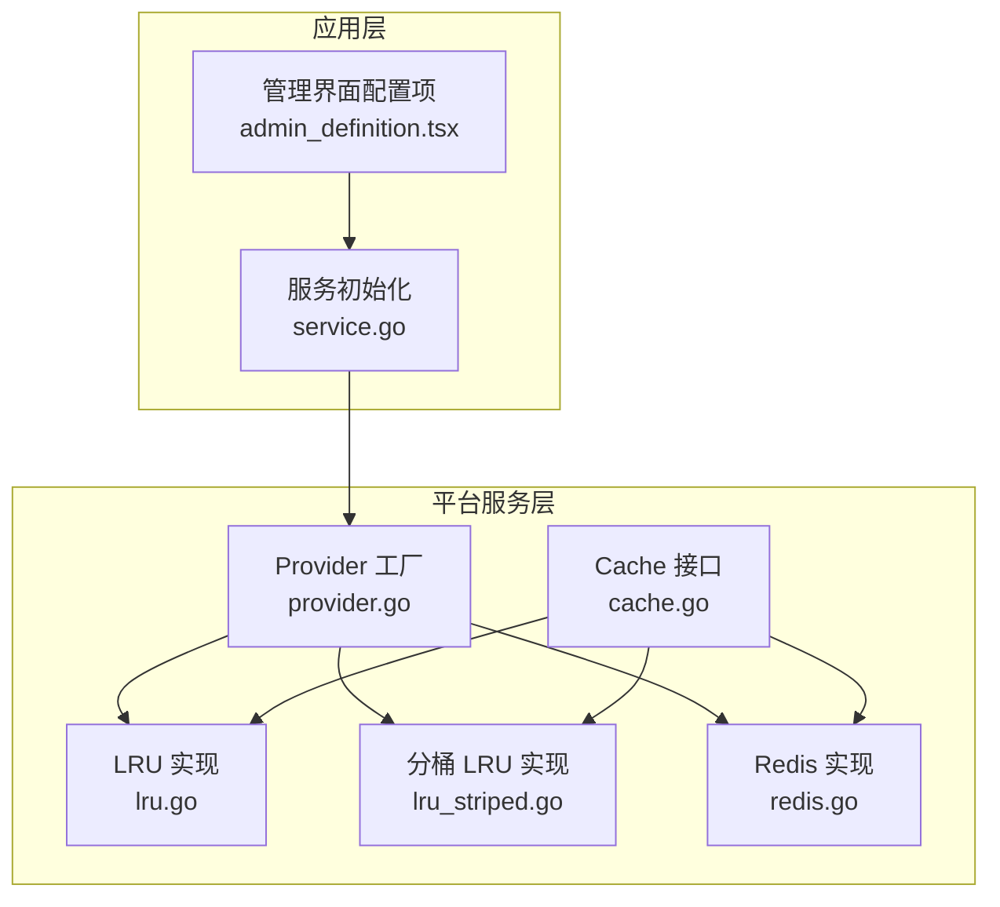
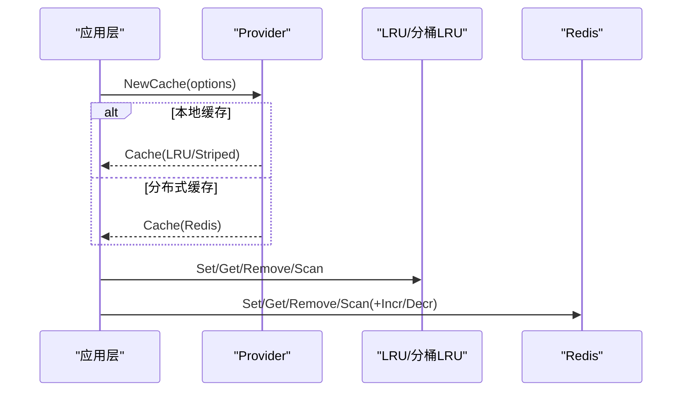
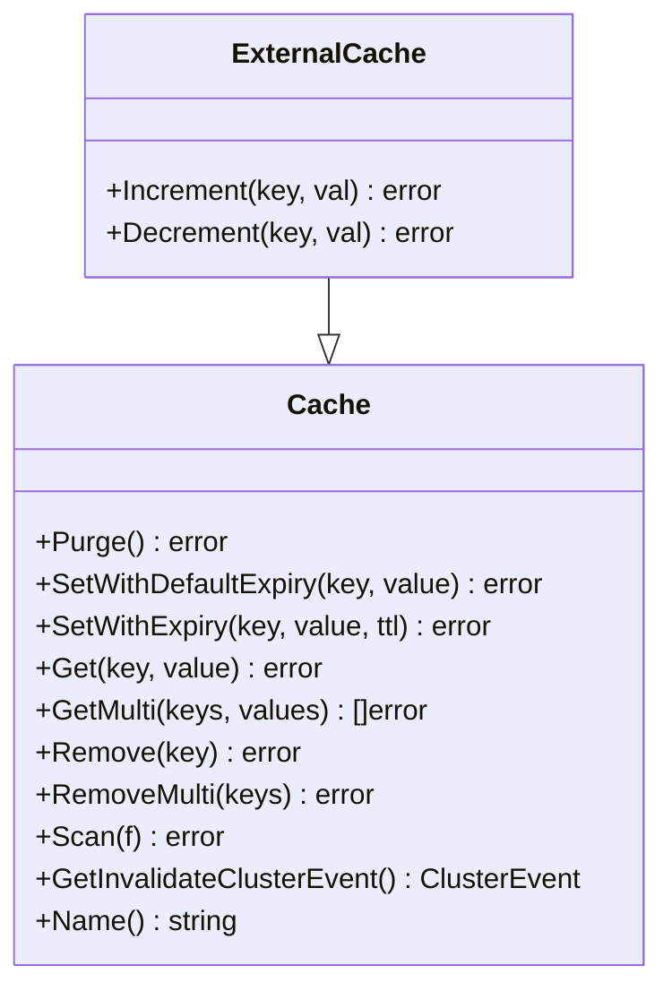
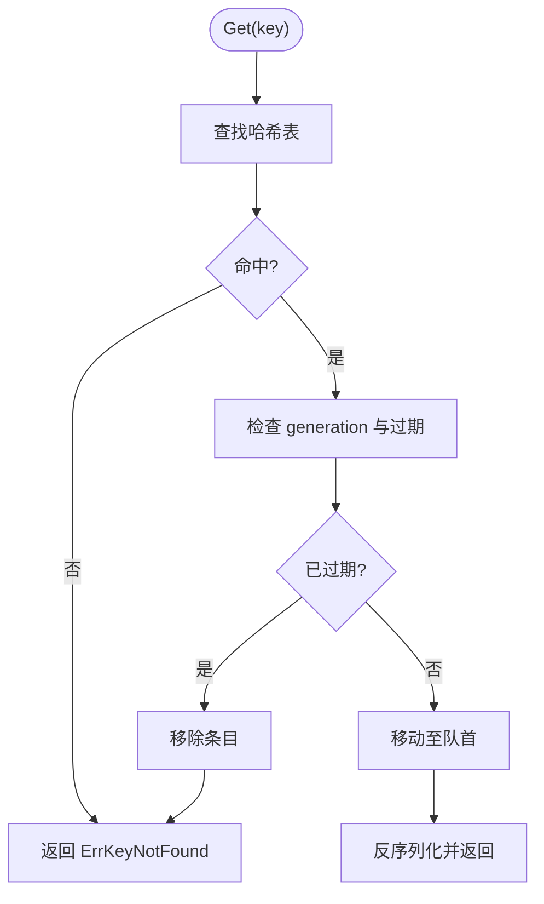
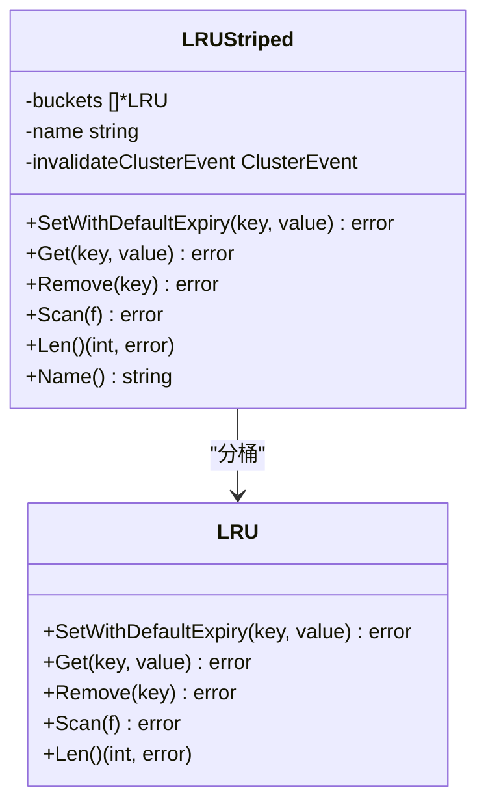
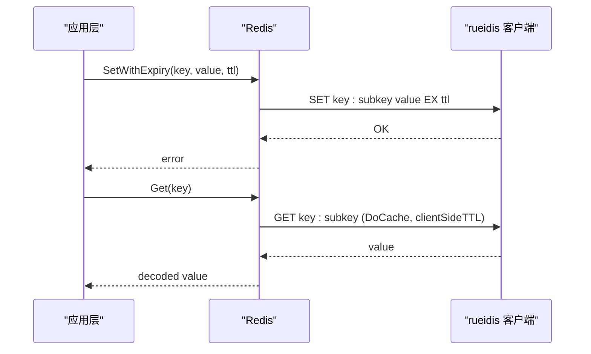
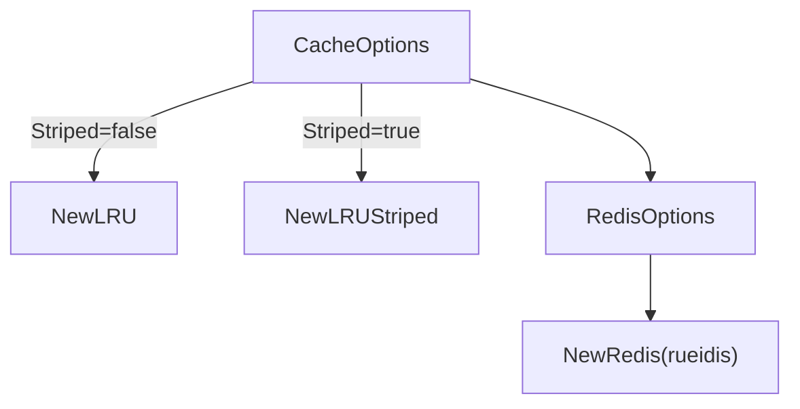
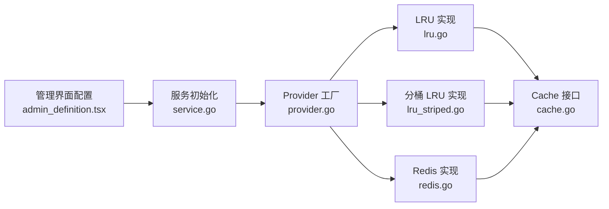

# 缓存策略与数据一致性

<cite>
**本文引用的文件**
- [cache.go](file://server/platform/services/cache/cache.go)
- [lru.go](file://server/platform/services/cache/lru.go)
- [lru_striped.go](file://server/platform/services/cache/lru_striped.go)
- [redis.go](file://server/platform/services/cache/redis.go)
- [provider.go](file://server/platform/services/cache/provider.go)
- [service.go](file://server/channels/app/platform/service.go)
- [admin_definition.tsx](file://webapp/channels/src/components/admin_console/admin_definition.tsx)
- [data_loader.ts](file://webapp/channels/src/packages/mattermost-redux/src/utils/data_loader.ts)
</cite>

## 目录
1. [简介](#简介)
2. [项目结构](#项目结构)
3. [核心组件](#核心组件)
4. [架构总览](#架构总览)
5. [详细组件分析](#详细组件分析)
6. [依赖关系分析](#依赖关系分析)
7. [性能考量](#性能考量)
8. [故障排查指南](#故障排查指南)
9. [结论](#结论)
10. [附录](#附录)

## 简介
本文件系统性阐述 Mattermost 的多层缓存架构与数据一致性保障机制，覆盖本地 LRU 缓存、分布式 Redis 缓存以及查询结果缓存的协同工作方式；详述缓存更新策略（写穿透、读穿透、失效处理）、一致性模型（强一致与最终一致）、缓存键设计与命名规范、过期与内存管理、性能监控与调优、故障转移与降级、缓存预热与批量加载、与数据库的同步机制，以及缓存穿透防护与热点数据处理。

## 项目结构
缓存子系统位于平台服务层，提供统一的 Cache/ExternalCache 接口，并通过 Provider 工厂在运行时选择本地或分布式实现。应用层在初始化阶段根据配置创建不同类型的缓存实例，如会话、状态等关键对象的缓存。

图表来源
- [cache.go:16-68](file://server/platform/services/cache/cache.go#L16-L68)
- [lru.go:17-48](file://server/platform/services/cache/lru.go#L17-L48)
- [lru_striped.go:17-46](file://server/platform/services/cache/lru_striped.go#L17-L46)
- [redis.go:24-39](file://server/platform/services/cache/redis.go#L24-L39)
- [provider.go:28-74](file://server/platform/services/cache/provider.go#L28-L74)
- [service.go:336-372](file://server/channels/app/platform/service.go#L336-L372)
- [admin_definition.tsx:2080-2103](file://webapp/channels/src/components/admin_console/admin_definition.tsx#L2080-L2103)

章节来源
- [cache.go:16-68](file://server/platform/services/cache/cache.go#L16-L68)
- [provider.go:28-74](file://server/platform/services/cache/provider.go#L28-L74)
- [service.go:336-372](file://server/channels/app/platform/service.go#L336-L372)
- [admin_definition.tsx:2080-2103](file://webapp/channels/src/components/admin_console/admin_definition.tsx#L2080-L2103)

## 核心组件
- Cache/ExternalCache 接口：定义统一的缓存操作能力，支持单键/多键读写、删除、扫描、集群事件无效化标记，以及外部缓存的原子增减。
- LRU 本地缓存：固定容量、基于链表+哈希表的线程安全实现，支持 TTL 过期与生成计数控制。
- 分桶 LRU（Striped）：按 key 哈希映射到多个独立 LRU 桶，降低锁竞争，提升并发性能。
- Redis 分布式缓存：基于 rueidis 客户端，提供跨节点共享、原子增减、客户端侧 TTL 缓存以降低后端压力。
- Provider 工厂：根据配置创建 LRU 或 Redis 缓存实例，支持连接检查与指标注入。

章节来源
- [cache.go:16-68](file://server/platform/services/cache/cache.go#L16-L68)
- [lru.go:17-48](file://server/platform/services/cache/lru.go#L17-L48)
- [lru_striped.go:17-46](file://server/platform/services/cache/lru_striped.go#L17-L46)
- [redis.go:24-39](file://server/platform/services/cache/redis.go#L24-L39)
- [provider.go:28-74](file://server/platform/services/cache/provider.go#L28-L74)

## 架构总览
Mattermost 的缓存采用“多层协同”模式：
- 应用层在启动时通过 Provider 创建缓存实例，区分本地 LRU 与 Redis。
- 本地 LRU 用于高并发、低延迟场景（如会话、状态），具备严格的容量与过期控制。
- Redis 用于跨节点共享与全局可见性（如分布式锁、计数器），并提供原子增减能力。
- 多键操作（GetMulti、RemoveMulti、Scan）在接口层面统一抽象，便于在不同实现间切换。

图表来源
- [provider.go:51-57](file://server/platform/services/cache/provider.go#L51-L57)
- [lru.go:60-85](file://server/platform/services/cache/lru.go#L60-L85)
- [redis.go:46-89](file://server/platform/services/cache/redis.go#L46-L89)

## 详细组件分析

### Cache 接口与扩展
- 统一能力：Purge、SetWithDefaultExpiry/SetWithExpiry、Get/GetMulti、Remove/RemoveMulti、Scan、集群事件无效化标记、名称标识。
- ExternalCache 扩展：提供 Increment/Decrement，适用于分布式计数场景。

图表来源
- [cache.go:16-68](file://server/platform/services/cache/cache.go#L16-L68)

章节来源
- [cache.go:16-68](file://server/platform/services/cache/cache.go#L16-L68)

### LRU 本地缓存
- 数据结构：双向链表 + 哈希表，O(1) 访问与淘汰。
- 过期策略：记录到期时间，访问时判断并清理过期项。
- 并发控制：读写锁保护，避免细粒度锁开销。
- 生成计数：通过 generation 隔离扫描期间的新增项，确保扫描一致性。

图表来源
- [lru.go:197-228](file://server/platform/services/cache/lru.go#L197-L228)

章节来源
- [lru.go:17-48](file://server/platform/services/cache/lru.go#L17-L48)
- [lru.go:150-195](file://server/platform/services/cache/lru.go#L150-L195)
- [lru.go:197-228](file://server/platform/services/cache/lru.go#L197-L228)

### 分桶 LRU（Striped）
- 设计目标：降低锁竞争，提升高并发下的吞吐。
- 键到桶映射：基于 xxhash 对 key 取模，均匀分布。
- 规模调整：为防止误淘汰，总容量增加约 10%，再按桶均分。
- 并发特性：每个桶独立 LRU，无锁设计，适合多核环境。

图表来源
- [lru_striped.go:42-161](file://server/platform/services/cache/lru_striped.go#L42-L161)

章节来源
- [lru_striped.go:17-46](file://server/platform/services/cache/lru_striped.go#L17-L46)
- [lru_striped.go:132-161](file://server/platform/services/cache/lru_striped.go#L132-L161)

### Redis 分布式缓存
- 键空间：统一前缀 + 冒号 + key 的命名格式，便于批量扫描与清理。
- 客户端侧 TTL：对 GET/MGET 使用 DoCache，设置客户端侧 TTL，显著降低后端压力。
- 原子增减：提供 Increment/Decrement，适合全局计数场景。
- 性能监控：对 Set/Get/Remove/Scan/Incr/Decr 等操作埋点耗时指标。

图表来源
- [redis.go:54-89](file://server/platform/services/cache/redis.go#L54-L89)
- [redis.go:129-174](file://server/platform/services/cache/redis.go#L129-L174)

章节来源
- [redis.go:24-39](file://server/platform/services/cache/redis.go#L24-L39)
- [redis.go:42-89](file://server/platform/services/cache/redis.go#L42-L89)
- [redis.go:129-174](file://server/platform/services/cache/redis.go#L129-L174)
- [redis.go:291-322](file://server/platform/services/cache/redis.go#L291-L322)

### Provider 工厂与配置
- Provider.NewCache：根据 Striping 开关选择 LRU 或 LRUStriped。
- RedisProvider：创建 rueidis 客户端，支持连接参数、禁用本地缓存、最大刷新延迟、写超时等。
- 应用层初始化：在服务启动时创建 Session、Status 等缓存实例，StripedBuckets 通常与 CPU 数相关。

图表来源
- [provider.go:51-57](file://server/platform/services/cache/provider.go#L51-L57)
- [provider.go:115-123](file://server/platform/services/cache/provider.go#L115-L123)
- [service.go:336-354](file://server/channels/app/platform/service.go#L336-L354)

章节来源
- [provider.go:51-57](file://server/platform/services/cache/provider.go#L51-L57)
- [provider.go:115-123](file://server/platform/services/cache/provider.go#L115-L123)
- [service.go:336-354](file://server/channels/app/platform/service.go#L336-L354)

## 依赖关系分析
- 接口与实现解耦：Cache/ExternalCache 抽象屏蔽具体实现差异，便于在 LRU 与 Redis 之间切换。
- Provider 单例工厂：集中创建与配置缓存实例，避免散落的初始化逻辑。
- 应用层依赖：服务初始化阶段注入缓存，形成清晰的依赖链。
- 前端辅助：管理界面提供缓存类型配置入口，影响运行时 Provider 类型选择。

图表来源
- [admin_definition.tsx:2080-2103](file://webapp/channels/src/components/admin_console/admin_definition.tsx#L2080-L2103)
- [service.go:336-354](file://server/channels/app/platform/service.go#L336-L354)
- [provider.go:51-57](file://server/platform/services/cache/provider.go#L51-L57)
- [cache.go:16-68](file://server/platform/services/cache/cache.go#L16-L68)

章节来源
- [admin_definition.tsx:2080-2103](file://webapp/channels/src/components/admin_console/admin_definition.tsx#L2080-L2103)
- [service.go:336-354](file://server/channels/app/platform/service.go#L336-L354)
- [provider.go:51-57](file://server/platform/services/cache/provider.go#L51-L57)
- [cache.go:16-68](file://server/platform/services/cache/cache.go#L16-L68)

## 性能考量
- 并发与锁：LRU 使用读写锁；Striped 通过分桶进一步降低锁争用；Redis 通过原子命令与客户端侧缓存减少网络往返。
- 序列化：优先使用 msgp 快路径，其他类型走 msgpack，兼顾性能与通用性。
- 批量操作：GetMulti/RemoveMulti/Scan 提供批量能力，减少多次往返。
- 指标埋点：Redis 实现对关键操作进行耗时观测，便于定位瓶颈。
- 调优建议：
  - 本地缓存：根据热点数据规模设置 Size，合理分配 Striping 桶数；对高频访问对象启用默认 TTL。
  - 分布式缓存：结合业务峰值 QPS 调整 rueidis 的 MaxFlushDelay、ConnWriteTimeout；开启客户端侧 TTL 降低后端压力。
  - 批量加载：前端 DataLoader 将小批量请求合并为大批次，减少后端压力。

章节来源
- [lru.go:150-195](file://server/platform/services/cache/lru.go#L150-L195)
- [redis.go:54-89](file://server/platform/services/cache/redis.go#L54-L89)
- [redis.go:176-248](file://server/platform/services/cache/redis.go#L176-L248)
- [redis.go:291-322](file://server/platform/services/cache/redis.go#L291-L322)
- [data_loader.ts:65-100](file://webapp/channels/src/packages/mattermost-redux/src/utils/data_loader.ts#L65-L100)

## 故障排查指南
- 连接问题（Redis）：检查地址、密码、DB 选择与写超时；通过 Provider.Connect 返回值确认连通性。
- 缓存未命中：确认键前缀与命名规范是否一致；检查 TTL 是否过短导致提前过期。
- 集群事件无效化：若缓存需要跨节点失效，需在创建时指定 InvalidateClusterEvent。
- 性能异常：关注 Redis 指标耗时；评估批量大小与 FlushDelay 设置；观察 Striping 桶数量是否合理。
- 清理与扫描：使用 Purge/Scan 进行全量清理或遍历，注意 Scan 的游标与匹配规则。

章节来源
- [provider.go:126-132](file://server/platform/services/cache/provider.go#L126-L132)
- [redis.go:314-322](file://server/platform/services/cache/redis.go#L314-L322)
- [cache.go:49-50](file://server/platform/services/cache/cache.go#L49-L50)

## 结论
Mattermost 的缓存体系通过统一接口与工厂模式实现了本地与分布式缓存的灵活组合，配合 Striping 与客户端侧 TTL 等优化手段，在高并发场景下兼顾了性能与可维护性。通过明确的过期策略、批量操作与指标埋点，系统能够稳定支撑会话、状态等关键路径；同时，通过管理界面配置与应用层初始化流程，实现了从配置到运行时的闭环。

## 附录

### 缓存更新策略
- 写穿透：在写入后立即更新缓存，避免后续读取命中旧值；对热点键可考虑延迟双删或异步刷新。
- 读穿透：读取失败时回源数据库并写回缓存；对空值也应设置短 TTL，防止缓存击穿。
- 缓存失效：结合 InvalidateClusterEvent 在集群内广播失效；对批量更新使用 RemoveMulti/Scan 清理。

章节来源
- [cache.go:37-47](file://server/platform/services/cache/cache.go#L37-L47)
- [lru.go:88-112](file://server/platform/services/cache/lru.go#L88-L112)
- [redis.go:250-289](file://server/platform/services/cache/redis.go#L250-L289)

### 数据一致性模型
- 强一致性：对关键计数使用 ExternalCache 的 Increment/Decrement，确保全局原子性。
- 最终一致性：对非关键路径采用 TTL 过期与后台刷新，降低一致性成本。

章节来源
- [cache.go:60-68](file://server/platform/services/cache/cache.go#L60-L68)
- [redis.go:91-125](file://server/platform/services/cache/redis.go#L91-L125)

### 缓存键设计与命名规范
- 命名格式：统一使用 “前缀:子键”，前缀由 Provider 注入，便于隔离与批量管理。
- 建议：为不同业务域设置独立前缀，避免键冲突；对长生命周期对象设置更长 TTL，对临时对象设置短 TTL。

章节来源
- [redis.go:84-88](file://server/platform/services/cache/redis.go#L84-L88)
- [redis.go:187-189](file://server/platform/services/cache/redis.go#L187-L189)
- [redis.go:313-315](file://server/platform/services/cache/redis.go#L313-L315)

### 缓存过期策略与内存管理
- 过期策略：默认 TTL 由 CacheOptions 注入；LRU 严格按容量与过期回收；Striped 通过总容量加成与桶均分平衡。
- 内存管理：优先使用本地 LRU 控制内存占用；Redis 通过客户端侧 TTL 与过期策略降低存储压力。

章节来源
- [lru.go:150-195](file://server/platform/services/cache/lru.go#L150-L195)
- [lru_striped.go:132-161](file://server/platform/services/cache/lru_striped.go#L132-L161)
- [redis.go:22](file://server/platform/services/cache/redis.go#L22)

### 缓存性能监控与调优
- 指标埋点：Redis 实现对关键操作进行耗时观测，便于定位热点与异常。
- 调优方向：批量大小、FlushDelay、写超时、Striping 桶数、TTL 分配。

章节来源
- [redis.go:56-60](file://server/platform/services/cache/redis.go#L56-L60)
- [redis.go:130-136](file://server/platform/services/cache/redis.go#L130-L136)
- [redis.go:178-184](file://server/platform/services/cache/redis.go#L178-L184)
- [redis.go:252-258](file://server/platform/services/cache/redis.go#L252-L258)
- [redis.go:292-298](file://server/platform/services/cache/redis.go#L292-L298)

### 故障转移与降级策略
- 降级：当 Redis 不可用时，可通过配置切换为 LRU 本地缓存；或在应用层对关键路径进行降级处理。
- 故障转移：通过 Provider.Connect 返回值与健康检查机制，快速识别后端异常并切换。

章节来源
- [provider.go:126-132](file://server/platform/services/cache/provider.go#L126-L132)
- [service.go:362-368](file://server/channels/app/platform/service.go#L362-L368)

### 缓存预热与批量加载
- 预热：在启动阶段或低峰期批量写入热点键，缩短冷启动时间。
- 批量加载：前端 DataLoader 合并小请求为大批次，减少后端压力与网络开销。

章节来源
- [lru.go:60-85](file://server/platform/services/cache/lru.go#L60-L85)
- [data_loader.ts:65-100](file://webapp/channels/src/packages/mattermost-redux/src/utils/data_loader.ts#L65-L100)

### 缓存与数据库的同步机制
- 写路径：先写数据库，再更新缓存；对批量写入使用 RemoveMulti/Scan 清理相关键。
- 读路径：命中缓存则直接返回；未命中回源数据库并写回缓存。

章节来源
- [cache.go:37-47](file://server/platform/services/cache/cache.go#L37-L47)
- [redis.go:250-289](file://server/platform/services/cache/redis.go#L250-L289)

### 缓存穿透防护与热点数据处理
- 穿透防护：对空值设置短 TTL；对外部输入进行校验与限流。
- 热点处理：对热点键采用 Striping 分桶；对热点对象设置更长 TTL 与更合理的容量。

章节来源
- [lru_striped.go:17-46](file://server/platform/services/cache/lru_striped.go#L17-L46)
- [redis.go:22](file://server/platform/services/cache/redis.go#L22)