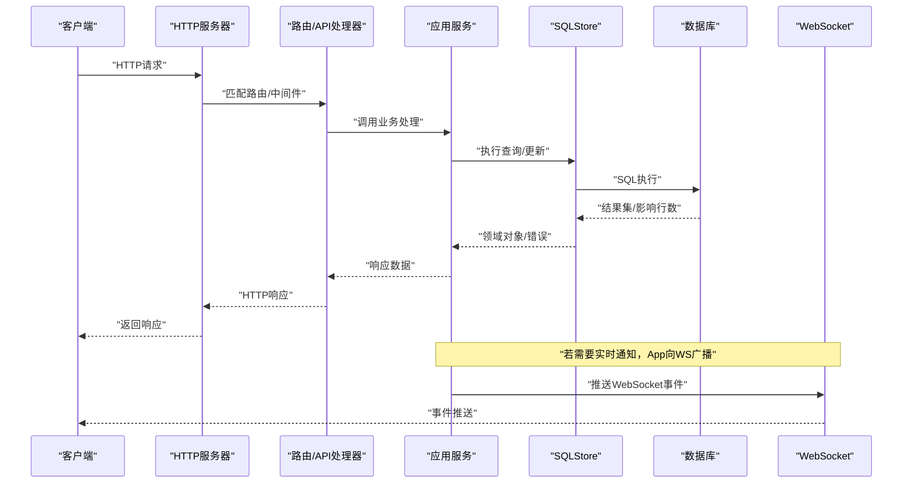
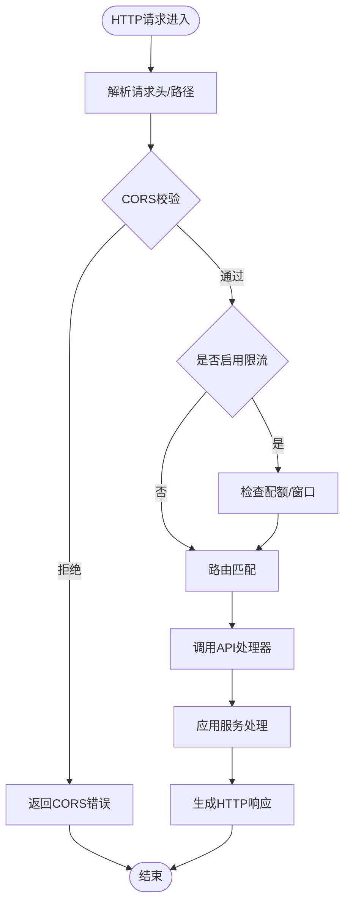
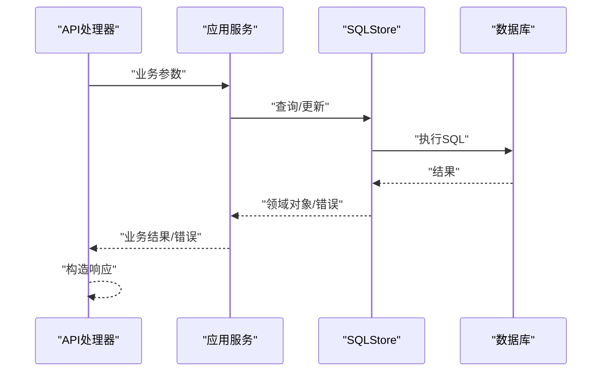
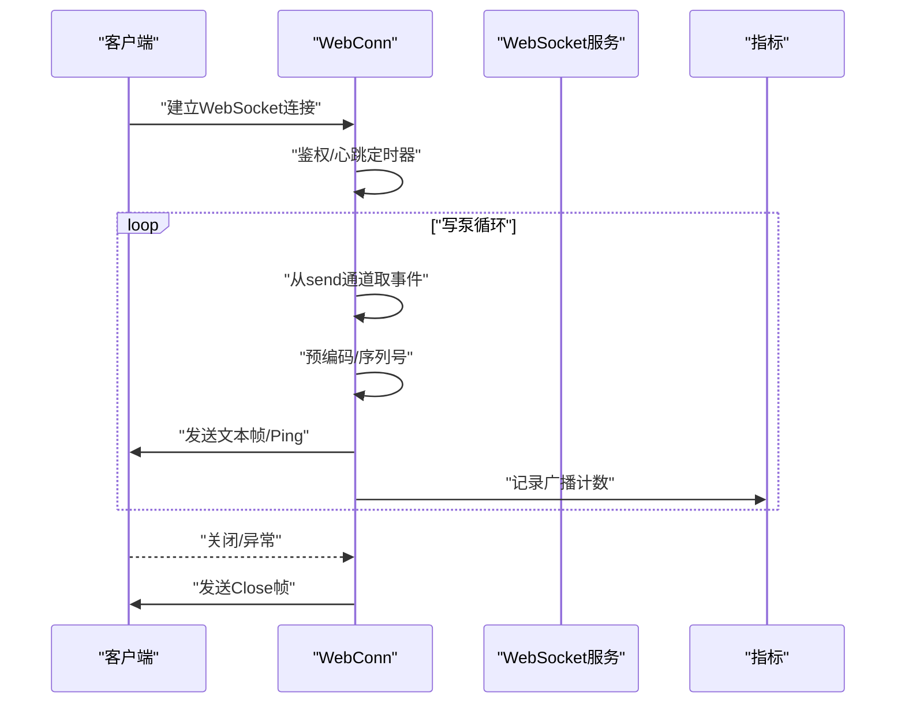
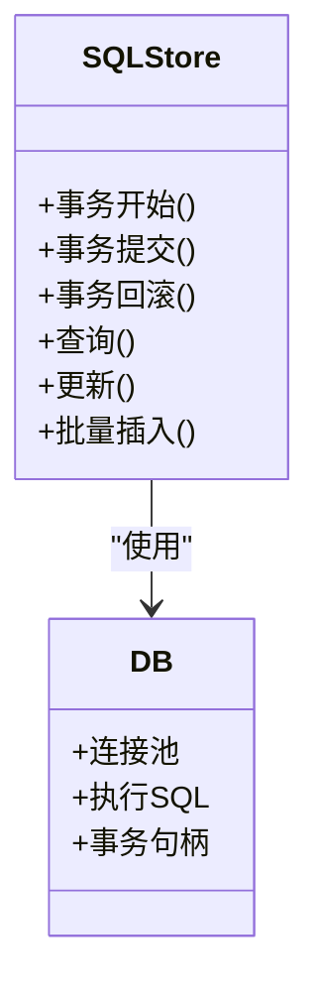
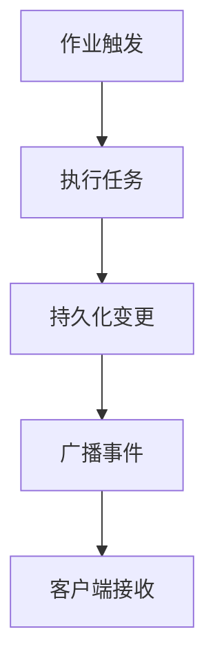
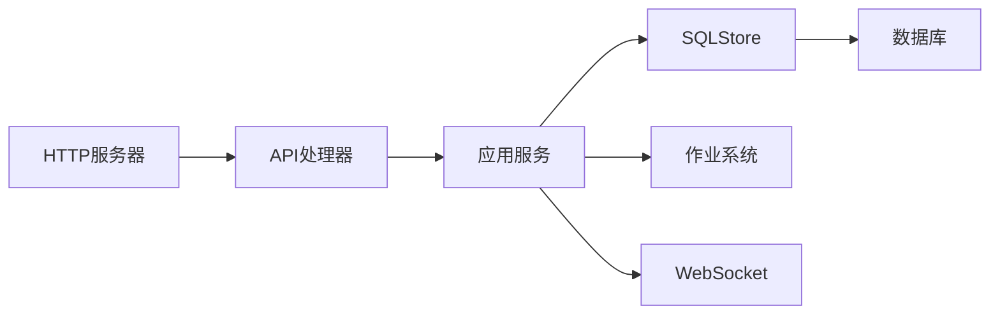

# 数据流设计

<cite>
**本文引用的文件**
- [server.go](file://server/channels/app/server.go)
- [web_conn.go](file://server/channels/app/platform/web_conn.go)
- [websocket_message.go](file://server/public/model/websocket_message.go)
- [api.go](file://server/channels/api4/api.go)
- [channel.go](file://server/channels/api4/channel.go)
- [post.go](file://server/channels/api4/post.go)
- [user.go](file://server/channels/api4/user.go)
- [team.go](file://server/channels/api4/team.go)
- [store.go](file://server/channels/store/sqlstore/store.go)
- [sql_store.go](file://server/channels/store/sqlstore/sql_store.go)
- [db.go](file://server/channels/db/db.go)
- [jobs.go](file://server/channels/jobs/jobs.go)
- [wsapi.go](file://server/channels/wsapi/wsapi.go)
- [main.go](file://api/server/main.go)
</cite>

## 目录
1. [引言](#引言)
2. [项目结构](#项目结构)
3. [核心组件](#核心组件)
4. [架构总览](#架构总览)
5. [详细组件分析](#详细组件分析)
6. [依赖关系分析](#依赖关系分析)
7. [性能考量](#性能考量)
8. [故障排查指南](#故障排查指南)
9. [结论](#结论)
10. [附录](#附录)

## 引言
本设计文档聚焦 Mattermost 后端的数据流与实时通信机制，覆盖从客户端请求进入 HTTP 层，经由路由与业务处理，到数据持久化与实时广播的完整链路。文档同时阐述 WebSocket 连接、事件序列化与广播队列、状态同步策略，并对 SQLStore 抽象、事务与查询优化进行深入解析，辅以多幅数据流与时序图帮助读者快速把握关键场景。

## 项目结构
后端采用“平台服务 + 应用层 + 存储层 + 实时层”的分层组织：
- 平台服务（Platform）负责配置、日志、指标、HTTP 服务等基础设施
- 应用层（App）封装业务逻辑，协调存储与作业调度
- 存储层（Store）提供 SQL/文件/缓存等数据访问抽象
- 实时层（WebSocket）负责连接生命周期、事件编码与广播

```mermaid
graph TB
subgraph "客户端"
C["浏览器/桌面/移动端"]
end
subgraph "HTTP入口"
HTTP["HTTP服务器<br/>路由与中间件"]
end
subgraph "应用层"
APP["应用服务<br/>业务编排"]
WSAPI["WebSocket API<br/>连接与事件"]
end
subgraph "存储层"
STORE["SQLStore 抽象<br/>事务/查询优化"]
DB["数据库"]
end
subgraph "后台作业"
JOBS["作业系统<br/>定时/异步任务"]
end
C --> HTTP --> APP --> STORE --> DB
APP --> JOBS
APP <- --> WSAPI
```

图表来源
- [server.go:192-220](file://server/channels/app/server.go#L192-L220)
- [api.go](file://server/channels/api4/api.go)
- [store.go](file://server/channels/store/sqlstore/store.go)
- [jobs.go](file://server/channels/jobs/jobs.go)
- [wsapi.go](file://server/channels/wsapi/wsapi.go)

章节来源
- [server.go:192-220](file://server/channels/app/server.go#L192-L220)
- [main.go](file://api/server/main.go)

## 核心组件
- HTTP 服务器与路由：初始化根路由、子路径、CORS、限流、Sentry 等，绑定监听地址
- 应用服务：用户、频道、帖子、团队等业务域的服务编排
- SQLStore：统一的 SQL 访问抽象，支持事务、查询优化与连接池
- WebSocket：连接写泵、事件编码、广播队列与心跳维护
- 作业系统：后台任务调度与执行

章节来源
- [server.go:192-220](file://server/channels/app/server.go#L192-L220)
- [server.go:985-1057](file://server/channels/app/server.go#L985-L1057)
- [store.go](file://server/channels/store/sqlstore/store.go)
- [web_conn.go:556-651](file://server/channels/app/platform/web_conn.go#L556-L651)
- [jobs.go](file://server/channels/jobs/jobs.go)

## 架构总览
下图展示了典型请求从客户端到数据库与实时广播的全链路：



图表来源
- [server.go:985-1057](file://server/channels/app/server.go#L985-L1057)
- [api.go](file://server/channels/api4/api.go)
- [store.go](file://server/channels/store/sqlstore/store.go)
- [web_conn.go:556-651](file://server/channels/app/platform/web_conn.go#L556-L651)

## 详细组件分析

### HTTP 请求处理链路
- 路由初始化：根据配置设置子路径、CORS、限流、Sentry 包装器
- 中间件：CORS、速率限制、错误日志
- 监听与启动：绑定监听地址，启动 HTTP 服务



图表来源
- [server.go:985-1057](file://server/channels/app/server.go#L985-L1057)

章节来源
- [server.go:985-1057](file://server/channels/app/server.go#L985-L1057)

### 业务处理与数据持久化
- 典型业务模块：频道、帖子、用户、团队等均通过各自的 API 处理器对接应用服务
- 应用服务调用 SQLStore 执行事务性操作，返回领域对象或错误
- 错误传播：应用层包装错误，HTTP 层统一序列化为响应



图表来源
- [channel.go](file://server/channels/api4/channel.go)
- [post.go](file://server/channels/api4/post.go)
- [user.go](file://server/channels/api4/user.go)
- [team.go](file://server/channels/api4/team.go)
- [store.go](file://server/channels/store/sqlstore/store.go)

章节来源
- [channel.go](file://server/channels/api4/channel.go)
- [post.go](file://server/channels/api4/post.go)
- [user.go](file://server/channels/api4/user.go)
- [team.go](file://server/channels/api4/team.go)
- [store.go](file://server/channels/store/sqlstore/store.go)

### 实时通信数据流（WebSocket）
- 连接建立：握手、鉴权、心跳与写泵循环
- 事件编码：预计算 JSON 提升广播效率；按需移除广播钩子
- 广播队列：事件入队、序列号递增、超阈值告警
- 心跳与保活：周期性 Ping，超时断开



图表来源
- [web_conn.go:556-651](file://server/channels/app/platform/web_conn.go#L556-L651)
- [websocket_message.go:236-367](file://server/public/model/websocket_message.go#L236-L367)

章节来源
- [web_conn.go:556-651](file://server/channels/app/platform/web_conn.go#L556-L651)
- [websocket_message.go:236-367](file://server/public/model/websocket_message.go#L236-L367)

### 数据访问层设计（SQLStore）
- 抽象封装：统一接口屏蔽底层差异，支持事务、批量、连接池
- 事务管理：Begin/Commit/Rollback 生命周期控制
- 查询优化：预计算 JSON、批量插入、索引与分页策略
- 连接与健康：连接池大小、空闲超时、健康检查



图表来源
- [store.go](file://server/channels/store/sqlstore/store.go)
- [sql_store.go](file://server/channels/store/sqlstore/sql_store.go)
- [db.go](file://server/channels/db/db.go)

章节来源
- [store.go](file://server/channels/store/sqlstore/store.go)
- [sql_store.go](file://server/channels/store/sqlstore/sql_store.go)
- [db.go](file://server/channels/db/db.go)

### 后台作业与数据一致性
- 作业系统：定时任务、异步批处理、重试与幂等
- 与实时层协作：作业完成后触发事件广播，确保最终一致



图表来源
- [jobs.go](file://server/channels/jobs/jobs.go)
- [wsapi.go](file://server/channels/wsapi/wsapi.go)

章节来源
- [jobs.go](file://server/channels/jobs/jobs.go)
- [wsapi.go](file://server/channels/wsapi/wsapi.go)

## 依赖关系分析
- HTTP 层依赖平台服务提供的配置与中间件能力
- 应用层依赖存储层与作业系统
- 实时层与应用层松耦合，通过事件模型解耦
- 存储层向上提供统一接口，向下适配数据库驱动



图表来源
- [server.go:192-220](file://server/channels/app/server.go#L192-L220)
- [api.go](file://server/channels/api4/api.go)
- [store.go](file://server/channels/store/sqlstore/store.go)
- [jobs.go](file://server/channels/jobs/jobs.go)
- [wsapi.go](file://server/channels/wsapi/wsapi.go)

章节来源
- [server.go:192-220](file://server/channels/app/server.go#L192-L220)
- [api.go](file://server/channels/api4/api.go)
- [store.go](file://server/channels/store/sqlstore/store.go)
- [jobs.go](file://server/channels/jobs/jobs.go)
- [wsapi.go](file://server/channels/wsapi/wsapi.go)

## 性能考量
- 编码优化：WebSocket 事件预计算 JSON，减少重复序列化
- 广播节流：写泵缓冲区满载告警，避免内存压力
- 限流与降级：HTTP 层限流与 Sentry 包装，保障稳定性
- 存储优化：批量写入、索引与分页、连接池参数调优
- 心跳与超时：合理的 Ping 周期与写超时，提升连接存活率

## 故障排查指南
- HTTP 层问题：检查监听地址、CORS 配置、限流规则与错误日志
- WebSocket 连接：关注鉴权失败、写超时、缓冲区溢出告警
- 存储层问题：核对事务边界、慢查询与锁等待，确认连接池健康
- 实时广播：验证事件类型计数、序列号递增、广播钩子清理

章节来源
- [server.go:985-1057](file://server/channels/app/server.go#L985-L1057)
- [web_conn.go:556-651](file://server/channels/app/platform/web_conn.go#L556-L651)
- [websocket_message.go:236-367](file://server/public/model/websocket_message.go#L236-L367)

## 结论
Mattermost 的数据流设计以清晰的分层与事件驱动为核心：HTTP 层负责接入与治理，应用层编排业务与存储，存储层提供稳定可靠的持久化能力，实时层通过 WebSocket 实现低延迟的状态同步。通过预编码、心跳与限流等机制，系统在高并发场景下仍能保持良好的吞吐与稳定性。

## 附录
- 关键流程参考路径
  - HTTP 启动与中间件：[server.go:985-1057](file://server/channels/app/server.go#L985-L1057)
  - WebSocket 写泵与编码：[web_conn.go:556-651](file://server/channels/app/platform/web_conn.go#L556-L651)
  - WebSocket 事件模型：[websocket_message.go:236-367](file://server/public/model/websocket_message.go#L236-L367)
  - 业务 API 示例：频道/帖子/用户/团队处理器
    - [channel.go](file://server/channels/api4/channel.go)
    - [post.go](file://server/channels/api4/post.go)
    - [user.go](file://server/channels/api4/user.go)
    - [team.go](file://server/channels/api4/team.go)
  - 存储层抽象：[store.go](file://server/channels/store/sqlstore/store.go)
  - 数据库适配：[sql_store.go](file://server/channels/store/sqlstore/sql_store.go)
  - 数据库接口：[db.go](file://server/channels/db/db.go)
  - 作业系统：[jobs.go](file://server/channels/jobs/jobs.go)
  - WebSocket API：[wsapi.go](file://server/channels/wsapi/wsapi.go)
  - HTTP 入口：[main.go](file://api/server/main.go)