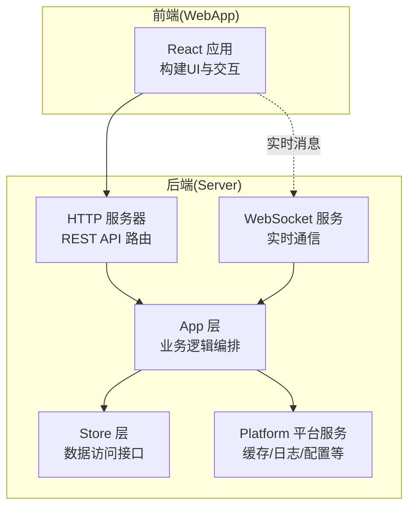
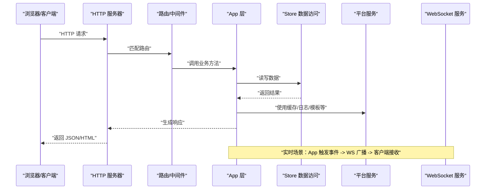
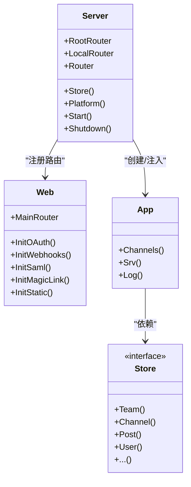
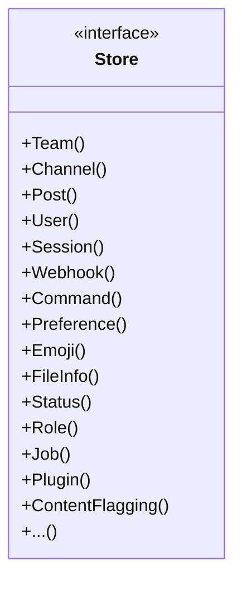
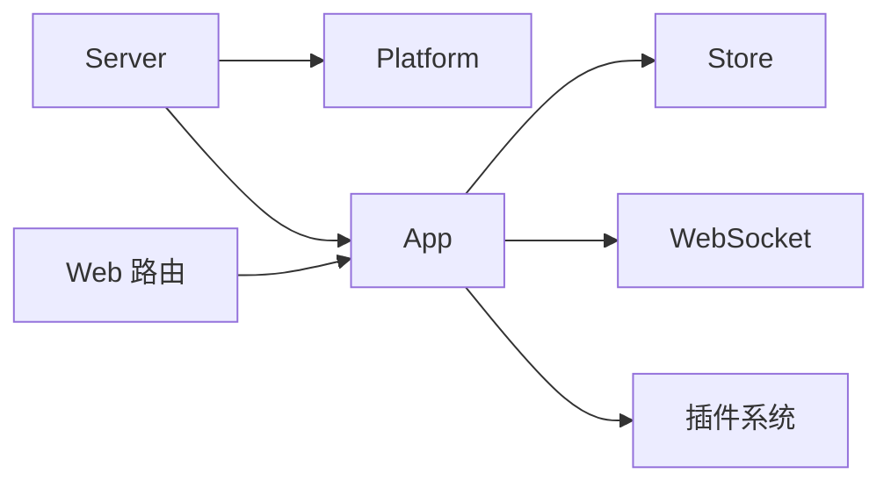

# 整体架构概览

<cite>
**本文档引用的文件**
- [README.md](file://README.md)
- [server/go.mod](file://server/go.mod)
- [webapp/package.json](file://webapp/package.json)
- [server/cmd/mattermost/main.go](file://server/cmd/mattermost/main.go)
- [server/channels/app/app.go](file://server/channels/app/app.go)
- [server/channels/app/server.go](file://server/channels/app/server.go)
- [server/channels/store/store.go](file://server/channels/store/store.go)
- [server/channels/web/web.go](file://server/channels/web/web.go)
</cite>

## 目录
1. [简介](#简介)
2. [项目结构](#项目结构)
3. [核心组件](#核心组件)
4. [架构总览](#架构总览)
5. [详细组件分析](#详细组件分析)
6. [依赖分析](#依赖分析)
7. [性能考虑](#性能考虑)
8. [故障排查指南](#故障排查指南)
9. [结论](#结论)

## 简介
本文件面向 Mattermost 的整体架构概览，聚焦于其分层架构与模块化组织方式，解释后端 Go 服务如何通过 REST API 与前端 React 应用协作，并说明实时通信、数据访问与插件体系在系统中的定位与职责。文档同时给出请求处理流程、消息传播机制与状态管理策略的可视化说明，帮助读者快速把握系统全貌。

## 项目结构
Mattermost 采用前后端分离的典型现代应用结构：
- 后端（Go）：位于 server 目录，提供 HTTP API、WebSocket 服务、作业调度、平台服务与数据访问层。
- 前端（React）：位于 webapp 目录，构建用户界面与交互逻辑，通过 REST API 与后端通信。
- 插件与企业版：通过模块化导入与平台服务集成，实现功能扩展与企业特性。

图示来源
- [server/channels/web/web.go:21-41](file://server/channels/web/web.go#L21-L41)
- [server/channels/app/server.go:91-162](file://server/channels/app/server.go#L91-L162)
- [server/channels/store/store.go:25-109](file://server/channels/store/store.go#L25-L109)

章节来源
- [README.md:1-104](file://README.md#L1-L104)
- [webapp/package.json:1-119](file://webapp/package.json#L1-L119)
- [server/go.mod:1-243](file://server/go.mod#L1-L243)

## 核心组件
- Server（入口点）
  - 负责 HTTP 与 WebSocket 服务初始化、路由注册、平台服务启动与生命周期管理。
  - 提供全局配置、审计、作业调度、推送通知等基础设施能力。
- Platform（平台服务）
  - 提供缓存、日志、模板、国际化、集群、搜索等通用能力，被 App 与各子系统复用。
- Channels（业务逻辑）
  - 将用户、团队、频道、帖子、文件等业务域抽象为服务，协调 Store 与平台能力完成业务编排。
- Store（数据访问）
  - 定义统一的数据访问接口集合，按实体划分 Store 接口，屏蔽底层数据库细节。
- WebSocket（实时通信）
  - 作为实时消息通道，承载事件广播、增量更新与交互式通知。
- Plugins（插件系统）
  - 通过平台钩子与属性服务集成，实现权限控制、字段校验与能力扩展。

章节来源
- [server/channels/app/server.go:91-162](file://server/channels/app/server.go#L91-L162)
- [server/channels/app/app.go:22-163](file://server/channels/app/app.go#L22-L163)
- [server/channels/store/store.go:25-109](file://server/channels/store/store.go#L25-L109)
- [server/channels/web/web.go:21-41](file://server/channels/web/web.go#L21-L41)

## 架构总览
下图展示从浏览器到后端的典型请求路径，以及实时消息传播的关键节点：

图示来源
- [server/channels/web/web.go:21-41](file://server/channels/web/web.go#L21-L41)
- [server/channels/app/server.go:192-286](file://server/channels/app/server.go#L192-L286)
- [server/channels/store/store.go:25-109](file://server/channels/store/store.go#L25-L109)

## 详细组件分析

### 组件一：Server（入口点）
- 职责
  - 初始化根路由与子路径路由；加载平台服务与企业特性；创建用户、团队、属性等服务；启动作业与遥测；管理 HTTP 与本地模式服务器生命周期。
  - 暴露 Store 访问器与平台服务引用，供上层业务使用。
- 关键点
  - 严格依赖顺序：先平台、再企业、再服务层、最后渠道层，避免空指针与竞态。
  - 支持子路径部署（SiteURL 子路径），并提供 404 重定向。
  - 集成 Sentry 错误上报与诊断开关，按环境启用。
- 交互
  - 与 Web 路由、App 层、Store、平台服务紧密耦合，是系统启动与运行的中枢。

图示来源
- [server/channels/app/server.go:91-162](file://server/channels/app/server.go#L91-L162)
- [server/channels/web/web.go:21-41](file://server/channels/web/web.go#L21-L41)
- [server/channels/app/app.go:22-163](file://server/channels/app/app.go#L22-L163)
- [server/channels/store/store.go:25-109](file://server/channels/store/store.go#L25-L109)

章节来源
- [server/channels/app/server.go:192-582](file://server/channels/app/server.go#L192-L582)
- [server/channels/web/web.go:21-134](file://server/channels/web/web.go#L21-L134)

### 组件二：Platform（平台服务）
- 职责
  - 提供缓存、日志、模板、国际化、集群、配置监听、特性标志、邮件批处理等横切能力。
  - 作为 App 与 Store 的“胶水”，统一对外暴露服务接口。
- 特性
  - 缓存容器、时间区域、OpenGraph 元数据缓存、模板容器等。
  - 配置变更监听与热更新支持。
- 与插件/属性服务的协作
  - 通过属性服务注册访问控制钩子、许可证检查钩子与字段限制钩子，保障插件能力在受控范围内运行。

章节来源
- [server/channels/app/server.go:404-453](file://server/channels/app/server.go#L404-L453)
- [server/channels/app/server.go:308-359](file://server/channels/app/server.go#L308-L359)

### 组件三：Channels（业务逻辑）
- 职责
  - 将用户、团队、频道、帖子、文件、偏好、Webhook、命令等业务域抽象为服务，协调 Store 与平台能力完成业务编排。
  - 作为 App 的持有者，向上提供统一的业务入口。
- 设计要点
  - 以服务为中心的领域建模，降低跨模块耦合。
  - 与平台服务的钩子机制配合，实现权限与属性控制。

章节来源
- [server/channels/app/app.go:59-163](file://server/channels/app/app.go#L59-L163)

### 组件四：Store（数据访问）
- 职责
  - 定义统一的数据访问接口集合，覆盖团队、频道、帖子、用户、会话、Webhook、命令、偏好、表情包、文件信息、状态、角色、计划任务、插件、内容标记、归档等。
  - 提供事务、连接池、完整性检查、迁移版本查询等能力。
- 设计要点
  - 接口分层清晰，便于替换实现与测试替身。
  - 支持只读副本、主库连接回收、副本延迟检测等运维能力。

图示来源
- [server/channels/store/store.go:25-109](file://server/channels/store/store.go#L25-L109)

章节来源
- [server/channels/store/store.go:1-800](file://server/channels/store/store.go#L1-L800)

### 组件五：WebSocket（实时通信）
- 职责
  - 作为实时消息通道，承载事件广播、增量更新与交互式通知。
  - 与 App 层协作，将业务事件转化为实时消息推送给订阅者。
- 交互
  - 前端通过 WebSocket 连接接收来自后端的事件流，实现低延迟的消息体验。

章节来源
- [server/channels/web/web.go:21-41](file://server/channels/web/web.go#L21-L41)

### 组件六：Plugins（插件系统）
- 职责
  - 通过平台钩子与属性服务集成，实现权限控制、字段校验与能力扩展。
  - 注册内置属性组、许可证检查钩子、访问控制钩子、属性验证钩子、字段限制钩子与类型变更值清理钩子。
- 价值
  - 在不修改核心代码的前提下扩展业务能力，提升可维护性与可扩展性。

章节来源
- [server/channels/app/server.go:308-359](file://server/channels/app/server.go#L308-L359)

## 依赖分析
- 技术栈与外部依赖
  - 后端使用 Gorilla Mux 作为 HTTP 路由器，Gorilla WebSocket 提供 WebSocket 支持；集成 Sentry、Prometheus、Redis、OpenSearch/Elasticsearch、PostgreSQL 等生态组件。
  - 前端使用 React 生态与打包工具链，工作空间组织多模块工程，支持开发服务器与构建流水线。
- 模块间依赖
  - Server 依赖 Platform 与 Store；App 依赖 Server 与 Store；Web 路由依赖 App；WebSocket 与 App 协作；插件通过属性服务与平台钩子集成。

图示来源
- [server/channels/app/server.go:192-286](file://server/channels/app/server.go#L192-L286)
- [server/channels/web/web.go:21-41](file://server/channels/web/web.go#L21-L41)
- [server/go.mod:5-86](file://server/go.mod#L5-L86)
- [webapp/package.json:25-59](file://webapp/package.json#L25-L59)

章节来源
- [server/go.mod:1-243](file://server/go.mod#L1-L243)
- [webapp/package.json:1-119](file://webapp/package.json#L1-L119)

## 性能考虑
- 可扩展性
  - 多租户与子路径部署支持，满足多实例与多团队隔离需求。
  - 作业调度与集群领导者切换，保证高可用与负载均衡。
- 可维护性
  - 清晰的分层与接口抽象，降低模块间耦合，便于演进与测试。
  - 平台服务统一横切能力，减少重复实现。
- 性能优化方向
  - 使用只读副本与连接池管理，降低主库压力。
  - 合理利用缓存与索引，结合搜索引擎提升检索性能。
  - 对高频 API 与实时通道进行限流与背压处理。

## 故障排查指南
- 常见问题定位
  - HTTP 404：确认子路径配置与路由前缀是否正确；检查 Web 层 404 处理逻辑。
  - 认证与会话：检查会话存储与过期策略；核对设备 ID 与移动会话元数据。
  - 实时消息异常：检查 WebSocket 连接状态与事件广播链路。
  - 插件权限：通过属性服务钩子与许可证检查钩子定位权限问题。
- 日志与监控
  - 启用平台日志与 Sentry 上报，结合配置监听与特性标志动态调整行为。
  - 使用指标与健康检查接口，监控数据库连接与副本延迟。

章节来源
- [server/channels/web/web.go:81-134](file://server/channels/web/web.go#L81-L134)
- [server/channels/app/server.go:464-471](file://server/channels/app/server.go#L464-L471)
- [server/channels/app/server.go:737-800](file://server/channels/app/server.go#L737-L800)

## 结论
Mattermost 采用清晰的分层架构与模块化组织，后端以 Server 为核心，通过 Platform 提供横切能力，App 层编排业务，Store 层抽象数据访问，WebSocket 提供实时通信，插件系统通过属性服务与钩子实现扩展。前后端分离的设计使前端专注于用户体验，后端专注业务与数据，整体架构在性能、可扩展性与可维护性之间取得良好平衡。