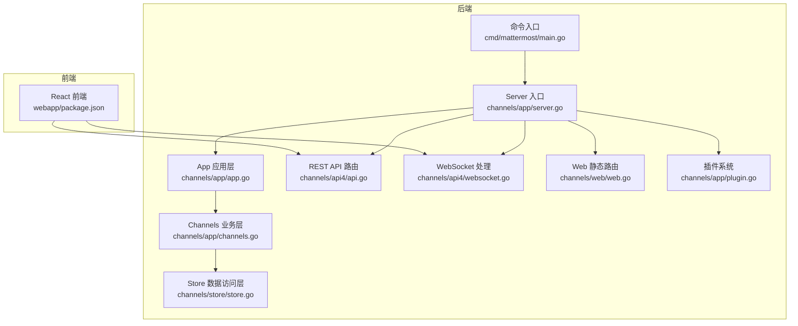
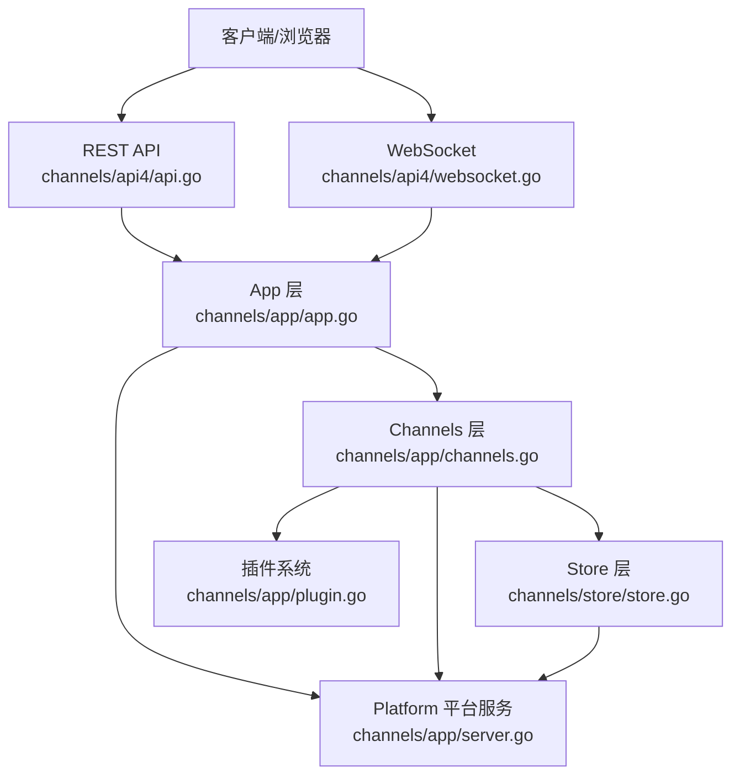
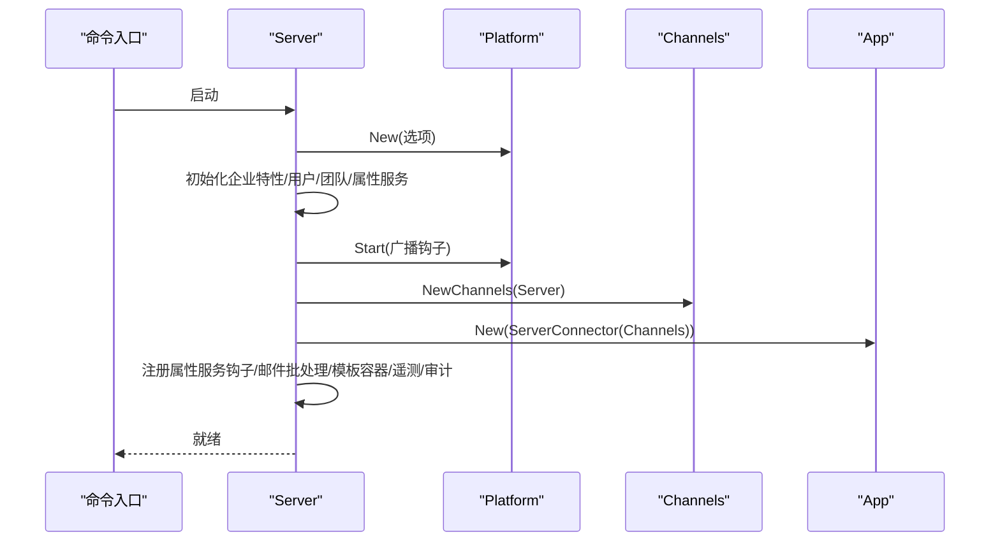
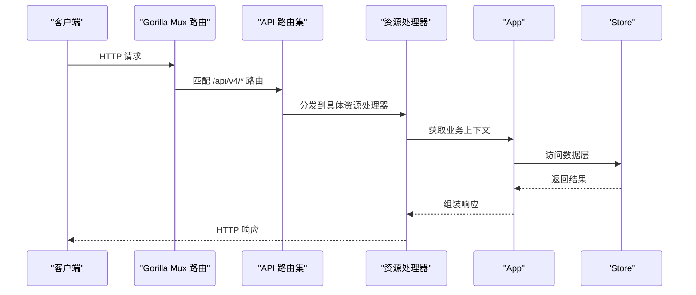
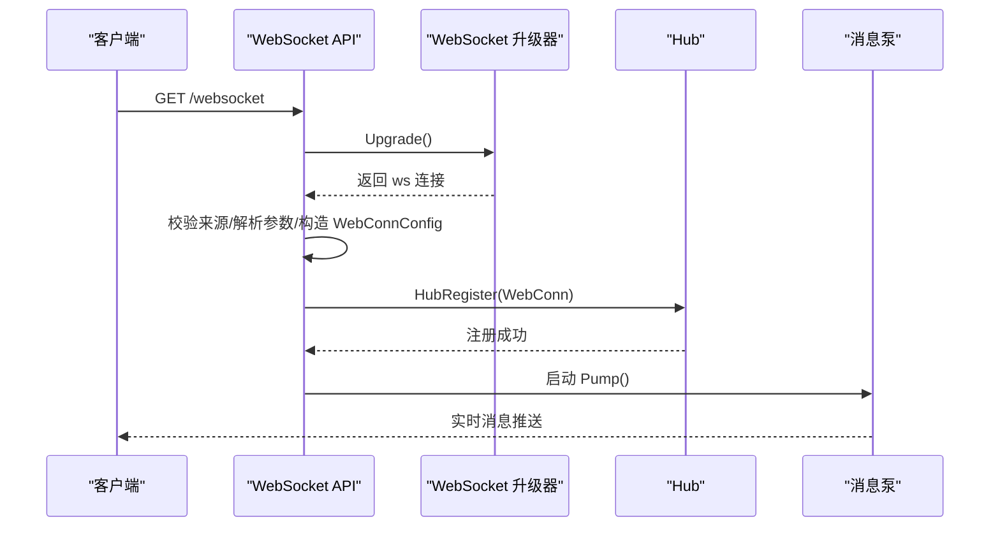
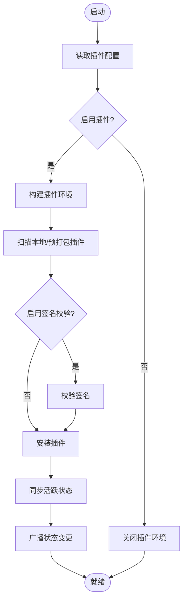
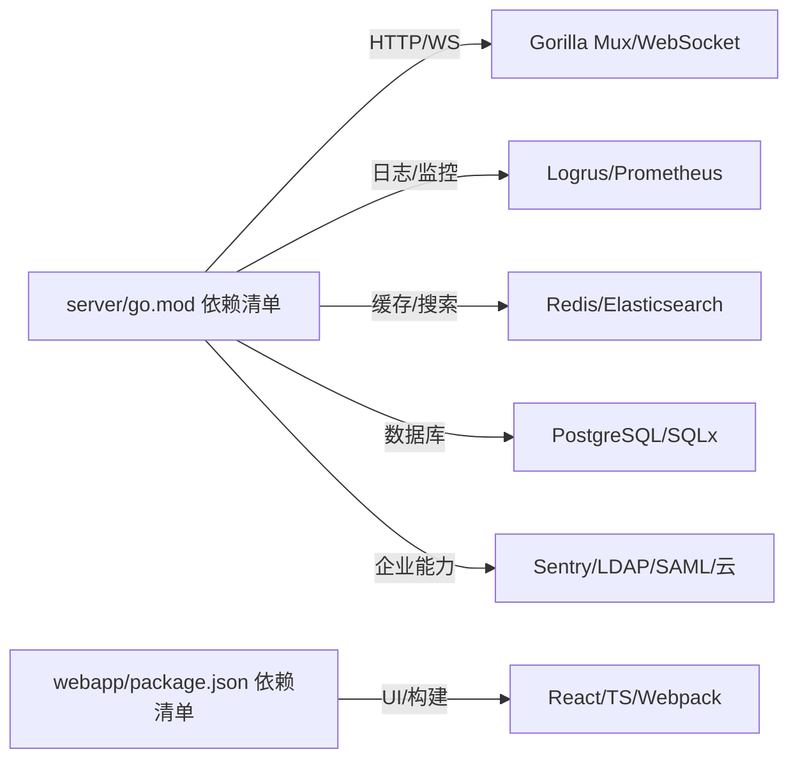

# 架构设计

<cite>
**本文引用的文件**
- [server/go.mod](file://server/go.mod)
- [webapp/package.json](file://webapp/package.json)
- [server/channels/app/app.go](file://server/channels/app/app.go)
- [server/channels/app/server.go](file://server/channels/app/server.go)
- [server/channels/app/channels.go](file://server/channels/app/channels.go)
- [server/channels/app/plugin.go](file://server/channels/app/plugin.go)
- [server/channels/store/store.go](file://server/channels/store/store.go)
- [server/channels/api4/api.go](file://server/channels/api4/api.go)
- [server/channels/api4/websocket.go](file://server/channels/api4/websocket.go)
- [server/channels/web/web.go](file://server/channels/web/web.go)
- [server/cmd/mattermost/main.go](file://server/cmd/mattermost/main.go)
</cite>

## 目录
1. [引言](#引言)
2. [项目结构](#项目结构)
3. [核心组件](#核心组件)
4. [架构总览](#架构总览)
5. [详细组件分析](#详细组件分析)
6. [依赖分析](#依赖分析)
7. [性能考虑](#性能考虑)
8. [故障排查指南](#故障排查指南)
9. [结论](#结论)

## 引言
本文件面向 Mattermost 项目的架构设计说明，聚焦于整体架构模式与模块化组织方式，涵盖分层架构、微服务式子系统设计以及前后端分离的实现。重点解释以下组件关系与交互：Server（入口点）、Platform（平台服务）、Channels（业务逻辑）、Store（数据访问）、WebSocket（实时通信）与 Plugins（插件系统）。同时阐述请求处理流程、消息传播机制与状态管理策略，并给出技术选型与权衡考虑，以帮助读者在不同场景下进行性能、可扩展性与维护性的取舍。

## 项目结构
Mattermost 采用典型的前后端分离架构：
- 后端（Go）：提供 REST API 与 WebSocket 服务，承载业务逻辑、平台能力与数据持久化。
- 前端（React）：负责用户界面渲染与交互，通过 HTTP/WebSocket 与后端通信。
- 插件体系：在运行时动态加载与管理，扩展后端能力。

图示来源
- [server/cmd/mattermost/main.go:19-23](file://server/cmd/mattermost/main.go#L19-L23)
- [server/channels/app/server.go:192-582](file://server/channels/app/server.go#L192-L582)
- [server/channels/app/app.go:22-67](file://server/channels/app/app.go#L22-L67)
- [server/channels/app/channels.go:108-252](file://server/channels/app/channels.go#L108-L252)
- [server/channels/store/store.go:25-109](file://server/channels/store/store.go#L25-L109)
- [server/channels/api4/api.go:183-414](file://server/channels/api4/api.go#L183-L414)
- [server/channels/api4/websocket.go:52-125](file://server/channels/api4/websocket.go#L52-L125)
- [server/channels/web/web.go:26-41](file://server/channels/web/web.go#L26-L41)
- [server/channels/app/plugin.go:170-257](file://server/channels/app/plugin.go#L170-L257)

章节来源
- [server/go.mod:1-243](file://server/go.mod#L1-L243)
- [webapp/package.json:1-119](file://webapp/package.json#L1-L119)
- [server/cmd/mattermost/main.go:19-23](file://server/cmd/mattermost/main.go#L19-L23)

## 核心组件
- Server（入口点）
  - 初始化平台服务、路由、作业调度、审计与遥测等基础设施。
  - 提供 HTTP 与 WebSocket 的统一接入点，协调各子系统。
- Platform（平台服务）
  - 抽象底层能力（缓存、邮件、搜索、集群、配置监听等），为上层提供稳定接口。
- Channels（业务逻辑）
  - 聚合用户、团队、频道、帖子、插件等业务域，负责路由注册与插件生命周期管理。
- Store（数据访问）
  - 定义统一的数据访问接口集合，屏蔽数据库细节，支持主从与只读副本。
- WebSocket（实时通信）
  - 基于 Gorilla WebSocket 升级，提供连接校验、序列号与断开码校验、Hub 注册与泵循环。
- Plugins（插件系统）
  - 支持本地/远程市场插件、签名验证、激活/停用、集群状态同步与钩子执行。

章节来源
- [server/channels/app/server.go:91-162](file://server/channels/app/server.go#L91-L162)
- [server/channels/app/channels.go:38-106](file://server/channels/app/channels.go#L38-L106)
- [server/channels/store/store.go:25-109](file://server/channels/store/store.go#L25-L109)
- [server/channels/api4/websocket.go:52-125](file://server/channels/api4/websocket.go#L52-L125)
- [server/channels/app/plugin.go:47-164](file://server/channels/app/plugin.go#L47-L164)

## 架构总览
Mattermost 的整体架构遵循“入口层—应用层—业务层—数据层”的分层设计，并通过平台服务抽象跨领域通用能力。前端通过 REST API 与 WebSocket 与后端交互；插件系统在运行期注入业务能力，形成微服务式的扩展点。

图示来源
- [server/channels/api4/api.go:183-414](file://server/channels/api4/api.go#L183-L414)
- [server/channels/api4/websocket.go:52-125](file://server/channels/api4/websocket.go#L52-L125)
- [server/channels/app/app.go:22-67](file://server/channels/app/app.go#L22-L67)
- [server/channels/app/channels.go:108-252](file://server/channels/app/channels.go#L108-L252)
- [server/channels/store/store.go:25-109](file://server/channels/store/store.go#L25-L109)
- [server/channels/app/server.go:212-286](file://server/channels/app/server.go#L212-L286)

## 详细组件分析

### 组件 A：Server（入口点）
- 责任边界
  - 初始化平台服务、路由与子系统（用户、团队、属性服务、推送通知 Hub 等）。
  - 启动作业服务器、配置监听、许可证与日志目标更新。
  - 提供 HTTP 与 WebSocket 的统一接入点。
- 关键流程
  - 步骤化初始化：平台 → 企业特性 → 用户/团队/属性服务 → 平台启动 → Channels 初始化 → App 对象绑定 → 属性服务钩子注册 → 邮件批处理与模板容器 → 遥测与审计初始化。
  - 插件启动与配置监听：根据配置变化动态启停插件。
- 性能与可靠性
  - 使用并发与锁保护关键共享资源；优雅关闭顺序确保资源释放顺序正确。

图示来源
- [server/channels/app/server.go:192-582](file://server/channels/app/server.go#L192-L582)
- [server/cmd/mattermost/main.go:19-23](file://server/cmd/mattermost/main.go#L19-L23)

章节来源
- [server/channels/app/server.go:192-582](file://server/channels/app/server.go#L192-L582)

### 组件 B：REST API（路由与处理）
- 路由组织
  - 通过 Gorilla Mux 在根路由与 API 子路径下注册多组资源路由（用户、团队、频道、帖子、插件、OAuth、SAML、系统等）。
  - 支持 v4 与 v5 API 前缀，便于版本演进。
- 请求处理
  - 每个资源路由绑定到具体处理器，上下文包含 App 实例与会话信息。
  - 未匹配路由统一返回 404 处理器，区分 API 与 Web 请求。
- 可扩展性
  - 新增资源只需定义路由与处理器，保持清晰的命名空间与权限控制。

图示来源
- [server/channels/api4/api.go:183-414](file://server/channels/api4/api.go#L183-L414)
- [server/channels/web/web.go:81-97](file://server/channels/web/web.go#L81-L97)

章节来源
- [server/channels/api4/api.go:183-414](file://server/channels/api4/api.go#L183-L414)
- [server/channels/web/web.go:26-41](file://server/channels/web/web.go#L26-L41)

### 组件 C：WebSocket（实时通信）
- 连接建立
  - 通过升级 HTTP 到 WebSocket，设置缓冲区大小与来源校验。
  - 解析查询参数（连接 ID、序列号、断开错误码、已读回执等），构造 WebConn 配置。
- Hub 注册与消息泵
  - 将连接注册到 Hub，启动 Pump 循环处理读写与事件分发。
- 错误与安全
  - 校验断开错误码范围，移动端与普通客户端来源区分处理。

图示来源
- [server/channels/api4/websocket.go:52-125](file://server/channels/api4/websocket.go#L52-L125)

章节来源
- [server/channels/api4/websocket.go:52-125](file://server/channels/api4/websocket.go#L52-L125)

### 组件 D：插件系统（扩展点）
- 生命周期
  - 启动时扫描本地与预打包插件目录，构建插件环境；根据配置决定启用/停用与健康检查。
  - 配置变更触发同步，按需激活或停用插件，并向集群广播状态变更。
- 安全与签名
  - 可选启用签名校验，从文件存储读取签名与插件包进行验证。
- 集群一致性
  - 通过配置监听与集群领导节点变更事件，保证多实例一致的状态推进。

图示来源
- [server/channels/app/plugin.go:170-257](file://server/channels/app/plugin.go#L170-L257)
- [server/channels/app/plugin.go:267-347](file://server/channels/app/plugin.go#L267-L347)

章节来源
- [server/channels/app/plugin.go:47-164](file://server/channels/app/plugin.go#L47-L164)
- [server/channels/app/plugin.go:170-257](file://server/channels/app/plugin.go#L170-L257)
- [server/channels/app/plugin.go:267-347](file://server/channels/app/plugin.go#L267-L347)

### 组件 E：数据访问（Store）
- 接口设计
  - Store 接口统一暴露各类仓储（团队、频道、帖子、用户、会话、偏好、插件、令牌等），支持主从与只读副本。
- 事务与一致性
  - 提供连接池管理、复制延迟检测、完整性检查与诊断接口，保障高可用与一致性。
- 扩展性
  - 通过生成器与接口抽象，新增实体仓储无需改动上层调用方。

章节来源
- [server/channels/store/store.go:25-109](file://server/channels/store/store.go#L25-L109)

## 依赖分析
- 后端依赖
  - Web 框架：Gorilla Mux、Gorilla WebSocket。
  - 日志与监控：Logrus、Prometheus。
  - 缓存与搜索：Redis/Rueidis、Elasticsearch/OpenSearch。
  - 数据库：PostgreSQL（lib/pq）、SQLx。
  - 企业能力：Sentry、LDAP、SAML、云服务集成等。
- 前端依赖
  - React 生态、Webpack、TypeScript、国际化工具链等。

图示来源
- [server/go.mod:5-86](file://server/go.mod#L5-L86)
- [webapp/package.json:25-118](file://webapp/package.json#L25-L118)

章节来源
- [server/go.mod:1-243](file://server/go.mod#L1-L243)
- [webapp/package.json:1-119](file://webapp/package.json#L1-L119)

## 性能考虑
- 并发与锁
  - Server/Channels 中广泛使用互斥锁与并发等待组，避免竞态与死锁。
- 连接与资源
  - WebSocket 升级参数与缓冲区大小合理配置，减少内存占用与 GC 压力。
  - Store 层支持主从与只读副本，降低热点查询对主库压力。
- 可观测性
  - Prometheus 指标、Sentry 错误上报、审计日志与诊断接口，辅助定位性能瓶颈。
- 可扩展性
  - 插件系统与平台服务解耦，业务扩展通过插件实现，避免核心代码膨胀。
- 维护性
  - 清晰的分层与接口抽象，配合生成器与统一错误模型，降低维护成本。

## 故障排查指南
- 404 未匹配路由
  - API 与 Web 请求分别处理，确认请求路径是否位于 API 子路径下。
- WebSocket 升级失败
  - 检查来源校验、客户端 UA 与查询参数（连接 ID、序列号、断开码）。
- 插件无法启用/停用
  - 检查插件目录权限、签名配置与集群配置监听是否生效。
- 数据访问异常
  - 查看 Store 的诊断接口输出，确认主从延迟、连接池状态与完整性检查结果。

章节来源
- [server/channels/web/web.go:81-97](file://server/channels/web/web.go#L81-L97)
- [server/channels/api4/websocket.go:52-125](file://server/channels/api4/websocket.go#L52-L125)
- [server/channels/app/plugin.go:170-257](file://server/channels/app/plugin.go#L170-L257)
- [server/channels/store/store.go:83-109](file://server/channels/store/store.go#L83-L109)

## 结论
Mattermost 采用清晰的分层架构与模块化组织，结合平台服务抽象与插件系统，实现了前后端分离、可扩展且易于维护的即时通讯平台。Server 作为统一入口协调各子系统，REST API 与 WebSocket 提供稳定的交互通道，Store 与平台服务保障数据与基础设施的稳定性。通过合理的依赖选择与可观测性设计，系统在性能、可扩展性与维护性之间取得良好平衡。