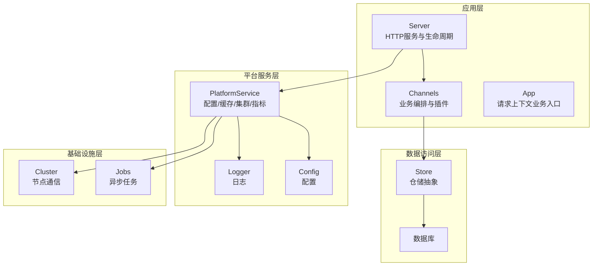
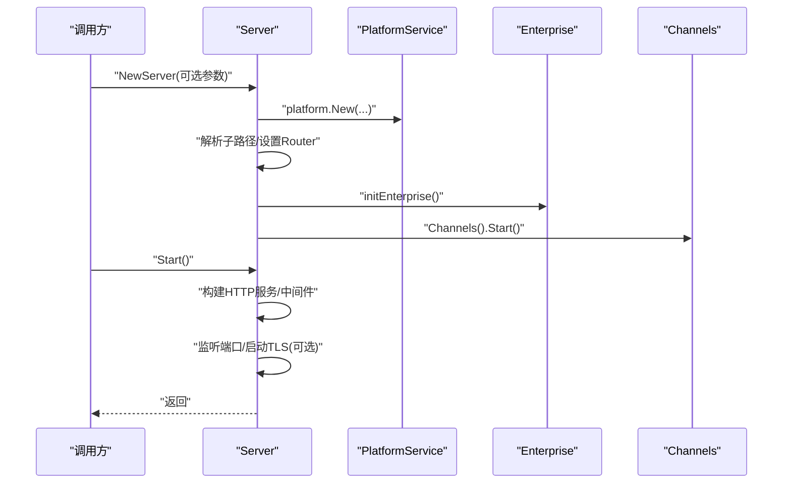
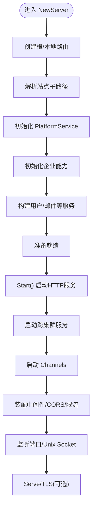
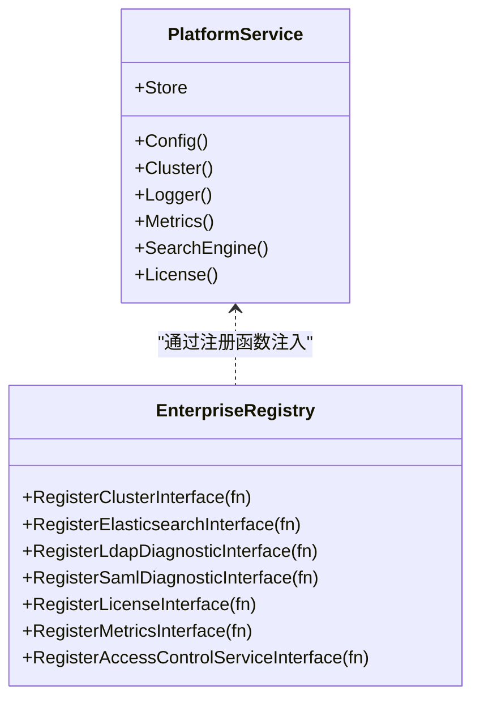
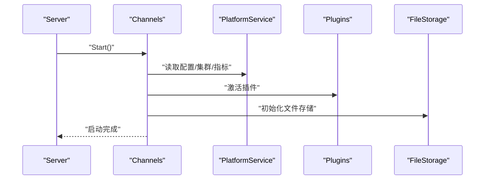
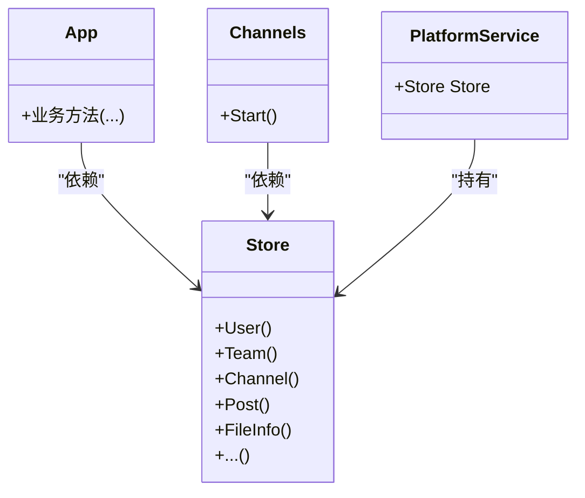
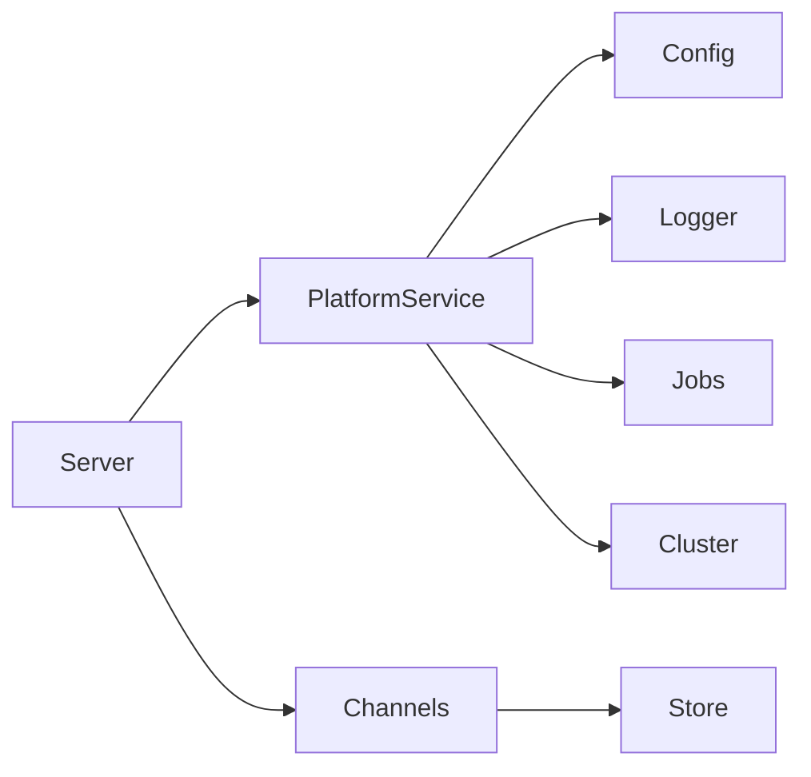

# 组件设计模式

<cite>
**本文引用的文件**
- [server.go](file://server/channels/app/server.go)
- [doc.go](file://server/channels/app/doc.go)
- [enterprise.go](file://server/channels/app/platform/enterprise.go)
- [app.go](file://server/channels/app/app.go)
- [channels.go](file://server/channels/app/channels.go)
- [store.go](file://server/channels/store/store.go)
- [config.go](file://server/config/config.go)
- [logger.go](file://server/config/logger.go)
- [cluster.go](file://server/channels/app/cluster.go)
- [jobs.go](file://server/channels/jobs/jobs.go)
- [platform.go](file://server/platform/services/platform.go)
</cite>

## 目录
1. [引言](#引言)
2. [项目结构](#项目结构)
3. [核心组件](#核心组件)
4. [架构总览](#架构总览)
5. [详细组件分析](#详细组件分析)
6. [依赖分析](#依赖分析)
7. [性能考虑](#性能考虑)
8. [故障排查指南](#故障排查指南)
9. [结论](#结论)
10. [附录](#附录)

## 引言
本文件聚焦 Mattermost 的组件设计模式与实现方式，围绕以下主题展开：Server 结构体的初始化流程、Platform 服务的模块化设计、Channels 业务逻辑的封装方式、Store 数据访问层的抽象设计；解释组件间的依赖关系与接口设计（依赖注入、接口隔离），并给出生命周期管理、错误处理机制与性能优化策略。文末提供最佳实践示例与参考路径，帮助读者在不直接阅读源码的情况下掌握关键实现。

## 项目结构
Mattermost 后端采用分层与模块化组织方式：
- 应用入口与运行时：Server 负责 HTTP 服务、路由、中间件与生命周期管理
- 平台服务：Platform 提供配置、缓存、日志、集群、指标等横切能力
- 业务编排：Channels 封装频道相关状态与企业特性协调
- 数据访问：Store 抽象数据库访问，按领域拆分仓库
- 配置与日志：集中于 config 与 logger 模块
- 任务与作业：Jobs 提供异步任务调度
- 平台服务：platform/services 提供具体平台能力实现

图示来源
- [server.go:192-231](file://server/channels/app/server.go#L192-L231)
- [channels.go](file://server/channels/app/channels.go)
- [platform.go](file://server/platform/services/platform.go)

章节来源
- [doc.go:21-52](file://server/channels/app/doc.go#L21-L52)
- [server.go:192-231](file://server/channels/app/server.go#L192-L231)

## 核心组件
本节概述四大核心组件及其职责边界与协作方式。

- Server
  - 职责：HTTP 服务启动、路由注册、中间件装配、服务生命周期控制、速率限制、CORS、本地模式服务
  - 关键点：按严格顺序初始化 Platform → Enterprise → Channels；监听地址与 TLS 配置；优雅关闭与错误日志
- Platform
  - 职责：非实体类横切能力（配置、缓存、日志、集群、指标、搜索、LDAP/SAML 诊断、许可证）
  - 设计：通过注册函数注入企业能力接口，支持按需替换实现
- Channels
  - 职责：频道相关状态与企业特性协调（合规、LDAP、SAML、共享频道等）
  - 设计：作为业务编排中心，协调插件、文件存储、图像处理与企业功能
- Store
  - 职责：数据访问层抽象，按领域划分仓库（用户、团队、频道、帖子等）
  - 设计：统一接口与事务模型，屏蔽底层数据库差异

章节来源
- [server.go:192-231](file://server/channels/app/server.go#L192-L231)
- [enterprise.go:1-51](file://server/channels/app/platform/enterprise.go#L1-L51)
- [channels.go](file://server/channels/app/channels.go)
- [store.go](file://server/channels/store/store.go)

## 架构总览
下图展示 Server 初始化与启动的关键步骤及依赖关系：

图示来源
- [server.go:192-231](file://server/channels/app/server.go#L192-L231)
- [server.go:907-1190](file://server/channels/app/server.go#L907-L1190)

## 详细组件分析

### Server 初始化与启动流程
- 初始化阶段
  - 通过选项函数（Option）对 Server 进行可插拔配置
  - 创建根路由与本地路由，解析站点子路径，设置子路由前缀
  - 初始化 HTTP 服务包装器，随后加载企业能力
  - 构建用户服务等依赖平台配置的服务
- 启动阶段
  - 先启动跨集群服务，再启动 Channels
  - 注册集群处理器并启动节点间通信
  - 可选：确保安装时间戳与首次运行时间戳
  - 可选：重置所有状态、邮件连接测试、自动翻译初始化
  - 中间件：CORS 包装、速率限制（可配置）、错误日志记录
  - 监听：根据配置选择 TCP 或 Unix Socket，支持 HTTP/TLS

图示来源
- [server.go:192-231](file://server/channels/app/server.go#L192-L231)
- [server.go:907-1190](file://server/channels/app/server.go#L907-L1190)

章节来源
- [server.go:192-231](file://server/channels/app/server.go#L192-L231)
- [server.go:907-1190](file://server/channels/app/server.go#L907-L1190)

### Platform 服务的模块化设计与依赖注入
- 注册机制
  - 通过注册函数为 Platform 注入企业能力接口（集群、Elasticsearch、LDAP/SAML 诊断、许可证、指标、访问控制）
  - 支持按部署环境动态替换实现
- 作用域
  - 非实体类横切能力：配置、缓存、日志、集群、指标、搜索、安全诊断、许可证
- 与 Server 协作
  - Server 在初始化早期即创建 Platform，并将其注入到后续组件（如 Store、HTTP 服务）

图示来源
- [enterprise.go:1-51](file://server/channels/app/platform/enterprise.go#L1-L51)

章节来源
- [enterprise.go:1-51](file://server/channels/app/platform/enterprise.go#L1-L51)

### Channels 业务逻辑的封装方式
- 角色定位
  - Channels 是频道相关状态与企业特性协调的核心
  - 协调插件、文件存储、图像处理与合规、LDAP、SAML 等企业功能
- 生命周期
  - 由 Server 在启动阶段调用 Start() 完成初始化与运行
- 与 App 的关系
  - App 作为请求上下文下的纯函数式业务入口，通过与 Channels 的关联提供业务方法

图示来源
- [channels.go](file://server/channels/app/channels.go)
- [server.go:914-918](file://server/channels/app/server.go#L914-L918)

章节来源
- [channels.go](file://server/channels/app/channels.go)
- [server.go:914-918](file://server/channels/app/server.go#L914-L918)

### Store 数据访问层的抽象设计
- 抽象层次
  - Store 以领域仓库形式暴露统一接口，屏蔽底层数据库差异
  - 支持事务、批量操作与一致性保障
- 与 Platform 的关系
  - Server 在初始化 Platform 后，将 Store 注入到平台服务中，供上层组件使用
- 与 App/Channels 的关系
  - App 与 Channels 通过 Store 访问持久化数据，遵循接口隔离原则，仅依赖所需仓库

图示来源
- [store.go](file://server/channels/store/store.go)
- [server.go:187-190](file://server/channels/app/server.go#L187-L190)

章节来源
- [store.go](file://server/channels/store/store.go)
- [server.go:187-190](file://server/channels/app/server.go#L187-L190)

### 配置与日志的集成
- 配置
  - 通过 Config 模块集中管理运行时配置，Server 与 Platform 均依赖其进行初始化
- 日志
  - Logger 提供统一日志接口，Server 启动时将错误日志输出到标准错误级别

章节来源
- [config.go](file://server/config/config.go)
- [logger.go](file://server/config/logger.go)
- [server.go:1032-1041](file://server/channels/app/server.go#L1032-L1041)

### 集群与作业的协同
- 集群
  - Server 在启动后注册集群处理器并启动节点间通信，确保跨节点能力可用
- 作业
  - Jobs 作为异步任务调度器，由 PlatformService 管理，Server 启动后可正常执行

章节来源
- [cluster.go](file://server/channels/app/cluster.go)
- [jobs.go](file://server/channels/jobs/jobs.go)
- [server.go:920-923](file://server/channels/app/server.go#L920-L923)

## 依赖分析
- 依赖方向
  - Server → Platform → Store（间接通过平台服务）
  - Server → Channels（启动依赖）
  - App/Channels → Store（业务依赖）
  - Platform → Config/Logger（基础设施依赖）
- 解耦策略
  - 通过注册函数注入企业能力接口，实现接口隔离与替换
  - Store 以领域仓库暴露最小接口集，避免上层过度依赖
  - Server 与 Channels 通过平台服务解耦，便于扩展与测试

图示来源
- [server.go:192-231](file://server/channels/app/server.go#L192-L231)
- [channels.go](file://server/channels/app/channels.go)
- [store.go](file://server/channels/store/store.go)
- [config.go](file://server/config/config.go)
- [logger.go](file://server/config/logger.go)
- [jobs.go](file://server/channels/jobs/jobs.go)
- [cluster.go](file://server/channels/app/cluster.go)

## 性能考虑
- 中间件与限流
  - CORS 与速率限制可按配置启用，建议在高并发场景开启速率限制并合理配置阈值
- HTTP 服务参数
  - ReadTimeout/WriteTimeout/IdleTimeout 建议结合业务峰值流量与响应时间调优
- 日志与错误处理
  - 使用专用错误日志通道，避免阻塞主请求链路
- 存储与索引
  - Elasticsearch 等搜索引擎接口通过注册注入，建议在企业版启用并优化索引策略
- 集群与本地模式
  - 跨集群服务优先启动，减少插件激活时的等待；本地模式适用于开发调试

章节来源
- [server.go:1020-1030](file://server/channels/app/server.go#L1020-L1030)
- [server.go:1032-1041](file://server/channels/app/server.go#L1032-L1041)
- [enterprise.go:17-21](file://server/channels/app/platform/enterprise.go#L17-L21)

## 故障排查指南
- 启动失败
  - 检查站点子路径解析与监听地址配置
  - 查看 HTTP 服务错误日志与致命错误输出
- 速率限制与 CORS
  - 确认速率限制开关与阈值配置；验证 CORS 预检请求是否通过
- 邮件通知与 TLS
  - 启用邮件通知时先进行连接测试；TLS 证书与密钥路径需正确
- 集群与插件
  - 跨集群服务启动异常需检查节点通信配置；插件激活失败需查看 Channels 启动日志

章节来源
- [server.go:221-225](file://server/channels/app/server.go#L221-L225)
- [server.go:1052-1056](file://server/channels/app/server.go#L1052-L1056)
- [server.go:1169-1173](file://server/channels/app/server.go#L1169-L1173)
- [server.go:937-941](file://server/channels/app/server.go#L937-L941)

## 结论
Mattermost 通过清晰的分层与模块化设计实现了高内聚、低耦合的系统架构。Server 以严格顺序完成初始化与启动，Platform 通过注册机制注入企业能力，Channels 负责业务编排，Store 提供领域化的数据访问抽象。该设计在保证扩展性的同时，也便于测试与维护。建议在实际工程中遵循接口隔离、依赖注入与最小暴露原则，结合配置与日志体系，持续优化性能与稳定性。

## 附录
- 最佳实践参考路径
  - Server 初始化与启动：[server.go:192-231](file://server/channels/app/server.go#L192-L231)、[server.go:907-1190](file://server/channels/app/server.go#L907-L1190)
  - Platform 注册注入：[enterprise.go:1-51](file://server/channels/app/platform/enterprise.go#L1-L51)
  - Channels 启动与插件：[channels.go](file://server/channels/app/channels.go)、[server.go:914-918](file://server/channels/app/server.go#L914-L918)
  - Store 抽象与注入：[store.go](file://server/channels/store/store.go)、[server.go:187-190](file://server/channels/app/server.go#L187-L190)
  - 配置与日志：[config.go](file://server/config/config.go)、[logger.go](file://server/config/logger.go)
  - 集群与作业：[cluster.go](file://server/channels/app/cluster.go)、[jobs.go](file://server/channels/jobs/jobs.go)