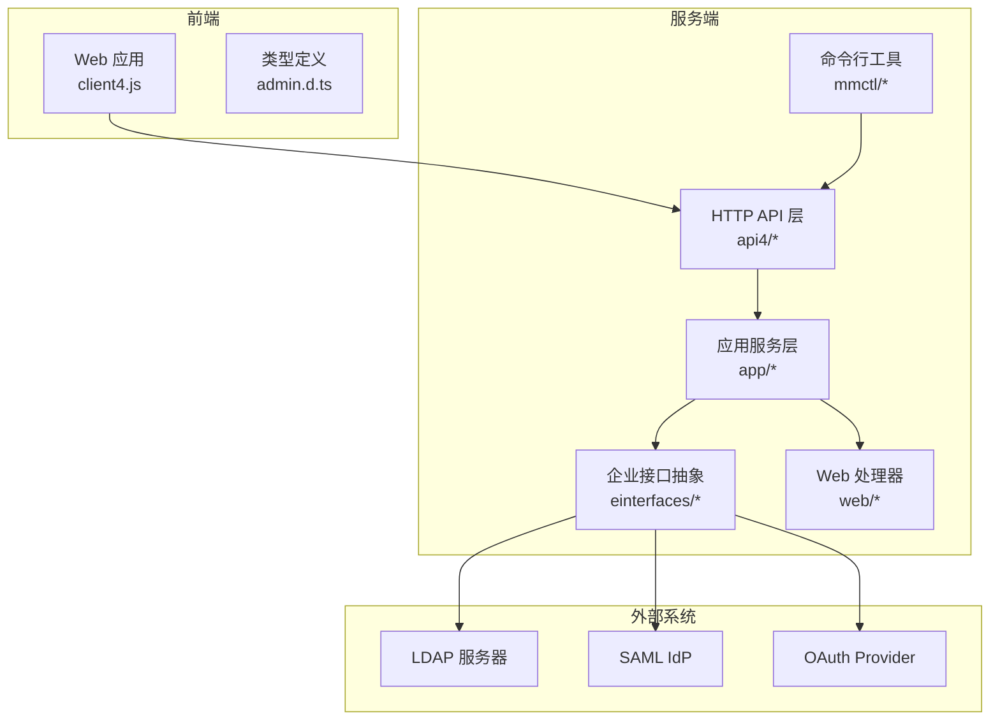
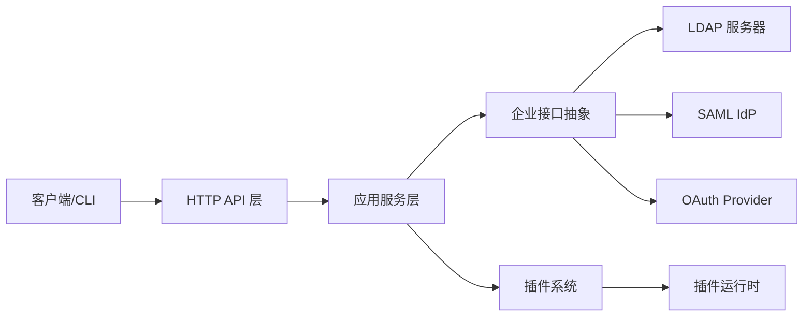
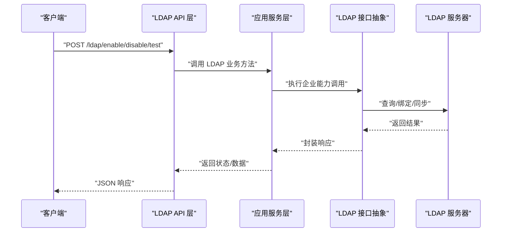
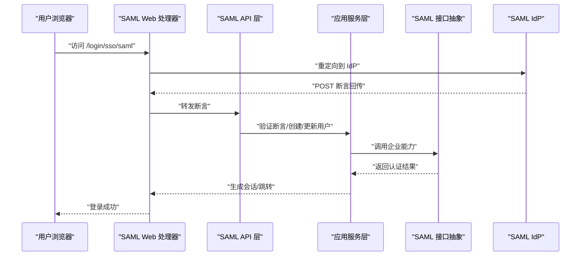
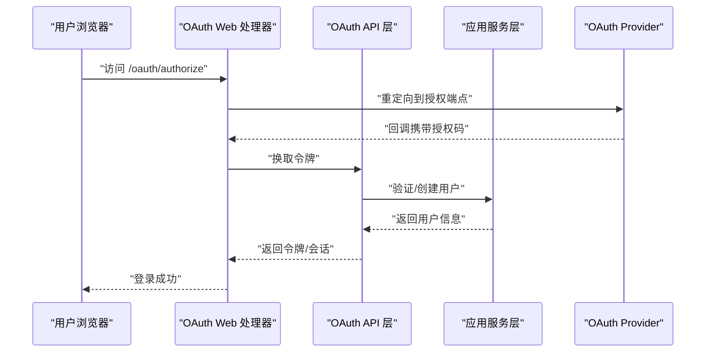
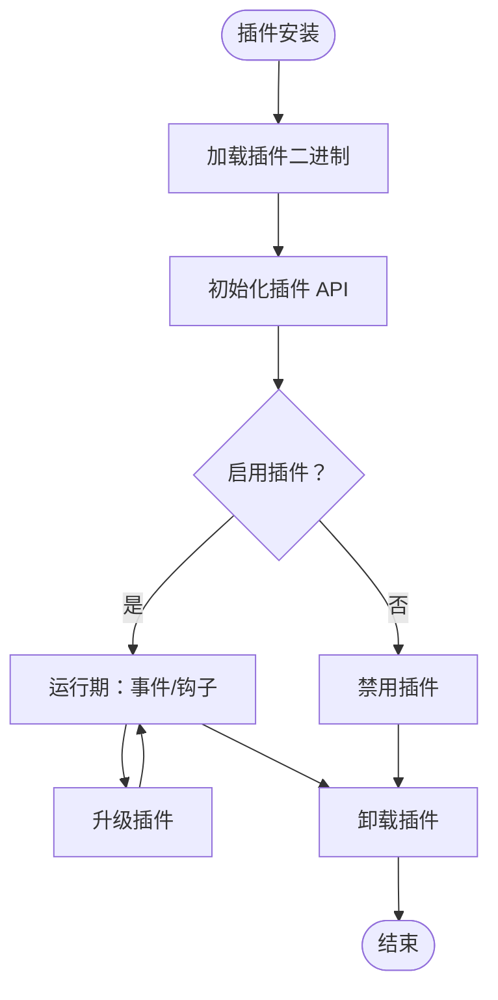
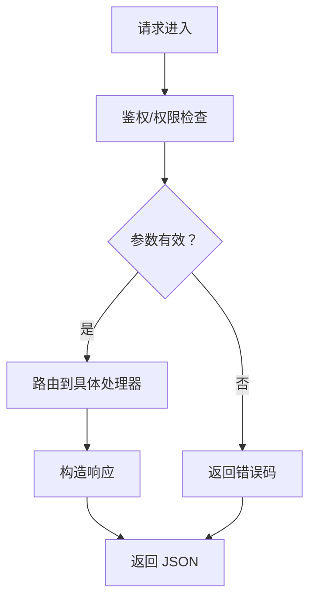
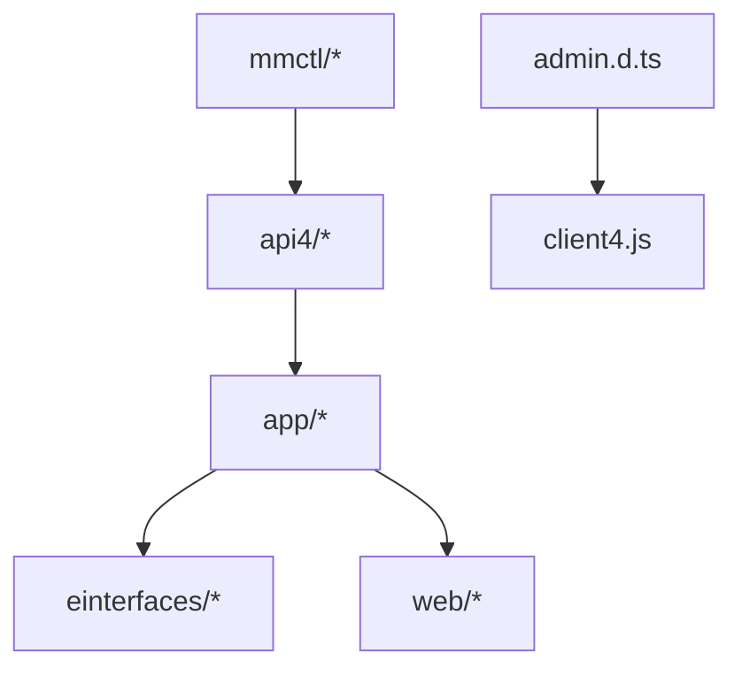

# 集成模式设计

<cite>
**本文引用的文件**
- [server/channels/app/plugin_api.go](file://server/channels/app/plugin_api.go)
- [server/channels/app/plugin.go](file://server/channels/app/plugin.go)
- [server/channels/api4/plugin.go](file://server/channels/api4/plugin.go)
- [server/channels/api4/ldap.go](file://server/channels/api4/ldap.go)
- [server/channels/app/ldap.go](file://server/channels/app/ldap.go)
- [server/einterfaces/ldap.go](file://server/einterfaces/ldap.go)
- [server/public/model/ldap.go](file://server/public/model/ldap.go)
- [server/channels/api4/saml.go](file://server/channels/api4/saml.go)
- [server/channels/app/saml.go](file://server/channels/app/saml.go)
- [server/einterfaces/saml.go](file://server/einterfaces/saml.go)
- [server/public/model/saml.go](file://server/public/model/saml.go)
- [server/channels/api4/oauth.go](file://server/channels/api4/oauth.go)
- [server/channels/app/oauth.go](file://server/channels/app/oauth.go)
- [server/public/model/oauth.go](file://server/public/model/oauth.go)
- [webapp/platform/client/lib/client4.js](file://webapp/platform/client/lib/client4.js)
- [webapp/platform/types/lib/admin.d.ts](file://webapp/platform/types/lib/admin.d.ts)
- [server/channels/web/oauth.go](file://server/channels/web/oauth.go)
- [server/channels/web/saml.go](file://server/channels/web/saml.go)
- [server/cmd/mmctl/commands/plugin.go](file://server/cmd/mmctl/commands/plugin.go)
- [server/cmd/mmctl/commands/ldap.go](file://server/cmd/mmctl/commands/ldap.go)
- [server/cmd/mmctl/commands/saml.go](file://server/cmd/mmctl/commands/saml.go)
- [server/channels/app/enterprise_test.go](file://server/channels/app/enterprise_test.go)
</cite>

## 目录
1. [引言](#引言)
2. [项目结构](#项目结构)
3. [核心组件](#核心组件)
4. [架构总览](#架构总览)
5. [详细组件分析](#详细组件分析)
6. [依赖关系分析](#依赖关系分析)
7. [性能考量](#性能考量)
8. [故障排查指南](#故障排查指南)
9. [结论](#结论)
10. [附录](#附录)

## 引言
本设计文档聚焦 Mattermost 的企业级集成模式与扩展机制，涵盖以下主题：
- 企业功能的模块化集成：LDAP、SAML、OAuth 等外部系统的集成方式与控制流
- 插件系统的扩展架构：插件 API 设计原则、生命周期管理、与核心系统的交互机制
- API 接口的集成模式：REST API 设计规范、版本管理策略、向后兼容性保障
- 提供集成示例与最佳实践，帮助正确实现企业功能、开发兼容插件、设计稳定 API

## 项目结构
Mattermost 采用分层与模块化组织方式：
- 服务端（Go）：核心业务逻辑位于 server/channels/app，HTTP 入口在 server/channels/api4；企业能力通过 einterfaces 抽象接口注入
- 前端（Webapp）：平台客户端封装 REST 调用，类型定义位于 webapp/platform/types
- 命令行工具（mmctl）：提供插件、LDAP、SAML 等运维命令
- 插件生态：插件 API 定义于 server/public/pluginapi，插件运行时由核心加载与管理

**图表来源**
- [server/channels/api4/plugin.go](file://server/channels/api4/plugin.go)
- [server/channels/app/plugin.go](file://server/channels/app/plugin.go)
- [server/channels/api4/ldap.go](file://server/channels/api4/ldap.go)
- [server/channels/app/ldap.go](file://server/channels/app/ldap.go)
- [server/channels/api4/saml.go](file://server/channels/api4/saml.go)
- [server/channels/app/saml.go](file://server/channels/app/saml.go)
- [server/channels/api4/oauth.go](file://server/channels/api4/oauth.go)
- [server/channels/app/oauth.go](file://server/channels/app/oauth.go)
- [webapp/platform/client/lib/client4.js](file://webapp/platform/client/lib/client4.js)
- [webapp/platform/types/lib/admin.d.ts](file://webapp/platform/types/lib/admin.d.ts)

**章节来源**
- [server/channels/api4/plugin.go](file://server/channels/api4/plugin.go)
- [server/channels/app/plugin.go](file://server/channels/app/plugin.go)
- [server/channels/api4/ldap.go](file://server/channels/api4/ldap.go)
- [server/channels/app/ldap.go](file://server/channels/app/ldap.go)
- [server/channels/api4/saml.go](file://server/channels/api4/saml.go)
- [server/channels/app/saml.go](file://server/channels/app/saml.go)
- [server/channels/api4/oauth.go](file://server/channels/api4/oauth.go)
- [server/channels/app/oauth.go](file://server/channels/app/oauth.go)
- [webapp/platform/client/lib/client4.js](file://webapp/platform/client/lib/client4.js)
- [webapp/platform/types/lib/admin.d.ts](file://webapp/platform/types/lib/admin.d.ts)

## 核心组件
- 企业接口抽象（einterfaces）：以接口形式定义 LDAP、SAML、OAuth 等企业能力，便于替换与测试
- 应用服务层（app）：具体实现企业能力与业务流程，调用存储与平台服务
- HTTP API 层（api4）：对外暴露 REST 接口，路由到应用服务层
- Web 处理器（web）：处理浏览器重定向、回调等 Web 场景
- 插件系统：通过插件 API 暴露能力给插件，支持生命周期管理与安全沙箱
- 前端客户端（client4.js）：封装 REST 请求，统一错误处理与认证态
- 类型与诊断：admin.d.ts 提供 LDAP/SAML/OAuth 等类型定义，辅助前端与 CLI

**章节来源**
- [server/einterfaces/ldap.go](file://server/einterfaces/ldap.go)
- [server/einterfaces/saml.go](file://server/einterfaces/saml.go)
- [server/public/model/ldap.go](file://server/public/model/ldap.go)
- [server/public/model/saml.go](file://server/public/model/saml.go)
- [server/public/model/oauth.go](file://server/public/model/oauth.go)
- [webapp/platform/types/lib/admin.d.ts](file://webapp/platform/types/lib/admin.d.ts)

## 架构总览
下图展示企业功能与插件系统的关键交互路径：

**图表来源**
- [server/channels/api4/ldap.go](file://server/channels/api4/ldap.go)
- [server/channels/app/ldap.go](file://server/channels/app/ldap.go)
- [server/channels/api4/saml.go](file://server/channels/api4/saml.go)
- [server/channels/app/saml.go](file://server/channels/app/saml.go)
- [server/channels/api4/oauth.go](file://server/channels/api4/oauth.go)
- [server/channels/app/oauth.go](file://server/channels/app/oauth.go)
- [server/channels/app/plugin.go](file://server/channels/app/plugin.go)
- [server/channels/api4/plugin.go](file://server/channels/api4/plugin.go)

## 详细组件分析

### LDAP 集成模式
- 控制流概览
  - 前端通过 client4.js 发起配置与诊断请求
  - HTTP API 层接收请求并路由至应用服务层
  - 应用服务层调用企业接口抽象，实际实现对接 LDAP 服务器
  - 诊断结果返回前端用于排障

**图表来源**
- [server/channels/api4/ldap.go](file://server/channels/api4/ldap.go)
- [server/channels/app/ldap.go](file://server/channels/app/ldap.go)
- [server/einterfaces/ldap.go](file://server/einterfaces/ldap.go)
- [webapp/platform/client/lib/client4.js](file://webapp/platform/client/lib/client4.js)

- 关键点
  - 企业接口抽象：通过 einterfaces/ldap.go 定义可替换的 LDAP 实现
  - 类型与诊断：admin.d.ts 中包含 LDAP 诊断结果类型，便于前端展示
  - 前端集成：client4.js 提供 LDAP 开关与切换登录方式的接口

**章节来源**
- [server/channels/api4/ldap.go](file://server/channels/api4/ldap.go)
- [server/channels/app/ldap.go](file://server/channels/app/ldap.go)
- [server/einterfaces/ldap.go](file://server/einterfaces/ldap.go)
- [webapp/platform/types/lib/admin.d.ts](file://webapp/platform/types/lib/admin.d.ts)
- [webapp/platform/client/lib/client4.js](file://webapp/platform/client/lib/client4.js)

### SAML 集成模式
- 控制流概览
  - Web 处理器负责 IdP 重定向与断言接收
  - 应用服务层完成 SAML 断言验证与用户映射
  - 企业接口抽象屏蔽具体 IdP 差异

**图表来源**
- [server/channels/web/saml.go](file://server/channels/web/saml.go)
- [server/channels/api4/saml.go](file://server/channels/api4/saml.go)
- [server/channels/app/saml.go](file://server/channels/app/saml.go)
- [server/einterfaces/saml.go](file://server/einterfaces/saml.go)

**章节来源**
- [server/channels/web/saml.go](file://server/channels/web/saml.go)
- [server/channels/api4/saml.go](file://server/channels/api4/saml.go)
- [server/channels/app/saml.go](file://server/channels/app/saml.go)
- [server/einterfaces/saml.go](file://server/einterfaces/saml.go)

### OAuth 集成模式
- 控制流概览
  - Web 处理器负责授权码与令牌交换
  - 应用服务层完成用户映射与会话建立
  - 支持第三方应用授权与资源访问

**图表来源**
- [server/channels/web/oauth.go](file://server/channels/web/oauth.go)
- [server/channels/api4/oauth.go](file://server/channels/api4/oauth.go)
- [server/channels/app/oauth.go](file://server/channels/app/oauth.go)
- [server/public/model/oauth.go](file://server/public/model/oauth.go)

**章节来源**
- [server/channels/web/oauth.go](file://server/channels/web/oauth.go)
- [server/channels/api4/oauth.go](file://server/channels/api4/oauth.go)
- [server/channels/app/oauth.go](file://server/channels/app/oauth.go)
- [server/public/model/oauth.go](file://server/public/model/oauth.go)

### 插件系统扩展架构
- 插件 API 设计原则
  - 明确边界：插件仅能通过公开 API 访问核心能力
  - 安全沙箱：禁止直接访问数据库或网络
  - 生命周期：安装、启用、禁用、卸载、升级均有明确钩子
- 生命周期管理
  - 安装/启用：加载插件二进制，初始化 API
  - 运行期：事件订阅、HTTP 钩子、后台任务
  - 卸载：清理资源、停止钩子
- 与核心系统交互
  - 通过 server/public/pluginapi 下的接口与核心通信
  - 通过 HTTP API 暴露插件端点供前端或其他系统调用

**图表来源**
- [server/channels/app/plugin_api.go](file://server/channels/app/plugin_api.go)
- [server/channels/app/plugin.go](file://server/channels/app/plugin.go)
- [server/channels/api4/plugin.go](file://server/channels/api4/plugin.go)
- [server/cmd/mmctl/commands/plugin.go](file://server/cmd/mmctl/commands/plugin.go)

**章节来源**
- [server/channels/app/plugin_api.go](file://server/channels/app/plugin_api.go)
- [server/channels/app/plugin.go](file://server/channels/app/plugin.go)
- [server/channels/api4/plugin.go](file://server/channels/api4/plugin.go)
- [server/cmd/mmctl/commands/plugin.go](file://server/cmd/mmctl/commands/plugin.go)

### API 接口集成模式
- 设计规范
  - 统一的 HTTP 方法与路径约定，清晰的请求/响应结构
  - 错误码与错误消息标准化，便于前端一致处理
  - 权限校验前置，鉴权失败快速拒绝
- 版本管理策略
  - 采用语义化版本控制，主版本号变更时进行破坏性改动
  - 保持向后兼容：新增字段、新增接口不改变旧字段与行为
- 向后兼容性保证
  - 严格遵循“只增不减”原则，避免删除或重命名现有字段
  - 对废弃字段保留一段时间并在未来版本移除

**图表来源**
- [server/channels/api4/ldap.go](file://server/channels/api4/ldap.go)
- [server/channels/api4/saml.go](file://server/channels/api4/saml.go)
- [server/channels/api4/oauth.go](file://server/channels/api4/oauth.go)
- [server/channels/api4/plugin.go](file://server/channels/api4/plugin.go)

**章节来源**
- [server/channels/api4/ldap.go](file://server/channels/api4/ldap.go)
- [server/channels/api4/saml.go](file://server/channels/api4/saml.go)
- [server/channels/api4/oauth.go](file://server/channels/api4/oauth.go)
- [server/channels/api4/plugin.go](file://server/channels/api4/plugin.go)

## 依赖关系分析
- 低耦合高内聚：企业能力通过接口抽象解耦，便于替换与测试
- 渐进增强：mmctl 命令与前端功能按需启用，不影响核心稳定性
- 可观测性：类型定义与诊断接口为集成与排障提供支撑

**图表来源**
- [server/channels/api4/ldap.go](file://server/channels/api4/ldap.go)
- [server/channels/app/ldap.go](file://server/channels/app/ldap.go)
- [server/einterfaces/ldap.go](file://server/einterfaces/ldap.go)
- [server/channels/api4/saml.go](file://server/channels/api4/saml.go)
- [server/channels/app/saml.go](file://server/channels/app/saml.go)
- [server/einterfaces/saml.go](file://server/einterfaces/saml.go)
- [server/channels/api4/oauth.go](file://server/channels/api4/oauth.go)
- [server/channels/app/oauth.go](file://server/channels/app/oauth.go)
- [webapp/platform/client/lib/client4.js](file://webapp/platform/client/lib/client4.js)
- [webapp/platform/types/lib/admin.d.ts](file://webapp/platform/types/lib/admin.d.ts)

**章节来源**
- [server/channels/api4/ldap.go](file://server/channels/api4/ldap.go)
- [server/channels/app/ldap.go](file://server/channels/app/ldap.go)
- [server/einterfaces/ldap.go](file://server/einterfaces/ldap.go)
- [server/channels/api4/saml.go](file://server/channels/api4/saml.go)
- [server/channels/app/saml.go](file://server/channels/app/saml.go)
- [server/einterfaces/saml.go](file://server/einterfaces/saml.go)
- [server/channels/api4/oauth.go](file://server/channels/api4/oauth.go)
- [server/channels/app/oauth.go](file://server/channels/app/oauth.go)
- [webapp/platform/client/lib/client4.js](file://webapp/platform/client/lib/client4.js)
- [webapp/platform/types/lib/admin.d.ts](file://webapp/platform/types/lib/admin.d.ts)

## 性能考量
- 企业集成性能
  - 合理设置 LDAP/SAML/OAuth 的超时与重试策略，避免阻塞请求线程
  - 使用连接池与批量操作减少外部系统往返次数
- 插件性能
  - 限制插件 CPU/内存占用，必要时引入资源配额
  - 将耗时任务放入队列或异步执行
- API 性能
  - 对热点接口启用缓存与压缩
  - 分页与筛选参数合理使用，避免一次性返回大量数据

## 故障排查指南
- LDAP
  - 使用诊断接口收集样本条目与过滤器匹配情况，定位属性映射问题
  - 检查连接参数、证书与网络连通性
- SAML
  - 校验元数据、断言签名与时间窗口
  - 查看登录日志与 Web 处理器回调状态
- OAuth
  - 校验授权码、回调地址与客户端密钥
  - 检查令牌交换与用户映射流程
- 插件
  - 通过 mmctl 查看插件状态与日志
  - 禁用插件验证是否为插件导致的问题

**章节来源**
- [webapp/platform/types/lib/admin.d.ts](file://webapp/platform/types/lib/admin.d.ts)
- [server/channels/app/enterprise_test.go](file://server/channels/app/enterprise_test.go)
- [server/cmd/mmctl/commands/ldap.go](file://server/cmd/mmctl/commands/ldap.go)
- [server/cmd/mmctl/commands/saml.go](file://server/cmd/mmctl/commands/saml.go)

## 结论
Mattermost 的集成模式以“接口抽象 + 分层架构 + 渐进增强”为核心，既保证了企业能力的可替换与可观测，又为插件生态提供了稳定扩展面。遵循本文的设计原则与最佳实践，可在不破坏向后兼容性的前提下，持续演进系统能力。

## 附录
- 最佳实践清单
  - 企业集成：先做最小可行配置，再逐步完善诊断与监控
  - 插件开发：严格遵守 API 边界，避免直接访问核心内部状态
  - API 设计：保持版本演进的可预测性，充分测试破坏性变更
- 示例参考
  - LDAP：通过前端开关与诊断接口完成配置与排障
  - SAML：利用 Web 处理器与企业接口实现单点登录
  - OAuth：借助 Web 处理器与应用服务层完成授权与令牌管理
  - 插件：通过 mmctl 完成安装、启用、升级与卸载