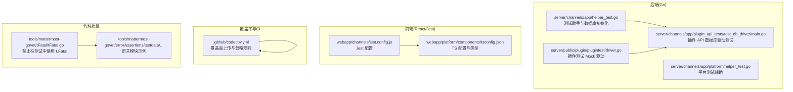
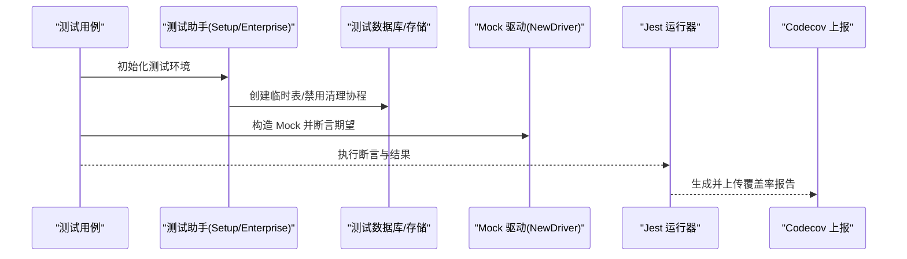
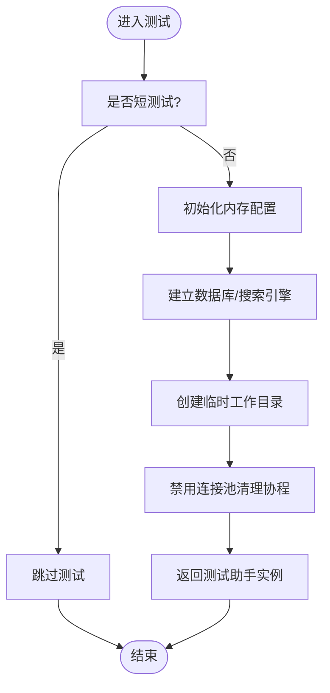
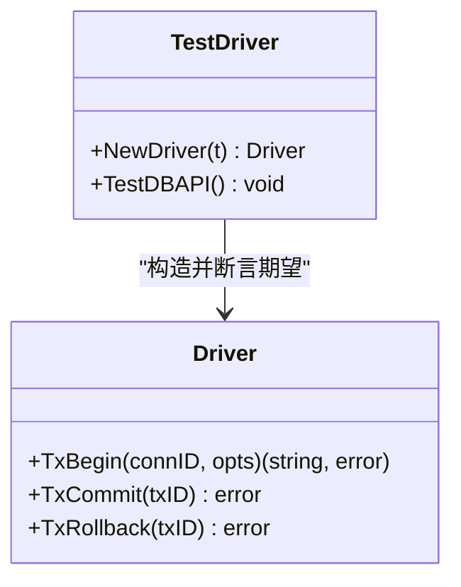
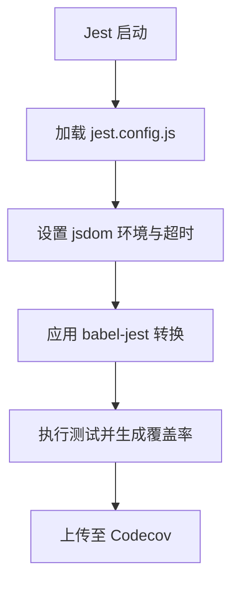
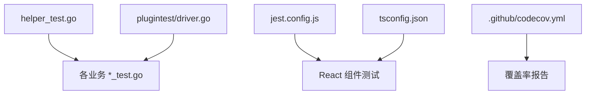

# 单元测试

<cite>
**本文引用的文件**
- [tools/mattermost-govet/tFatal/tFatal.go](file://tools/mattermost-govet/tFatal/tFatal.go)
- [tools/mattermost-govet/errorAssertions/testdata/src/require/require.go](file://tools/mattermost-govet/errorAssertions/testdata/src/require/require.go)
- [webapp/channels/jest.config.js](file://webapp/channels/jest.config.js)
- [webapp/platform/components/tsconfig.json](file://webapp/platform/components/tsconfig.json)
- [.github/codecov.yml](file://.github/codecov.yml)
- [server/channels/app/helper_test.go](file://server/channels/app/helper_test.go)
- [server/public/plugin/plugintest/driver.go](file://server/public/plugin/plugintest/driver.go)
- [e2e-tests/cypress/tests/plugins/file_util.js](file://e2e-tests/cypress/tests/plugins/file_util.js)
- [e2e-tests/playwright/script/lint-test-docs.js](file://e2e-tests/playwright/script/lint-test-docs.js)
- [.github/actions/save-junit-report-tms/src/main.ts](file://.github/actions/save-junit-report-tms/src/main.ts)
- [server/channels/app/platform/helper_test.go](file://server/channels/app/platform/helper_test.go)
- [server/channels/app/plugin_api_tests/test_db_driver/main.go](file://server/channels/app/plugin_api_tests/test_db_driver/main.go)
- [docs/README.md](file://docs/README.md)
- [webapp/CLAUDE.OPTIONAL.md](file://webapp/CLAUDE.OPTIONAL.md)
</cite>

## 目录
1. [简介](#简介)
2. [项目结构](#项目结构)
3. [核心组件](#核心组件)
4. [架构总览](#架构总览)
5. [详细组件分析](#详细组件分析)
6. [依赖分析](#依赖分析)
7. [性能考虑](#性能考虑)
8. [故障排查指南](#故障排查指南)
9. [结论](#结论)
10. [附录](#附录)

## 简介
本指南面向 Mattermost 的单元测试实践，覆盖 Go 语言与前端 React 两部分。内容包括：
- Go 单元测试框架与断言规范（testing 包、testify 断言库）
- React 组件单元测试（Jest 配置、React Testing Library 使用、组件渲染测试）
- 测试数据准备与模拟对象（测试夹具、Mock 对象、测试数据库）
- 测试隔离与副作用管理（避免竞态、连接池清理、跳过长耗时测试）
- 覆盖率分析与改进（Codecov 配置、报告生成、阈值设置）
- 测试组织结构（文件命名、测试套件分组、测试标签与文档化）
- 调试技巧与常见问题解决

## 项目结构
Mattermost 的测试相关能力分布在多个子系统中：
- 后端 Go 测试：server 目录下的大量 *_test.go 文件，配合测试辅助工具与数据库驱动测试
- 前端 React 测试：webapp 目录下各包的 jest.config.* 与测试代码
- 覆盖率与 CI：.github/codecov.yml 控制覆盖率上报与忽略规则
- E2E 工具链：e2e-tests 下的 Cypress/Playwright 测试与脚本
- 代码质量工具：tools/mattermost-govet 提供自定义静态检查，约束测试中的断言风格

**图示来源**
- [server/channels/app/helper_test.go:223-264](file://server/channels/app/helper_test.go#L223-L264)
- [server/public/plugin/plugintest/driver.go:468-480](file://server/public/plugin/plugintest/driver.go#L468-L480)
- [webapp/channels/jest.config.js:31-59](file://webapp/channels/jest.config.js#L31-L59)
- [.github/codecov.yml:1-42](file://.github/codecov.yml#L1-L42)
- [tools/mattermost-govet/tFatal/tFatal.go:1-43](file://tools/mattermost-govet/tFatal/tFatal.go#L1-L43)
- [tools/mattermost-govet/errorAssertions/testdata/src/require/require.go:1-14](file://tools/mattermost-govet/errorAssertions/testdata/src/require/require.go#L1-L14)

**章节来源**
- [server/channels/app/helper_test.go:223-264](file://server/channels/app/helper_test.go#L223-L264)
- [webapp/channels/jest.config.js:31-59](file://webapp/channels/jest.config.js#L31-L59)
- [.github/codecov.yml:1-42](file://.github/codecov.yml#L1-L42)
- [tools/mattermost-govet/tFatal/tFatal.go:1-43](file://tools/mattermost-govet/tFatal/tFatal.go#L1-L43)

## 核心组件
- Go 测试助手与数据库初始化：提供 Setup/SetupEnterprise/SetupWithStoreMock 等便捷入口，支持短测试跳过、内存配置、连接池清理等隔离措施
- 插件测试 Mock 驱动：通过 NewDriver 构造 Mock，自动断言期望，简化插件 API 的单元测试
- Jest 配置与 TS 类型：统一的 Jest 转换器、环境、模块解析与 TS 严格模式，保障 React 组件测试一致性
- 覆盖率控制：Codecov 忽略生成代码、Mock 与测试基础设施，仅统计生产代码覆盖率
- 断言规范与静态检查：禁止直接使用 t.Fatal，推荐使用 testify 的 require/assert 模块进行语义化断言

**章节来源**
- [server/channels/app/helper_test.go:223-264](file://server/channels/app/helper_test.go#L223-L264)
- [server/public/plugin/plugintest/driver.go:468-480](file://server/public/plugin/plugintest/driver.go#L468-L480)
- [webapp/channels/jest.config.js:31-59](file://webapp/channels/jest.config.js#L31-L59)
- [webapp/platform/components/tsconfig.json:1-22](file://webapp/platform/components/tsconfig.json#L1-L22)
- [.github/codecov.yml:21-31](file://.github/codecov.yml#L21-L31)
- [tools/mattermost-govet/tFatal/tFatal.go:18-42](file://tools/mattermost-govet/tFatal/tFatal.go#L18-L42)

## 架构总览
下图展示从测试入口到断言与覆盖率的关键流程。

**图示来源**
- [server/channels/app/helper_test.go:223-264](file://server/channels/app/helper_test.go#L223-L264)
- [server/public/plugin/plugintest/driver.go:468-480](file://server/public/plugin/plugintest/driver.go#L468-L480)
- [.github/codecov.yml:1-42](file://.github/codecov.yml#L1-L42)

## 详细组件分析

### Go 单元测试：测试助手与数据库隔离
- 入口函数
  - Setup/SetupEnterprise/SetupWithStoreMock：根据场景选择数据库与企业版特性，自动处理短测试跳过与配置注入
  - SetupWithoutPreloadMigrations：清空表并标记单元测试运行，确保测试前状态一致
- 隔离与清理
  - 禁用连接池清理 goroutine，避免竞态检测器与 testify mock 参数差异比较之间的冲突
  - 临时工作目录用于文件类测试，减少磁盘副作用
- 断言与错误处理
  - 推荐使用 testify 的 require/assert 模块，避免直接调用 t.Fatal 导致测试中断且难以收集上下文

**图示来源**
- [server/channels/app/helper_test.go:223-264](file://server/channels/app/helper_test.go#L223-L264)
- [server/channels/app/platform/helper_test.go:146-157](file://server/channels/app/platform/helper_test.go#L146-L157)

**章节来源**
- [server/channels/app/helper_test.go:223-264](file://server/channels/app/helper_test.go#L223-L264)
- [server/channels/app/platform/helper_test.go:146-157](file://server/channels/app/platform/helper_test.go#L146-L157)

### Go 单元测试：插件 API 与 Mock 驱动
- Mock 驱动
  - NewDriver 返回带断言期望的 Mock 实例，并在测试结束后自动校验
  - TxCommit/TxRollback 等方法提供签名一致的 Mock 行为
- 插件 API 测试
  - 通过插件客户端主函数运行测试二进制，复用 storetest 套件验证存储层行为

**图示来源**
- [server/public/plugin/plugintest/driver.go:432-466](file://server/public/plugin/plugintest/driver.go#L432-L466)
- [server/channels/app/plugin_api_tests/test_db_driver/main.go:62-69](file://server/channels/app/plugin_api_tests/test_db_driver/main.go#L62-L69)

**章节来源**
- [server/public/plugin/plugintest/driver.go:468-480](file://server/public/plugin/plugintest/driver.go#L468-L480)
- [server/channels/app/plugin_api_tests/test_db_driver/main.go:62-69](file://server/channels/app/plugin_api_tests/test_db_driver/main.go#L62-L69)

### React 组件单元测试：Jest 配置与 React Testing Library
- Jest 配置要点
  - 模块映射与转换：对 CSS/LESS/SCSS 使用 identity-obj-proxy；对 i18n 使用本地 mock；JS/TS 使用 babel-jest
  - 环境与超时：jsdom 环境、60s 超时、自定义 URL
  - 设置：canvas mock、测试环境初始化脚本
- TS 严格模式
  - 开启 strict、strictNullChecks，引入 @testing-library/jest-dom 类型，提升断言类型安全
- 建议
  - 使用 React Testing Library 进行组件渲染与交互测试，聚焦用户视角断言
  - 将测试文件命名为 *.test.ts 或 *.spec.ts，保持与现有工程一致

**图示来源**
- [webapp/channels/jest.config.js:31-59](file://webapp/channels/jest.config.js#L31-L59)
- [webapp/platform/components/tsconfig.json:1-22](file://webapp/platform/components/tsconfig.json#L1-L22)

**章节来源**
- [webapp/channels/jest.config.js:31-59](file://webapp/channels/jest.config.js#L31-L59)
- [webapp/platform/components/tsconfig.json:1-22](file://webapp/platform/components/tsconfig.json#L1-L22)

### 测试数据准备与模拟对象
- 测试夹具
  - e2e-tests 中的 fixtures 用于端到端测试数据准备；单元测试建议在测试内构造最小化数据或使用内存存储
- Mock 对象
  - Go：使用 testify/mock 或 plugintest 驱动；Jest：使用 jest.mock 或 @testing-library/react 的 render 配合自定义 renderer
- 测试数据库
  - 使用内存配置与临时目录，避免持久化副作用；在需要真实 SQL 的场景，使用专用测试数据库或容器化方案

**章节来源**
- [e2e-tests/cypress/tests/plugins/file_util.js:1-38](file://e2e-tests/cypress/tests/plugins/file_util.js#L1-L38)
- [server/channels/app/helper_test.go:223-264](file://server/channels/app/helper_test.go#L223-L264)

### 测试隔离与副作用管理
- 短测试跳过：通过 testing.Short() 判断，快速跳过耗时测试
- 连接池清理：禁用清理协程，避免与断言差异比较产生竞态
- 临时资源：临时工作目录、内存配置存储，确保每次测试独立
- Mock 生命周期：NewDriver 在 Cleanup 中断言期望，保证测试结束时未遗漏调用

**章节来源**
- [server/channels/app/helper_test.go:223-264](file://server/channels/app/helper_test.go#L223-L264)
- [server/public/plugin/plugintest/driver.go:468-480](file://server/public/plugin/plugintest/driver.go#L468-L480)

### 覆盖率分析与改进策略
- 报告生成
  - 使用 go test -cover 生成 cover.out，结合 Codecov Action 上传
- 忽略规则
  - 排除 retrylayer/timerlayer、*_serial_gen.go、mocks、storetest、plugintest、searchtest 等非生产代码
- 阈值设置
  - 项目目标采用“自动目标 + 阈值 1%”策略，确保覆盖率稳定增长；补丁阈值 50%，鼓励修复回归
- 分布式上传
  - CI 等待所有服务分片与 WebApp 合并后再计算状态，避免误判

**图示来源**
- [.github/codecov.yml:1-42](file://.github/codecov.yml#L1-L42)

**章节来源**
- [.github/codecov.yml:1-42](file://.github/codecov.yml#L1-L42)

### 测试组织结构：命名、套件与标签
- Go 测试文件命名
  - 使用 *_test.go，按功能模块划分目录，便于按包/子系统运行
- 套件分组
  - 使用 go test -run 与 -short 控制套件；短测试通过 testing.Short() 跳过
- 标签与文档化
  - Playwright 测试脚本对测试声明、JSDoc、标签与动作/验证注释进行格式校验，确保测试可追溯性
- 文档与参考
  - 文档中明确列出 Jest 版本与配置位置，便于新成员快速上手

**章节来源**
- [e2e-tests/playwright/script/lint-test-docs.js:41-386](file://e2e-tests/playwright/script/lint-test-docs.js#L41-L386)
- [docs/README.md:62-62](file://docs/README.md#L62-L62)
- [webapp/CLAUDE.OPTIONAL.md:44-77](file://webapp/CLAUDE.OPTIONAL.md#L44-L77)

## 依赖分析
- Go 测试依赖关系
  - helper_test 提供通用 Setup，被各业务模块测试复用
  - plugintest 驱动为插件 API 测试提供 Mock，贯穿 storetest 套件
- 前端测试依赖关系
  - jest.config.js 作为统一入口，tsconfig.json 提供类型与严格模式
- 覆盖率依赖关系
  - Codecov 配置决定哪些路径被忽略，影响覆盖率计算

**图示来源**
- [server/channels/app/helper_test.go:223-264](file://server/channels/app/helper_test.go#L223-L264)
- [server/public/plugin/plugintest/driver.go:468-480](file://server/public/plugin/plugintest/driver.go#L468-L480)
- [webapp/channels/jest.config.js:31-59](file://webapp/channels/jest.config.js#L31-L59)
- [webapp/platform/components/tsconfig.json:1-22](file://webapp/platform/components/tsconfig.json#L1-L22)
- [.github/codecov.yml:1-42](file://.github/codecov.yml#L1-L42)

**章节来源**
- [server/channels/app/helper_test.go:223-264](file://server/channels/app/helper_test.go#L223-L264)
- [server/public/plugin/plugintest/driver.go:468-480](file://server/public/plugin/plugintest/driver.go#L468-L480)
- [webapp/channels/jest.config.js:31-59](file://webapp/channels/jest.config.js#L31-L59)
- [webapp/platform/components/tsconfig.json:1-22](file://webapp/platform/components/tsconfig.json#L1-L22)
- [.github/codecov.yml:1-42](file://.github/codecov.yml#L1-L42)

## 性能考虑
- 缩短测试时间
  - 使用 testing.Short() 与 -short 标志，跳过耗时集成测试
  - 复用内存配置与 Mock，避免真实外部依赖
- 减少竞态风险
  - 禁用连接池清理协程，避免与断言差异比较并发访问内部字段
- 前端测试优化
  - 合理设置 transformIgnorePatterns，避免对大型依赖进行不必要的转换
  - 使用 jsdom 环境，减少浏览器启动开销

[本节为通用指导，无需具体文件分析]

## 故障排查指南
- 禁止使用 t.Fatal
  - 工具会检测并报错，应改用 require.NoError/require.Equal 等语义化断言
- Mock 未满足期望
  - 确保在测试结束时调用 Cleanup，以便自动断言期望
- 覆盖率异常
  - 检查 .github/codecov.yml 是否正确忽略生成代码与测试基础设施
- 端到端夹具写入失败
  - 使用 e2e-tests 中的工具函数创建 fixtures 目录并写入数据

**章节来源**
- [tools/mattermost-govet/tFatal/tFatal.go:18-42](file://tools/mattermost-govet/tFatal/tFatal.go#L18-L42)
- [server/public/plugin/plugintest/driver.go:468-480](file://server/public/plugin/plugintest/driver.go#L468-L480)
- [.github/codecov.yml:21-31](file://.github/codecov.yml#L21-L31)
- [e2e-tests/cypress/tests/plugins/file_util.js:17-38](file://e2e-tests/cypress/tests/plugins/file_util.js#L17-L38)

## 结论
通过统一的测试助手、Mock 驱动与严格的断言规范，Mattermost 在 Go 侧实现了高可靠与可维护的单元测试体系；在前端侧，Jest 与 React Testing Library 的配置确保了组件测试的一致性与可扩展性。结合 Codecov 的覆盖率策略与 CI 等待机制，能够持续提升代码质量与测试覆盖面。

[本节为总结，无需具体文件分析]

## 附录
- 参考文档与配置位置
  - Jest 配置与版本信息见 docs/README.md 与 webapp/CLAUDE.OPTIONAL.md
  - 测试标签与文档化规范见 e2e-tests/playwright/script/lint-test-docs.js
  - 覆盖率上传与忽略规则见 .github/codecov.yml
  - 断言规范与静态检查见 tools/mattermost-govet/*

**章节来源**
- [docs/README.md:62-62](file://docs/README.md#L62-L62)
- [webapp/CLAUDE.OPTIONAL.md:44-77](file://webapp/CLAUDE.OPTIONAL.md#L44-L77)
- [e2e-tests/playwright/script/lint-test-docs.js:41-386](file://e2e-tests/playwright/script/lint-test-docs.js#L41-L386)
- [.github/codecov.yml:1-42](file://.github/codecov.yml#L1-L42)
- [tools/mattermost-govet/tFatal/tFatal.go:1-43](file://tools/mattermost-govet/tFatal/tFatal.go#L1-L43)