# 性能测试

<cite>
**本文引用的文件**
- [metrics.go](file://server/public/model/metrics.go)
- [metrics_test.go](file://server/channels/app/metrics_test.go)
- [metrics.go](file://server/channels/app/platform/metrics.go)
- [metrics_test.go](file://server/channels/app/platform/metrics_test.go)
- [support_packet.go](file://server/channels/app/platform/support_packet.go)
- [support_packet.go](file://server/public/model/support_packet.go)
- [command_loadtest.go](file://server/channels/api4/command_loadtest.go)
- [file_bench_test.go](file://server/channels/app/file_bench_test.go)
- [upload_test.go](file://server/channels/api4/upload_test.go)
- [reporter.ts](file://webapp/channels/src/utils/performance_telemetry/reporter.ts)
- [performance.ts](file://webapp/channels/src/components/admin_console/workspace-optimization/dashboard_checks/performance.ts)
- [database_settings.tsx](file://webapp/channels/src/components/admin_console/database_settings.tsx)
- [provider.go](file://server/platform/services/cache/provider.go)
- [memory_other.go](file://server/channels/app/platform/memory_other.go)
- [websocket.js](file://webapp/platform/client/lib/websocket.js)
- [websocket.test.ts](file://webapp/platform/client/src/websocket.test.ts)
</cite>

## 目录
1. [简介](#简介)
2. [项目结构](#项目结构)
3. [核心组件](#核心组件)
4. [架构总览](#架构总览)
5. [详细组件分析](#详细组件分析)
6. [依赖关系分析](#依赖关系分析)
7. [性能考量](#性能考量)
8. [故障排查指南](#故障排查指南)
9. [结论](#结论)
10. [附录](#附录)

## 简介
本指南面向 Mattermost 的性能测试与基准评测实践，覆盖压力测试（并发用户、负载生成、响应时间测量）、性能基准（指标定义、基线建立、趋势分析）、内存泄漏与资源监控（内存/CPU/数据库连接池）、响应时间测试（API 延迟、数据库查询优化、缓存验证）、并发策略（用户并发、消息并发、文件并发）、瓶颈识别与优化（慢查询、热点定位、系统调优）以及性能测试自动化（持续监控、回归检测、报告生成）。文档以仓库中现有实现为依据，结合可操作的流程与可视化图示，帮助读者在 Mattermost 上系统开展性能工作。

## 项目结构
围绕性能测试的关键目录与文件分布如下：
- 指标模型与上报：server/public/model/metrics.go、webapp/channels/src/utils/performance_telemetry/reporter.ts
- 平台指标与剖析服务：server/channels/app/platform/metrics.go、server/channels/app/platform/metrics_test.go
- 支持包与数据库诊断：server/channels/app/platform/support_packet.go、server/public/model/support_packet.go
- 基准与负载测试：server/channels/app/file_bench_test.go、server/channels/api4/command_loadtest.go
- 文件上传与并发：server/channels/api4/upload_test.go
- 数据库配置与优化检查：webapp/channels/src/components/admin_console/database_settings.tsx、webapp/channels/src/components/admin_console/workspace-optimization/dashboard_checks/performance.ts
- 缓存与内存支持：server/platform/services/cache/provider.go、server/channels/app/platform/memory_other.go
- WebRTC/WebSocket 连接与重连：webapp/platform/client/lib/websocket.js、webapp/platform/client/src/websocket.test.ts

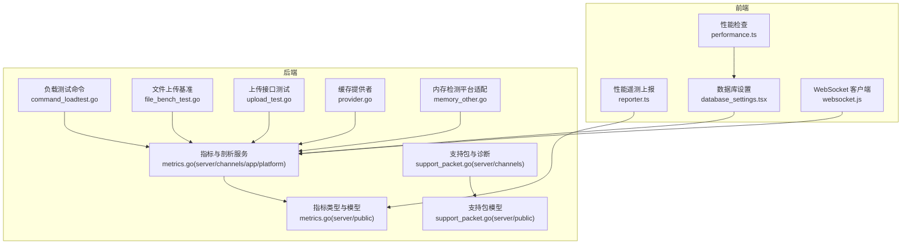

**图表来源**
- [metrics.go:1-129](file://server/public/model/metrics.go#L1-L129)
- [metrics.go:102-152](file://server/channels/app/platform/metrics.go#L102-L152)
- [support_packet.go:56-406](file://server/channels/app/platform/support_packet.go#L56-L406)
- [support_packet.go:70-85](file://server/public/model/support_packet.go#L70-L85)
- [command_loadtest.go:102-151](file://server/channels/api4/command_loadtest.go#L102-L151)
- [file_bench_test.go:61-183](file://server/channels/app/file_bench_test.go#L61-L183)
- [upload_test.go:529-553](file://server/channels/api4/upload_test.go#L529-L553)
- [reporter.ts:338-380](file://webapp/channels/src/utils/performance_telemetry/reporter.ts#L338-L380)
- [performance.ts:37-77](file://webapp/channels/src/components/admin_console/workspace-optimization/dashboard_checks/performance.ts#L37-L77)
- [database_settings.tsx:96-321](file://webapp/channels/src/components/admin_console/database_settings.tsx#L96-L321)
- [provider.go:38-93](file://server/platform/services/cache/provider.go#L38-L93)
- [memory_other.go:1-17](file://server/channels/app/platform/memory_other.go#L1-L17)
- [websocket.js:158-271](file://webapp/platform/client/lib/websocket.js#L158-L271)

**章节来源**
- [metrics.go:1-129](file://server/public/model/metrics.go#L1-L129)
- [metrics.go:102-152](file://server/channels/app/platform/metrics.go#L102-L152)

## 核心组件
- 指标模型与上报
  - 指标类型覆盖页面加载、移动端切换、网络请求统计、桌面端 CPU/内存、插件性能等，支持直方图与计数器两类样本，并对上报版本与时效进行校验。
  - 前端通过遥测上报器聚合直方图与计数器样本，计算起止时间并发送至服务端路由。
- 平台指标与剖析服务
  - 启动独立指标与剖析 HTTP 服务器，暴露 /metrics 与 /debug/pprof 路由，支持阻塞剖析率配置与超时控制。
- 支持包与数据库诊断
  - 采集数据库连接池等待次数/时长、连接关闭统计、PostgreSQL 特有命中率/死锁/临时文件等指标，便于定位数据库瓶颈。
- 基准与负载测试
  - 提供文件上传基准测试，覆盖不同数据大小与传输方式；提供 /test 负载测试命令入口（需启用测试开关）。
- 数据库配置与优化检查
  - 提供最大空闲/打开连接数、查询超时、连接生命周期、追踪开关等配置项；基于总量指标给出 Elasticsearch 建议。
- 缓存与内存支持
  - 缓存提供 LRU/Redis 实现；内存检测在非 Linux/Darwin 平台返回不支持错误。
- WebSocket 连接与重连
  - 客户端具备指数退避与抖动、心跳保活、错误码透传与重连回调机制。

**章节来源**
- [metrics.go:1-129](file://server/public/model/metrics.go#L1-L129)
- [metrics_test.go:42-102](file://server/channels/app/metrics_test.go#L42-L102)
- [metrics.go:102-152](file://server/channels/app/platform/metrics.go#L102-L152)
- [metrics_test.go:45-68](file://server/channels/app/platform/metrics_test.go#L45-L68)
- [support_packet.go:56-406](file://server/channels/app/platform/support_packet.go#L56-L406)
- [support_packet.go:70-85](file://server/public/model/support_packet.go#L70-L85)
- [command_loadtest.go:102-151](file://server/channels/api4/command_loadtest.go#L102-L151)
- [file_bench_test.go:61-183](file://server/channels/app/file_bench_test.go#L61-L183)
- [upload_test.go:529-553](file://server/channels/api4/upload_test.go#L529-L553)
- [reporter.ts:338-380](file://webapp/channels/src/utils/performance_telemetry/reporter.ts#L338-L380)
- [performance.ts:37-77](file://webapp/channels/src/components/admin_console/workspace-optimization/dashboard_checks/performance.ts#L37-L77)
- [database_settings.tsx:96-321](file://webapp/channels/src/components/admin_console/database_settings.tsx#L96-L321)
- [provider.go:38-93](file://server/platform/services/cache/provider.go#L38-L93)
- [memory_other.go:1-17](file://server/channels/app/platform/memory_other.go#L1-L17)
- [websocket.js:158-271](file://webapp/platform/client/lib/websocket.js#L158-L271)

## 架构总览
下图展示性能测试相关组件在客户端与服务端的交互路径，包括指标采集、上报、剖析与数据库诊断。

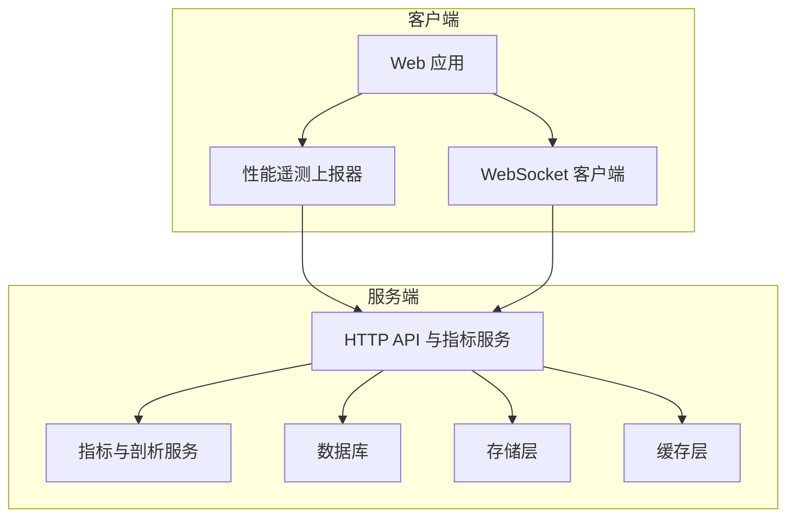

**图表来源**
- [reporter.ts:338-380](file://webapp/channels/src/utils/performance_telemetry/reporter.ts#L338-L380)
- [metrics.go:102-152](file://server/channels/app/platform/metrics.go#L102-L152)
- [support_packet.go:56-406](file://server/channels/app/platform/support_packet.go#L56-L406)

## 详细组件分析

### 指标模型与上报（前端）
- 组件职责
  - 聚合直方图与计数器样本，计算上报起止时间，构造性能报告并通过客户端路由发送到服务端。
- 关键流程
  - 将直方图条目转换为度量样本，合并计数器样本，计算 start/end 时间戳，序列化后发送。
- 可观测点
  - 页面加载、LCP/INP、移动端切换、网络请求统计、桌面端 CPU/内存等指标类型均可用作性能报告内容。

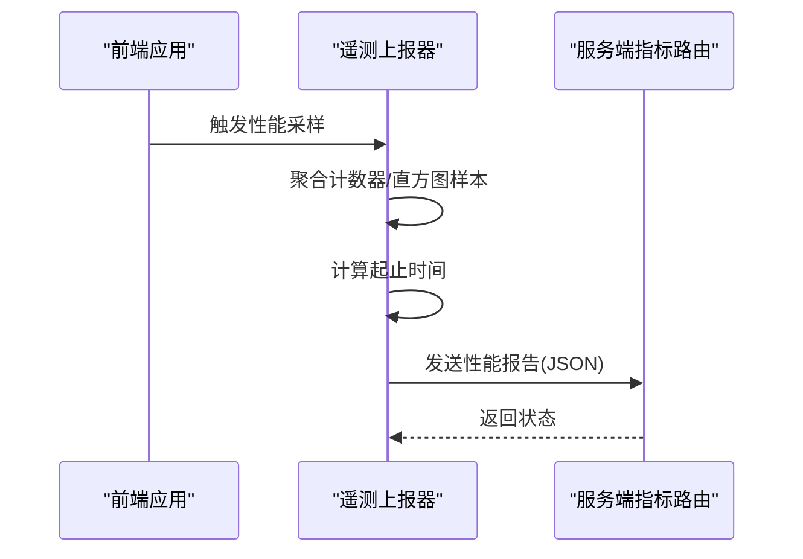

**图表来源**
- [reporter.ts:338-380](file://webapp/channels/src/utils/performance_telemetry/reporter.ts#L338-L380)
- [metrics.go:1-129](file://server/public/model/metrics.go#L1-L129)

**章节来源**
- [metrics.go:1-129](file://server/public/model/metrics.go#L1-L129)
- [reporter.ts:338-380](file://webapp/channels/src/utils/performance_telemetry/reporter.ts#L338-L380)

### 平台指标与剖析服务（后端）
- 组件职责
  - 启动独立 HTTP 服务器，暴露 /metrics 与 /debug/pprof，支持阻塞剖析率配置与读写超时。
- 关键流程
  - 初始化路由与处理器，监听配置的地址与端口，启动后台 Serve 协程。
- 可观测点
  - 通过 /metrics 查看 Prometheus 指标，通过 /debug/pprof 获取堆栈、阻塞、Goroutine 等剖析数据。

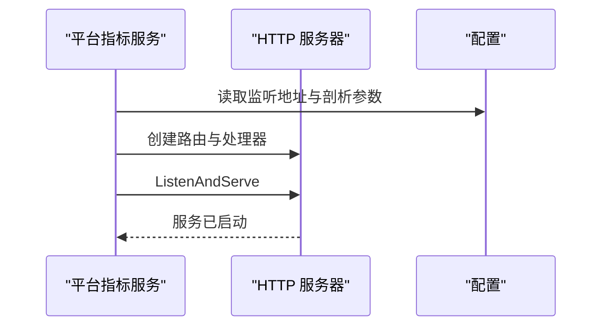

**图表来源**
- [metrics.go:102-152](file://server/channels/app/platform/metrics.go#L102-L152)

**章节来源**
- [metrics.go:102-152](file://server/channels/app/platform/metrics.go#L102-L152)
- [metrics_test.go:45-68](file://server/channels/app/platform/metrics_test.go#L45-L68)

### 支持包与数据库诊断（后端）
- 组件职责
  - 采集数据库连接池等待与关闭统计、PostgreSQL 特有命中率/死锁/临时文件等指标，输出 YAML 结构化诊断信息。
- 关键流程
  - 从存储层诊断结构体读取各项指标，填充到诊断对象，附加注释说明语义。
- 可观测点
  - 连接池等待时长/次数、连接因空闲/生命周期被关闭数量、PostgreSQL 命中率、死锁与临时文件计数等。

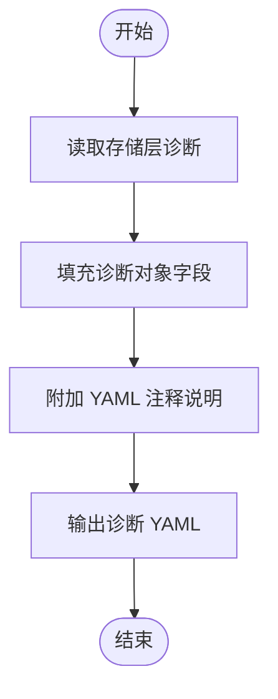

**图表来源**
- [support_packet.go:56-406](file://server/channels/app/platform/support_packet.go#L56-L406)
- [support_packet.go:70-85](file://server/public/model/support_packet.go#L70-L85)

**章节来源**
- [support_packet.go:56-406](file://server/channels/app/platform/support_packet.go#L56-L406)
- [support_packet.go:70-85](file://server/public/model/support_packet.go#L70-L85)

### 基准与负载测试（后端）
- 文件上传基准
  - 覆盖不同大小 GIF/JPG/零数据文件，对比原始上传与带 Content-Length/分块上传等路径，循环执行以评估吞吐与延迟。
- 负载测试命令
  - 提供 /test 命令入口，解析用户/团队/频道/消息/并发范围/时长/图片等参数，用于快速发起负载测试（需开启测试开关）。

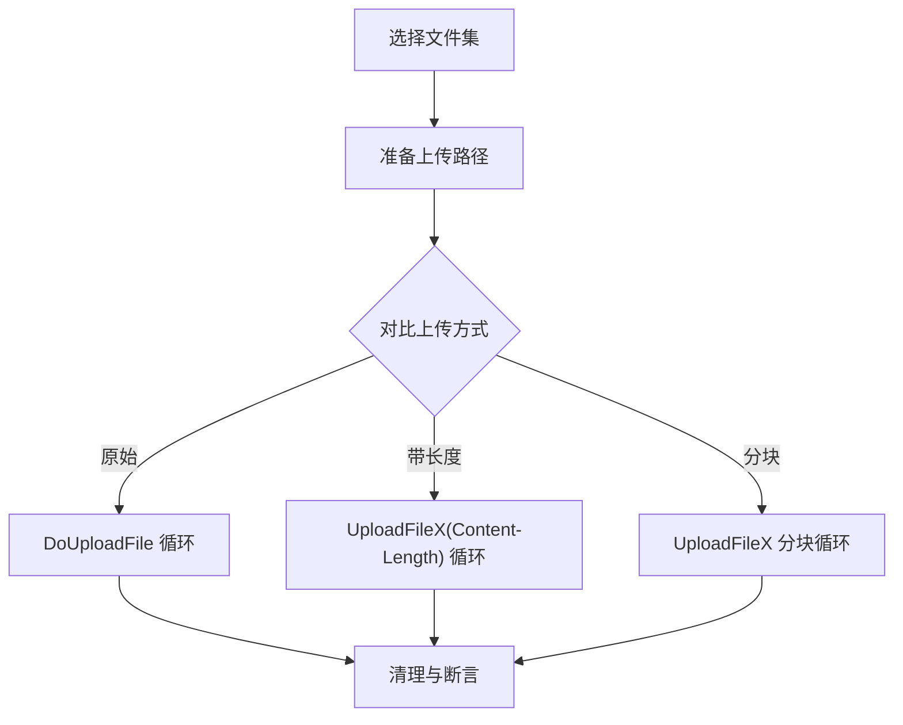

**图表来源**
- [file_bench_test.go:61-183](file://server/channels/app/file_bench_test.go#L61-L183)
- [command_loadtest.go:102-151](file://server/channels/api4/command_loadtest.go#L102-L151)

**章节来源**
- [file_bench_test.go:61-183](file://server/channels/app/file_bench_test.go#L61-L183)
- [command_loadtest.go:102-151](file://server/channels/api4/command_loadtest.go#L102-L151)

### 文件上传与并发（后端）
- 接口行为
  - 多段上传成功后返回文件信息，后续可按 ID 获取文件内容并校验一致性。
- 并发要点
  - 在高并发场景下关注连接池上限、查询超时、连接生命周期与数据库追踪设置，避免阻塞与超时导致的延迟放大。

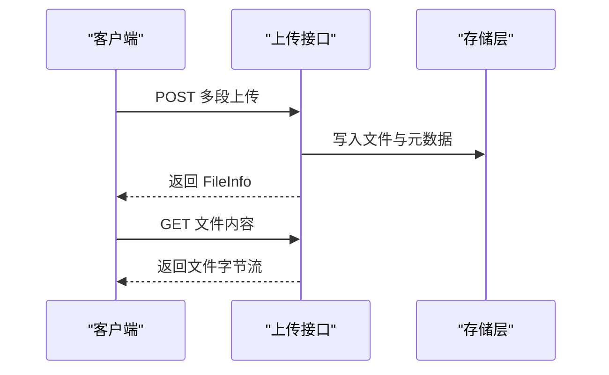

**图表来源**
- [upload_test.go:529-553](file://server/channels/api4/upload_test.go#L529-L553)

**章节来源**
- [upload_test.go:529-553](file://server/channels/api4/upload_test.go#L529-L553)

### 数据库配置与优化检查（前端）
- 配置项
  - 最大空闲/打开连接数、查询超时、分析查询超时、连接最大存活时间、追踪开关等。
- 优化建议
  - 当总量超过阈值时提示启用 Elasticsearch 以改善搜索性能。

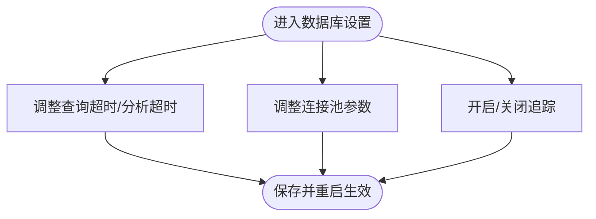

**图表来源**
- [database_settings.tsx:96-321](file://webapp/channels/src/components/admin_console/database_settings.tsx#L96-L321)
- [performance.ts:37-77](file://webapp/channels/src/components/admin_console/workspace-optimization/dashboard_checks/performance.ts#L37-L77)

**章节来源**
- [database_settings.tsx:96-321](file://webapp/channels/src/components/admin_console/database_settings.tsx#L96-L321)
- [performance.ts:37-77](file://webapp/channels/src/components/admin_console/workspace-optimization/dashboard_checks/performance.ts#L37-L77)

### 缓存与内存支持（后端）
- 缓存提供者
  - 支持 LRU 与 Redis 两种实现，可通过选项选择分片 LRU。
- 内存检测
  - 非 Linux/Darwin 平台返回“不支持”错误，避免误报。

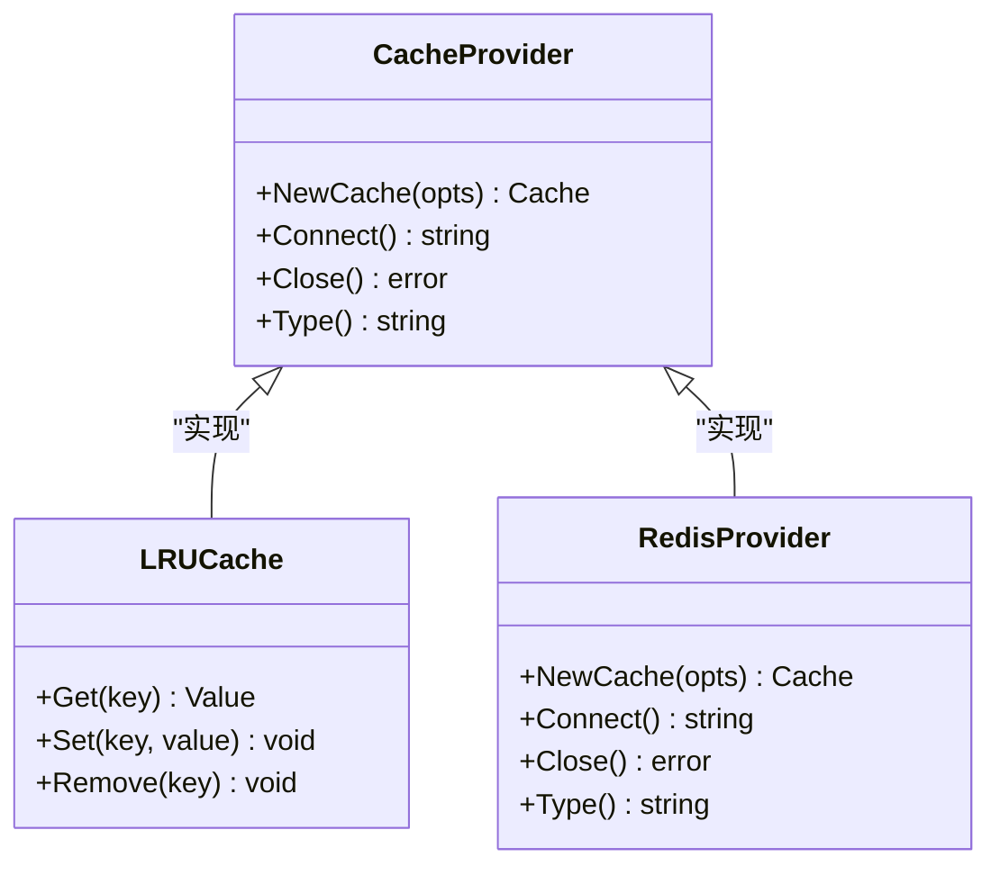

**图表来源**
- [provider.go:38-93](file://server/platform/services/cache/provider.go#L38-L93)
- [memory_other.go:1-17](file://server/channels/app/platform/memory_other.go#L1-L17)

**章节来源**
- [provider.go:38-93](file://server/platform/services/cache/provider.go#L38-L93)
- [memory_other.go:1-17](file://server/channels/app/platform/memory_other.go#L1-L17)

### WebSocket 连接与重连（前端）
- 机制
  - 支持最小重试时间、抖动范围、心跳间隔与错误码透传；连接关闭时停止心跳并触发回退重试。
- 测试
  - 单测覆盖初始化回调注册、关闭重连次数、心跳丢失处理等场景。

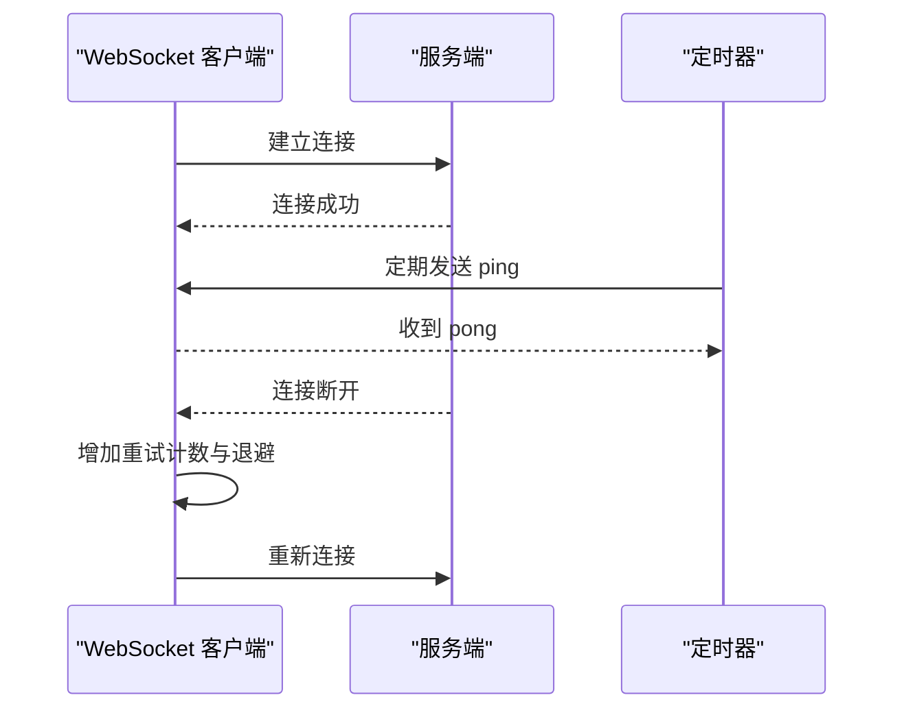

**图表来源**
- [websocket.js:158-271](file://webapp/platform/client/lib/websocket.js#L158-L271)
- [websocket.test.ts:82-128](file://webapp/platform/client/src/websocket.test.ts#L82-L128)

**章节来源**
- [websocket.js:158-271](file://webapp/platform/client/lib/websocket.js#L158-L271)
- [websocket.test.ts:82-128](file://webapp/platform/client/src/websocket.test.ts#L82-L128)

## 依赖关系分析
- 指标模型与上报依赖于服务端指标类型定义；前端上报器依赖客户端路由与时间戳计算。
- 平台指标服务依赖配置中的监听地址与剖析参数；测试用例覆盖路由可达性与剖析页面内容。
- 支持包依赖存储层诊断结构体；数据库设置影响连接池与查询超时，进而影响整体延迟。
- 缓存提供者与内存检测分别服务于缓存层与资源监控；WebSocket 客户端影响实时通信链路稳定性。

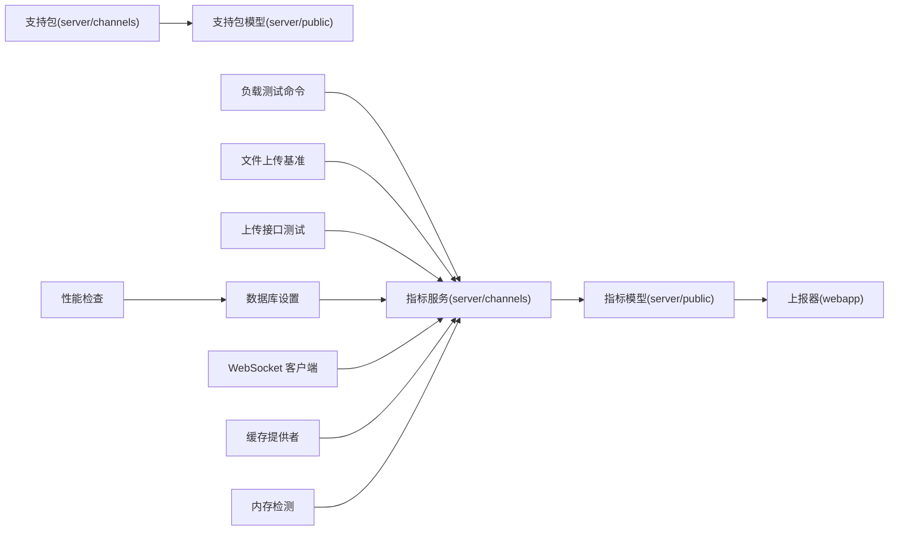

**图表来源**
- [metrics.go:1-129](file://server/public/model/metrics.go#L1-L129)
- [reporter.ts:338-380](file://webapp/channels/src/utils/performance_telemetry/reporter.ts#L338-L380)
- [metrics.go:102-152](file://server/channels/app/platform/metrics.go#L102-L152)
- [support_packet.go:56-406](file://server/channels/app/platform/support_packet.go#L56-L406)
- [support_packet.go:70-85](file://server/public/model/support_packet.go#L70-L85)
- [command_loadtest.go:102-151](file://server/channels/api4/command_loadtest.go#L102-L151)
- [file_bench_test.go:61-183](file://server/channels/app/file_bench_test.go#L61-L183)
- [upload_test.go:529-553](file://server/channels/api4/upload_test.go#L529-L553)
- [database_settings.tsx:96-321](file://webapp/channels/src/components/admin_console/database_settings.tsx#L96-L321)
- [performance.ts:37-77](file://webapp/channels/src/components/admin_console/workspace-optimization/dashboard_checks/performance.ts#L37-L77)
- [provider.go:38-93](file://server/platform/services/cache/provider.go#L38-L93)
- [memory_other.go:1-17](file://server/channels/app/platform/memory_other.go#L1-L17)
- [websocket.js:158-271](file://webapp/platform/client/lib/websocket.js#L158-L271)

**章节来源**
- [metrics.go:1-129](file://server/public/model/metrics.go#L1-L129)
- [metrics.go:102-152](file://server/channels/app/platform/metrics.go#L102-L152)
- [support_packet.go:56-406](file://server/channels/app/platform/support_packet.go#L56-L406)
- [support_packet.go:70-85](file://server/public/model/support_packet.go#L70-L85)
- [reporter.ts:338-380](file://webapp/channels/src/utils/performance_telemetry/reporter.ts#L338-L380)
- [command_loadtest.go:102-151](file://server/channels/api4/command_loadtest.go#L102-L151)
- [file_bench_test.go:61-183](file://server/channels/app/file_bench_test.go#L61-L183)
- [upload_test.go:529-553](file://server/channels/api4/upload_test.go#L529-L553)
- [database_settings.tsx:96-321](file://webapp/channels/src/components/admin_console/database_settings.tsx#L96-L321)
- [performance.ts:37-77](file://webapp/channels/src/components/admin_console/workspace-optimization/dashboard_checks/performance.ts#L37-L77)
- [provider.go:38-93](file://server/platform/services/cache/provider.go#L38-L93)
- [memory_other.go:1-17](file://server/channels/app/platform/memory_other.go#L1-L17)
- [websocket.js:158-271](file://webapp/platform/client/lib/websocket.js#L158-L271)

## 性能考量
- 指标定义与基线
  - 使用页面加载、LCP/INP、移动端切换、网络请求统计、桌面端 CPU/内存等指标构建基线；定期校验版本与时效，确保报告有效。
- 响应时间测量
  - 通过前端遥测上报器聚合直方图样本，结合服务端 /metrics 与 /debug/pprof 获取端到端延迟与剖析数据。
- 数据库连接池与查询
  - 调整最大空闲/打开连接数、查询超时与连接生命周期，观察支持包中的等待时长/次数与 PostgreSQL 命中率变化。
- 缓存与内存
  - 优先使用 LRU/Redis 缓存；在非支持平台避免误用内存检测；结合剖析服务定位内存峰值与泄漏迹象。
- WebSocket 与并发
  - 控制最小重试时间与心跳间隔，避免高并发下的连接风暴；上传并发需配合数据库与存储层限流。

[本节为通用指导，无需特定文件引用]

## 故障排查指南
- 指标上报校验失败
  - 报告版本不匹配或时间戳异常会导致校验失败；检查前端上报器的时间戳计算与服务端版本兼容性。
- 指标服务不可达
  - 确认监听地址与端口配置正确，路由可达；检查读写超时设置是否过短。
- 数据库连接问题
  - 关注连接池等待时长/次数与连接关闭统计；必要时提升最大连接数或缩短连接生命周期。
- WebSocket 连接不稳定
  - 检查最小重试时间、抖动范围与心跳间隔；确认错误码透传与回退逻辑正常。

**章节来源**
- [metrics.go:110-129](file://server/public/model/metrics.go#L110-L129)
- [metrics_test.go:45-68](file://server/channels/app/platform/metrics_test.go#L45-L68)
- [support_packet.go:56-406](file://server/channels/app/platform/support_packet.go#L56-L406)
- [websocket.js:158-271](file://webapp/platform/client/lib/websocket.js#L158-L271)

## 结论
通过指标模型与上报、平台指标与剖析服务、支持包与数据库诊断、基准与负载测试、数据库配置与优化检查、缓存与内存支持以及 WebSocket 连接机制，Mattermost 提供了完整的性能测试与监控能力。建议在实际环境中结合这些组件，建立基线、持续监控、回归检测与报告生成的闭环，以保障系统在高并发场景下的稳定性与低延迟表现。

[本节为总结，无需特定文件引用]

## 附录
- 性能测试清单
  - 准备阶段：启用测试开关、配置指标服务、设置数据库参数、部署缓存。
  - 压力测试：并发用户模拟、负载生成、响应时间测量、剖析采集。
  - 基准评测：文件上传/下载、消息发送/接收、搜索/索引性能。
  - 资源监控：内存/CPU/连接池/IO，结合支持包诊断。
  - 回归与报告：自动化脚本、趋势分析、报告生成与发布。

[本节为通用附录，无需特定文件引用]