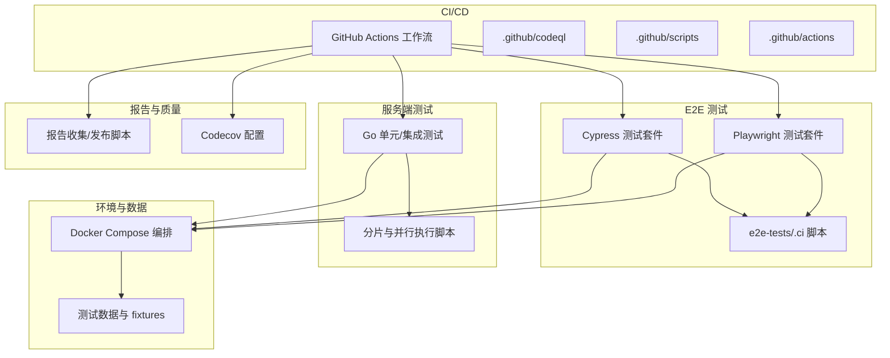
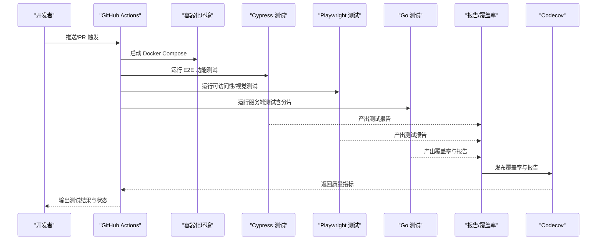
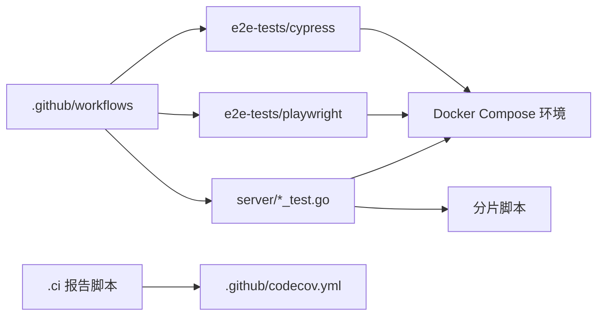

# 测试自动化

<cite>
**本文引用的文件**
- [.github/workflows](file://.github/workflows)
- [.github/codeql](file://.github/codeql)
- [.github/scripts](file://.github/scripts)
- [.github/actions](file://.github/actions)
- [.github/e2e-tests-workflows.md](file://.github/e2e-tests-workflows.md)
- [.github/codecov.yml](file://.github/codecov.yml)
- [e2e-tests/.ci](file://e2e-tests/.ci)
- [e2e-tests/cypress](file://e2e-tests/cypress)
- [e2e-tests/playwright](file://e2e-tests/playwright)
- [server/docker-compose.yaml](file://server/docker-compose.yaml)
- [server/docker-compose.generated.yml](file://server/docker-compose.generated.yml)
- [server/scripts/run-shard-tests.sh](file://server/scripts/run-shard-tests.sh)
- [server/scripts/shard-split.js](file://server/scripts/shard-split.js)
- [server/scripts/shard-split.test.js](file://server/scripts/shard-split.test.js)
- [server/channels/api4/apitestlib.go](file://server/channels/api4/apitestlib.go)
- [server/channels/api4/main_test.go](file://server/channels/api4/main_test.go)
- [server/channels/api4/channel_test.go](file://server/channels/api4/channel_test.go)
- [server/channels/api4/post_test.go](file://server/channels/api4/post_test.go)
- [server/channels/api4/user_test.go](file://server/channels/api4/user_test.go)
- [server/channels/api4/team_test.go](file://server/channels/api4/team_test.go)
- [server/channels/api4/preferences_test.go](file://server/channels/api4/preferences_test.go)
- [server/channels/api4/webhook_test.go](file://server/channels/api4/webhook_test.go)
- [server/channels/api4/plugin_test.go](file://server/channels/api4/plugin_test.go)
- [server/channels/api4/job_test.go](file://server/channels/api4/job_test.go)
- [server/channels/api4/ldap_test.go](file://server/channels/api4/ldap_test.go)
- [server/channels/api4/saml_test.go](file://server/channels/api4/saml_test.go)
- [server/channels/api4/oauth_test.go](file://server/channels/api4/oauth_test.go)
- [server/channels/api4/emoji_test.go](file://server/channels/api4/emoji_test.go)
- [server/channels/api4/upload_test.go](file://server/channels/api4/upload_test.go)
- [server/channels/api4/file_test.go](file://server/channels/api4/file_test.go)
- [server/channels/api4/command_test.go](file://server/channels/api4/command_test.go)
- [server/channels/api4/group_test.go](file://server/channels/api4/group_test.go)
- [server/channels/api4/status_test.go](file://server/channels/api4/status_test.go)
- [server/channels/api4/system_test.go](file://server/channels/api4/system_test.go)
- [server/channels/api4/metrics_test.go](file://server/channels/api4/metrics_test.go)
- [server/channels/api4/data_retention_test.go](file://server/channels/api4/data_retention_test.go)
- [server/channels/api4/content_flagging_test.go](file://server/channels/api4/content_flagging_test.go)
- [server/channels/api4/compliance_test.go](file://server/channels/api4/compliance_test.go)
- [server/channels/api4/ip_filtering_test.go](file://server/channels/api4/ip_filtering_test.go)
- [server/channels/api4/export_test.go](file://server/channels/api4/export_test.go)
- [server/channels/api4/import_test.go](file://server/channels/api4/import_test.go)
- [server/channels/api4/brand_test.go](file://server/channels/api4/brand_test.go)
- [server/channels/api4/bot_test.go](file://server/channels/api4/bot_test.go)
- [server/channels/api4/board_test.go](file://server/channels/api4/board_test.go)
- [server/channels/api4/channel_category_test.go](file://server/channels/api4/channel_category_test.go)
- [server/channels/api4/channel_bookmark_test.go](file://server/channels/api4/channel_bookmark_test.go)
- [server/channels/api4/channel_join_request_test.go](file://server/channels/api4/channel_join_request_test.go)
- [server/channels/api4/shared_channel_test.go](file://server/channels/api4/shared_channel_test.go)
- [server/channels/api4/scheduled_post_test.go](file://server/channels/api4/scheduled_post_test.go)
- [server/channels/api4/view_test.go](file://server/channels/api4/view_test.go)
- [server/channels/api4/reaction_test.go](file://server/channels/api4/reaction_test.go)
- [server/channels/api4/post_utils_test.go](file://server/channels/api4/post_utils_test.go)
- [server/channels/api4/access_control_test.go](file://server/channels/api4/access_control_test.go)
- [server/channels/api4/permission.go](file://server/channels/api4/permission.go)
- [server/channels/api4/permission_test.go](file://server/channels/api4/permission_test.go)
- [server/channels/api4/role_test.go](file://server/channels/api4/role_test.go)
- [server/channels/api4/scheme_test.go](file://server/channels/api4/scheme_test.go)
- [server/channels/api4/remote_cluster_test.go](file://server/channels/api4/remote_cluster_test.go)
- [server/channels/api4/report_test.go](file://server/channels/api4/report_test.go)
- [server/channels/api4/recap_test.go](file://server/channels/api4/recap_test.go)
- [server/channels/api4/terms_of_service_test.go](file://server/channels/api4/terms_of_service_test.go)
- [server/channels/api4/usage_test.go](file://server/channels/api4/usage_test.go)
- [server/channels/api4/viewmembers_test.go](file://server/channels/api4/viewmembers_test.go)
- [server/channels/api4/websocket_test.go](file://server/channels/api4/websocket_test.go)
- [server/channels/api4/websocket_norace_test.go](file://server/channels/api4/websocket_norace_test.go)
- [server/channels/api4/drafts_test.go](file://server/channels/api4/drafts_test.go)
- [server/channels/api4/custom_profile_attributes_test.go](file://server/channels/api4/custom_profile_attributes_test.go)
- [server/channels/api4/image_test.go](file://server/channels/api4/image_test.go)
- [server/channels/api4/notify_admin_test.go](file://server/channels/api4/notify_admin_test.go)
- [server/channels/api4/outgoing_oauth_connection_test.go](file://server/channels/api4/outgoing_oauth_connection_test.go)
- [server/channels/api4/elasticsearch_test.go](file://server/channels/api4/elasticsearch_test.go)
- [server/channels/api4/cloud_test.go](file://server/channels/api4/cloud_test.go)
- [server/channels/api4/cluster_test.go](file://server/channels/api4/cluster_test.go)
- [server/channels/api4/ai_bridge_test_helper.go](file://server/channels/api4/ai_bridge_test_helper.go)
- [server/channels/api4/ai_bridge_test_helper_test.go](file://server/channels/api4/ai_bridge_test_helper_test.go)
- [server/channels/api4/access_control_merge_test.go](file://server/channels/api4/access_control_merge_test.go)
- [server/channels/api4/access_control_validation_test.go](file://server/channels/api4/access_control_validation_test.go)
- [server/channels/api4/access_control_masking_test.go](file://server/channels/api4/access_control_masking_test.go)
- [server/channels/api4/post_create_test.go](file://server/channels/api4/post_create_test.go)
- [server/channels/api4/user_viewmembers_test.go](file://server/channels/api4/user_viewmembers_test.go)
- [server/channels/api4/shared_channel_metadata_test.go](file://server/channels/api4/shared_channel_metadata_test.go)
- [server/channels/api4/shared_channel_remotes_test.go](file://server/channels/api4/shared_channel_remotes_test.go)
- [server/channels/api4/shared_channel_test_utils.go](file://server/channels/api4/shared_channel_test_utils.go)
- [server/channels/api4/commands_test.go](file://server/channels/api4/commands_test.go)
- [server/channels/api4/command_help_test.go](file://server/channels/api4/command_help_test.go)
- [server/channels/api4/ratelimit_test.go](file://server/channels/api4/ratelimit_test.go)
- [server/channels/api4/cors_test.go](file://server/channels/api4/cors_test.go)
- [server/channels/api4/limits_test.go](file://server/channels/api4/limits_test.go)
- [server/channels/api4/properties_test.go](file://server/channels/api4/properties_test.go)
- [server/channels/api4/content_flagging_report_test.go](file://server/channels/api4/content_flagging_report_test.go)
- [server/channels/api4/content_flagging_report.go](file://server/channels/api4/content_flagging_report.go)
- [server/channels/api4/audit_logging.go](file://server/channels/api4/audit_logging.go)
- [server/channels/api4/audit_logging_test.go](file://server/channels/api4/audit_logging_test.go)
- [server/channels/api4/agents.go](file://server/channels/api4/agents.go)
- [server/channels/api4/agents_test.go](file://server/channels/api4/agents_test.go)
- [server/channels/api4/ai_bridge_test_helper.go](file://server/channels/api4/ai_bridge_test_helper.go)
- [server/channels/api4/ai_bridge_test_helper_test.go](file://server/channels/api4/ai_bridge_test_helper_test.go)
- [server/channels/api4/access_control.go](file://server/channels/api4/access_control.go)
- [server/channels/api4/access_control_test.go](file://server/channels/api4/access_control_test.go)
- [server/channels/api4/access_control_merge_test.go](file://server/channels/api4/access_control_merge_test.go)
- [server/channels/api4/access_control_validation_test.go](file://server/channels/api4/access_control_validation_test.go)
- [server/channels/api4/access_control_masking_test.go](file://server/channels/api4/access_control_masking_test.go)
- [server/channels/api4/agent.go](file://server/channels/api4/agent.go)
- [server/channels/api4/agent_test.go](file://server/channels/api4/agent_test.go)
- [server/channels/api4/agent_bridge.go](file://server/channels/api4/agent_bridge.go)
- [server/channels/api4/agent_bridge_test.go](file://server/channels/api4/agent_bridge_test.go)
- [server/channels/api4/ai_bridge_test_helper.go](file://server/channels/api4/ai_bridge_test_helper.go)
- [server/channels/api4/ai_bridge_test_helper_test.go](file://server/channels/api4/ai_bridge_test_helper_test.go)
- [server/channels/api4/ai_bridge_test_helper.go](file://server/channels/api4/ai_bridge_test_helper.go)
- [server/channels/api4/ai_bridge_test_helper_test.go](file://server/channels/api4/ai_bridge_test_helper_test.go)
- [server/channels/api4/ai_bridge_test_helper.go](file://server/channels/api4/ai_bridge_test_helper.go)
- [server/channels/api4/ai_bridge_test_helper_test.go](file://server/channels/api4/ai_bridge_test_helper_test.go)
- [server/channels/api4/ai_bridge_test_helper.go](file://server/channels/api4/ai_bridge_test_helper.go)
- [server/channels/api4/ai_bridge_test_helper_test.go](file://server/channels/api4/ai_bridge_test_helper_test.go)
- [server/channels/api4/ai_bridge_test_helper.go](file://server/channels/api4/ai_bridge_test_helper.go)
- [server/channels/api4/ai_bridge_test_helper_test.go](file://server/channels/api4/ai_bridge_test_helper_test.go)
- [server/channels/api4/ai_bridge_test_helper.go](file://server/channels/api4/ai_bridge_test_helper.go)
- [server/channels/api4/ai_bridge_test_helper_test.go](file://server/channels/api4/ai_bridge_test_helper_test.go)
- [server/channels/api4/ai_bridge_test_helper.go](file://server/channels/api4/ai_bridge_test_helper.go)
- [server/channels/api4/ai_bridge_test_helper_test.go](file://server/channels/api4/ai_bridge_test_helper_test.go)
- [server/channels/api4/ai_bridge_test_helper.go](file://server/channels/api4/ai_bridge_test_helper.go)
- [server/channels/api4/ai_bridge_test_helper_test.go](file://server/channels/api4/ai_bridge_test_helper_test.go)
- [server/channels/api4/ai_bridge_test_helper.go](file://server/channels/api4/ai_bridge_test_helper.go)
- [server/channels/api4/ai_bridge_test_helper_test.go](file://server/channels/api4/ai_bridge_test_helper_test.go)
- [server/channels/api4/ai_bridge_test_helper.go](file://server/channels/api4/ai_bridge_test_helper.go)
- [server/channels/api4/ai_bridge_test_helper_test.go](file://server/channels/api......)
</cite>

## 目录
1. 引言
2. 项目结构
3. 核心组件
4. 架构总览
5. 详细组件分析
6. 依赖关系分析
7. 性能考量
8. 故障排查指南
9. 结论
10. 附录

## 引言
本指南面向 Mattermost 的测试自动化体系，聚焦于 CI/CD 流水线中的测试集成与质量门禁，涵盖 GitHub Actions 配置、测试任务调度与并行执行策略、测试报告与覆盖率生成、测试环境管理（容器化、数据库与临时环境清理）、测试数据管理（生成、隔离与隐私保护）、测试结果分析与通知机制、测试维护策略（重构、过期清理与框架升级），以及测试成本优化（执行时间、资源与维护效率）。文档以仓库中现有的 e2e 测试、CI 工作流与服务端测试为依据，结合容器编排与脚本工具，形成可操作的实践路径。

## 项目结构
Mattermost 的测试自动化由多层组成：
- GitHub Actions 工作流：定义流水线阶段、触发条件与质量门禁。
- 端到端测试（E2E）：Cypress 与 Playwright 双栈，覆盖功能、可访问性与视觉回归。
- 服务端单元/集成测试：Go 语言测试套件，覆盖 API 与业务逻辑。
- 容器化与环境管理：Docker Compose 编排应用与数据库，配合临时环境生命周期管理脚本。
- 报告与覆盖率：Codecov 集成、测试报告收集与发布脚本。
- 数据与脚本：测试数据生成、分片与并行执行脚本，保障大规模测试的稳定性与效率。

图示来源
- [.github/workflows](file://.github/workflows)
- [.github/codeql](file://.github/codeql)
- [.github/scripts](file://.github/scripts)
- [.github/actions](file://.github/actions)
- [e2e-tests/.ci](file://e2e-tests/.ci)
- [e2e-tests/cypress](file://e2e-tests/cypress)
- [e2e-tests/playwright](file://e2e-tests/playwright)
- [server/docker-compose.yaml](file://server/docker-compose.yaml)
- [server/scripts/run-shard-tests.sh](file://server/scripts/run-shard-tests.sh)
- [server/scripts/shard-split.js](file://server/scripts/shard-split.js)
- [.github/codecov.yml](file://.github/codecov.yml)

章节来源
- [.github/workflows](file://.github/workflows)
- [e2e-tests/.ci](file://e2e-tests/.ci)
- [e2e-tests/cypress](file://e2e-tests/cypress)
- [e2e-tests/playwright](file://e2e-tests/playwright)
- [server/docker-compose.yaml](file://server/docker-compose.yaml)
- [server/scripts/run-shard-tests.sh](file://server/scripts/run-shard-tests.sh)
- [server/scripts/shard-split.js](file://server/scripts/shard-split.js)
- [.github/codecov.yml](file://.github/codecov.yml)

## 核心组件
- GitHub Actions 工作流：集中定义构建、测试、安全扫描与发布流程；通过质量门禁控制合并。
- Cypress 与 Playwright：双栈 E2E 框架，分别覆盖功能与可访问性/视觉回归场景。
- Go 服务端测试：围绕 API 层与业务模块的单元/集成测试，辅以分片与并行执行脚本。
- 容器化与环境管理：Docker Compose 统一编排应用与数据库，配套生命周期脚本。
- 报告与覆盖率：Codecov 配置与报告收集/发布脚本，支撑质量门禁与可视化。
- 测试数据与脚本：fixtures、数据生成与分片脚本，确保隔离与可重复性。

章节来源
- [.github/workflows](file://.github/workflows)
- [e2e-tests/cypress](file://e2e-tests/cypress)
- [e2e-tests/playwright](file://e2e-tests/playwright)
- [server/scripts/run-shard-tests.sh](file://server/scripts/run-shard-tests.sh)
- [server/scripts/shard-split.js](file://server/scripts/shard-split.js)
- [server/docker-compose.yaml](file://server/docker-compose.yaml)
- [.github/codecov.yml](file://.github/codecov.yml)

## 架构总览
下图展示从触发到产出的测试自动化全链路：工作流触发后，拉起容器化环境，运行 Cypress/Playwright 与 Go 测试，收集报告并通过 Codecov 发布，最终根据质量门禁决定是否允许合并。

图示来源
- [.github/workflows](file://.github/workflows)
- [e2e-tests/.ci](file://e2e-tests/.ci)
- [e2e-tests/cypress](file://e2e-tests/cypress)
- [e2e-tests/playwright](file://e2e-tests/playwright)
- [server/scripts/run-shard-tests.sh](file://server/scripts/run-shard-tests.sh)
- [server/scripts/shard-split.js](file://server/scripts/shard-split.js)
- [server/docker-compose.yaml](file://server/docker-compose.yaml)
- [.github/codecov.yml](file://.github/codecov.yml)

## 详细组件分析

### GitHub Actions 工作流与质量门禁
- 触发与矩阵：基于分支/PR 的触发策略，支持并发与矩阵参数化（如 Go 版本、操作系统）。
- 步骤拆分：构建、安装依赖、安全扫描（CodeQL）、E2E 测试、服务端测试、报告与覆盖率发布。
- 质量门禁：基于覆盖率阈值、测试失败数与安全扫描结果的判定。
- 依赖与复用：通过 .github/actions 复用公共步骤，减少重复配置。

章节来源
- [.github/workflows](file://.github/workflows)
- [.github/codeql](file://.github/codeql)
- [.github/actions](file://.github/actions)
- [.github/codecov.yml](file://.github/codecov.yml)

### Cypress E2E 测试
- 测试组织：按功能域划分目录结构，支持 fixtures、support、plugins 与自定义工具。
- 配置与报告：cypress.config.ts、reporter-config.json 与 save_report.js 支持报告生成与归档。
- 生命周期脚本：.ci 下的 server.* 脚本负责环境准备、启动、运行与停止。
- 并行与分片：结合分片脚本与工作流矩阵实现并行执行，缩短整体时长。

章节来源
- [e2e-tests/cypress](file://e2e-tests/cypress)
- [e2e-tests/.ci](file://e2e-tests/.ci)
- [server/scripts/shard-split.js](file://server/scripts/shard-split.js)

### Playwright 测试
- 场景覆盖：功能、可访问性与视觉回归三类规范目录，统一配置 playwright.config.ts。
- 报告与快照：报告生成与快照校验，便于回归对比。
- 全局设置：global_setup.ts 提供初始化与清理逻辑，保证测试隔离。

章节来源
- [e2e-tests/playwright](file://e2e-tests/playwright)
- [e2e-tests/.ci](file://e2e-tests/.ci)

### 服务端 Go 测试与分片并行
- 测试范围：围绕 API 层与核心业务模块，覆盖权限、角色、频道、用户、插件、作业等。
- 分片与并行：run-shard-tests.sh 与 shard-split.js 将测试集切分为多个分片，配合工作流矩阵并行执行。
- 隔离与稳定性：通过 apitestlib.go 提供统一的测试基座，确保数据库与环境隔离。

章节来源
- [server/scripts/run-shard-tests.sh](file://server/scripts/run-shard-tests.sh)
- [server/scripts/shard-split.js](file://server/scripts/shard-split.js)
- [server/channels/api4/apitestlib.go](file://server/channels/api4/apitestlib.go)
- [server/channels/api4/main_test.go](file://server/channels/api4/main_test.go)

### 测试环境管理（容器化、数据库与清理）
- 编排：docker-compose.yaml 与 docker-compose.generated.yml 统一编排应用与数据库服务。
- 生命周期：.ci 下的 dashboard.* 与 server.* 脚本负责环境准备、启动、运行与停止，确保临时环境可回收。
- 清理策略：在工作流结束或失败时执行停止与清理，避免资源泄漏。

章节来源
- [server/docker-compose.yaml](file://server/docker-compose.yaml)
- [server/docker-compose.generated.yml](file://server/docker-compose.generated.yml)
- [e2e-tests/.ci](file://e2e-tests/.ci)

### 测试数据管理（生成、隔离与隐私）
- fixtures：Cypress 的 fixtures 目录用于注入测试数据，支持多场景输入。
- 生成与导入：通过 API 或脚本生成测试数据，避免硬编码，提升可维护性。
- 隔离与清理：每个测试进程/会话独立使用隔离数据，测试结束后清理，防止交叉污染。
- 隐私保护：对敏感数据进行脱敏处理，仅在受控环境中使用。

章节来源
- [e2e-tests/cypress](file://e2e-tests/cypress)
- [server/channels/api4/apitestlib.go](file://server/channels/api4/apitestlib.go)

### 测试结果分析与通知
- 报告收集：.ci 下 report.collect.sh 与 report.publish.sh 负责聚合与发布报告。
- 覆盖率：.github/codecov.yml 配置覆盖率阈值与上传规则。
- 通知：结合工作流状态与外部 Webhook，向团队发送失败通知与趋势摘要。

章节来源
- [e2e-tests/.ci](file://e2e-tests/.ci)
- [.github/codecov.yml](file://.github/codecov.yml)

### 测试维护策略（重构、过期清理与框架升级）
- 重构：统一测试基座（apitestlib.go）、共享工具（even_distribution.js）与报告模板，降低重复。
- 过期清理：定期移除废弃场景与历史 fixtures，保持测试集精简。
- 框架升级：通过 .github/actions 与各框架的 package.json 管理依赖版本，确保兼容性与安全性。

章节来源
- [server/channels/api4/apitestlib.go](file://server/channels/api4/apitestlib.go)
- [e2e-tests/cypress/utils/even_distribution.js](file://e2e-tests/cypress/utils/even_distribution.js)
- [e2e-tests/cypress/package.json](file://e2e-tests/cypress/package.json)
- [e2e-tests/playwright/package.json](file://e2e-tests/playwright/package.json)

### 测试成本优化（执行时间、资源与维护效率）
- 执行时间：通过分片与并行（run-shard-tests.sh + 工作流矩阵）显著缩短总耗时。
- 资源优化：容器化按需启动，测试结束后清理，避免长期占用资源。
- 维护效率：统一的报告与覆盖率发布流程、共享工具与脚本，降低维护成本。

章节来源
- [server/scripts/run-shard-tests.sh](file://server/scripts/run-shard-tests.sh)
- [e2e-tests/.ci](file://e2e-tests/.ci)
- [server/docker-compose.yaml](file://server/docker-compose.yaml)

## 依赖关系分析
- 工作流对测试框架与环境脚本存在直接依赖，测试框架依赖容器化环境与数据。
- 服务端测试依赖 apitestlib.go 提供的基础设施，分片脚本影响并行度与资源消耗。
- 报告与覆盖率依赖 .ci 脚本与 .github/codecov.yml 的配置。

图示来源
- [.github/workflows](file://.github/workflows)
- [e2e-tests/cypress](file://e2e-tests/cypress)
- [e2e-tests/playwright](file://e2e-tests/playwright)
- [server/scripts/run-shard-tests.sh](file://server/scripts/run-shard-tests.sh)
- [server/docker-compose.yaml](file://server/docker-compose.yaml)
- [e2e-tests/.ci](file://e2e-tests/.ci)
- [.github/codecov.yml](file://.github/codecov.yml)

章节来源
- [.github/workflows](file://.github/workflows)
- [e2e-tests/cypress](file://e2e-tests/cypress)
- [e2e-tests/playwright](file://e2e-tests/playwright)
- [server/scripts/run-shard-tests.sh](file://server/scripts/run-shard-tests.sh)
- [server/docker-compose.yaml](file://server/docker-compose.yaml)
- [e2e-tests/.ci](file://e2e-tests/.ci)
- [.github/codecov.yml](file://.github/codecov.yml)

## 性能考量
- 并行与分片：利用分片脚本与工作流矩阵，最大化 CPU/IO 利用率，缩短端到端时间。
- 容器启动：预热镜像、缓存依赖与持久化卷，减少冷启动开销。
- 报告与覆盖率：异步发布与增量上传，避免阻塞主流程。
- 数据隔离：按测试用例粒度隔离数据，减少锁竞争与回滚成本。

## 故障排查指南
- 环境问题：检查 .ci 脚本的启动/停止顺序与日志输出，确认容器健康状态。
- 测试失败：查看报告与日志，定位具体用例与错误堆栈；必要时降级为串行复现。
- 覆盖率异常：核对 .github/codecov.yml 配置与上传路径，确保报告生成完整。
- 权限与隔离：确认 apitestlib.go 的初始化逻辑与数据库事务边界，避免跨用例污染。

章节来源
- [e2e-tests/.ci](file://e2e-tests/.ci)
- [.github/codecov.yml](file://.github/codecov.yml)
- [server/channels/api4/apitestlib.go](file://server/channels/api4/apitestlib.go)

## 结论
Mattermost 的测试自动化以 GitHub Actions 为核心，结合 Cypress 与 Playwright 的端到端覆盖、Go 服务端测试与容器化环境，形成了完整的质量闭环。通过分片与并行、统一报告与覆盖率发布、严格的环境与数据管理，实现了高可靠性与高效率的测试交付。建议持续优化分片策略、完善数据隐私保护与通知机制，并定期评估框架升级与依赖维护的成本收益。

## 附录
- 参考文档：.github/e2e-tests-workflows.md 提供了 E2E 测试工作流的背景与策略说明。
- API 测试样例：参考 server/channels/api4 下的各类 *_test.go 文件，理解测试模式与断言策略。
- E2E 测试样例：参考 e2e-tests/cypress 与 e2e-tests/playwright 的目录结构与配置文件，快速上手编写新用例。

章节来源
- [.github/e2e-tests-workflows.md](file://.github/e2e-tests-workflows.md)
- [server/channels/api4](file://server/channels/api4)
- [e2e-tests/cypress](file://e2e-tests/cypress)
- [e2e-tests/playwright](file://e2e-tests/playwright)