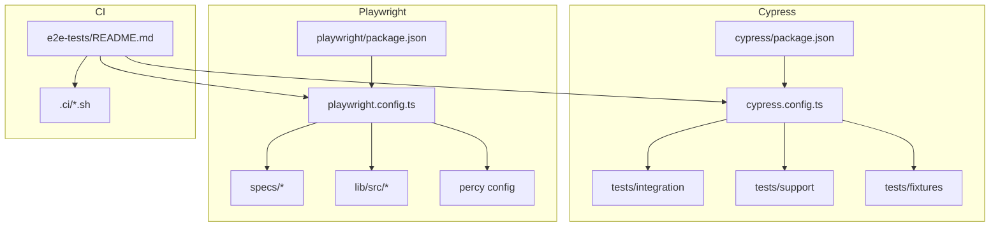
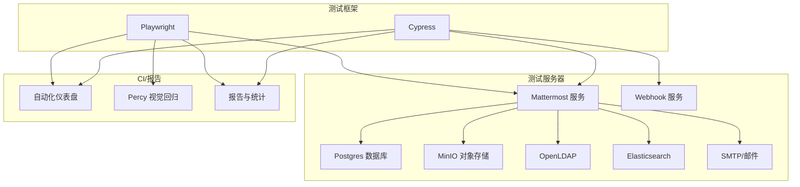
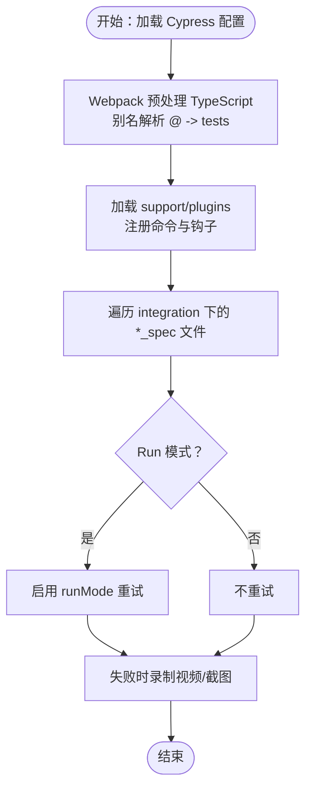
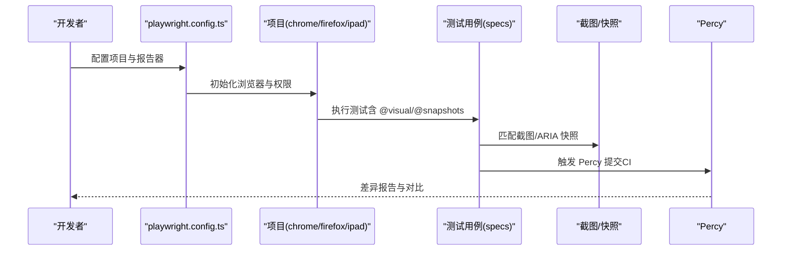
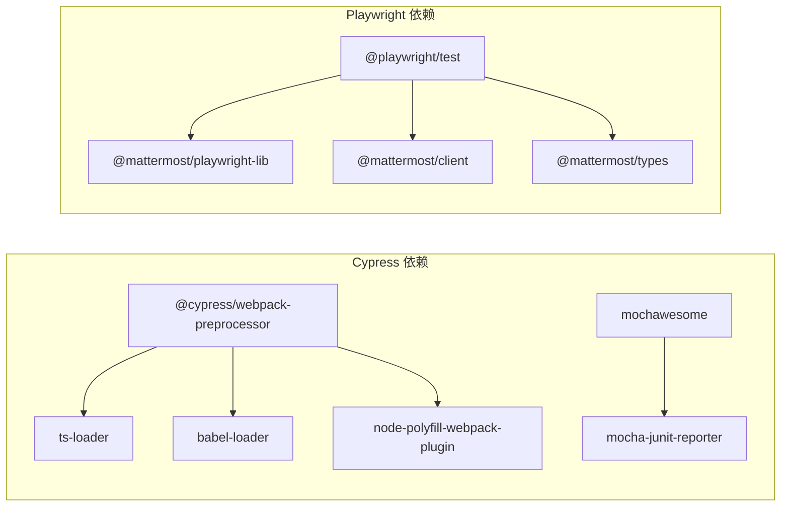

# 端到端测试

<cite>
**本文引用的文件**
- [e2e-tests/README.md](file://e2e-tests/README.md)
- [e2e-tests/cypress/README-Subpath.md](file://e2e-tests/cypress/README-Subpath.md)
- [e2e-tests/cypress/cypress.config.ts](file://e2e-tests/cypress/cypress.config.ts)
- [e2e-tests/cypress/package.json](file://e2e-tests/cypress/package.json)
- [e2e-tests/playwright/README.md](file://e2e-tests/playwright/README.md)
- [e2e-tests/playwright/playwright.config.ts](file://e2e-tests/playwright/playwright.config.ts)
- [e2e-tests/playwright/package.json](file://e2e-tests/playwright/package.json)
- [.github/e2e-tests-workflows.md](file://.github/e2e-tests-workflows.md)
</cite>

## 目录
1. [简介](#简介)
2. [项目结构](#项目结构)
3. [核心组件](#核心组件)
4. [架构总览](#架构总览)
5. [详细组件分析](#详细组件分析)
6. [依赖关系分析](#依赖关系分析)
7. [性能考量](#性能考量)
8. [故障排查指南](#故障排查指南)
9. [结论](#结论)
10. [附录](#附录)

## 简介
本指南面向 Mattermost Web 客户端的端到端测试实践，系统讲解以下内容：
- 使用 Cypress 编写测试用例、采用页面对象模式与测试数据管理
- 使用 Playwright 进行多浏览器支持、截图与视频录制
- 用户工作流测试：注册登录、频道创建、消息发送等核心业务场景
- 视觉回归测试：Percy 集成、屏幕截图比较与差异检测
- 可访问性测试：自动化可访问性扫描与最佳实践
- 测试环境配置：测试服务器启动、数据库初始化与环境变量设置
- 报告生成与结果分析：失败用例重试与统计分析
- 并行执行与分布式测试策略

## 项目结构
端到端测试由两套框架并行维护：
- Cypress：位于 e2e-tests/cypress，用于传统 Web 端到端测试与部分集成场景
- Playwright：位于 e2e-tests/playwright，用于现代浏览器测试、多项目并行、视觉与可访问性测试

关键目录与职责概览：
- e2e-tests/cypress
  - tests/integration：测试用例
  - tests/support：Cypress 支持脚本（命令、钩子）
  - tests/fixtures：测试数据
  - tests/plugins：自定义插件
  - cypress.config.ts：Cypress 配置
  - package.json：Cypress 脚本与依赖
- e2e-tests/playwright
  - specs：测试用例（functional、visual、accessibility、client）
  - lib：共享 UI 组件与工具库
  - playwright.config.ts：Playwright 配置（项目、超时、报告器）
  - package.json：Playwright 脚本与依赖
  - .percy.yml：Percy 配置（视觉回归）
- e2e-tests/.ci：CI 启动脚本与仪表盘集成
- 根级 e2e-tests/README.md：本地运行与流水线调试说明

图表来源
- [e2e-tests/cypress/cypress.config.ts:1-128](file://e2e-tests/cypress/cypress.config.ts#L1-L128)
- [e2e-tests/playwright/playwright.config.ts:1-87](file://e2e-tests/playwright/playwright.config.ts#L1-L87)
- [e2e-tests/cypress/package.json:1-110](file://e2e-tests/cypress/package.json#L1-L110)
- [e2e-tests/playwright/package.json:1-53](file://e2e-tests/playwright/package.json#L1-L53)
- [e2e-tests/README.md:1-75](file://e2e-tests/README.md#L1-L75)

章节来源
- [e2e-tests/README.md:1-75](file://e2e-tests/README.md#L1-L75)

## 核心组件
- Cypress 配置与生命周期
  - 基础配置：超时、重试、截图/视频、别名与预处理器
  - e2e 模式：specPattern、supportFile、baseUrl、测试隔离
  - Node 事件：Webpack 预处理 TypeScript 与别名解析
- Playwright 配置与项目矩阵
  - 全局设置：全局超时、重试、输出目录、workers
  - 项目：setup、chrome、firefox、ipad；依赖链确保初始化在各项目前完成
  - 报告器：HTML、JSON、JUnit、Blob（CI），仅失败保留截图与视频
- 测试运行脚本
  - Cypress：cypress:run、cypress:open、smoke、CI 聚合脚本
  - Playwright：test、test:ci、test:smoke、test:visual、percy:docker、playwright-ui

章节来源
- [e2e-tests/cypress/cypress.config.ts:1-128](file://e2e-tests/cypress/cypress.config.ts#L1-L128)
- [e2e-tests/playwright/playwright.config.ts:1-87](file://e2e-tests/playwright/playwright.config.ts#L1-L87)
- [e2e-tests/cypress/package.json:91-108](file://e2e-tests/cypress/package.json#L91-L108)
- [e2e-tests/playwright/package.json:6-30](file://e2e-tests/playwright/package.json#L6-L30)

## 架构总览
下图展示端到端测试的整体架构：测试框架（Cypress/Playwright）通过配置驱动，连接测试服务器与辅助服务（数据库、对象存储、LDAP、搜索、通知等），并在 CI 中与报告与可视化平台（如 Percy）集成。

图表来源
- [e2e-tests/cypress/cypress.config.ts:36-62](file://e2e-tests/cypress/cypress.config.ts#L36-L62)
- [e2e-tests/playwright/playwright.config.ts:14-86](file://e2e-tests/playwright/playwright.config.ts#L14-L86)
- [e2e-tests/README.md:17-48](file://e2e-tests/README.md#L17-L48)

## 详细组件分析

### Cypress：测试用例编写、页面对象与数据管理
- 页面对象模式
  - 在 tests/support 与 tests/plugins 中集中定义命令与钩子，避免在用例中直接操作 DOM
  - 使用 @ 别名指向 tests 目录，便于模块化组织
- 测试数据管理
  - tests/fixtures 存放静态数据；通过 cy.fixture 或 cy.task 注入
  - 通过 expose 配置注入数据库连接、第三方服务地址等环境参数
- 失败重试与录制
  - runMode 重试 1 次；开启视频与压缩；截图目录统一管理
- 子路径多服务器测试
  - 通过 baseURL 与 secondServerURL 支持双实例；需反向代理将同一域名映射至不同端口与子路径

图表来源
- [e2e-tests/cypress/cypress.config.ts:63-126](file://e2e-tests/cypress/cypress.config.ts#L63-L126)
- [e2e-tests/cypress/README-Subpath.md:1-133](file://e2e-tests/cypress/README-Subpath.md#L1-L133)

章节来源
- [e2e-tests/cypress/cypress.config.ts:1-128](file://e2e-tests/cypress/cypress.config.ts#L1-L128)
- [e2e-tests/cypress/README-Subpath.md:1-133](file://e2e-tests/cypress/README-Subpath.md#L1-L133)

### Playwright：多浏览器、截图与视频、项目矩阵
- 项目矩阵
  - setup：仅运行一次的初始化测试
  - chrome/firefox/ipad：覆盖主流浏览器与移动端视口
  - 依赖链：各项目依赖 setup，确保服务就绪
- 截图与视频
  - 仅失败保留截图与视频；阈值与动画禁用策略用于稳定视觉对比
- 可访问性快照
  - expect.toMatchAriaSnapshot 输出 ARIA 快照，便于可访问性回归
- 视觉测试与 Percy
  - 分离常规测试与视觉测试；视觉测试在独立容器中更新快照
  - percy:docker 在 Chrome/iPad 项目上运行 Percy 执行器

图表来源
- [e2e-tests/playwright/playwright.config.ts:14-86](file://e2e-tests/playwright/playwright.config.ts#L14-L86)
- [e2e-tests/playwright/README.md:87-182](file://e2e-tests/playwright/README.md#L87-L182)

章节来源
- [e2e-tests/playwright/playwright.config.ts:1-87](file://e2e-tests/playwright/playwright.config.ts#L1-L87)
- [e2e-tests/playwright/README.md:1-223](file://e2e-tests/playwright/README.md#L1-L223)

### 用户工作流测试：注册、登录、频道创建与消息发送
- 登录流程
  - 通过页面对象进入登录页，输入凭据并提交；断言登录成功后的主界面元素可见
- 注册与邀请
  - 通过管理员或邀请链接完成新用户注册；校验欢迎页与初始频道列表
- 频道创建
  - 导航至“创建频道”表单，填写名称与描述，断言频道出现在频道列表
- 消息发送
  - 在频道内输入文本/上传附件，断言消息出现在消息流且附件可打开
- 断言与稳定性
  - 使用显式等待与可见性断言；对动态内容进行隐藏或稳定后再截图

章节来源
- [e2e-tests/playwright/README.md:183-223](file://e2e-tests/playwright/README.md#L183-L223)

### 视觉回归测试：Percy 集成与差异检测
- 流水线分离
  - 常规测试排除 @visual 标签；视觉测试单独运行并使用 Chrome/iPad 项目
- 快照策略
  - 禁用动画、设定阈值与像素比；对动态内容进行隐藏以减少误报
- 更新快照
  - 严格在 Docker 容器中运行以保证一致性；支持 --update-snapshots 与 --update-source-method=overwrite
- Percy 执行
  - 通过 percy:docker 在指定项目上运行，需要设置 PERCY_TOKEN

章节来源
- [e2e-tests/playwright/README.md:87-182](file://e2e-tests/playwright/README.md#L87-L182)

### 可访问性测试：自动化扫描与最佳实践
- 优先使用可访问性定位器
  - getByRole、getByLabel、getText、getByPlaceholder；仅在必要时使用 data-testid
- ARIA 快照
  - expect.toMatchAriaSnapshot 输出 ARIA 结构快照，便于可访问性回归
- 测试组织
  - specs/accessibility 下按功能区组织；使用 @a11y 标签与文档注释

章节来源
- [e2e-tests/playwright/README.md:183-223](file://e2e-tests/playwright/README.md#L183-L223)

### 测试环境配置：服务器、数据库与环境变量
- 本地运行
  - 使用 e2e-tests/README.md 的 make 指令启动服务与测试；支持 Cypress/Playwright/none 三模式
  - 通过 .ci/env 设置 SERVER、TEST、ENABLED_DOCKER_SERVICES、MM_LICENSE 等
- 云环境
  - SERVER=cloud 时需先 make cloud-init 创建客户实例，再运行测试
- 子路径服务器
  - 通过反向代理将同一域名映射至不同端口与子路径；配置 cypress.json 的 baseURL 与 secondServerURL

章节来源
- [e2e-tests/README.md:17-48](file://e2e-tests/README.md#L17-L48)
- [e2e-tests/cypress/README-Subpath.md:1-133](file://e2e-tests/cypress/README-Subpath.md#L1-L133)

### 测试报告生成与结果分析：重试与统计
- Cypress
  - 通过 run_tests.js 聚合测试；生成 summary.json 记录 passed/failed/failed_expected
  - 多报告器：Mochawesome、JUnit、Multi-Reporters
- Playwright
  - HTML/JSON/JUnit/Blob（CI）；CI 模式启用 Blob 报告
  - 重试：CI 环境 run 重试 1 次，开发环境为 0
- 统计与仪表盘
  - 自动化仪表盘支持并行分片与进度跟踪；Cypress 当前使用，Playwright 未使用

章节来源
- [e2e-tests/README.md:32-48](file://e2e-tests/README.md#L32-L48)
- [e2e-tests/cypress/package.json:91-108](file://e2e-tests/cypress/package.json#L91-L108)
- [e2e-tests/playwright/playwright.config.ts:79-86](file://e2e-tests/playwright/playwright.config.ts#L79-L86)

### 并行执行与分布式测试策略
- 并行 workers
  - Playwright workers 数量由 testConfig.workers 控制
- 分布式运行
  - 通过自动化仪表盘分片；多台机器并行执行相同 BUILD_ID 与 BRANCH 的任务
  - 每台机器设置唯一 CI_BASE_URL 以区分实例
- 项目依赖
  - setup 项目先行，其他项目依赖其完成初始化，确保跨节点一致性

章节来源
- [e2e-tests/README.md:32-48](file://e2e-tests/README.md#L32-L48)
- [e2e-tests/playwright/playwright.config.ts:53-78](file://e2e-tests/playwright/playwright.config.ts#L53-L78)

## 依赖关系分析
- Cypress
  - 依赖 @cypress/webpack-preprocessor、ts-loader、babel-loader、node-polyfill-webpack-plugin
  - 依赖 mochawesome、mochawesome-merge、mochawesome-report-generator、mocha-junit-reporter
- Playwright
  - 依赖 @playwright/test、@mattermost/playwright-lib、@mattermost/client、@mattermost/types
  - 通过 workspaces 管理 lib 子包构建

图表来源
- [e2e-tests/cypress/package.json:3-82](file://e2e-tests/cypress/package.json#L3-L82)
- [e2e-tests/playwright/package.json:31-51](file://e2e-tests/playwright/package.json#L31-L51)

章节来源
- [e2e-tests/cypress/package.json:1-110](file://e2e-tests/cypress/package.json#L1-L110)
- [e2e-tests/playwright/package.json:1-53](file://e2e-tests/playwright/package.json#L1-L53)

## 性能考量
- 浏览器与视口
  - 固定视口尺寸与禁用媒体流权限，降低资源消耗
- 重试与超时
  - runMode 重试 1 次；合理设置 timeout 与 actionTimeout，避免过长等待
- 视觉测试
  - 关闭动画、降低阈值与像素比，提升对比稳定性
- 并行与分片
  - workers 与 CI 分片提升吞吐；注意数据库与对象存储的并发限制

## 故障排查指南
- 无法启动或连接服务器
  - 检查 .ci/env 中 SERVER、ENABLED_DOCKER_SERVICES、MM_LICENSE 是否正确
  - 云环境需先执行 cloud-init 再运行测试
- 子路径测试失败
  - 确认反向代理配置与 cypress.json 的 baseURL/secondServerURL 一致
- 视觉测试波动
  - 隐藏动态内容；在 Docker 容器中更新快照；检查 Percy_TOKEN 与项目权限
- 可访问性快照不匹配
  - 使用可访问性定位器替代 data-testid；检查 ARIA 结构变化
- 报告缺失或格式异常
  - 确认报告器配置；CI 环境启用 Blob 报告；检查输出目录权限

章节来源
- [e2e-tests/README.md:17-48](file://e2e-tests/README.md#L17-L48)
- [e2e-tests/cypress/README-Subpath.md:1-133](file://e2e-tests/cypress/README-Subpath.md#L1-L133)
- [e2e-tests/playwright/README.md:87-182](file://e2e-tests/playwright/README.md#L87-L182)

## 结论
本指南系统梳理了 Mattermost 端到端测试体系：Cypress 与 Playwright 的配置与使用、用户工作流与可访问性测试、视觉回归与 Percy 集成、环境配置与报告生成、以及并行与分布式策略。建议在团队内统一页面对象与断言规范，结合 CI 分离常规与视觉测试流水线，持续优化重试与超时策略，以获得更稳定高效的端到端测试体验。

## 附录
- GitHub Actions 端到端测试工作流参考：.github/e2e-tests-workflows.md
- Playwright 文档与页面对象模型：https://playwright.dev/docs/test-pom

章节来源
- [.github/e2e-tests-workflows.md](file://.github/e2e-tests-workflows.md)