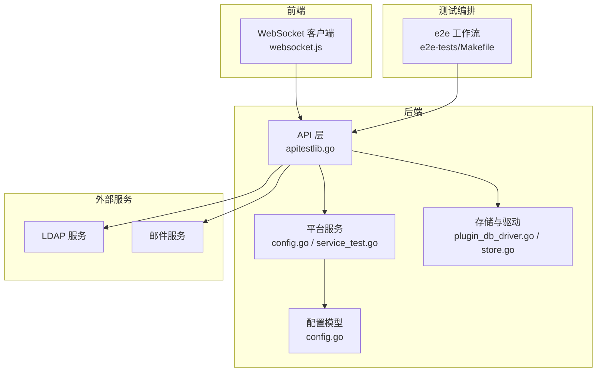
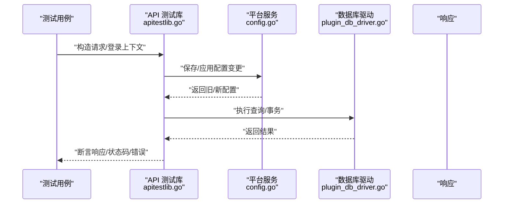
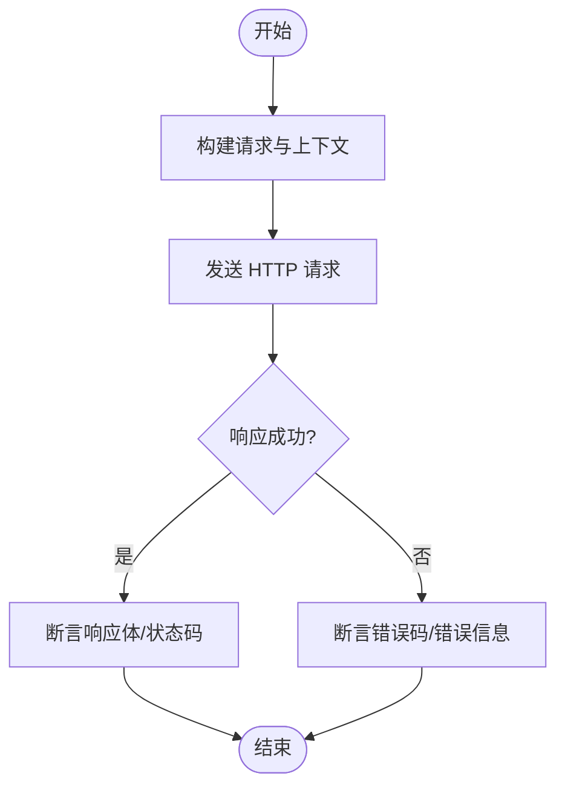
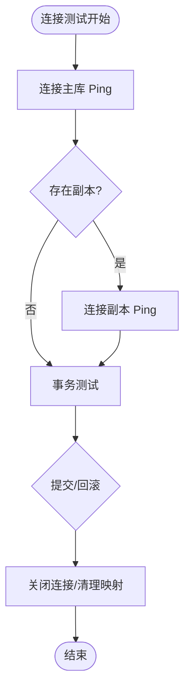
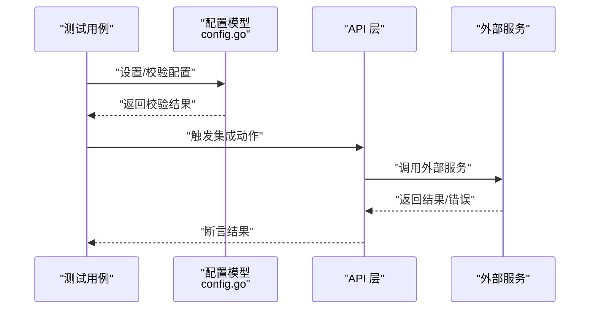
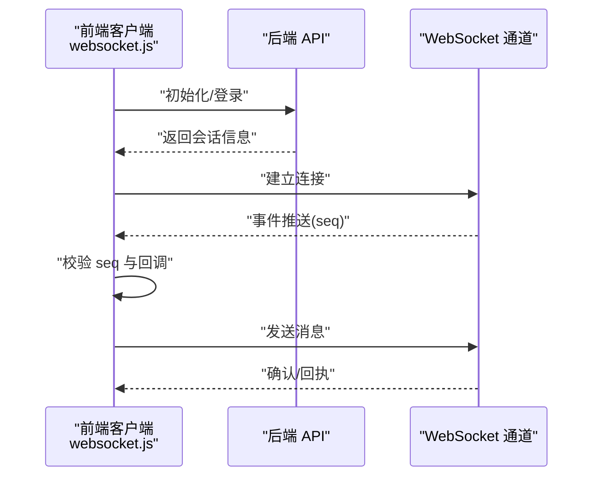
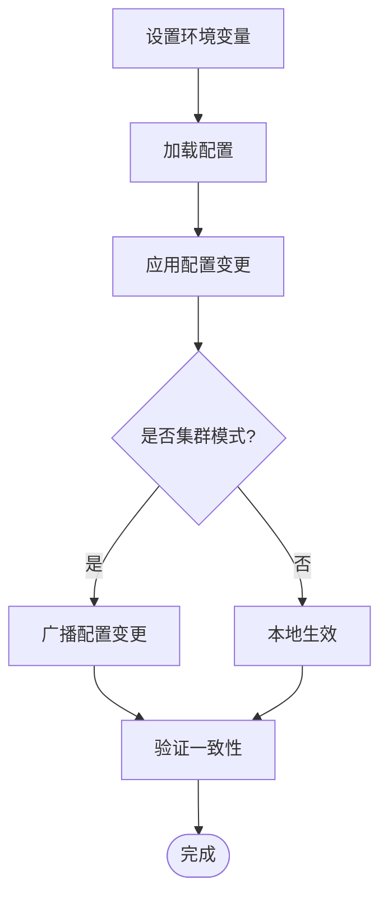
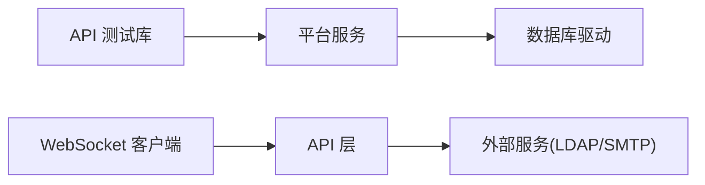

# 集成测试

<cite>
**本文引用的文件**
- [apitestlib.go](file://server/channels/api4/apitestlib.go)
- [apitestlib_test.go](file://server/channels/api4/apitestlib_test.go)
- [config_test.go](file://server/channels/api4/config_test.go)
- [ldap_test.go](file://server/channels/api4/ldap_test.go)
- [email_test.go](file://server/channels/app/email_test.go)
- [plugin_db_driver.go](file://server/channels/app/plugin_db_driver.go)
- [store.go](file://server/public/pluginapi/store.go)
- [config.go](file://server/public/model/config.go)
- [service_environment.go](file://server/public/model/service_environment.go)
- [config.go（mmctl）](file://server/cmd/mmctl/commands/config.go)
- [websocket.js](file://webapp/platform/client/lib/websocket.js)
- [websocket.test.js](file://webapp/platform/client/lib/websocket.test.js)
- [docker-compose.yaml](file://server/docker-compose.yaml)
- [Makefile（e2e-tests）](file://e2e-tests/Makefile)
- [README.md（e2e-tests）](file://e2e-tests/README.md)
- [config_test.go（平台）](file://server/channels/app/platform/config.go)
- [support_packet_test.go](file://server/channels/app/platform/support_packet_test.go)
- [service_test.go](file://server/channels/app/platform/service_test.go)
</cite>

## 目录
1. [引言](#引言)
2. [项目结构](#项目结构)
3. [核心组件](#核心组件)
4. [架构总览](#架构总览)
5. [详细组件分析](#详细组件分析)
6. [依赖关系分析](#依赖关系分析)
7. [性能考量](#性能考量)
8. [故障排查指南](#故障排查指南)
9. [结论](#结论)
10. [附录](#附录)

## 引言
本指南面向 Mattermost 的集成测试实践，系统阐述如何在真实或接近真实的运行环境中验证端到端行为。内容覆盖：
- API 集成测试：HTTP 请求模拟、响应校验与错误路径测试
- 数据库集成测试：连接测试、事务处理与一致性验证
- 外部服务集成测试：LDAP、邮件服务与第三方 API
- 服务间通信测试：WebSocket 连接、消息传递与事件处理
- 配置集成测试：环境变量、配置加载与动态更新
- 测试环境搭建：测试数据库、服务启动顺序与依赖管理
- 测试数据管理与清理：隔离性与纯净性保障

## 项目结构
Mattermost 的集成测试分布在多个层次：
- 后端 API 层：通过统一的测试库发起 HTTP 请求，验证路由、鉴权、业务逻辑与错误处理
- 平台层：负责配置加载、动态更新、环境变量解析与数据库连接状态
- 插件与存储：插件通过自定义驱动访问主从数据库，支持连接池、事务与语句缓存
- 前端客户端：WebSocket 客户端负责实时事件接收与序列号校验
- 端到端测试：基于 Cypress/Playwright 的 e2e 工作流与脚本

图示来源
- [apitestlib.go](file://server/channels/api4/apitestlib.go)
- [config.go（平台）](file://server/channels/app/platform/config.go)
- [plugin_db_driver.go](file://server/channels/app/plugin_db_driver.go)
- [store.go](file://server/public/pluginapi/store.go)
- [config.go](file://server/public/model/config.go)
- [websocket.js](file://webapp/platform/client/lib/websocket.js)
- [Makefile（e2e-tests）](file://e2e-tests/Makefile)

章节来源
- [apitestlib.go](file://server/channels/api4/apitestlib.go)
- [config.go（平台）](file://server/channels/app/platform/config.go)
- [plugin_db_driver.go](file://server/channels/app/plugin_db_driver.go)
- [store.go](file://server/public/pluginapi/store.go)
- [config.go](file://server/public/model/config.go)
- [websocket.js](file://webapp/platform/client/lib/websocket.js)
- [Makefile（e2e-tests）](file://e2e-tests/Makefile)

## 核心组件
- API 测试库：提供统一的 HTTP 请求构造、认证上下文设置与响应断言能力，便于编写可复用的集成测试
- 平台配置服务：负责配置持久化、集群广播、环境变量覆盖与清理；支持动态重载
- 存储与驱动：为插件提供主从数据库连接、事务与语句封装，内置连接生命周期管理
- WebSocket 客户端：负责事件序列号校验、网络状态监听与异常重连
- 外部服务适配：LDAP 与邮件配置校验与集成验证入口

章节来源
- [apitestlib.go](file://server/channels/api4/apitestlib.go)
- [config_test.go（平台）](file://server/channels/app/platform/config.go)
- [plugin_db_driver.go](file://server/channels/app/plugin_db_driver.go)
- [store.go](file://server/public/pluginapi/store.go)
- [websocket.js](file://webapp/platform/client/lib/websocket.js)

## 架构总览
下图展示一次典型 API 集成测试的调用链路，包括请求发起、平台配置处理、数据库访问与响应返回。

图示来源
- [apitestlib.go](file://server/channels/api4/apitestlib.go)
- [config_test.go（平台）](file://server/channels/app/platform/config.go)
- [plugin_db_driver.go](file://server/channels/app/plugin_db_driver.go)

## 详细组件分析

### API 集成测试
- 请求模拟与上下文
  - 使用统一的测试库构造 HTTP 请求，设置认证头与请求体
  - 支持多用户上下文切换，便于跨角色场景验证
- 响应验证
  - 断言状态码、响应体字段与分页参数
  - 对于错误场景，断言错误码与错误信息
- 错误处理测试
  - 覆盖鉴权失败、权限不足、参数非法等典型错误路径
  - 验证错误响应结构与日志记录

章节来源
- [apitestlib.go](file://server/channels/api4/apitestlib.go)
- [apitestlib_test.go](file://server/channels/api4/apitestlib_test.go)

### 数据库集成测试
- 连接测试
  - 验证主库与只读副本连接可用性，检查连接池统计
  - 使用驱动封装进行连接 Ping，确保可达性
- 事务处理
  - 通过驱动封装开启事务、提交与回滚，验证原子性
  - 结合插件 ID 进行连接生命周期管理，避免泄漏
- 一致性验证
  - 在事务内执行读写操作，断言最终一致性
  - 检查连接关闭与回收计数，确保资源释放

图示来源
- [plugin_db_driver.go](file://server/channels/app/plugin_db_driver.go)
- [store.go](file://server/public/pluginapi/store.go)

章节来源
- [plugin_db_driver.go](file://server/channels/app/plugin_db_driver.go)
- [store.go](file://server/public/pluginapi/store.go)
- [support_packet_test.go](file://server/channels/app/platform/support_packet_test.go)

### 外部服务集成测试
- LDAP 服务测试
  - 验证 LDAP 配置项合法性与连接参数
  - 执行用户同步、组映射与认证流程
- 邮件服务测试
  - 校验邮件配置有效性与批量发送参数
  - 触发邮件发送流程，验证模板渲染与队列处理
- 第三方 API 集成验证
  - 针对 OAuth 提供商、Webhook 回调等场景进行端到端验证

图示来源
- [config.go](file://server/public/model/config.go)
- [ldap_test.go](file://server/channels/api4/ldap_test.go)
- [email_test.go](file://server/channels/app/email_test.go)

章节来源
- [config.go](file://server/public/model/config.go)
- [ldap_test.go](file://server/channels/api4/ldap_test.go)
- [email_test.go](file://server/channels/app/email_test.go)

### 服务间通信测试
- WebSocket 连接测试
  - 初始化客户端，注册在线/离线事件监听
  - 断言连接建立、心跳与异常重连
- 消息传递验证
  - 发送/接收消息，校验序列号递增与乱序处理
- 事件处理测试
  - 订阅频道事件，验证事件类型与负载完整性

图示来源
- [websocket.js](file://webapp/platform/client/lib/websocket.js)
- [websocket.test.js](file://webapp/platform/client/lib/websocket.test.js)

章节来源
- [websocket.js](file://webapp/platform/client/lib/websocket.js)
- [websocket.test.js](file://webapp/platform/client/lib/websocket.test.js)

### 配置集成测试
- 环境变量测试
  - 设置服务环境变量，验证其被正确识别与应用
- 配置加载验证
  - 读取配置快照，断言关键字段存在且合法
- 动态配置更新测试
  - 通过命令行或 API 更新配置，触发平台服务广播与重载
  - 验证集群内配置一致性与回滚机制

图示来源
- [service_environment.go](file://server/public/model/service_environment.go)
- [config_test.go（平台）](file://server/channels/app/platform/config.go)
- [config.go（mmctl）](file://server/cmd/mmctl/commands/config.go)

章节来源
- [service_environment.go](file://server/public/model/service_environment.go)
- [config_test.go（平台）](file://server/channels/app/platform/config.go)
- [config.go（mmctl）](file://server/cmd/mmctl/commands/config.go)

## 依赖关系分析
- 组件耦合
  - API 测试库依赖平台配置服务以获取当前配置与环境变量
  - 存储驱动依赖平台服务提供的数据库连接工厂
  - WebSocket 客户端依赖后端 API 提供的连接与事件通道
- 外部依赖
  - LDAP 与邮件服务作为黑盒依赖，通过配置校验与端到端调用来验证
- 循环依赖
  - 当前设计避免直接循环依赖，通过接口与服务抽象解耦

图示来源
- [apitestlib.go](file://server/channels/api4/apitestlib.go)
- [config_test.go（平台）](file://server/channels/app/platform/config.go)
- [plugin_db_driver.go](file://server/channels/app/plugin_db_driver.go)
- [websocket.js](file://webapp/platform/client/lib/websocket.js)

章节来源
- [apitestlib.go](file://server/channels/api4/apitestlib.go)
- [config_test.go（平台）](file://server/channels/app/platform/config.go)
- [plugin_db_driver.go](file://server/channels/app/plugin_db_driver.go)
- [websocket.js](file://webapp/platform/client/lib/websocket.js)

## 性能考量
- 连接池与超时
  - 合理设置数据库连接池大小与最大空闲时间，避免并发峰值下的连接耗尽
  - 为长查询设置超时，防止阻塞影响整体吞吐
- 事务粒度
  - 将高冲突写操作拆分为小事务，降低锁竞争
- 缓存与批处理
  - 对高频读取启用只读副本，减少主库压力
  - 批量处理邮件与导入任务，降低瞬时负载

## 故障排查指南
- 配置错误
  - 使用配置校验函数定位非法字段，结合错误码快速定位问题
  - 通过平台服务描述配置快照，比对期望值
- 数据库连接问题
  - 检查主从连接 Ping 与连接池统计，确认连接可用性
  - 关注连接关闭与回收计数，排查泄漏
- WebSocket 异常
  - 校验事件序列号，出现不一致时触发重连与状态重置
  - 检查网络事件监听器注册与清理
- 端到端测试失败
  - 查看 e2e 工作流日志，确认服务启动顺序与依赖可用性

章节来源
- [config.go](file://server/public/model/config.go)
- [support_packet_test.go](file://server/channels/app/platform/support_packet_test.go)
- [websocket.js](file://webapp/platform/client/lib/websocket.js)
- [README.md（e2e-tests）](file://e2e-tests/README.md)

## 结论
通过以上体系化的集成测试实践，可以在接近生产环境的条件下验证 Mattermost 的核心功能与可靠性。建议在 CI 中固定运行关键集成测试套件，并结合端到端测试覆盖用户路径，持续保障质量与稳定性。

## 附录

### 测试环境搭建指南
- 测试数据库准备
  - 使用容器化 PostgreSQL，初始化测试数据库与用户
  - 配置主从副本与只读副本，满足读写分离场景
- 服务启动顺序
  - 先启动数据库，再启动 Mattermost 服务，最后启动前端
  - 确保外部服务（LDAP/邮件）可用后再运行相关集成测试
- 依赖管理
  - 使用编排文件统一管理服务依赖与网络
  - 在 CI 中预热镜像，缩短启动时间

章节来源
- [docker-compose.yaml](file://server/docker-compose.yaml)
- [Makefile（e2e-tests）](file://e2e-tests/Makefile)
- [README.md（e2e-tests）](file://e2e-tests/README.md)

### 测试数据管理与清理策略
- 隔离性
  - 为每个测试用例创建独立的团队/频道/用户，避免交叉污染
  - 使用随机化标识符与命名空间，降低冲突概率
- 清理
  - 在测试结束后删除临时对象，回滚事务或重置数据库状态
  - 对于外部服务，清理测试账户与临时数据
- 纯净性
  - 在测试前后对比配置快照，确保无残留变更
  - 对于配置更新测试，验证回滚与一致性

章节来源
- [service_test.go](file://server/channels/app/platform/service_test.go)
- [support_packet_test.go](file://server/channels/app/platform/support_packet_test.go)