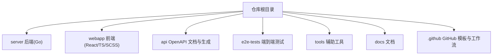
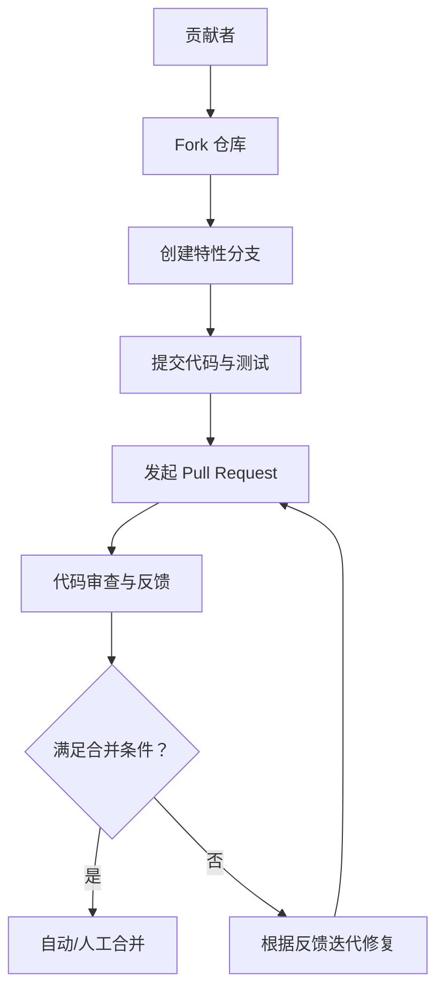
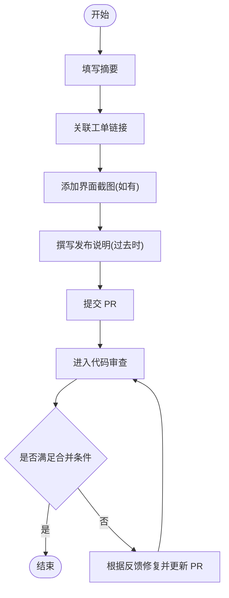
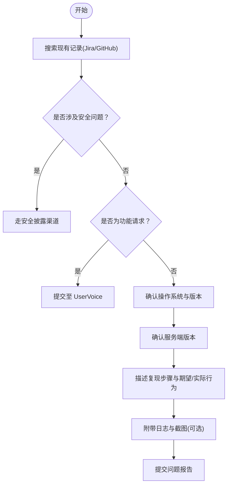
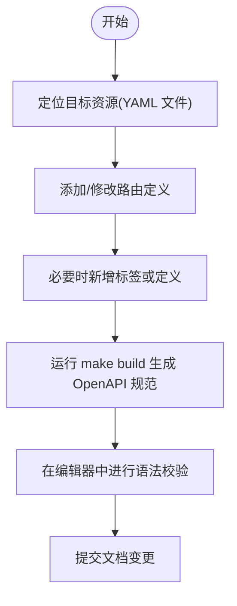
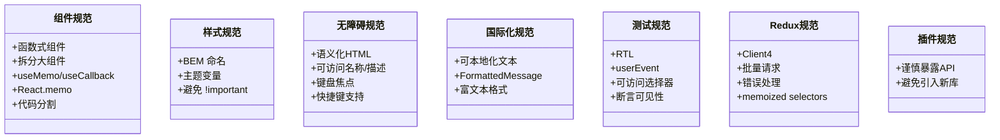
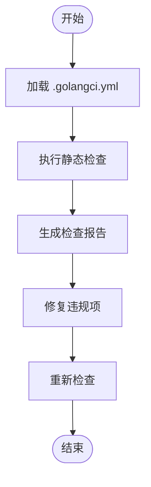
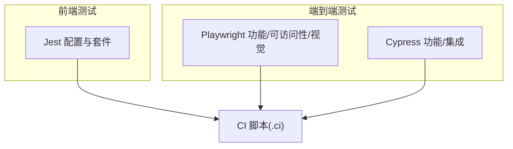
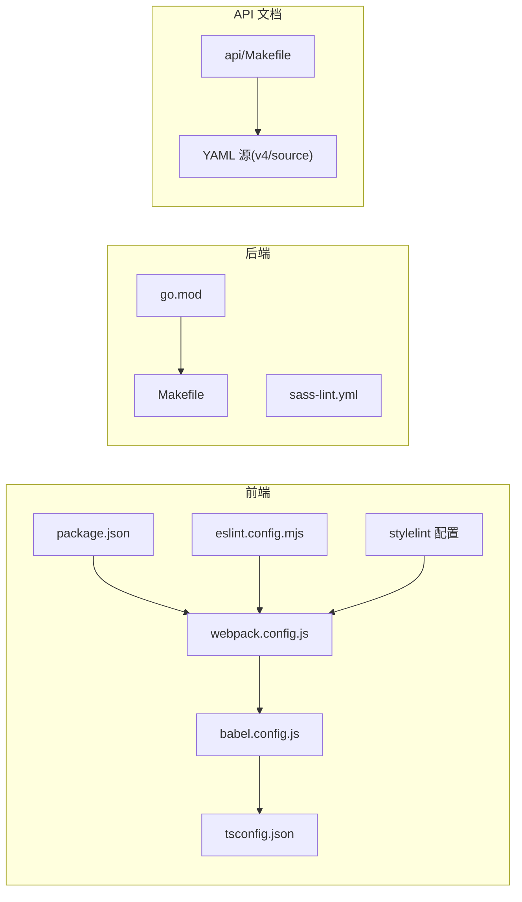

# 贡献指南

<cite>
**本文引用的文件**
- [CONTRIBUTING.md](file://CONTRIBUTING.md)
- [.github/PULL_REQUEST_TEMPLATE.md](file://.github/PULL_REQUEST_TEMPLATE.md)
- [.github/ISSUE_TEMPLATE.md](file://.github/ISSUE_TEMPLATE.md)
- [api/CONTRIBUTING.md](file://api/CONTRIBUTING.md)
- [webapp/STYLE_GUIDE.md](file://webapp/STYLE_GUIDE.md)
- [server/.golangci.yml](file://server/.golangci.yml)
- [e2e-tests/README.md](file://e2e-tests/README.md)
- [e2e-tests/playwright/README.md](file://e2e-tests/playwright/README.md)
- [e2e-tests/cypress/README-Subpath.md](file://e2e-tests/cypress/README-Subpath.md)
- [e2e-tests/playwright/eslint.config.mjs](file://e2e-tests/playwright/eslint.config.mjs)
- [e2e-tests/cypress/eslint.config.mjs](file://e2e-tests/cypress/eslint.config.mjs)
- [webapp/.eslintrc.json](file://webapp/.eslintrc.json)
- [webapp/.stylelintrc.json](file://webapp/.stylelintrc.json)
- [server/go.mod](file://server/go.mod)
- [webapp/package.json](file://webapp/package.json)
- [api/Makefile](file://api/Makefile)
- [server/Makefile](file://server/Makefile)
- [webapp/Makefile](file://webapp/Makefile)
- [e2e-tests/Makefile](file://e2e-tests/Makefile)
- [SECURITY.md](file://SECURITY.md)
- [README.md](file://README.md)
- [api/README.md](file://api/README.md)
- [docs/README.md](file://docs/README.md)
- [docs/接口梳理.md](file://docs/接口梳理.md)
- [e2e-tests/playwright/tsconfig.json](file://e2e-tests/playwright/tsconfig.json)
- [e2e-tests/cypress/tsconfig.json](file://e2e-tests/cypress/tsconfig.json)
- [webapp/tsconfig.json](file://webapp/tsconfig.json)
- [server/.sass-lint.yml](file://server/.sass-lint.yml)
- [webapp/.npmrc](file://webapp/.npmrc)
- [server/config.mk](file://server/config.mk)
- [webapp/config.mk](file://webapp/config.mk)
- [server/docker-compose.yaml](file://server/docker-compose.yaml)
- [webapp/webpack.config.js](file://webapp/webpack.config.js)
- [webapp/babel.config.js](file://webapp/babel.config.js)
- [webapp/jest.config.js](file://webapp/jest.config.js)
- [webapp/platform/client/jest.config.js](file://webapp/platform/client/jest.config.js)
- [webapp/platform/components/jest.config.js](file://webapp/platform/components/jest.config.js)
- [webapp/platform/shared/jest.config.js](file://webapp/platform/shared/jest.config.js)
- [webapp/channels/jest.config.js](file://webapp/channels/jest.config.js)
- [webapp/channels/jest.config.mattermost-redux.js](file://webapp/channels/jest.config.mattermost-redux.js)
- [webapp/channels/jest.config.channels.js](file://webapp/channels/jest.config.channels.js)
- [webapp/platform/client/jest.config.js](file://webapp/platform/client/jest.config.js)
- [webapp/platform/components/jest.config.js](file://webapp/platform/components/jest.config.js)
- [webapp/platform/shared/jest.config.js](file://webapp/platform/shared/jest.config.js)
- [webapp/channels/jest.config.js](file://webapp/channels/jest.config.js)
- [webapp/channels/jest.config.mattermost-redux.js](file://webapp/channels/jest.config.mattermost-redux.js)
- [webapp/channels/jest.config.channels.js](file://webapp/channels/jest.config.channels.js)
- [e2e-tests/playwright/playwright.config.ts](file://e2e-tests/playwright/playwright.config.ts)
- [e2e-tests/cypress/cypress.config.ts](file://e2e-tests/cypress/cypress.config.ts)
- [e2e-tests/playwright/reporter-config.json](file://e2e-tests/playwright/reporter-config.json)
- [e2e-tests/cypress/reporter-config.json](file://e2e-tests/cypress/reporter-config.json)
- [e2e-tests/playwright/global_setup.ts](file://e2e-tests/playwright/global_setup.ts)
- [e2e-tests/cypress/plugins/index.js](file://e2e-tests/cypress/plugins/index.js)
- [e2e-tests/playwright/lib/src/package.json](file://e2e-tests/playwright/lib/src/package.json)
- [e2e-tests/playwright/lib/src/tsconfig.json](file://e2e-tests/playwright/lib/src/tsconfig.json)
- [e2e-tests/playwright/lib/src/rollup.config.js](file://e2e-tests/playwright/lib/src/rollup.config.js)
- [e2e-tests/playwright/script/lint-test-docs.js](file://e2e-tests/playwright/script/lint-test-docs.js)
- [e2e-tests/playwright/script/README.md](file://e2e-tests/playwright/script/README.md)
- [e2e-tests/playwright/.percy.yml](file://e2e-tests/playwright/.percy.yml)
- [e2e-tests/playwright/.prettierrc.json](file://e2e-tests/playwright/.prettierrc.json)
- [e2e-tests/playwright/.prettierignore](file://e2e-tests/playwright/.prettierignore)
- [e2e-tests/playwright/.gitignore](file://e2e-tests/playwright/.gitignore)
- [e2e-tests/playwright/merge.config.mjs](file://e2e-tests/playwright/merge.config.mjs)
- [e2e-tests/playwright/mock_libre_translate.js](file://e2e-tests/playwright/mock_libre_translate.js)
- [e2e-tests/playwright/sample.env](file://e2e-tests/playwright/sample.env)
- [e2e-tests/playwright/report.webhookgen.js](file://e2e-tests/playwright/report.webhookgen.js)
- [e2e-tests/playwright/specs/test_setup.ts](file://e2e-tests/playwright/specs/test_setup.ts)
- [e2e-tests/playwright/specs/functional/](file://e2e-tests/playwright/specs/functional/)
- [e2e-tests/playwright/specs/accessibility/](file://e2e-tests/playwright/specs/accessibility/)
- [e2e-tests/playwright/specs/visual/](file://e2e-tests/playwright/specs/visual/)
- [e2e-tests/cypress/tests/integration/](file://e2e-tests/cypress/tests/integration/)
- [e2e-tests/cypress/tests/fixtures/](file://e2e-tests/cypress/tests/fixtures/)
- [e2e-tests/cypress/tests/support/](file://e2e-tests/cypress/tests/support/)
- [e2e-tests/cypress/tests/types/](file://e2e-tests/cypress/tests/types/)
- [e2e-tests/cypress/utils/artifacts.js](file://e2e-tests/cypress/utils/artifacts.js)
- [e2e-tests/cypress/utils/constants.js](file://e2e-tests/cypress/utils/constants.js)
- [e2e-tests/cypress/utils/dashboard.js](file://e2e-tests/cypress/utils/dashboard.js)
- [e2e-tests/cypress/utils/even_distribution.js](file://e2e-tests/cypress/utils/even_distribution.js)
- [e2e-tests/cypress/utils/file.js](file://e2e-tests/cypress/utils/file.js)
- [e2e-tests/cypress/utils/report.js](file://e2e-tests/cypress/utils/report.js)
- [e2e-tests/cypress/utils/test_cases.js](file://e2e-tests/cypress/utils/test_cases.js)
- [e2e-tests/cypress/utils/webhook_utils.js](file://e2e-tests/cypress/utils/webhook_utils.js)
- [e2e-tests/cypress/utils/even_distribution.test.js](file://e2e-tests/cypress/utils/even_distribution.test.js)
- [e2e-tests/.ci/](file://e2e-tests/.ci/)
- [e2e-tests/.ci/dashboard.entrypoint.sh](file://e2e-tests/.ci/dashboard.entrypoint.sh)
- [e2e-tests/.ci/dashboard.generate_test_cycle.sh](file://e2e-tests/.ci/dashboard.generate_test_cycle.sh)
- [e2e-tests/.ci/dashboard.start.sh](file://e2e-tests/.ci/dashboard.start.sh)
- [e2e-tests/.ci/dashboard.stop.sh](file://e2e-tests/.ci/dashboard.stop.sh)
- [e2e-tests/.ci/server.run_cypress.sh](file://e2e-tests/.ci/server.run_cypress.sh)
- [e2e-tests/.ci/server.run_playwright.sh](file://e2e-tests/.ci/server.run_playwright.sh)
- [e2e-tests/.ci/server.run_specs.sh](file://e2e-tests/.ci/server.run_specs.sh)
- [e2e-tests/.ci/server.run_test.sh](file://e2e-tests/.ci/server.run_test.sh)
- [e2e-tests/.ci/server.start.sh](file://e2e-tests/.ci/server.start.sh)
- [e2e-tests/.ci/server.stop.sh](file://e2e-tests/.ci/server.stop.sh)
- [e2e-tests/.ci/report.collect.sh](file://e2e-tests/.ci/report.collect.sh)
- [e2e-tests/.ci/report.publish.sh](file://e2e-tests/.ci/report.publish.sh)
- [e2e-tests/.ci/server.cloud_init.sh](file://e2e-tests/.ci/server.cloud_init.sh)
- [e2e-tests/.ci/server.cloud_teardown.sh](file://e2e-tests/.ci/server.cloud_teardown.sh)
- [e2e-tests/.ci/server.prepare.sh](file://e2e-tests/.ci/server.prepare.sh)
- [e2e-tests/.ci/server.generate.sh](file://e2e-tests/.ci/server.generate.sh)
- [e2e-tests/.ci/dashboard.override.yml](file://e2e-tests/.ci/dashboard.override.yml)
- [e2e-tests/.ci/dashboard.stop.sh](file://e2e-tests/.ci/dashboard.stop.sh)
- [e2e-tests/.ci/dashboard.start.sh](file://e2e-tests/.ci/dashboard.start.sh)
- [e2e-tests/.ci/dashboard.entrypoint.sh](file://e2e-tests/.ci/dashboard.entrypoint.sh)
- [e2e-tests/.ci/dashboard.generate_test_cycle.sh](file://e2e-tests/.ci/dashboard.generate_test_cycle.sh)
- [e2e-tests/.ci/server.run_cypress.sh](file://e2e-tests/.ci/server.run_cypress.sh)
- [e2e-tests/.ci/server.run_playwright.sh](file://e2e-tests/.ci/server.run_playwright.sh)
- [e2e-tests/.ci/server.run_specs.sh](file://e2e-tests/.ci/server.run_specs.sh)
- [e2e-tests/.ci/server.run_test.sh](file://e2e-tests/.ci/server.run_test.sh)
- [e2e-tests/.ci/server.start.sh](file://e2e-tests/.ci/server.start.sh)
- [e2e-tests/.ci/server.stop.sh](file://e2e-tests/.ci/server.stop.sh)
- [e2e-tests/.ci/report.collect.sh](file://e2e-tests/.ci/report.collect.sh)
- [e2e-tests/.ci/report.publish.sh](file://e2e-tests/.ci/report.publish.sh)
- [e2e-tests/.ci/server.cloud_init.sh](file://e2e-tests/.ci/server.cloud_init.sh)
- [e2e-tests/.ci/server.cloud_teardown.sh](file://e2e-tests/.ci/server.cloud_teardown.sh)
- [e2e-tests/.ci/server.prepare.sh](file://e2e-tests/.ci/server.prepare.sh)
- [e2e-tests/.ci/server.generate.sh](file://e2e-tests/.ci/server.generate.sh)
- [e2e-tests/.ci/dashboard.override.yml](file://e2e-tests/.ci/dashboard.override.yml)
</cite>

## 目录
1. 引言
2. 项目结构
3. 核心组件
4. 架构总览
5. 详细组件分析
6. 依赖关系分析
7. 性能考虑
8. 故障排查指南
9. 结论
10. 附录

## 引言
本指南面向所有希望为 Mattermost 做出贡献的开发者，覆盖从 Fork 与分支管理、提交与 PR 流程，到代码规范、测试要求、问题报告、文档贡献、社区行为准则、项目治理与新贡献者入门等全流程内容。仓库中已包含官方贡献入口与模板，建议优先参考官方链接以获得最新流程。

- 官方贡献入口与流程：[CONTRIBUTING.md:1-8](file://CONTRIBUTING.md#L1-L8)
- 官方安全披露政策：[SECURITY.md](file://SECURITY.md)
- 项目总体说明：[README.md](file://README.md)

章节来源
- [CONTRIBUTING.md:1-8](file://CONTRIBUTING.md#L1-L8)
- [SECURITY.md](file://SECURITY.md)
- [README.md](file://README.md)

## 项目结构
仓库采用多模块组织方式：
- server：后端服务（Go），包含核心业务逻辑、API 层、数据库层、作业系统、企业版扩展等。
- webapp：前端应用（React/TypeScript/SCSS），包含平台组件、Redux 状态管理、国际化、构建与测试配置。
- api：OpenAPI 文档与生成工具，基于 YAML 描述 API，并可生成 OpenAPI 规范。
- e2e-tests：端到端测试（Playwright/Cypress），包含可访问性、功能、视觉回归等测试套件及 CI 辅助脚本。
- tools：辅助工具集，如自定义 Go 静态检查工具等。
- docs：文档与接口梳理资料。
- .github：GitHub 模板与工作流相关文件。

下图给出概念性结构示意（非特定源码映射）：

## 核心组件
本节聚焦贡献流程中的关键环节与规范依据。

- 提交与 PR 流程
  - 使用统一的 PR 模板，确保摘要、工单链接、截图、发布说明等字段齐备。
  - 参考模板路径：[PR 模板:1-37](file://.github/PULL_REQUEST_TEMPLATE.md#L1-L37)

- 问题报告与模板
  - 提交 Bug 前请先检索现有 Jira/GitHub 记录；涉及安全问题请走安全披露渠道；功能请求与故障排查请使用指定渠道。
  - 参考模板路径：[问题模板:1-35](file://.github/ISSUE_TEMPLATE.md#L1-L35)

- API 文档贡献
  - API 文档由 YAML 维护，按资源分类存放；新增路由需放入对应文件，标签与定义需在指定文件中维护。
  - 参考路径：[API 贡献指南:1-14](file://api/CONTRIBUTING.md#L1-L14)

- 前端样式与测试规范
  - Web 应用遵循严格的样式与测试指南，涵盖 React 组件结构、样式命名、无障碍、国际化、测试框架与断言策略等。
  - 参考路径：[Web 样式指南:1-154](file://webapp/STYLE_GUIDE.md#L1-L154)

- 后端静态检查与风格
  - 使用 golangci-lint 进行静态检查，配置文件定义了启用/禁用规则、排除路径与格式化器。
  - 参考路径：[golangci 配置:1-285](file://server/.golangci.yml#L1-L285)

- 测试与覆盖率
  - 前端 Jest 配置与测试套件分布于多个包；e2e-tests 提供 Playwright/Cypress 测试与 CI 脚本；覆盖率与报告收集通过 CI 工具链完成。
  - 参考路径：[e2e-tests 总览](file://e2e-tests/README.md)，[Playwright 说明](file://e2e-tests/playwright/README.md)，[Cypress 子路径说明](file://e2e-tests/cypress/README-Subpath.md)

章节来源
- [.github/PULL_REQUEST_TEMPLATE.md:1-37](file://.github/PULL_REQUEST_TEMPLATE.md#L1-L37)
- [.github/ISSUE_TEMPLATE.md:1-35](file://.github/ISSUE_TEMPLATE.md#L1-L35)
- [api/CONTRIBUTING.md:1-14](file://api/CONTRIBUTING.md#L1-L14)
- [webapp/STYLE_GUIDE.md:1-154](file://webapp/STYLE_GUIDE.md#L1-L154)
- [server/.golangci.yml:1-285](file://server/.golangci.yml#L1-L285)
- [e2e-tests/README.md](file://e2e-tests/README.md)
- [e2e-tests/playwright/README.md](file://e2e-tests/playwright/README.md)
- [e2e-tests/cypress/README-Subpath.md](file://e2e-tests/cypress/README-Subpath.md)

## 架构总览
下图展示贡献流程的关键参与者与交互关系（概念图，不直接映射具体源码文件）：

## 详细组件分析

### 贡献流程与 PR 模板
- PR 模板强制填写摘要、工单链接、截图与发布说明，确保变更透明且可追踪。
- 发布说明必须使用过去时态，若无用户可见影响则填写“NONE”。

章节来源
- [.github/PULL_REQUEST_TEMPLATE.md:1-37](file://.github/PULL_REQUEST_TEMPLATE.md#L1-L37)

### 问题报告与模板
- 提交前务必搜索现有记录，避免重复；安全问题走安全披露通道；功能请求与故障排查使用指定渠道。
- 模板字段覆盖步骤复现、操作系统、服务端版本、预期/实际行为、日志输出与附加信息等。

章节来源
- [.github/ISSUE_TEMPLATE.md:1-35](file://.github/ISSUE_TEMPLATE.md#L1-L35)

### API 文档贡献
- 文档以 YAML 维护，按资源分类存放；新增路由需放入对应文件，标签与定义需在指定文件中维护。
- 可通过 Makefile 构建生成 OpenAPI 规范，便于语法校验与集成。

章节来源
- [api/CONTRIBUTING.md:1-14](file://api/CONTRIBUTING.md#L1-L14)
- [api/Makefile](file://api/Makefile)

### 前端样式与测试规范
- React 组件结构：函数式组件优先、拆分大组件、使用 hooks、回调与对象传递使用 useMemo/useCallback、按需 memo 化。
- 样式与主题：组件内联样式文件、BEM 风格命名、避免 !important、使用主题变量。
- 无障碍：优先语义化 HTML、提供可访问名称与描述、键盘焦点可见与可预测、支持不同键盘布局与平台快捷键。
- 国际化：所有 UI 文本可本地化，优先使用 FormattedMessage，避免组合翻译字符串。
- 测试：使用 React Testing Library（RTL），避免快照测试，优先可访问选择器与 userEvent；异步交互需等待；尽量模拟真实用户操作。
- Redux 与数据获取：统一使用 Client4 单例、批量网络请求、错误处理标准化、memoized selectors。
- 插件开发：谨慎暴露 API，避免引入新第三方库。

章节来源
- [webapp/STYLE_GUIDE.md:1-154](file://webapp/STYLE_GUIDE.md#L1-L154)

### 后端静态检查与风格
- golangci-lint 默认启用多项检查，同时对特定包/路径进行禁用或排除，确保与项目既有模式兼容。
- 格式化器启用 gofmt 与 goimports，并对 interface{} 到 any 的重写规则进行定制。

章节来源
- [server/.golangci.yml:1-285](file://server/.golangci.yml#L1-L285)

### 测试要求与执行
- 前端测试
  - 多个包拥有独立的 Jest 配置，覆盖客户端、组件、共享模块与频道包。
  - 参考路径：[webapp/jest 配置集合](file://webapp/jest.config.js) 及各子包配置。
- 端到端测试
  - Playwright 与 Cypress 并行存在，分别用于功能、可访问性与视觉回归测试。
  - 配置文件与报告工具位于各自目录，CI 脚本位于 e2e-tests/.ci。
  - 参考路径：[playwright 配置](file://e2e-tests/playwright/playwright.config.ts)，[cypress 配置](file://e2e-tests/cypress/cypress.config.ts)，[CI 脚本](file://e2e-tests/.ci/)。

章节来源
- [webapp/jest.config.js](file://webapp/jest.config.js)
- [webapp/platform/client/jest.config.js](file://webapp/platform/client/jest.config.js)
- [webapp/platform/components/jest.config.js](file://webapp/platform/components/jest.config.js)
- [webapp/platform/shared/jest.config.js](file://webapp/platform/shared/jest.config.js)
- [webapp/channels/jest.config.js](file://webapp/channels/jest.config.js)
- [webapp/channels/jest.config.mattermost-redux.js](file://webapp/channels/jest.config.mattermost-redux.js)
- [webapp/channels/jest.config.channels.js](file://webapp/channels/jest.config.channels.js)
- [e2e-tests/playwright/playwright.config.ts](file://e2e-tests/playwright/playwright.config.ts)
- [e2e-tests/cypress/cypress.config.ts](file://e2e-tests/cypress/cypress.config.ts)
- [e2e-tests/.ci/server.run_cypress.sh](file://e2e-tests/.ci/server.run_cypress.sh)
- [e2e-tests/.ci/server.run_playwright.sh](file://e2e-tests/.ci/server.run_playwright.sh)
- [e2e-tests/.ci/server.run_specs.sh](file://e2e-tests/.ci/server.run_specs.sh)
- [e2e-tests/.ci/server.run_test.sh](file://e2e-tests/.ci/server.run_test.sh)
- [e2e-tests/.ci/server.start.sh](file://e2e-tests/.ci/server.start.sh)
- [e2e-tests/.ci/server.stop.sh](file://e2e-tests/.ci/server.stop.sh)
- [e2e-tests/.ci/report.collect.sh](file://e2e-tests/.ci/report.collect.sh)
- [e2e-tests/.ci/report.publish.sh](file://e2e-tests/.ci/report.publish.sh)
- [e2e-tests/.ci/server.cloud_init.sh](file://e2e-tests/.ci/server.cloud_init.sh)
- [e2e-tests/.ci/server.cloud_teardown.sh](file://e2e-tests/.ci/server.cloud_teardown.sh)
- [e2e-tests/.ci/server.prepare.sh](file://e2e-tests/.ci/server.prepare.sh)
- [e2e-tests/.ci/server.generate.sh](file://e2e-tests/.ci/server.generate.sh)
- [e2e-tests/.ci/dashboard.override.yml](file://e2e-tests/.ci/dashboard.override.yml)

### 文档贡献与示例
- API 文档：按资源分类维护 YAML，新增路由与标签需放入正确文件，通过 Makefile 生成 OpenAPI 规范。
- 文档与接口梳理：docs 目录包含 README 与接口梳理文档，可用于补充与修订。
- 示例贡献：可在相应测试夹具或示例目录中增加示例数据与用例。

章节来源
- [api/CONTRIBUTING.md:1-14](file://api/CONTRIBUTING.md#L1-L14)
- [api/Makefile](file://api/Makefile)
- [docs/README.md](file://docs/README.md)
- [docs/接口梳理.md](file://docs/接口梳理.md)

### 社区行为准则与沟通
- 安全问题：严格通过安全披露渠道提交，避免公开讨论潜在风险。
- 功能请求与故障排查：使用指定渠道，避免在主仓库中混杂无关讨论。
- 社区互动：加入贡献者社区频道，与其他贡献者与核心团队交流。

章节来源
- [CONTRIBUTING.md:1-8](file://CONTRIBUTING.md#L1-L8)
- [.github/ISSUE_TEMPLATE.md:1-35](file://.github/ISSUE_TEMPLATE.md#L1-L35)
- [SECURITY.md](file://SECURITY.md)

### 项目治理与版本发布
- 仓库未包含明确的治理文档与发布周期说明；建议参考官方贡献入口与手册链接获取最新治理与发布信息。
- 官方入口：[CONTRIBUTING.md:1-8](file://CONTRIBUTING.md#L1-L8)

章节来源
- [CONTRIBUTING.md:1-8](file://CONTRIBUTING.md#L1-L8)

### 新贡献者入门
- 开发环境设置
  - 服务器：Go 模块与 Makefile，可通过 Makefile 快速构建与运行。
    - 参考路径：[server/go.mod](file://server/go.mod)，[server/Makefile](file://server/Makefile)
  - 前端：Node/包管理与构建配置，Webpack/Babel/TS/Jest 等。
    - 参考路径：[webapp/package.json](file://webapp/package.json)，[webapp/webpack.config.js](file://webapp/webpack.config.js)，[webapp/babel.config.js](file://webapp/babel.config.js)，[webapp/tsconfig.json](file://webapp/tsconfig.json)
  - e2e-tests：Playwright/Cypress 配置与 CI 脚本。
    - 参考路径：[e2e-tests/playwright/playwright.config.ts](file://e2e-tests/playwright/playwright.config.ts)，[e2e-tests/cypress/cypress.config.ts](file://e2e-tests/cypress/cypress.config.ts)，[e2e-tests/.ci/](file://e2e-tests/.ci/)
- 第一个贡献
  - 从最小问题或文档改进入手，遵循模板与规范，逐步熟悉流程。
- 导师制度
  - 仓库未提供正式导师制度说明；建议通过贡献者社区频道寻求帮助与指导。

章节来源
- [server/go.mod](file://server/go.mod)
- [server/Makefile](file://server/Makefile)
- [webapp/package.json](file://webapp/package.json)
- [webapp/webpack.config.js](file://webapp/webpack.config.js)
- [webapp/babel.config.js](file://webapp/babel.config.js)
- [webapp/tsconfig.json](file://webapp/tsconfig.json)
- [e2e-tests/playwright/playwright.config.ts](file://e2e-tests/playwright/playwright.config.ts)
- [e2e-tests/cypress/cypress.config.ts](file://e2e-tests/cypress/cypress.config.ts)
- [e2e-tests/.ci/dashboard.entrypoint.sh](file://e2e-tests/.ci/dashboard.entrypoint.sh)
- [e2e-tests/.ci/dashboard.generate_test_cycle.sh](file://e2e-tests/.ci/dashboard.generate_test_cycle.sh)
- [e2e-tests/.ci/dashboard.start.sh](file://e2e-tests/.ci/dashboard.start.sh)
- [e2e-tests/.ci/dashboard.stop.sh](file://e2e-tests/.ci/dashboard.stop.sh)
- [e2e-tests/.ci/server.run_cypress.sh](file://e2e-tests/.ci/server.run_cypress.sh)
- [e2e-tests/.ci/server.run_playwright.sh](file://e2e-tests/.ci/server.run_playwright.sh)
- [e2e-tests/.ci/server.run_specs.sh](file://e2e-tests/.ci/server.run_specs.sh)
- [e2e-tests/.ci/server.run_test.sh](file://e2e-tests/.ci/server.run_test.sh)
- [e2e-tests/.ci/server.start.sh](file://e2e-tests/.ci/server.start.sh)
- [e2e-tests/.ci/server.stop.sh](file://e2e-tests/.ci/server.stop.sh)
- [e2e-tests/.ci/report.collect.sh](file://e2e-tests/.ci/report.collect.sh)
- [e2e-tests/.ci/report.publish.sh](file://e2e-tests/.ci/report.publish.sh)
- [e2e-tests/.ci/server.cloud_init.sh](file://e2e-tests/.ci/server.cloud_init.sh)
- [e2e-tests/.ci/server.cloud_teardown.sh](file://e2e-tests/.ci/server.cloud_teardown.sh)
- [e2e-tests/.ci/server.prepare.sh](file://e2e-tests/.ci/server.prepare.sh)
- [e2e-tests/.ci/server.generate.sh](file://e2e-tests/.ci/server.generate.sh)
- [e2e-tests/.ci/dashboard.override.yml](file://e2e-tests/.ci/dashboard.override.yml)

## 依赖关系分析
- 前端依赖与构建
  - 包管理与构建配置：[webapp/package.json](file://webapp/package.json)，[webapp/webpack.config.js](file://webapp/webpack.config.js)，[webapp/babel.config.js](file://webapp/babel.config.js)，[webapp/tsconfig.json](file://webapp/tsconfig.json)
  - Lint 配置：ESLint 与 Stylelint 配置文件
    - [webapp/.eslintrc.json](file://webapp/.eslintrc.json)
    - [webapp/.stylelintrc.json](file://webapp/.stylelintrc.json)
  - e2e-tests 的 ESLint 配置
    - [e2e-tests/playwright/eslint.config.mjs](file://e2e-tests/playwright/eslint.config.mjs)
    - [e2e-tests/cypress/eslint.config.mjs](file://e2e-tests/cypress/eslint.config.mjs)
- 后端依赖与构建
  - Go 模块与 Makefile：[server/go.mod](file://server/go.mod)，[server/Makefile](file://server/Makefile)
  - Sass Lint 配置：[server/.sass-lint.yml](file://server/.sass-lint.yml)
- API 文档与生成
  - Makefile 与 YAML 源：[api/Makefile](file://api/Makefile)，[api/README.md](file://api/README.md)

章节来源
- [webapp/package.json](file://webapp/package.json)
- [webapp/webpack.config.js](file://webapp/webpack.config.js)
- [webapp/babel.config.js](file://webapp/babel.config.js)
- [webapp/tsconfig.json](file://webapp/tsconfig.json)
- [webapp/.eslintrc.json](file://webapp/.eslintrc.json)
- [webapp/.stylelintrc.json](file://webapp/.stylelintrc.json)
- [e2e-tests/playwright/eslint.config.mjs](file://e2e-tests/playwright/eslint.config.mjs)
- [e2e-tests/cypress/eslint.config.mjs](file://e2e-tests/cypress/eslint.config.mjs)
- [server/go.mod](file://server/go.mod)
- [server/Makefile](file://server/Makefile)
- [server/.sass-lint.yml](file://server/.sass-lint.yml)
- [api/Makefile](file://api/Makefile)
- [api/README.md](file://api/README.md)

## 性能考虑
- 前端性能
  - 组件拆分与 memo 化减少不必要的重渲染；合理使用代码分割与懒加载；避免过度使用 !important 与硬编码值。
- 后端性能
  - 批量网络请求与缓存策略；避免在结构体中存储 context.Context（项目既定模式）；保持 SQL 查询与事务的高效性。
- 测试性能
  - 使用 RTL 的 userEvent 模拟真实交互，减少快照测试带来的维护成本；合理组织测试套件与并行执行。

## 故障排查指南
- 本地构建失败
  - 检查 Go/Node 版本与依赖安装；参考各模块 Makefile 与配置文件定位问题。
  - 参考路径：[server/Makefile](file://server/Makefile)，[webapp/Makefile](file://webapp/Makefile)，[e2e-tests/Makefile](file://e2e-tests/Makefile)
- 测试失败
  - 确认 Jest/Playwright/Cypress 配置正确；查看 CI 脚本输出与报告；关注可访问性与异步交互断言。
  - 参考路径：[e2e-tests/.ci/](file://e2e-tests/.ci/)
- 代码风格问题
  - 使用 ESLint/Stylelint 与 golangci-lint 自动化检查；遵循样式指南与测试规范。
  - 参考路径：[webapp/STYLE_GUIDE.md:1-154](file://webapp/STYLE_GUIDE.md#L1-L154)，[server/.golangci.yml:1-285](file://server/.golangci.yml#L1-L285)

章节来源
- [server/Makefile](file://server/Makefile)
- [webapp/Makefile](file://webapp/Makefile)
- [e2e-tests/Makefile](file://e2e-tests/Makefile)
- [e2e-tests/.ci/dashboard.entrypoint.sh](file://e2e-tests/.ci/dashboard.entrypoint.sh)
- [e2e-tests/.ci/dashboard.generate_test_cycle.sh](file://e2e-tests/.ci/dashboard.generate_test_cycle.sh)
- [e2e-tests/.ci/dashboard.start.sh](file://e2e-tests/.ci/dashboard.start.sh)
- [e2e-tests/.ci/dashboard.stop.sh](file://e2e-tests/.ci/dashboard.stop.sh)
- [e2e-tests/.ci/server.run_cypress.sh](file://e2e-tests/.ci/server.run_cypress.sh)
- [e2e-tests/.ci/server.run_playwright.sh](file://e2e-tests/.ci/server.run_playwright.sh)
- [e2e-tests/.ci/server.run_specs.sh](file://e2e-tests/.ci/server.run_specs.sh)
- [e2e-tests/.ci/server.run_test.sh](file://e2e-tests/.ci/server.run_test.sh)
- [e2e-tests/.ci/server.start.sh](file://e2e-tests/.ci/server.start.sh)
- [e2e-tests/.ci/server.stop.sh](file://e2e-tests/.ci/server.stop.sh)
- [e2e-tests/.ci/report.collect.sh](file://e2e-tests/.ci/report.collect.sh)
- [e2e-tests/.ci/report.publish.sh](file://e2e-tests/.ci/report.publish.sh)
- [e2e-tests/.ci/server.cloud_init.sh](file://e2e-tests/.ci/server.cloud_init.sh)
- [e2e-tests/.ci/server.cloud_teardown.sh](file://e2e-tests/.ci/server.cloud_teardown.sh)
- [e2e-tests/.ci/server.prepare.sh](file://e2e-tests/.ci/server.prepare.sh)
- [e2e-tests/.ci/server.generate.sh](file://e2e-tests/.ci/server.generate.sh)
- [e2e-tests/.ci/dashboard.override.yml](file://e2e-tests/.ci/dashboard.override.yml)

## 结论
本指南汇总了 Mattermost 项目的主要贡献流程与规范，包括 PR/Issue 模板、API 文档贡献、前端样式与测试规范、后端静态检查、测试执行与 CI 脚本、以及社区与治理相关信息。建议新贡献者从最小改动入手，严格遵循模板与规范，并通过社区频道获取帮助。对于治理与发布周期，请以官方入口为准。

## 附录
- 官方贡献入口与流程：[CONTRIBUTING.md:1-8](file://CONTRIBUTING.md#L1-L8)
- 安全披露政策：[SECURITY.md](file://SECURITY.md)
- 项目总体说明：[README.md](file://README.md)
- API 文档贡献指南：[api/CONTRIBUTING.md:1-14](file://api/CONTRIBUTING.md#L1-L14)
- Web 样式与测试规范：[webapp/STYLE_GUIDE.md:1-154](file://webapp/STYLE_GUIDE.md#L1-L154)
- 后端静态检查配置：[server/.golangci.yml:1-285](file://server/.golangci.yml#L1-L285)
- e2e-tests 总览与 CI 脚本：[e2e-tests/README.md](file://e2e-tests/README.md)，[e2e-tests/.ci/](file://e2e-tests/.ci/)