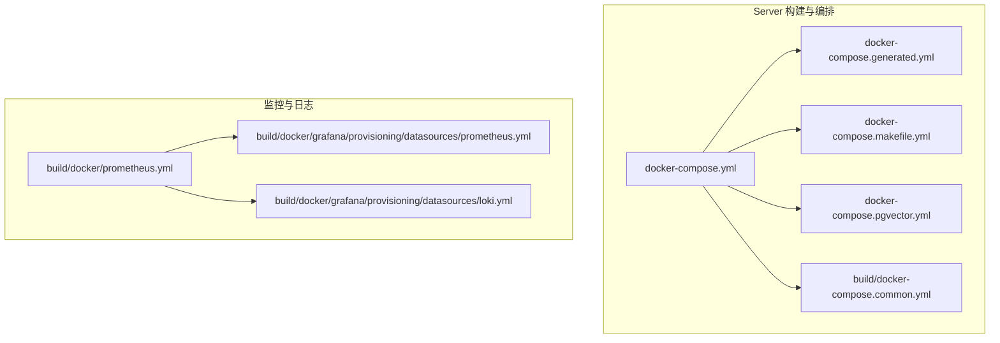
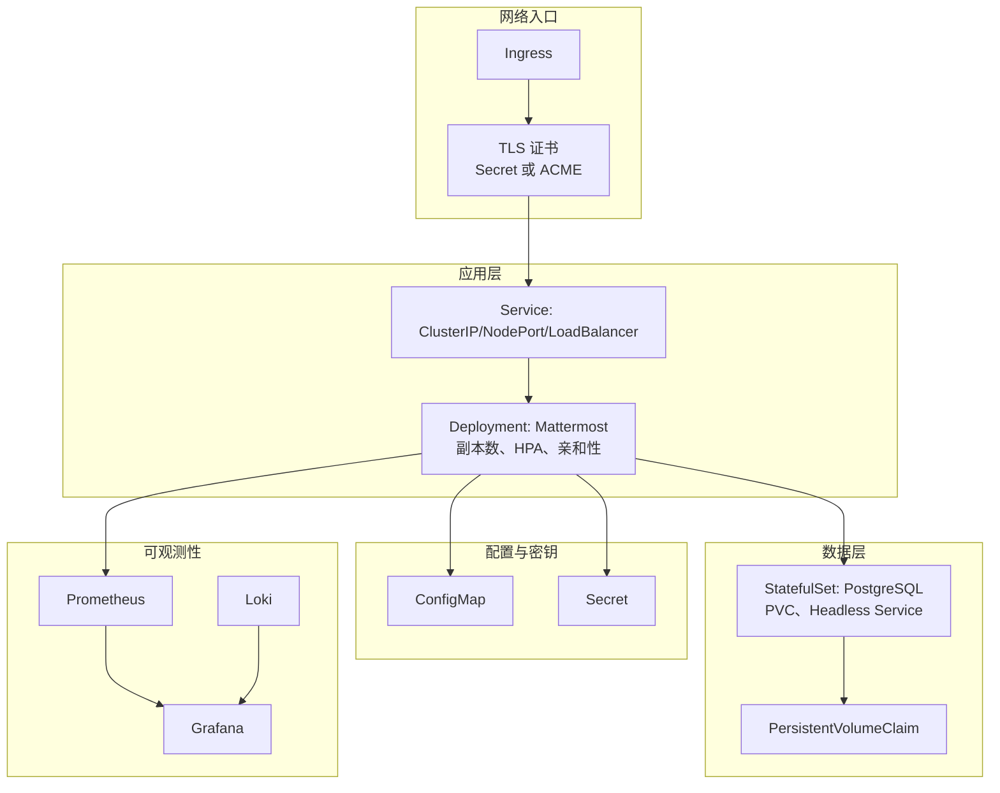
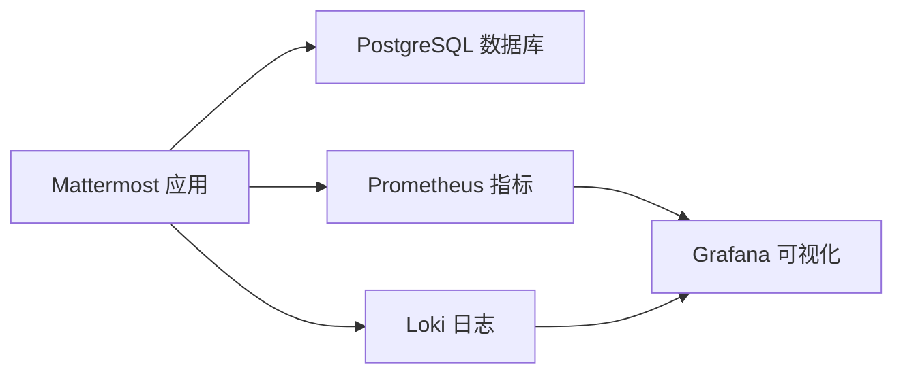

# Kubernetes 部署

<cite>
**本文引用的文件**
- [server\docker-compose.yml](file://server/docker-compose.yml)
- [server\docker-compose.generated.yml](file://server/docker-compose.generated.yml)
- [server\docker-compose.makefile.yml](file://server/docker-compose.makefile.yml)
- [server\docker-compose.pgvector.yml](file://server/docker-compose.pgvector.yml)
- [server\build\docker-compose.common.yml](file://server/build/docker-compose.common.yml)
- [server\build\docker\prometheus.yml](file://server/build/docker/prometheus.yml)
- [server\build\docker\grafana\provisioning\datasources\prometheus.yml](file://server/build/docker/grafana/provisioning/datasources/prometheus.yml)
- [server\build\docker\grafana\provisioning\datasources\loki.yml](file://server/build/docker/grafana/provisioning/datasources/loki.yml)
- [server\channels\app\server.go](file://server/channels/app/server.go)
- [server\cmd\mmctl\commands\config.go](file://server/cmd/mmctl/commands/config.go)
- [webapp\channels\src\components\admin_console\cluster_settings.tsx](file://webapp/channels/src/components/admin_console/cluster_settings.tsx)
</cite>

## 目录
1. [简介](#简介)
2. [项目结构](#项目结构)
3. [核心组件](#核心组件)
4. [架构总览](#架构总览)
5. [详细组件分析](#详细组件分析)
6. [依赖关系分析](#依赖关系分析)
7. [性能考量](#性能考量)
8. [故障排查指南](#故障排查指南)
9. [结论](#结论)
10. [附录](#附录)

## 简介
本指南面向在 Kubernetes 环境中部署 Mattermost 的工程团队，目标是提供从资源清单编写到 Helm 使用、StatefulSet 部署、Ingress/TLS、HPA、亲和性与节点选择器、滚动更新与蓝绿/金丝雀发布、命名空间与 RBAC 安全配置的完整实践路径。为保证可操作性，本指南以仓库内现有的容器编排与配置能力为基础，结合 Mattermost 服务端 TLS、集群设置等运行时特性，给出可落地的部署建议。

## 项目结构
仓库中与部署密切相关的文件主要集中在 server/build 与 server/docker-compose* 文件，以及 Grafana/Prometheus 的监控配置。这些文件展示了应用、数据库与可观测性的容器化组合方式，可作为设计 Kubernetes 资源的参考。

图示来源
- [server\docker-compose.yml](file://server/docker-compose.yml)
- [server\docker-compose.generated.yml](file://server/docker-compose.generated.yml)
- [server\docker-compose.makefile.yml](file://server/docker-compose.makefile.yml)
- [server\docker-compose.pgvector.yml](file://server/docker-compose.pgvector.yml)
- [server\build\docker-compose.common.yml](file://server/build/docker-compose.common.yml)
- [server\build\docker\prometheus.yml](file://server/build/docker/prometheus.yml)
- [server\build\docker\grafana\provisioning\datasources\prometheus.yml](file://server/build/docker/grafana/provisioning/datasources/prometheus.yml)
- [server\build\docker\grafana\provisioning\datasources\loki.yml](file://server/build/docker/grafana/provisioning/datasources/loki.yml)

章节来源
- [server\docker-compose.yml](file://server/docker-compose.yml)
- [server\docker-compose.generated.yml](file://server/docker-compose.generated.yml)
- [server\docker-compose.makefile.yml](file://server/docker-compose.makefile.yml)
- [server\docker-compose.pgvector.yml](file://server/docker-compose.pgvector.yml)
- [server\build\docker-compose.common.yml](file://server/build/docker-compose.common.yml)
- [server\build\docker\prometheus.yml](file://server/build/docker/prometheus.yml)
- [server\build\docker\grafana\provisioning\datasources\prometheus.yml](file://server/build/docker/grafana/provisioning/datasources/prometheus.yml)
- [server\build\docker\grafana\provisioning\datasources\loki.yml](file://server/build/docker/grafana/provisioning/datasources/loki.yml)

## 核心组件
- 应用服务（Mattermost）：提供 Web、WebSocket、认证与业务逻辑；支持 TLS 与 Let’s Encrypt 获取证书；可通过 mmctl 进行配置读取、重载与迁移。
- 数据库（PostgreSQL）：通过 docker-compose 组合，可在 Kubernetes 中以 StatefulSet + PVC 提供持久化数据。
- 消息与文件存储：可按需引入对象存储或本地卷，结合 ConfigMap/Secret 管理访问凭证。
- 监控与日志：Prometheus 采集指标，Grafana 作为可视化面板，Loki 收集日志，三者通过 docker-compose 共同演示。

章节来源
- [server\channels\app\server.go](file://server/channels/app/server.go)
- [server\cmd\mmctl\commands\config.go](file://server/cmd/mmctl/commands/config.go)
- [server\build\docker\prometheus.yml](file://server/build/docker/prometheus.yml)
- [server\build\docker\grafana\provisioning\datasources\prometheus.yml](file://server/build/docker/grafana/provisioning/datasources/prometheus.yml)
- [server\build\docker\grafana\provisioning\datasources\loki.yml](file://server/build/docker/grafana/provisioning/datasources/loki.yml)

## 架构总览
下图展示在 Kubernetes 中部署 Mattermost 的推荐架构：应用层使用 Deployment，数据库使用 StatefulSet，Ingress 暴露服务并统一处理 TLS，HPA 根据 CPU/内存或自定义指标自动扩缩，ConfigMap/Secret 管理配置与密钥，PVC 提供持久化存储。

图示来源
- [server\channels\app\server.go](file://server/channels/app/server.go)
- [server\build\docker\prometheus.yml](file://server/build/docker/prometheus.yml)
- [server\build\docker\grafana\provisioning\datasources\prometheus.yml](file://server/build/docker/grafana/provisioning/datasources/prometheus.yml)
- [server\build\docker\grafana\provisioning\datasources\loki.yml](file://server/build/docker/grafana/provisioning/datasources/loki.yml)

## 详细组件分析

### Deployment 与 Service
- Deployment
  - 设置副本数与滚动更新策略（如 MaxUnavailable/MaxSurge），启用健康检查（liveness/readiness probes）。
  - 通过环境变量或 ConfigMap 注入运行参数，Secret 注入敏感信息。
  - 可选：基于 HPA 实现自动扩缩容。
- Service
  - ClusterIP 用于集群内部访问；若需要外网访问，配合 Ingress。
  - 若使用 Headless Service，可与 StatefulSet 协作实现稳定网络标识。

章节来源
- [server\channels\app\server.go](file://server/channels/app/server.go)

### StatefulSet 与持久化（PostgreSQL）
- StatefulSet
  - 为数据库提供稳定的网络标识与持久化存储，确保主从切换或重启后数据不丢失。
  - 使用 Headless Service 与 PVC 绑定，避免 StatefulSet 默认的负载均衡行为。
- PVC
  - 选择合适的 StorageClass，确保 IOPS 与容量满足业务峰值。
- 备份与恢复
  - 结合数据库快照与 WAL 归档，制定备份策略。

章节来源
- [server\docker-compose.yml](file://server/docker-compose.yml)
- [server\docker-compose.makefile.yml](file://server/docker-compose.makefile.yml)

### ConfigMap 与 Secret
- ConfigMap
  - 存放非敏感配置（如应用日志级别、功能开关、外部服务地址等）。
  - 通过挂载目录或环境变量注入。
- Secret
  - 存放密码、证书、令牌等敏感信息。
  - 通过挂载路径或环境变量注入，避免明文暴露。

章节来源
- [server\cmd\mmctl\commands\config.go](file://server/cmd/mmctl/commands/config.go)

### Ingress 控制器、TLS 与域名解析
- Ingress
  - 定义路由规则，将域名映射到 Service。
  - 支持多路径与通配符域名，结合证书管理器实现自动化证书签发与续期。
- TLS
  - 使用 Secret 托管证书与私钥；或启用 ACME 自动签发（Let’s Encrypt）。
  - 在应用层支持 TLS 最小版本与加密套件覆盖，详见服务端 TLS 配置。
- 域名解析
  - 将 CNAME/ALIAS 指向 Ingress 控制器提供的地址，确保 DNS 生效。

章节来源
- [server\channels\app\server.go](file://server/channels/app/server.go)

### HorizontalPodAutoscaler（HPA）
- 目标
  - 基于 CPU 使用率、内存或自定义指标（如请求速率、队列长度）进行自动扩缩容。
- 实施要点
  - 为 Deployment 设置资源请求与限制，避免 HPA 误判。
  - 配置合理的最小/最大副本数，防止抖动。
  - 对于有状态组件（数据库），谨慎开启 HPA，优先通过纵向扩展与存储优化。

章节来源
- [server\channels\app\server.go](file://server/channels/app/server.go)

### Pod 亲和性、反亲和性与节点选择器
- 亲和性/反亲和性
  - 将应用与数据库尽量调度到同一可用区，降低跨区延迟。
  - 将副本分散到不同节点，提升高可用性。
- 节点选择器/污点容忍
  - 通过节点标签隔离生产与测试工作负载。
  - 对数据库节点设置专用资源池，避免与其他组件争抢。

章节来源
- [server\channels\app\server.go](file://server/channels/app/server.go)

### 滚动更新、蓝绿与金丝雀发布
- 滚动更新
  - 合理设置 MaxUnavailable 与 MaxSurge，确保更新期间服务连续性。
- 蓝绿发布
  - 通过两套完全独立的 Deployment/Service 切换流量，降低风险。
- 金丝雀发布
  - 逐步将部分流量导入新版本，结合 HPA 与监控指标动态调整权重。

章节来源
- [server\channels\app\server.go](file://server/channels/app/server.go)

### 命名空间管理、RBAC 与安全上下文
- 命名空间
  - 按环境（开发/测试/生产）划分命名空间，隔离资源与权限。
- RBAC
  - 为不同角色授予最小权限，避免使用 cluster-admin。
  - 为 Ingress、Service、Deployment、Secret 等资源分别授权。
- 安全上下文
  - 限制容器以非 root 用户运行，禁用不必要的 capabilities。
  - 使用只读根文件系统，仅挂载必要目录为读写。

章节来源
- [server\channels\app\server.go](file://server/channels/app/server.go)

### Helm Chart 使用与自定义
- Chart 结构
  - templates 下放置 Deployment、Service、Ingress、ConfigMap、Secret、StatefulSet、PVC、HPA、RBAC 等模板。
  - values.yaml 定义默认值，支持多环境覆盖（dev/staging/prod）。
- 模板渲染
  - 使用 .Values.* 引用 values.yaml 中的键，结合内置函数（eq/ne）实现条件渲染。
- 自定义建议
  - 将数据库、对象存储、消息队列等外部依赖通过子 Chart 或外部服务对接。
  - 为 TLS 证书提供两种模式：用户自管 Secret 或启用 ACME 自动签发。

章节来源
- [server\docker-compose.yml](file://server/docker-compose.yml)
- [server\docker-compose.makefile.yml](file://server/docker-compose.makefile.yml)

## 依赖关系分析
下图展示应用、数据库与监控之间的依赖关系，有助于在 Kubernetes 中规划资源依赖与启动顺序。

图示来源
- [server\channels\app\server.go](file://server/channels/app/server.go)
- [server\build\docker\prometheus.yml](file://server/build/docker/prometheus.yml)
- [server\build\docker\grafana\provisioning\datasources\prometheus.yml](file://server/build/docker/grafana/provisioning/datasources/prometheus.yml)
- [server\build\docker\grafana\provisioning\datasources\loki.yml](file://server/build/docker/grafana/provisioning/datasources/loki.yml)

章节来源
- [server\channels\app\server.go](file://server/channels/app/server.go)
- [server\build\docker\prometheus.yml](file://server/build/docker/prometheus.yml)
- [server\build\docker\grafana\provisioning\datasources\prometheus.yml](file://server/build/docker/grafana/provisioning/datasources/prometheus.yml)
- [server\build\docker\grafana\provisioning\datasources\loki.yml](file://server/build/docker/grafana/provisioning/datasources/loki.yml)

## 性能考量
- 资源规划
  - 为应用与数据库设置合理的 requests/limits，避免 OOM 或 CPU 抢占。
- 存储
  - 选择高性能 SSD 类型的 StorageClass，确保数据库 WAL 写入性能。
- 网络
  - 将应用与数据库部署在同一可用区，减少跨区网络延迟。
- 监控
  - 开启慢查询日志与关键指标（QPS、连接数、磁盘 I/O、缓存命中率）告警。

## 故障排查指南
- TLS 与证书
  - 若出现证书链问题，检查 Ingress 证书 Secret 与服务端 TLS 配置是否一致。
  - 应用层支持 TLS 最小版本与加密套件覆盖，必要时调整以兼容客户端。
- 配置变更
  - 使用 mmctl 读取当前配置、重载配置或迁移配置，避免直接修改运行中的配置文件。
- 集群设置
  - 通过管理界面或 API 设置集群名称与主机名覆盖，确保服务发现与负载均衡正常。

章节来源
- [server\channels\app\server.go](file://server/channels/app/server.go)
- [server\cmd\mmctl\commands\config.go](file://server/cmd/mmctl/commands/config.go)
- [webapp\channels\src\components\admin_console\cluster_settings.tsx](file://webapp/channels/src/components/admin_console/cluster_settings.tsx)

## 结论
在 Kubernetes 中部署 Mattermost 的关键在于：清晰的资源分层（应用/数据库/存储/网络/监控）、严格的配置与密钥管理、完善的可观测性与告警、以及稳健的发布策略（滚动/蓝绿/金丝雀）。结合本仓库中已有的容器编排与 TLS 配置能力，可快速搭建出高可用、可扩展且安全的生产级部署方案。

## 附录
- 参考文件
  - [server\docker-compose.yml](file://server/docker-compose.yml)
  - [server\docker-compose.generated.yml](file://server/docker-compose.generated.yml)
  - [server\docker-compose.makefile.yml](file://server/docker-compose.makefile.yml)
  - [server\docker-compose.pgvector.yml](file://server/docker-compose.pgvector.yml)
  - [server\build\docker-compose.common.yml](file://server/build/docker-compose.common.yml)
  - [server\build\docker\prometheus.yml](file://server/build/docker/prometheus.yml)
  - [server\build\docker\grafana\provisioning\datasources\prometheus.yml](file://server/build/docker/grafana/provisioning/datasources/prometheus.yml)
  - [server\build\docker\grafana\provisioning\datasources\loki.yml](file://server/build/docker/grafana/provisioning/datasources/loki.yml)
  - [server\channels\app\server.go](file://server/channels/app/server.go)
  - [server\cmd\mmctl\commands\config.go](file://server/cmd/mmctl/commands/config.go)
  - [webapp\channels\src\components\admin_console\cluster_settings.tsx](file://webapp/channels/src/components/admin_console/cluster_settings.tsx)