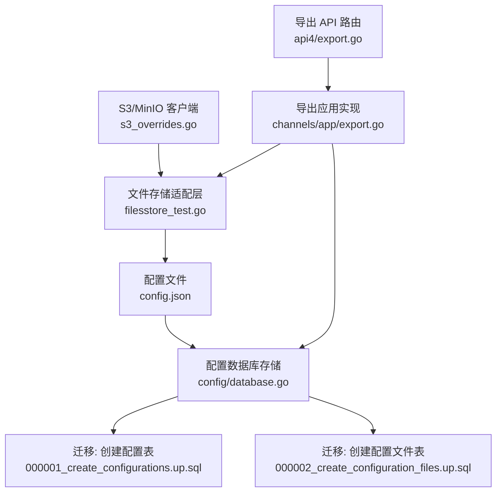
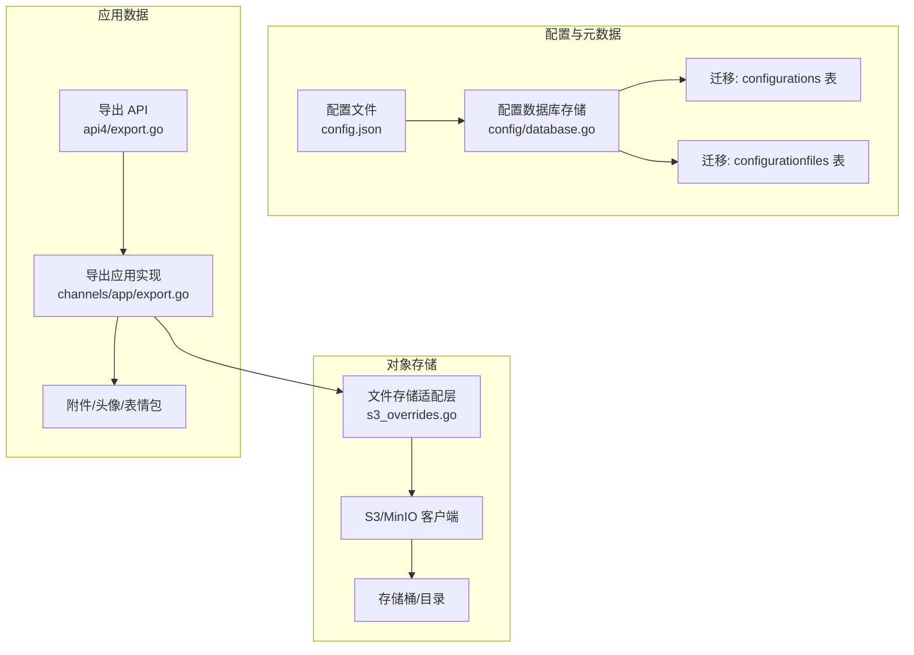
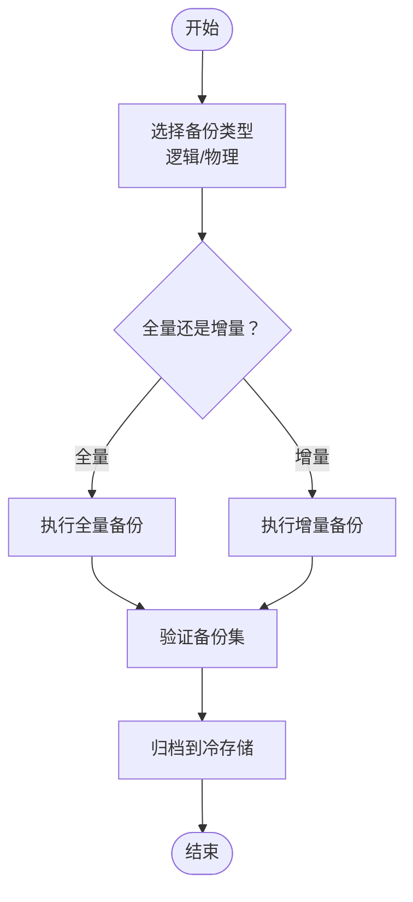
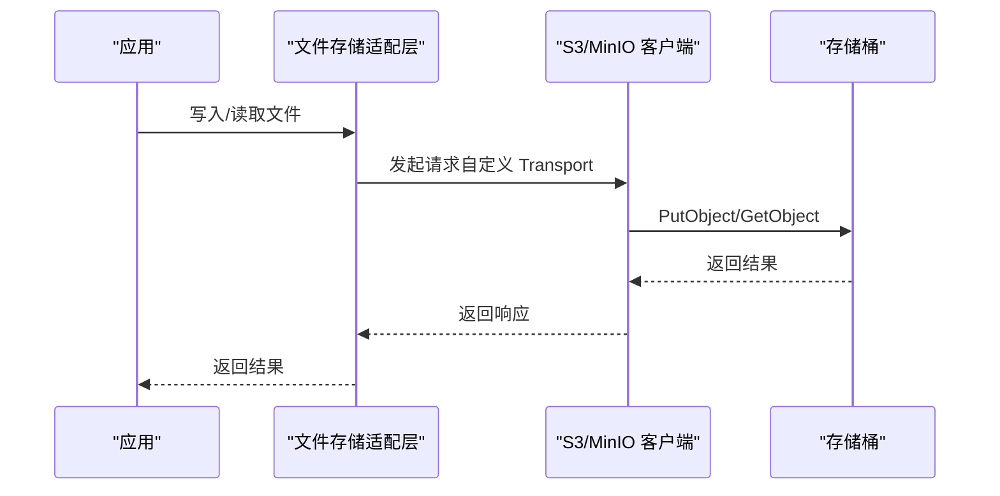
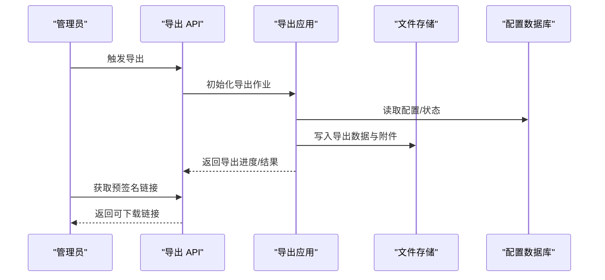
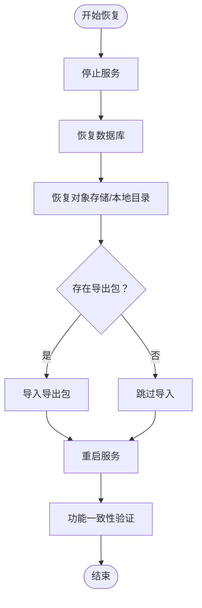
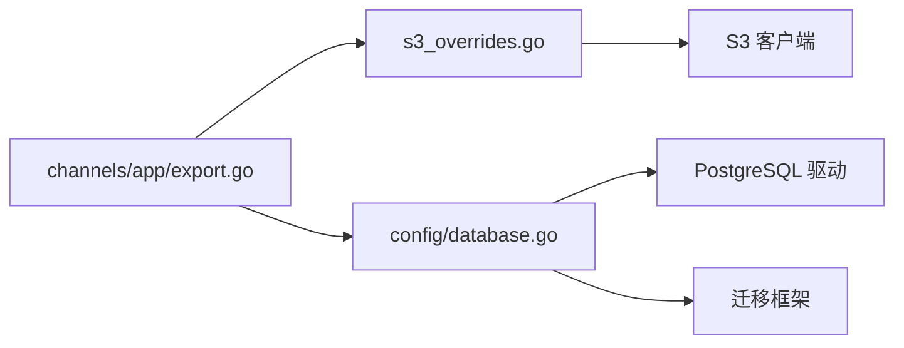

# 备份与恢复

<cite>
**本文引用的文件**
- [config.json](file://server/config/config.json)
- [database.go](file://server/config/database.go)
- [000001_create_configurations.up.sql](file://server/config/migrations/postgres/000001_create_configurations.up.sql)
- [000002_create_configuration_files.up.sql](file://server/config/migrations/postgres/000002_create_configuration_files.up.sql)
- [export.go](file://server/channels/app/export.go)
- [export_local.go](file://server/channels/api4/export_local.go)
- [export.go（API）](file://server/channels/api4/export.go)
- [s3_overrides.go](file://server/platform/shared/filestore/s3_overrides.go)
- [filesstore_test.go](file://server/platform/shared/filestore/filesstore_test.go)
- [server_test.go](file://server/channels/app/server_test.go)
- [docker-compose-generator/main.go](file://server/build/docker-compose-generator/main.go)
- [apitestlib.go](file://server/channels/api4/apitestlib.go)
</cite>

## 目录
1. [简介](#简介)
2. [项目结构](#项目结构)
3. [核心组件](#核心组件)
4. [架构总览](#架构总览)
5. [详细组件分析](#详细组件分析)
6. [依赖关系分析](#依赖关系分析)
7. [性能考量](#性能考量)
8. [故障排查指南](#故障排查指南)
9. [结论](#结论)
10. [附录](#附录)

## 简介
本指南面向 Mattermost 的备份与恢复场景，围绕数据库、对象存储（MinIO/S3 兼容）、应用数据（头像、附件、导出数据）三类资产，给出可落地的备份策略、自动化脚本与调度建议、灾难恢复流程、数据一致性校验、加密与安全传输、长期归档与合规保留，以及恢复测试方法。文档同时结合仓库中的配置、导出实现与对象存储适配层，帮助读者在不直接阅读源码的情况下理解关键实现与最佳实践。

## 项目结构
与备份与恢复相关的关键位置如下：
- 配置与数据库：配置持久化到数据库（PostgreSQL），迁移表结构定义于嵌入资源中；配置文件也支持以文件形式持久化。
- 对象存储：通过 S3 客户端与自定义 Transport/Provider 实现对接 MinIO 或 S3 兼容服务。
- 应用数据导出：提供系统级导出能力，支持批量导出团队、频道、用户、帖子、表情包、附件等，并可生成预签名下载链接。
- 测试与示例：测试用例展示了如何在本地或 CI 环境下以 MinIO 作为后端进行文件存储与导出功能验证。

**图示来源**
- [config.json:162-179](file://server/config/config.json#L162-L179)
- [database.go:42-131](file://server/config/database.go#L42-L131)
- [000001_create_configurations.up.sql:1-8](file://server/config/migrations/postgres/000001_create_configurations.up.sql#L1-L8)
- [000002_create_configuration_files.up.sql:1-7](file://server/config/migrations/postgres/000002_create_configuration_files.up.sql#L1-L7)
- [s3_overrides.go:13-31](file://server/platform/shared/filestore/s3_overrides.go#L13-L31)
- [filesstore_test.go:819-852](file://server/platform/shared/filestore/filesstore_test.go#L819-L852)
- [export.go（API）:16-21](file://server/channels/api4/export.go#L16-L21)
- [export.go:113-250](file://server/channels/app/export.go#L113-L250)

**章节来源**
- [config.json:162-271](file://server/config/config.json#L162-L271)
- [database.go:42-131](file://server/config/database.go#L42-L131)
- [s3_overrides.go:13-31](file://server/platform/shared/filestore/s3_overrides.go#L13-L31)
- [export.go（API）:16-21](file://server/channels/api4/export.go#L16-L21)

## 核心组件
- 配置数据库存储与迁移
  - 使用数据库持久化配置与配置文件，PostgreSQL 迁移表名自定义，支持锁机制与超时控制。
  - 提供加载、设置、文件读写与清理等接口。
- 对象存储适配（S3/MinIO）
  - 支持自定义 Transport 将请求转发至不同主机；提供 Dummy Credentials Provider 以兼容无凭据场景。
  - 文件存储默认驱动为本地，可通过环境变量与配置项切换为 S3/MinIO 并指定端点、密钥、区域、上传分片大小等。
- 导出能力
  - 提供系统级导出 API 与后台作业，支持批量导出团队、频道、用户、帖子、表情包、附件等，可生成预签名下载链接，便于外部归档与跨域访问。

**章节来源**
- [database.go:42-353](file://server/config/database.go#L42-L353)
- [000001_create_configurations.up.sql:1-8](file://server/config/migrations/postgres/000001_create_configurations.up.sql#L1-L8)
- [000002_create_configuration_files.up.sql:1-7](file://server/config/migrations/postgres/000002_create_configuration_files.up.sql#L1-L7)
- [s3_overrides.go:13-42](file://server/platform/shared/filestore/s3_overrides.go#L13-L42)
- [filesstore_test.go:819-852](file://server/platform/shared/filestore/filesstore_test.go#L819-L852)
- [export.go（API）:16-21](file://server/channels/api4/export.go#L16-L21)
- [export.go:113-250](file://server/channels/app/export.go#L113-L250)

## 架构总览
下图展示备份与恢复涉及的数据流与组件交互：

**图示来源**
- [config.json:162-271](file://server/config/config.json#L162-L271)
- [database.go:42-131](file://server/config/database.go#L42-L131)
- [000001_create_configurations.up.sql:1-8](file://server/config/migrations/postgres/000001_create_configurations.up.sql#L1-L8)
- [000002_create_configuration_files.up.sql:1-7](file://server/config/migrations/postgres/000002_create_configuration_files.up.sql#L1-L7)
- [s3_overrides.go:13-42](file://server/platform/shared/filestore/s3_overrides.go#L13-L42)
- [export.go（API）:16-21](file://server/channels/api4/export.go#L16-L21)
- [export.go:113-250](file://server/channels/app/export.go#L113-L250)

## 详细组件分析

### 数据库备份策略（PostgreSQL）
- 逻辑备份（推荐用于可还原性优先场景）
  - 利用数据库存储的配置与配置文件表，结合标准逻辑备份工具生成 SQL 增量/全量备份。
  - 迁移表名自定义，避免与业务表混淆；迁移过程带锁与超时控制，保证一致性。
- 物理备份（推荐用于快速恢复场景）
  - 在业务低峰期对数据目录或共享卷进行快照/镜像备份，结合 WAL 归档实现时间点恢复。
- 增量与全量
  - 可按周期执行全量备份，按日/小时执行增量备份（基于 WAL 或存储快照）。
- 验证与归档
  - 恢复演练验证备份集可用性；将备份归档至异地冷存储，满足合规保留周期。

**章节来源**
- [database.go:42-131](file://server/config/database.go#L42-L131)
- [000001_create_configurations.up.sql:1-8](file://server/config/migrations/postgres/000001_create_configurations.up.sql#L1-L8)
- [000002_create_configuration_files.up.sql:1-7](file://server/config/migrations/postgres/000002_create_configuration_files.up.sql#L1-L7)

### 对象存储备份（MinIO/S3 兼容）
- 存储桶备份
  - 通过 S3 客户端与自定义 Transport 将请求重定向至 MinIO 或 S3 兼容服务。
  - 默认驱动为本地，可切换为 S3/MinIO 并配置端点、密钥、区域、上传分片大小、SSL、签名版本等。
- 跨区域复制
  - 建议启用多区域复制或跨区域同步策略，确保至少两个地理区域的可用性与持久性。
- 访问控制与审计
  - 结合 IAM 策略限制访问范围；开启服务器端加密与传输加密；记录访问日志以便审计。

**图示来源**
- [s3_overrides.go:13-31](file://server/platform/shared/filestore/s3_overrides.go#L13-L31)
- [filesstore_test.go:819-852](file://server/platform/shared/filestore/filesstore_test.go#L819-L852)
- [server_test.go:94-137](file://server/channels/app/server_test.go#L94-L137)
- [docker-compose-generator/main.go:27-29](file://server/build/docker-compose-generator/main.go#L27-L29)
- [apitestlib.go:1229-1263](file://server/channels/api4/apitestlib.go#L1229-L1263)

**章节来源**
- [s3_overrides.go:13-42](file://server/platform/shared/filestore/s3_overrides.go#L13-L42)
- [filesstore_test.go:819-852](file://server/platform/shared/filestore/filesstore_test.go#L819-L852)
- [server_test.go:94-137](file://server/channels/app/server_test.go#L94-L137)
- [docker-compose-generator/main.go:27-29](file://server/build/docker-compose-generator/main.go#L27-L29)
- [apitestlib.go:1229-1263](file://server/channels/api4/apitestlib.go#L1229-L1263)

### 应用数据备份（头像、附件、导出数据）
- 头像与附件
  - 当文件存储驱动为本地时，头像与附件位于本地目录；当驱动为 S3/MinIO 时，头像与附件位于对应存储桶。
  - 建议定期对本地目录或存储桶执行归档备份，并与数据库备份保持时间对齐。
- 导出数据
  - 系统提供导出 API 与后台作业，支持批量导出团队、频道、用户、帖子、表情包、附件等。
  - 可生成预签名下载链接，便于跨域访问与归档存储。

**图示来源**
- [export.go（API）:16-21](file://server/channels/api4/export.go#L16-L21)
- [export.go:113-250](file://server/channels/app/export.go#L113-L250)
- [export_local.go](file://server/channels/api4/export_local.go)

**章节来源**
- [export.go（API）:16-21](file://server/channels/api4/export.go#L16-L21)
- [export.go:113-250](file://server/channels/app/export.go#L113-L250)
- [config.json:209-271](file://server/config/config.json#L209-L271)

### 备份自动化脚本与调度
- 脚本建议
  - 数据库：使用逻辑备份工具生成 SQL 备份；物理备份使用存储快照或文件系统级快照。
  - 对象存储：针对 MinIO/S3 兼容存储，使用客户端工具进行桶级备份与跨区域复制。
  - 应用数据：调用导出 API 生成离线导出包，或直接备份本地目录/存储桶。
- 调度
  - 使用系统计划任务（如 cron）或编排平台（如 Kubernetes CronJob）定期执行备份。
  - 设置失败告警与重试策略，确保备份链路稳定。

[本节为通用实践指导，无需列出具体文件来源]

### 灾难恢复流程
- 数据库恢复
  - 基于备份集进行恢复，应用迁移以确保表结构一致；确认配置数据库处于活动状态。
- 对象存储恢复
  - 将备份的桶内容恢复到目标区域/实例；校验对象完整性与权限。
- 应用数据恢复
  - 若采用导出包，先恢复数据库与对象存储，再导入导出包；若直接备份本地目录/桶，则恢复对应位置。
- 服务重启与一致性验证
  - 重启服务后，检查关键接口可用性与日志；核对用户登录、消息检索、文件访问等功能是否正常。

[本图为概念流程图，无需列出具体文件来源]

### 加密与安全传输
- 存储加密
  - 对象存储启用服务器端加密（SSE-S3/SSE-KMS 或 SSE-C）。
- 传输加密
  - 强制使用 HTTPS/SSL；禁用明文传输。
- 访问控制
  - 通过 IAM/访问密钥最小权限原则；限制 IP 与来源；定期轮换密钥。
- 审计与日志
  - 开启访问日志与操作审计，定期审查异常行为。

[本节为通用实践指导，无需列出具体文件来源]

### 归档策略与长期保存
- 分层存储
  - 热数据：在线存储，频繁访问。
  - 温数据：近线存储，较低频次访问。
  - 冷数据：离线/归档存储，满足合规保留周期。
- 保留周期
  - 根据法规与公司政策设定保留期限；到期自动清理或转存。
- 元数据管理
  - 维护备份清单、索引与元数据，便于检索与恢复。

[本节为通用实践指导，无需列出具体文件来源]

### 恢复测试与验证
- 定期演练
  - 按月/季度进行恢复演练，覆盖数据库、对象存储与应用数据。
- 验证指标
  - 可用性：服务能正常启动与对外提供服务。
  - 一致性：用户、团队、频道、帖子、附件等数据一致。
  - 性能：关键路径查询与上传/下载性能达标。
- 回归报告
  - 记录演练过程、发现的问题与改进措施，持续优化恢复流程。

[本节为通用实践指导，无需列出具体文件来源]

## 依赖关系分析
- 配置数据库存储依赖 PostgreSQL 驱动与迁移框架，迁移表名自定义并带锁。
- 对象存储适配层依赖 S3 客户端，支持自定义 Transport 与 Dummy Credentials Provider。
- 导出模块依赖文件存储与数据库，负责批量导出与预签名链接生成。

**图示来源**
- [database.go:21-31](file://server/config/database.go#L21-L31)
- [s3_overrides.go:6-11](file://server/platform/shared/filestore/s3_overrides.go#L6-L11)
- [export.go:6-28](file://server/channels/app/export.go#L6-L28)

**章节来源**
- [database.go:21-31](file://server/config/database.go#L21-L31)
- [s3_overrides.go:6-11](file://server/platform/shared/filestore/s3_overrides.go#L6-L11)
- [export.go:6-28](file://server/channels/app/export.go#L6-L28)

## 性能考量
- 备份窗口
  - 合理安排备份时间，避免业务高峰期；对大体量对象存储建议分批处理。
- 并发与限速
  - 控制并发连接数与上传分片大小，平衡吞吐与稳定性。
- 存储与网络
  - 使用高带宽网络与高性能存储；启用压缩与去重以降低传输成本。

[本节为通用指导，无需列出具体文件来源]

## 故障排查指南
- 配置数据库无法连接
  - 检查 DSN、驱动名称与连接参数；确认迁移已成功应用。
- 对象存储不可达
  - 校验端点、密钥、区域与 SSL 配置；确认网络连通性与防火墙策略。
- 导出失败
  - 查看导出作业日志与错误码；确认磁盘空间与文件权限；必要时减小批次大小。
- 预签名链接无效
  - 校验签名算法、过期时间与桶策略；确认客户端时间同步。

**章节来源**
- [database.go:52-84](file://server/config/database.go#L52-L84)
- [filesstore_test.go:819-852](file://server/platform/shared/filestore/filesstore_test.go#L819-L852)
- [export.go（API）:65-89](file://server/channels/api4/export.go#L65-L89)
- [export.go:113-250](file://server/channels/app/export.go#L113-L250)

## 结论
通过将数据库、对象存储与应用数据三类资产纳入统一的备份与恢复体系，结合自动化脚本、定期演练与严格的安全与归档策略，可以显著提升系统的可靠性与可恢复性。建议以“逻辑备份+物理备份”双轨并行，配合对象存储的跨区域复制与导出能力，构建覆盖全量与增量、热备与冷备的完整备份矩阵。

## 附录
- 关键配置项参考
  - 数据库连接与加密：参见配置文件中的数据库设置与加密密钥字段。
  - 文件存储驱动与 S3 参数：参见文件存储与导出存储相关配置项。
  - 导出目录与保留策略：参见导出设置与导入设置。

**章节来源**
- [config.json:162-271](file://server/config/config.json#L162-L271)
- [config.json:688-695](file://server/config/config.json#L688-L695)