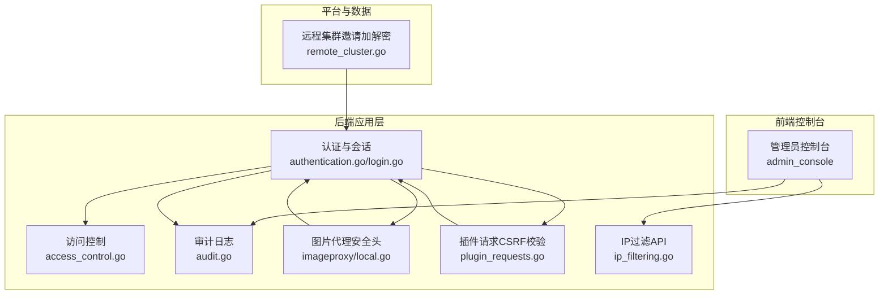
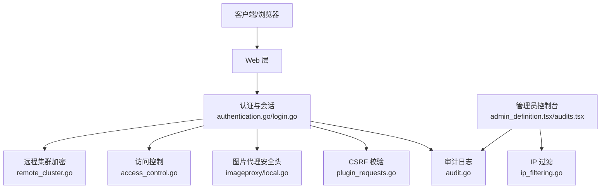
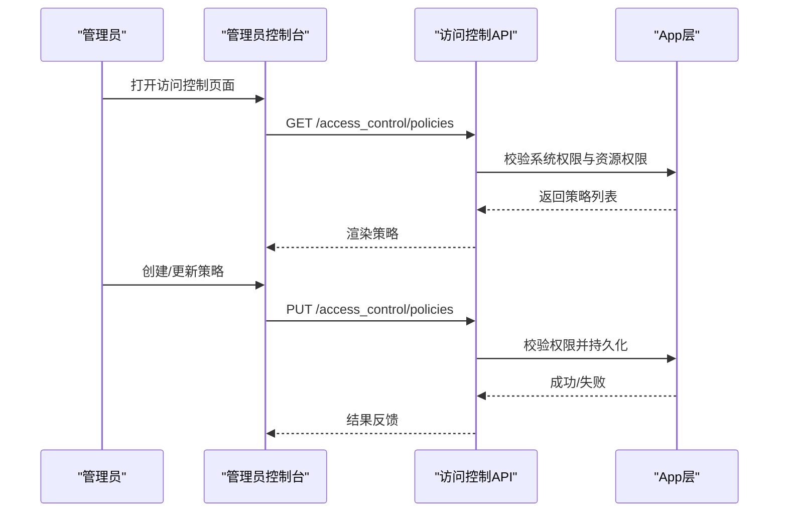
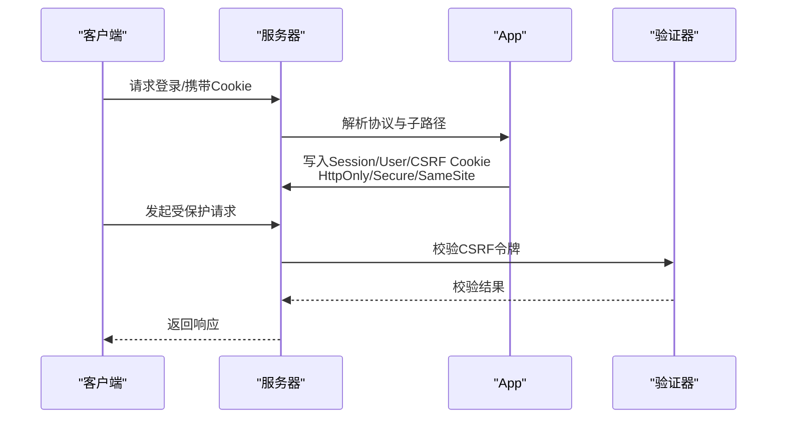
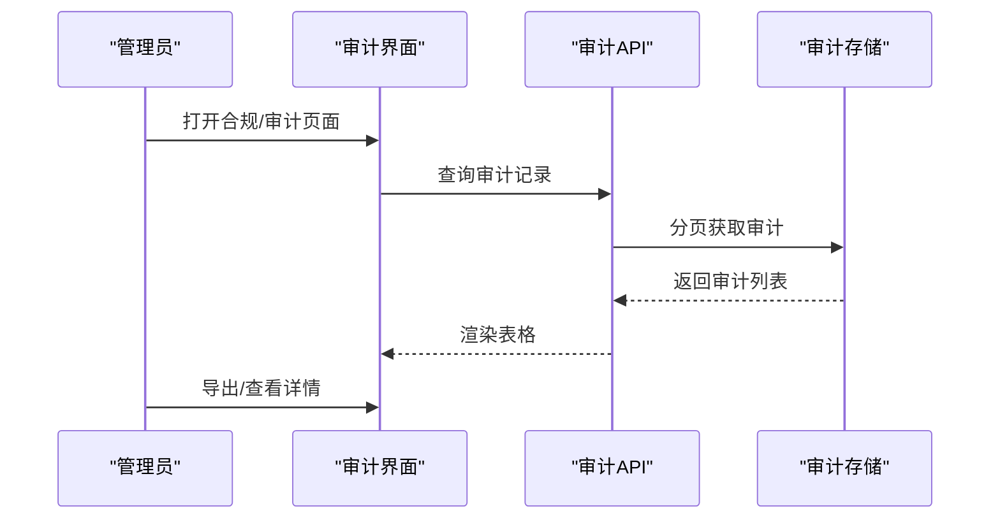
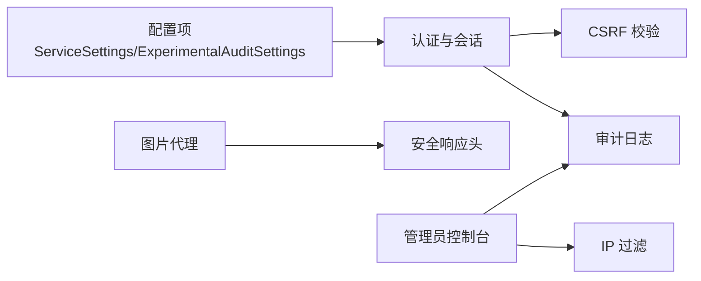

# 安全加固

<cite>
**本文引用的文件**
- [SECURITY.md](file://SECURITY.md)
- [ip_filtering.go](file://server/channels/api4/ip_filtering.go)
- [authentication.go](file://server/channels/app/authentication.go)
- [login.go](file://server/channels/app/login.go)
- [plugin_requests.go](file://server/channels/app/plugin_requests.go)
- [local.go](file://server/platform/services/imageproxy/local.go)
- [audit.go](file://server/channels/app/audit.go)
- [admin_definition.tsx](file://webapp/channels/src/components/admin_console/admin_definition.tsx)
- [audits.tsx](file://webapp/channels/src/components/admin_console/audits/audits.tsx)
- [dashboard.data.tsx](file://webapp/channels/src/components/admin_console/workspace-optimization/dashboard.data.tsx)
- [remote_cluster.go](file://server/public/model/remote_cluster.go)
- [access_control.go](file://server/channels/api4/access_control.go)
</cite>

## 目录
1. [简介](#简介)
2. [项目结构](#项目结构)
3. [核心组件](#核心组件)
4. [架构总览](#架构总览)
5. [详细组件分析](#详细组件分析)
6. [依赖分析](#依赖分析)
7. [性能考虑](#性能考虑)
8. [故障排查指南](#故障排查指南)
9. [结论](#结论)
10. [附录](#附录)

## 简介
本实施方案面向 Mattermost 的安全加固，围绕网络安全、访问控制、应用安全、数据安全、漏洞管理、审计日志、安全监控与威胁检测以及安全事件响应等维度，结合代码库中的现有实现与可配置项，提供可落地的配置建议与最佳实践。目标是提升系统在生产环境下的整体安全性与合规性。

## 项目结构
从安全视角看，Mattermost 的安全能力主要分布在以下层次：
- 应用层：认证与会话管理、权限与访问控制、审计日志、插件请求校验、图片代理安全头等
- 前端控制台：管理员侧的合规与审计界面入口
- 平台服务：图像代理的安全响应头注入
- 数据模型：远程集群邀请的加解密逻辑

图表来源
- [authentication.go:263-319](file://server/channels/app/authentication.go#L263-L319)
- [login.go:253-330](file://server/channels/app/login.go#L253-L330)
- [plugin_requests.go:285-318](file://server/channels/app/plugin_requests.go#L285-L318)
- [local.go:195-212](file://server/platform/services/imageproxy/local.go#L195-L212)
- [access_control.go:28-45](file://server/channels/api4/access_control.go#L28-L45)
- [audit.go:45-92](file://server/channels/app/audit.go#L45-L92)
- [ip_filtering.go:16-20](file://server/channels/api4/ip_filtering.go#L16-L20)
- [remote_cluster.go:419-475](file://server/public/model/remote_cluster.go#L419-L475)

章节来源
- [authentication.go:1-535](file://server/channels/app/authentication.go#L1-L535)
- [login.go:253-330](file://server/channels/app/login.go#L253-L330)
- [plugin_requests.go:285-318](file://server/channels/app/plugin_requests.go#L285-L318)
- [local.go:195-212](file://server/platform/services/imageproxy/local.go#L195-L212)
- [access_control.go:28-45](file://server/channels/api4/access_control.go#L28-L45)
- [audit.go:1-236](file://server/channels/app/audit.go#L1-L236)
- [ip_filtering.go:1-119](file://server/channels/api4/ip_filtering.go#L1-L119)
- [remote_cluster.go:419-475](file://server/public/model/remote_cluster.go#L419-L475)

## 核心组件
- 认证与会话管理：支持多种令牌位置解析、会话 Cookie 安全属性（HttpOnly、Secure、SameSite）、CSRF 令牌生成与校验、MFA 强制策略
- 权限与访问控制：基于系统权限与资源权限的访问控制策略，支持表达式与委派上下文
- 审计日志：多级审计日志记录、证书化审计证书上传与移除、高级审计配置加载
- 插件请求 CSRF 校验：严格与非严格模式下的 CSRF 校验差异
- 图片代理安全头：CORS 允许、CSP 禁止脚本、X-Content-Type-Options、X-XSS-Protection
- IP 过滤：管理员控制台侧的 IP 白名单配置与应用
- 远程集群邀请加解密：PBKDF2/scrypt 派生密钥、AES-GCM 加密、随机盐与随机 nonce

章节来源
- [authentication.go:21-49](file://server/channels/app/authentication.go#L21-L49)
- [login.go:263-319](file://server/channels/app/login.go#L263-L319)
- [plugin_requests.go:285-318](file://server/channels/app/plugin_requests.go#L285-L318)
- [local.go:195-212](file://server/platform/services/imageproxy/local.go#L195-L212)
- [access_control.go:28-45](file://server/channels/api4/access_control.go#L28-L45)
- [audit.go:45-92](file://server/channels/app/audit.go#L45-L92)
- [ip_filtering.go:16-20](file://server/channels/api4/ip_filtering.go#L16-L20)
- [remote_cluster.go:419-475](file://server/public/model/remote_cluster.go#L419-L475)

## 架构总览
下图展示安全相关模块之间的交互关系与职责边界：

图表来源
- [authentication.go:452-491](file://server/channels/app/authentication.go#L452-L491)
- [login.go:263-319](file://server/channels/app/login.go#L263-L319)
- [plugin_requests.go:285-318](file://server/channels/app/plugin_requests.go#L285-L318)
- [audit.go:74-92](file://server/channels/app/audit.go#L74-L92)
- [local.go:195-212](file://server/platform/services/imageproxy/local.go#L195-L212)
- [admin_definition.tsx:6300-6372](file://webapp/channels/src/components/admin_console/admin_definition.tsx#L6300-L6372)
- [audits.tsx:80-122](file://webapp/channels/src/components/admin_console/audits/audits.tsx#L80-L122)
- [ip_filtering.go:16-20](file://server/channels/api4/ip_filtering.go#L16-L20)
- [access_control.go:28-45](file://server/channels/api4/access_control.go#L28-L45)
- [remote_cluster.go:419-475](file://server/public/model/remote_cluster.go#L419-L475)

## 详细组件分析

### 网络安全与端口管理
- IP 过滤功能通过管理员 API 提供白名单查询、应用与当前 IP 获取能力，适用于云版企业许可场景
- 建议在网络边界层配合防火墙策略，仅开放必要端口（如 443/80），并在反向代理层强制 HTTPS

章节来源
- [ip_filtering.go:16-20](file://server/channels/api4/ip_filtering.go#L16-L20)
- [ip_filtering.go:32-53](file://server/channels/api4/ip_filtering.go#L32-L53)
- [ip_filtering.go:55-96](file://server/channels/api4/ip_filtering.go#L55-L96)
- [ip_filtering.go:98-119](file://server/channels/api4/ip_filtering.go#L98-L119)

### 访问控制与权限管理
- 访问控制策略通过系统权限与资源权限进行授权判定，支持表达式校验与可视化 AST
- 管理员可通过控制台对策略进行创建、激活、分配与模拟

图表来源
- [access_control.go:28-45](file://server/channels/api4/access_control.go#L28-L45)
- [access_control.go:79-121](file://server/channels/api4/access_control.go#L79-L121)
- [access_control.go:182-200](file://server/channels/api4/access_control.go#L182-L200)

章节来源
- [access_control.go:28-45](file://server/channels/api4/access_control.go#L28-L45)
- [access_control.go:79-121](file://server/channels/api4/access_control.go#L79-L121)
- [access_control.go:182-200](file://server/channels/api4/access_control.go#L182-L200)

### 会话安全管理
- 会话 Cookie 注入包含 HttpOnly、Secure、SameSite 控制；HTTPS 下 SameSite 设置为 None
- CSRF 令牌随会话下发并与请求校验，支持严格与非严格模式

图表来源
- [login.go:263-319](file://server/channels/app/login.go#L263-L319)
- [plugin_requests.go:285-318](file://server/channels/app/plugin_requests.go#L285-L318)

章节来源
- [login.go:263-319](file://server/channels/app/login.go#L263-L319)
- [plugin_requests.go:285-318](file://server/channels/app/plugin_requests.go#L285-L318)

### 应用安全配置（HTTPS、安全头、CSRF）
- HTTPS：根据请求协议设置 Secure 标志；嵌入式场景 SameSite 设为 None
- 安全头：图片代理返回中设置 CORS、CSP、X-Content-Type-Options、X-XSS-Protection
- CSRF：严格模式下禁止 XMLHttpRequest 方式传递 CSRF，非严格模式允许兼容

章节来源
- [login.go:321-326](file://server/channels/app/login.go#L321-L326)
- [local.go:195-212](file://server/platform/services/imageproxy/local.go#L195-L212)
- [plugin_requests.go:305-315](file://server/channels/app/plugin_requests.go#L305-L315)

### 数据安全与密钥管理
- 远程集群邀请：采用 PBKDF2 或 scrypt 派生密钥，AES-GCM 加密，随机盐与随机 nonce，前缀保存盐
- 建议：密钥轮换策略、最小权限存储、传输加密与完整性校验

章节来源
- [remote_cluster.go:419-475](file://server/public/model/remote_cluster.go#L419-L475)

### 漏洞管理流程
- 责任披露渠道与升级策略：通过指定邮箱披露，遵循 30 天公告周期
- 建议：建立内部扫描与外部渗透测试流程、补丁优先级与回滚预案

章节来源
- [SECURITY.md:1-26](file://SECURITY.md#L1-L26)

### 审计日志与合规
- 审计级别：API、内容、权限、CLI 四级别
- 管理员界面：合规监控与审计日志查看，支持分页与筛选
- 工作区优化检查：提示 SSL 与会话长度配置状态

图表来源
- [admin_definition.tsx:6300-6372](file://webapp/channels/src/components/admin_console/admin_definition.tsx#L6300-L6372)
- [audits.tsx:80-122](file://webapp/channels/src/components/admin_console/audits/audits.tsx#L80-L122)
- [audit.go:45-92](file://server/channels/app/audit.go#L45-L92)
- [dashboard.data.tsx:70-110](file://webapp/channels/src/components/admin_console/workspace-optimization/dashboard.data.tsx#L70-L110)

章节来源
- [admin_definition.tsx:6300-6372](file://webapp/channels/src/components/admin_console/admin_definition.tsx#L6300-L6372)
- [audits.tsx:80-122](file://webapp/channels/src/components/admin_console/audits/audits.tsx#L80-L122)
- [audit.go:45-92](file://server/channels/app/audit.go#L45-L92)
- [dashboard.data.tsx:70-110](file://webapp/channels/src/components/admin_console/workspace-optimization/dashboard.data.tsx#L70-L110)

### 安全监控与威胁检测
- 建议：结合审计日志与异常登录尝试阈值、MFA 强制触发、IP 过滤联动告警
- 可利用现有审计级别与管理员界面进行持续监控与合规审计

章节来源
- [authentication.go:378-425](file://server/channels/app/authentication.go#L378-L425)
- [audit.go:127-163](file://server/channels/app/audit.go#L127-L163)

### 安全事件响应
- 建议流程：事件发现、分级评估、隔离与处置、恢复与复盘、补丁与加固
- 与漏洞管理流程衔接，确保责任披露与升级通道畅通

章节来源
- [SECURITY.md:1-26](file://SECURITY.md#L1-L26)

## 依赖分析
- 认证与会话依赖于配置中的会话时长、HTTPS 协议判断与 Cookie 域名
- CSRF 校验依赖会话中的 CSRF 令牌与请求头/表单字段
- 审计日志依赖配置源与证书文件，支持高级审计配置加载
- 图片代理安全头独立于业务逻辑，统一注入标准安全响应头

图表来源
- [login.go:263-319](file://server/channels/app/login.go#L263-L319)
- [plugin_requests.go:285-318](file://server/channels/app/plugin_requests.go#L285-L318)
- [audit.go:127-163](file://server/channels/app/audit.go#L127-L163)
- [local.go:195-212](file://server/platform/services/imageproxy/local.go#L195-L212)
- [admin_definition.tsx:6300-6372](file://webapp/channels/src/components/admin_console/admin_definition.tsx#L6300-L6372)
- [ip_filtering.go:16-20](file://server/channels/api4/ip_filtering.go#L16-L20)

章节来源
- [login.go:263-319](file://server/channels/app/login.go#L263-L319)
- [plugin_requests.go:285-318](file://server/channels/app/plugin_requests.go#L285-L318)
- [audit.go:127-163](file://server/channels/app/audit.go#L127-L163)
- [local.go:195-212](file://server/platform/services/imageproxy/local.go#L195-L212)
- [admin_definition.tsx:6300-6372](file://webapp/channels/src/components/admin_console/admin_definition.tsx#L6300-L6372)
- [ip_filtering.go:16-20](file://server/channels/api4/ip_filtering.go#L16-L20)

## 性能考虑
- 审计队列满时丢弃策略避免阻塞主业务线
- 图片代理安全头注入为轻量级处理，注意上游缓存与压缩策略
- CSRF 校验与会话解析应尽量减少额外数据库查询

章节来源
- [audit.go:165-172](file://server/channels/app/audit.go#L165-L172)
- [local.go:195-212](file://server/platform/services/imageproxy/local.go#L195-L212)

## 故障排查指南
- 审计日志无法写入：检查高级审计配置 DSN、证书文件是否存在、环境变量覆盖
- CSRF 校验失败：确认是否启用严格模式、请求是否携带正确 CSRF 字段或头部
- 登录失败与 MFA：核对最大登录尝试次数、MFA 是否强制、账户状态与邮箱验证
- IP 过滤不生效：确认企业许可、功能开关与管理员权限

章节来源
- [audit.go:127-163](file://server/channels/app/audit.go#L127-L163)
- [plugin_requests.go:305-315](file://server/channels/app/plugin_requests.go#L305-L315)
- [authentication.go:378-425](file://server/channels/app/authentication.go#L378-L425)
- [ip_filtering.go:22-30](file://server/channels/api4/ip_filtering.go#L22-L30)

## 结论
通过结合现有认证、会话、CSRF、审计、IP 过滤与安全头注入能力，并辅以漏洞管理、监控告警与事件响应流程，可在生产环境中显著提升 Mattermost 的整体安全性与合规性。建议按本文档逐步实施并持续优化。

## 附录
- 管理员界面入口：合规监控与审计日志页面
- 工作区优化检查：SSL 与会话长度配置提示

章节来源
- [admin_definition.tsx:6300-6372](file://webapp/channels/src/components/admin_console/admin_definition.tsx#L6300-L6372)
- [audits.tsx:80-122](file://webapp/channels/src/components/admin_console/audits/audits.tsx#L80-L122)
- [dashboard.data.tsx:70-110](file://webapp/channels/src/components/admin_console/workspace-optimization/dashboard.data.tsx#L70-L110)