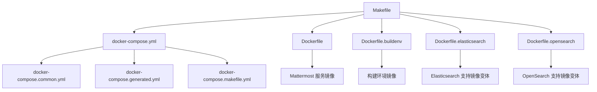
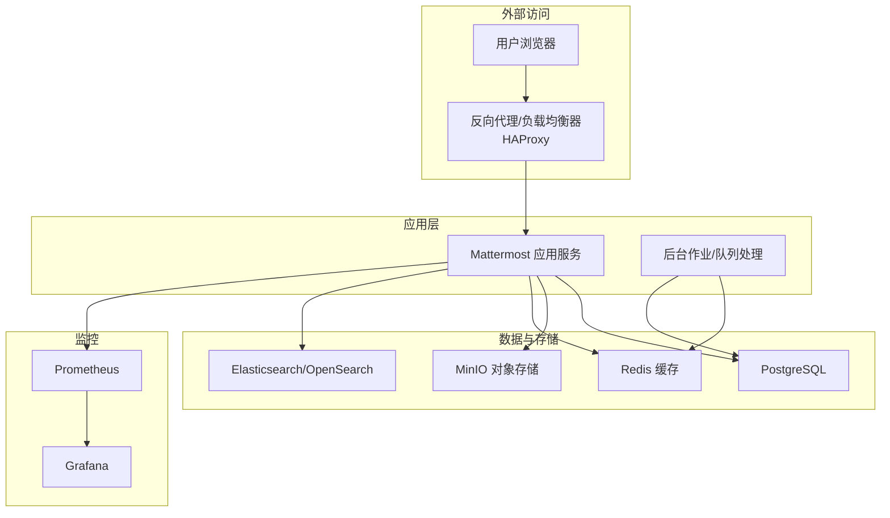
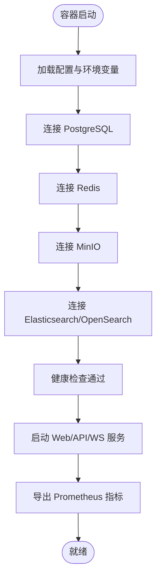
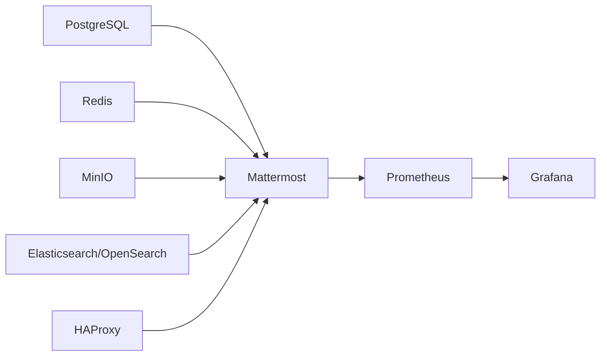

# 容器化部署

<cite>
**本文引用的文件**
- [docker-compose.yml](file://server/docker-compose.yml)
- [docker-compose.generated.yml](file://server/docker-compose.generated.yml)
- [docker-compose.makefile.yml](file://server/docker-compose.makefile.yml)
- [docker-compose.common.yml](file://server/build/docker-compose.common.yml)
- [Dockerfile](file://server/build/Dockerfile)
- [Dockerfile.buildenv](file://server/build/Dockerfile.buildenv)
- [Dockerfile.elasticsearch](file://server/build/Dockerfile.elasticsearch)
- [Dockerfile.opensearch](file://server/build/Dockerfile.opensearch)
- [Dockerfile.fips](file://server/build/Dockerfile.fips)
- [Dockerfile.buildenv-fips](file://server/build/Dockerfile.buildenv-fips)
- [Makefile](file://server/Makefile)
- [README.md](file://README.md)
- [项目启动指南.md](file://项目启动指南.md)
</cite>

## 目录
1. [简介](#简介)
2. [项目结构](#项目结构)
3. [核心组件](#核心组件)
4. [架构总览](#架构总览)
5. [详细组件分析](#详细组件分析)
6. [依赖关系分析](#依赖关系分析)
7. [性能考量](#性能考量)
8. [故障排除指南](#故障排除指南)
9. [结论](#结论)
10. [附录](#附录)

## 简介
本指南面向希望在本地或生产环境中以容器方式部署 Mattermost 的用户与工程师，系统性讲解基于 Docker Compose 的部署方案，覆盖以下主题：
- Docker Compose 配置结构与各服务角色（数据库、对象存储、缓存、搜索引擎、监控等）
- 容器间网络、数据卷、健康检查与启动顺序
- 单机与集群部署差异及高可用建议
- 环境变量、端口映射与依赖服务的启动顺序
- 容器镜像构建流程、自定义镜像制作与镜像优化策略
- 常见问题排查与日志查看方法

## 项目结构
仓库中与容器化部署直接相关的文件主要集中在 server 目录下，包含多套 docker-compose 配置与镜像构建脚本。核心文件如下：
- docker-compose.yml：主配置入口，定义服务、网络、卷与默认启动项
- docker-compose.generated.yml：由生成逻辑产出的组合配置
- docker-compose.makefile.yml：通过 Makefile 调用生成的可选扩展配置
- docker-compose.common.yml：通用服务定义（如数据库、缓存、对象存储等）的公共片段
- 多个 Dockerfile：用于构建 Mattermost 服务器镜像、构建环境镜像、以及针对不同后端（如 Elasticsearch/OpenSearch）的专用镜像
- Makefile：提供一键构建、生成配置、拉取镜像等常用任务

图表来源
- [docker-compose.yml](file://server/docker-compose.yml)
- [docker-compose.common.yml](file://server/build/docker-compose.common.yml)
- [docker-compose.generated.yml](file://server/docker-compose.generated.yml)
- [docker-compose.makefile.yml](file://server/docker-compose.makefile.yml)
- [Dockerfile](file://server/build/Dockerfile)
- [Dockerfile.buildenv](file://server/build/Dockerfile.buildenv)
- [Dockerfile.elasticsearch](file://server/build/Dockerfile.elasticsearch)
- [Dockerfile.opensearch](file://server/build/Dockerfile.opensearch)
- [Makefile](file://server/Makefile)

章节来源
- [docker-compose.yml](file://server/docker-compose.yml)
- [docker-compose.common.yml](file://server/build/docker-compose.common.yml)
- [docker-compose.generated.yml](file://server/docker-compose.generated.yml)
- [docker-compose.makefile.yml](file://server/docker-compose.makefile.yml)
- [Dockerfile](file://server/build/Dockerfile)
- [Dockerfile.buildenv](file://server/build/Dockerfile.buildenv)
- [Dockerfile.elasticsearch](file://server/build/Dockerfile.elasticsearch)
- [Dockerfile.opensearch](file://server/build/Dockerfile.opensearch)
- [Makefile](file://server/Makefile)

## 核心组件
本节概述 Mattermost 容器化部署中的关键服务及其职责：
- Mattermost 应用服务：承载 Web、WebSocket、后台作业与 API 服务
- 数据库（PostgreSQL）：持久化用户、团队、消息、文件元数据等
- 对象存储（MinIO）：文件上传与附件存储
- 缓存（Redis）：会话、速率限制、通知队列等
- 搜索引擎（Elasticsearch 或 OpenSearch）：全文检索与审计日志索引
- 监控（Prometheus + Grafana）：指标采集与可视化
- 反向代理（HAProxy，可选）：实现外部流量分发与高可用

章节来源
- [docker-compose.yml](file://server/docker-compose.yml)
- [docker-compose.common.yml](file://server/build/docker-compose.common.yml)

## 架构总览
下图展示了容器化部署的整体拓扑与交互关系，包括服务间通信、数据流向与外部访问路径。

图表来源
- [docker-compose.yml](file://server/docker-compose.yml)
- [docker-compose.common.yml](file://server/build/docker-compose.common.yml)

## 详细组件分析

### Mattermost 应用服务
- 作用：提供 Web 界面、REST API、WebSocket 通道、后台作业执行与插件运行环境
- 关键点：
  - 端口映射与对外暴露
  - 与数据库、对象存储、缓存、搜索引擎的连接参数
  - 健康检查与启动顺序依赖
  - 监控指标导出
- 镜像构建：
  - 使用 Dockerfile 构建标准镜像
  - 可选 FIPS 镜像变体
  - 可选支持 Elasticsearch 或 OpenSearch 的镜像变体

图表来源
- [Dockerfile](file://server/build/Dockerfile)
- [docker-compose.yml](file://server/docker-compose.yml)

章节来源
- [Dockerfile](file://server/build/Dockerfile)
- [Dockerfile.fips](file://server/build/Dockerfile.fips)
- [Dockerfile.elasticsearch](file://server/build/Dockerfile.elasticsearch)
- [Dockerfile.opensearch](file://server/build/Dockerfile.opensearch)
- [docker-compose.yml](file://server/docker-compose.yml)

### 数据库（PostgreSQL）
- 作用：存储业务数据（用户、团队、频道、消息、文件元数据等）
- 关键点：
  - 数据卷持久化
  - 初始化脚本与迁移
  - 连接池与备份策略
- 健康检查：通过连接测试与版本校验确保可用性

章节来源
- [docker-compose.common.yml](file://server/build/docker-compose.common.yml)
- [docker-compose.yml](file://server/docker-compose.yml)

### 对象存储（MinIO）
- 作用：文件上传、图片缩略图、视频预览等二进制内容的统一存储
- 关键点：
  - 端口与访问密钥配置
  - 数据卷持久化
  - 与 Mattermost 的兼容性配置（如 S3 兼容接口）

章节来源
- [docker-compose.common.yml](file://server/build/docker-compose.common.yml)
- [docker-compose.yml](file://server/docker-compose.yml)

### 缓存（Redis）
- 作用：会话存储、速率限制、通知队列、分布式锁等
- 关键点：
  - 单实例或哨兵模式（根据部署规模选择）
  - 数据持久化策略（RDB/AOF）
  - 与 Mattermost 的连接参数

章节来源
- [docker-compose.common.yml](file://server/build/docker-compose.common.yml)
- [docker-compose.yml](file://server/docker-compose.yml)

### 搜索引擎（Elasticsearch/OpenSearch）
- 作用：全文搜索、审计日志索引与报告
- 关键点：
  - 两种后端镜像变体（Elasticsearch 与 OpenSearch）
  - 索引初始化与权限配置
  - 与 Mattermost 的集成开关

章节来源
- [Dockerfile.elasticsearch](file://server/build/Dockerfile.elasticsearch)
- [Dockerfile.opensearch](file://server/build/Dockerfile.opensearch)
- [docker-compose.yml](file://server/docker-compose.yml)

### 监控（Prometheus + Grafana）
- 作用：采集 Mattermost 指标并可视化展示
- 关键点：
  - Prometheus 抓取目标与规则
  - Grafana 数据源与仪表板
  - 告警与日志聚合（可选）

章节来源
- [docker-compose.common.yml](file://server/build/docker-compose.common.yml)
- [docker-compose.yml](file://server/docker-compose.yml)

### 反向代理（HAProxy，可选）
- 作用：外部流量接入、TLS 终止、健康检查与负载均衡
- 关键点：
  - 多实例部署下的高可用
  - 与应用服务的健康检查联动
  - 日志与可观测性

章节来源
- [docker-compose.yml](file://server/docker-compose.yml)

## 依赖关系分析
- 启动顺序：数据库 → 缓存 → 对象存储 → 搜索引擎 → Mattermost → 监控 → 反向代理
- 服务发现：通过 Docker Compose 默认网络进行内部 DNS 解析
- 数据流：应用服务写入数据库与对象存储；缓存提升读性能；搜索引擎提供检索能力；监控采集指标

图表来源
- [docker-compose.yml](file://server/docker-compose.yml)
- [docker-compose.common.yml](file://server/build/docker-compose.common.yml)

章节来源
- [docker-compose.yml](file://server/docker-compose.yml)
- [docker-compose.common.yml](file://server/build/docker-compose.common.yml)

## 性能考量
- 存储与 I/O
  - 数据库与对象存储使用独立持久化卷，避免共享磁盘争用
  - MinIO 建议使用本地 SSD 并启用纠删码与分片
- 缓存策略
  - Redis 使用合理的淘汰策略与内存上限，开启持久化
  - Mattermost 的缓存命中率可通过监控面板观察
- 搜索性能
  - Elasticsearch/OpenSearch 节点数量与堆大小需按数据量与查询负载调优
  - 索引刷新间隔与副本数影响写入与查询性能
- 网络与并发
  - HAProxy 连接数与超时设置应与应用服务的并发模型匹配
  - WebSocket 长连接与静态资源压缩优化

## 故障排除指南
- 常见症状与定位
  - 应用无法启动：检查数据库连接、对象存储可达性、缓存连通性
  - 搜索功能异常：确认搜索引擎版本与索引初始化状态
  - 文件上传失败：验证 MinIO 访问密钥、桶权限与网络连通
  - 指标缺失：检查 Prometheus 抓取地址与标签
- 日志查看
  - 应用服务：查看容器日志输出与 Mattermost 日志文件
  - 数据库：查看 PostgreSQL 日志与慢查询日志
  - 对象存储：查看 MinIO 访问与错误日志
  - 缓存：查看 Redis 错误日志与内存使用
  - 搜索引擎：查看 Elasticsearch/OpenSearch 的集群健康与节点日志
- 健康检查
  - 使用 Docker Compose 的健康检查状态判断服务可用性
  - 在 HAProxy 中配置健康检查端点并与应用服务联动

章节来源
- [docker-compose.yml](file://server/docker-compose.yml)
- [docker-compose.common.yml](file://server/build/docker-compose.common.yml)

## 结论
通过 Docker Compose 提供的声明式编排，Mattermost 可以在单机与集群场景下快速落地。合理规划存储、缓存与搜索等基础设施，结合监控与反向代理，能够满足从开发测试到生产运行的多样化需求。建议在生产部署前完成容量评估、安全加固与备份演练。

## 附录

### 单机部署与集群部署对比
- 单机部署
  - 使用默认 docker-compose.yml 启动所有服务
  - 数据库、缓存、对象存储、搜索引擎均以单实例运行
  - 适合开发、测试与小规模演示
- 集群部署
  - 扩展 Mattermost 实例数量，配合 HAProxy 实现水平扩展
  - 数据库与对象存储需具备高可用能力（如 PostgreSQL 主从、MinIO 分布式）
  - 搜索引擎与缓存建议采用多节点集群
  - 通过 docker-compose.makefile.yml 或生成配置文件叠加集群特性

章节来源
- [docker-compose.yml](file://server/docker-compose.yml)
- [docker-compose.makefile.yml](file://server/docker-compose.makefile.yml)
- [docker-compose.generated.yml](file://server/docker-compose.generated.yml)

### 环境变量与端口映射
- 环境变量
  - 数据库连接字符串与凭据
  - 对象存储访问密钥与端点
  - 缓存连接参数
  - 搜索引擎地址与认证
  - 监控指标导出开关
- 端口映射
  - 应用服务对外端口（HTTP/HTTPS）
  - 数据库、对象存储、缓存、搜索引擎的内部端口
  - 监控服务端口（Prometheus、Grafana）

章节来源
- [docker-compose.yml](file://server/docker-compose.yml)
- [docker-compose.common.yml](file://server/build/docker-compose.common.yml)

### 容器镜像构建与优化
- 构建流程
  - 使用 Dockerfile 构建 Mattermost 服务镜像
  - 使用 Dockerfile.buildenv 构建构建环境镜像
  - 针对不同后端（Elasticsearch/OpenSearch）分别构建专用镜像
  - 可选 FIPS 镜像变体以满足合规要求
- 优化策略
  - 多阶段构建减少镜像体积
  - 层缓存利用与依赖最小化
  - 运行时镜像精简与只读根文件系统
  - 安全扫描与漏洞修复

章节来源
- [Dockerfile](file://server/build/Dockerfile)
- [Dockerfile.buildenv](file://server/build/Dockerfile.buildenv)
- [Dockerfile.elasticsearch](file://server/build/Dockerfile.elasticsearch)
- [Dockerfile.opensearch](file://server/build/Dockerfile.opensearch)
- [Dockerfile.fips](file://server/build/Dockerfile.fips)
- [Dockerfile.buildenv-fips](file://server/build/Dockerfile.buildenv-fips)
- [Makefile](file://server/Makefile)

### 自定义镜像制作
- 基于官方 Dockerfile 进行定制（如添加企业插件、替换许可证、调整运行参数）
- 使用构建环境镜像复现实验室环境
- 通过 Makefile 提供一键构建与推送流程

章节来源
- [Dockerfile](file://server/build/Dockerfile)
- [Dockerfile.buildenv](file://server/build/Dockerfile.buildenv)
- [Makefile](file://server/Makefile)

### 启动顺序与健康检查
- 通过 depends_on 与 healthcheck 控制启动顺序与可用性判定
- 建议为数据库、缓存、对象存储、搜索引擎配置健康检查脚本
- 应用服务健康检查应覆盖数据库、缓存、存储与搜索引擎的连通性

章节来源
- [docker-compose.yml](file://server/docker-compose.yml)
- [docker-compose.common.yml](file://server/build/docker-compose.common.yml)