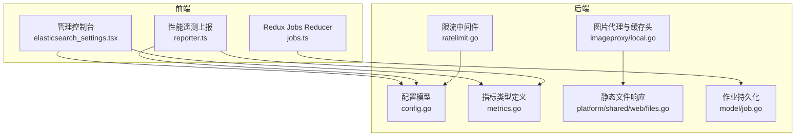
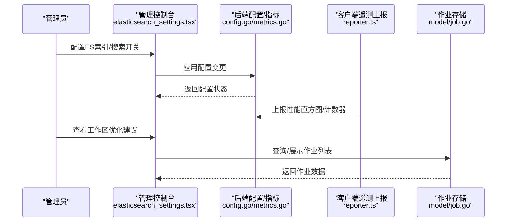
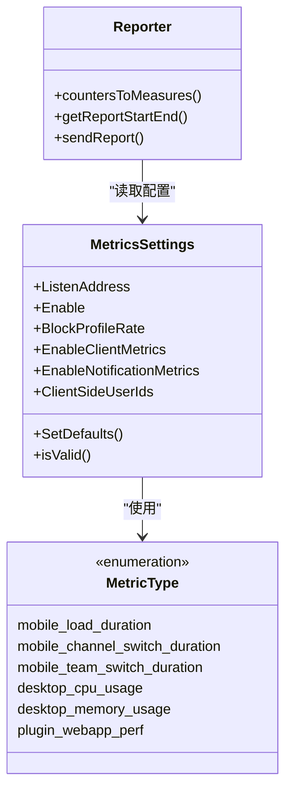
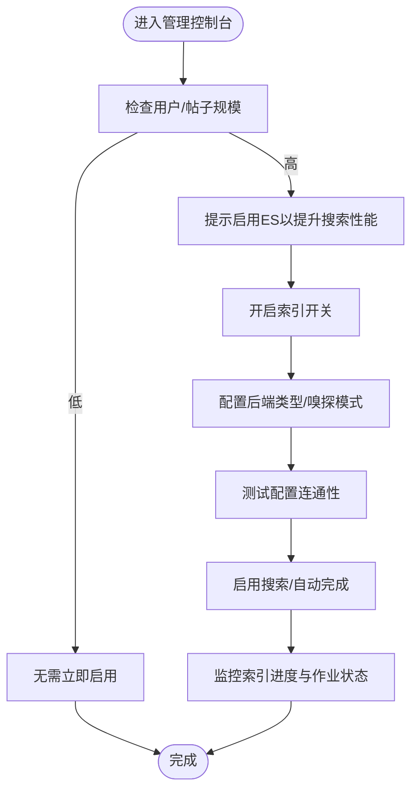
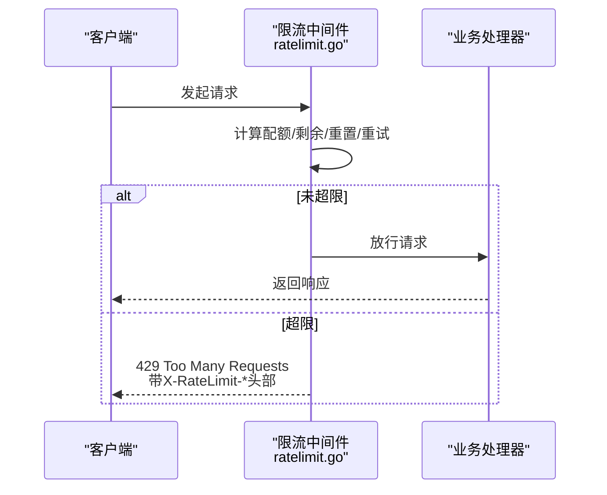
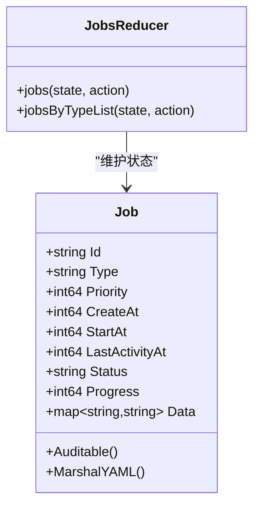
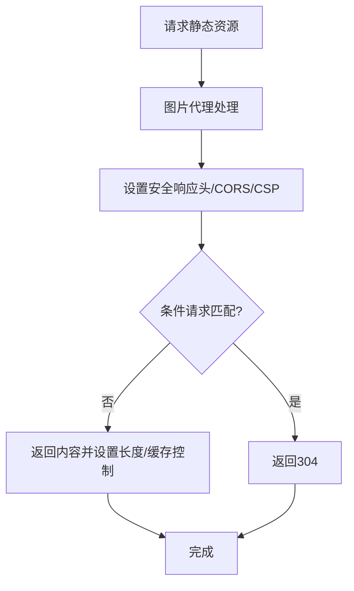
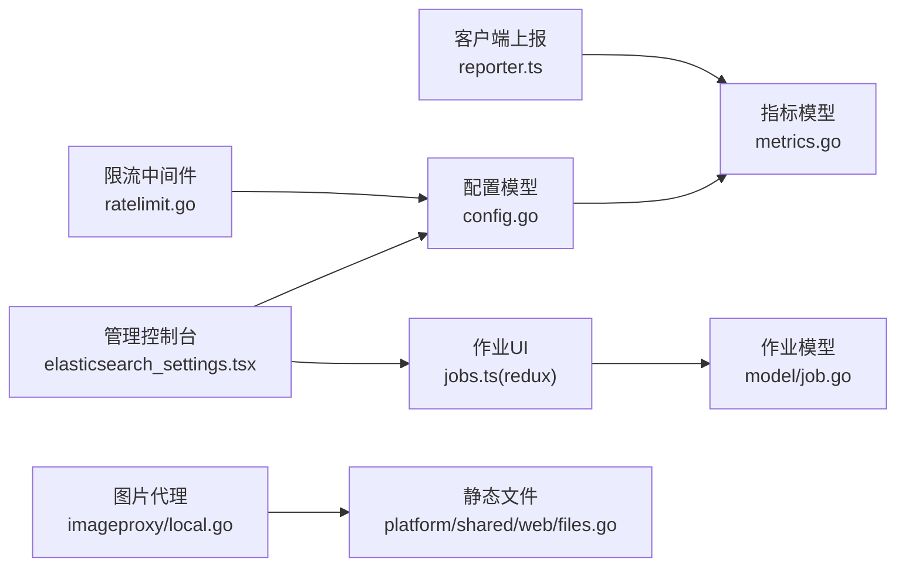

# 性能优化

<cite>
**本文引用的文件**
- [server/public/model/config.go](file://server/public/model/config.go)
- [server/public/model/metrics.go](file://server/public/model/metrics.go)
- [server/channels/app/metrics_test.go](file://server/channels/app/metrics_test.go)
- [webapp/channels/src/components/admin_console/admin_definition.tsx](file://webapp/channels/src/components/admin_console/admin_definition.tsx)
- [webapp/channels/src/utils/performance_telemetry/reporter.ts](file://webapp/channels/src/utils/performance_telemetry/reporter.ts)
- [webapp/channels/src/components/admin_console/elasticsearch_settings.tsx](file://webapp/channels/src/components/admin_console/elasticsearch_settings.tsx)
- [webapp/channels/src/components/admin_console/workspace-optimization/dashboard_checks/performance.ts](file://webapp/channels/src/components/admin_console/workspace-optimization/dashboard_checks/performance.ts)
- [server/public/pluginapi/cluster/job_once_mem_test.go](file://server/public/pluginapi/cluster/job_once_mem_test.go)
- [server/channels/app/job_test.go](file://server/channels/app/job_test.go)
- [webapp/channels/src/packages/mattermost-redux/src/reducers/entities/jobs.ts](file://webapp/channels/src/packages/mattermost-redux/src/reducers/entities/jobs.ts)
- [server/public/model/job.go](file://server/public/model/job.go)
- [server/channels/app/ratelimit.go](file://server/channels/app/ratelimit.go)
- [server/channels/app/ratelimit_test.go](file://server/channels/app/ratelimit_test.go)
- [server/platform/services/imageproxy/local.go](file://server/platform/services/imageproxy/local.go)
- [server/platform/shared/web/files.go](file://server/platform/shared/web/files.go)
- [server/platform/services/imageproxy/local_test.go](file://server/platform/services/imageproxy/local_test.go)
- [server/channels/app/post_metadata_test.go](file://server/channels/app/post_metadata_test.go)
- [server/public/pluginapi/cluster/job_once_mem_test.go](file://server/public/pluginapi/cluster/job_once_mem_test.go)
- [server/channels/app/job_test.go](file://server/channels/app/job_test.go)
- [webapp/channels/src/packages/mattermost-redux/src/reducers/entities/jobs.ts](file://webapp/channels/src/packages/mattermost-redux/src/reducers/entities/jobs.ts)
- [server/public/model/job.go](file://server/public/model/job.go)
- [server/channels/app/ratelimit.go](file://server/channels/app/ratelimit.go)
- [server/channels/app/ratelimit_test.go](file://server/channels/app/ratelimit_test.go)
- [server/platform/services/imageproxy/local.go](file://server/platform/services/imageproxy/local.go)
- [server/platform/shared/web/files.go](file://server/platform/shared/web/files.go)
- [server/platform/services/imageproxy/local_test.go](file://server/platform/services/imageproxy/local_test.go)
- [server/channels/app/post_metadata_test.go](file://server/channels/app/post_metadata_test.go)
</cite>

## 目录
1. [简介](#简介)
2. [项目结构](#项目结构)
3. [核心组件](#核心组件)
4. [架构总览](#架构总览)
5. [详细组件分析](#详细组件分析)
6. [依赖关系分析](#依赖关系分析)
7. [性能考量](#性能考量)
8. [故障排查指南](#故障排查指南)
9. [结论](#结论)
10. [附录](#附录)

## 简介
本指南面向 Mattermost 的性能优化实践，覆盖数据库与缓存、应用服务器、前端、搜索引擎、并发处理、性能监控与瓶颈识别，以及压力与基准测试方法。内容基于仓库中实际实现与配置项进行归纳总结，帮助读者在生产环境中系统地定位与解决性能问题。

## 项目结构
- 后端服务（Go）：位于 server 目录，包含 API 层、应用层、存储层、作业调度、平台服务等模块。
- 前端（React）：位于 webapp 目录，包含管理控制台、Redux 状态管理、性能遥测上报工具等。
- 搜索引擎集成：通过管理控制台配置 Elasticsearch，支持索引与搜索开关。
- 性能监控：后端内置 Prometheus 指标端点与客户端侧性能遥测上报流程。

图表来源
- [server/public/model/config.go:1185-1228](file://server/public/model/config.go#L1185-L1228)
- [server/public/model/metrics.go:33-53](file://server/public/model/metrics.go#L33-L53)
- [server/channels/app/ratelimit.go:80-132](file://server/channels/app/ratelimit.go#L80-L132)
- [server/platform/services/imageproxy/local.go:195-240](file://server/platform/services/imageproxy/local.go#L195-L240)
- [server/platform/shared/web/files.go:40-55](file://server/platform/shared/web/files.go#L40-L55)
- [server/public/model/job.go:94-136](file://server/public/model/job.go#L94-L136)
- [webapp/channels/src/components/admin_console/elasticsearch_settings.tsx:247-533](file://webapp/channels/src/components/admin_console/elasticsearch_settings.tsx#L247-L533)
- [webapp/channels/src/packages/mattermost-redux/src/reducers/entities/jobs.ts:12-52](file://webapp/channels/src/packages/mattermost-redux/src/reducers/entities/jobs.ts#L12-L52)
- [webapp/channels/src/utils/performance_telemetry/reporter.ts:338-380](file://webapp/channels/src/utils/performance_telemetry/reporter.ts#L338-L380)

章节来源
- [server/public/model/config.go:1185-1228](file://server/public/model/config.go#L1185-L1228)
- [server/public/model/metrics.go:33-53](file://server/public/model/metrics.go#L33-L53)
- [server/channels/app/ratelimit.go:80-132](file://server/channels/app/ratelimit.go#L80-L132)
- [server/platform/services/imageproxy/local.go:195-240](file://server/platform/services/imageproxy/local.go#L195-L240)
- [server/platform/shared/web/files.go:40-55](file://server/platform/shared/web/files.go#L40-L55)
- [server/public/model/job.go:94-136](file://server/public/model/job.go#L94-L136)
- [webapp/channels/src/components/admin_console/elasticsearch_settings.tsx:247-533](file://webapp/channels/src/components/admin_console/elasticsearch_settings.tsx#L247-L533)
- [webapp/channels/src/packages/mattermost-redux/src/reducers/entities/jobs.ts:12-52](file://webapp/channels/src/packages/mattermost-redux/src/reducers/entities/jobs.ts#L12-L52)
- [webapp/channels/src/utils/performance_telemetry/reporter.ts:338-380](file://webapp/channels/src/utils/performance_telemetry/reporter.ts#L338-L380)

## 核心组件
- 指标与监控
  - 后端指标监听地址、启用状态、阻塞采样、客户端与通知指标开关等配置项由配置模型提供默认值与校验逻辑。
  - 指标类型枚举覆盖移动端网络、桌面端 CPU/内存、插件 WebApp 性能等类别。
  - 客户端侧性能遥测通过上报器聚合直方图与计数器，并按时间窗口计算起止时间，发送到后端接口。
- 搜索引擎（Elasticsearch）
  - 管理控制台提供索引开关、后端类型、嗅探模式、测试配置、批量索引作业表等设置入口。
  - 工作区优化检查根据用户规模与帖子数量建议开启 ES 以改善搜索性能。
- 并发与限流
  - 限流中间件基于键维度进行速率限制，注入标准头部用于客户端观察剩余配额与重试时机。
- 作业与调度
  - 作业模型包含优先级、状态、进度、数据字段；前端 Redux reducer 维护作业列表与按类型分组的数据结构。
- 前端静态资源与缓存
  - 图片代理设置安全响应头与缓存控制；静态文件写入时可设置未压缩长度或内容长度，便于 gzip 场景的缓存与回退。

章节来源
- [server/public/model/config.go:1185-1228](file://server/public/model/config.go#L1185-L1228)
- [server/public/model/metrics.go:33-53](file://server/public/model/metrics.go#L33-L53)
- [webapp/channels/src/utils/performance_telemetry/reporter.ts:338-380](file://webapp/channels/src/utils/performance_telemetry/reporter.ts#L338-L380)
- [webapp/channels/src/components/admin_console/elasticsearch_settings.tsx:247-533](file://webapp/channels/src/components/admin_console/elasticsearch_settings.tsx#L247-L533)
- [webapp/channels/src/components/admin_console/workspace-optimization/dashboard_checks/performance.ts:37-61](file://webapp/channels/src/components/admin_console/workspace-optimization/dashboard_checks/performance.ts#L37-L61)
- [server/channels/app/ratelimit.go:80-132](file://server/channels/app/ratelimit.go#L80-L132)
- [server/public/model/job.go:94-136](file://server/public/model/job.go#L94-L136)
- [webapp/channels/src/packages/mattermost-redux/src/reducers/entities/jobs.ts:12-52](file://webapp/channels/src/packages/mattermost-redux/src/reducers/entities/jobs.ts#L12-L52)
- [server/platform/services/imageproxy/local.go:195-240](file://server/platform/services/imageproxy/local.go#L195-L240)
- [server/platform/shared/web/files.go:40-55](file://server/platform/shared/web/files.go#L40-L55)

## 架构总览
下图展示从管理控制台到后端配置、指标采集与前端遥测上报的整体路径，以及与作业系统、图片代理、静态文件服务的交互。

图表来源
- [webapp/channels/src/components/admin_console/elasticsearch_settings.tsx:247-533](file://webapp/channels/src/components/admin_console/elasticsearch_settings.tsx#L247-L533)
- [server/public/model/config.go:1185-1228](file://server/public/model/config.go#L1185-L1228)
- [server/public/model/metrics.go:33-53](file://server/public/model/metrics.go#L33-L53)
- [webapp/channels/src/utils/performance_telemetry/reporter.ts:338-380](file://webapp/channels/src/utils/performance_telemetry/reporter.ts#L338-L380)
- [server/public/model/job.go:94-136](file://server/public/model/job.go#L94-L136)

## 详细组件分析

### 指标与监控组件
- 配置模型提供指标监听地址、启用标志、阻塞采样率、客户端与通知指标开关的默认值与校验规则。
- 指标类型涵盖移动端加载/切换耗时、网络请求统计、桌面端 CPU/内存、插件 WebApp 性能等。
- 客户端上报器负责将直方图与计数器转换为测量项，计算报告起止时间并发送至后端。

图表来源
- [server/public/model/config.go:1185-1228](file://server/public/model/config.go#L1185-L1228)
- [server/public/model/metrics.go:33-53](file://server/public/model/metrics.go#L33-L53)
- [webapp/channels/src/utils/performance_telemetry/reporter.ts:338-380](file://webapp/channels/src/utils/performance_telemetry/reporter.ts#L338-L380)

章节来源
- [server/public/model/config.go:1185-1228](file://server/public/model/config.go#L1185-L1228)
- [server/public/model/metrics.go:33-53](file://server/public/model/metrics.go#L33-L53)
- [webapp/channels/src/utils/performance_telemetry/reporter.ts:338-380](file://webapp/channels/src/utils/performance_telemetry/reporter.ts#L338-L380)

### 搜索引擎（Elasticsearch）组件
- 管理控制台提供 ES 后端类型、嗅探模式、索引开关、搜索开关、自动完成开关、测试配置按钮、批量索引作业表等。
- 工作区优化检查根据用户与帖子规模给出是否启用 ES 的建议，并提供跳转链接与学习资料。

图表来源
- [webapp/channels/src/components/admin_console/elasticsearch_settings.tsx:247-533](file://webapp/channels/src/components/admin_console/elasticsearch_settings.tsx#L247-L533)
- [webapp/channels/src/components/admin_console/workspace-optimization/dashboard_checks/performance.ts:37-61](file://webapp/channels/src/components/admin_console/workspace-optimization/dashboard_checks/performance.ts#L37-L61)

章节来源
- [webapp/channels/src/components/admin_console/elasticsearch_settings.tsx:247-533](file://webapp/channels/src/components/admin_console/elasticsearch_settings.tsx#L247-L533)
- [webapp/channels/src/components/admin_console/workspace-optimization/dashboard_checks/performance.ts:37-61](file://webapp/channels/src/components/admin_console/workspace-optimization/dashboard_checks/performance.ts#L37-L61)

### 并发与限流组件
- 限流中间件按请求键生成限流结果，向响应头注入配额、剩余次数、重置时间与重试等待秒数，超过阈值返回 429。
- 单元测试验证不同键独立、同一用户 ID 在 burst 设置下的行为。

图表来源
- [server/channels/app/ratelimit.go:80-132](file://server/channels/app/ratelimit.go#L80-L132)
- [server/channels/app/ratelimit_test.go:153-194](file://server/channels/app/ratelimit_test.go#L153-L194)

章节来源
- [server/channels/app/ratelimit.go:80-132](file://server/channels/app/ratelimit.go#L80-L132)
- [server/channels/app/ratelimit_test.go:153-194](file://server/channels/app/ratelimit_test.go#L153-L194)

### 作业与调度组件
- 作业模型包含标识、类型、优先级、创建/开始/最后活动时间、状态、进度与数据字典。
- 前端 Redux reducer 维护作业对象映射与按类型分组的列表，便于在管理界面展示与筛选。

图表来源
- [server/public/model/job.go:94-136](file://server/public/model/job.go#L94-L136)
- [webapp/channels/src/packages/mattermost-redux/src/reducers/entities/jobs.ts:12-52](file://webapp/channels/src/packages/mattermost-redux/src/reducers/entities/jobs.ts#L12-L52)

章节来源
- [server/public/model/job.go:94-136](file://server/public/model/job.go#L94-L136)
- [webapp/channels/src/packages/mattermost-redux/src/reducers/entities/jobs.ts:12-52](file://webapp/channels/src/packages/mattermost-redux/src/reducers/entities/jobs.ts#L12-L52)

### 前端静态资源与缓存组件
- 图片代理设置跨域、CSP、X-Content-Type-Options、X-XSS-Protection 等安全响应头，并对 304 条件请求进行判断。
- 静态文件写入时设置未压缩长度或内容长度，配合 gzip 模式实现缓存与回退控制。

图表来源
- [server/platform/services/imageproxy/local.go:195-240](file://server/platform/services/imageproxy/local.go#L195-L240)
- [server/platform/shared/web/files.go:40-55](file://server/platform/shared/web/files.go#L40-L55)
- [server/platform/services/imageproxy/local_test.go:166-362](file://server/platform/services/imageproxy/local_test.go#L166-L362)

章节来源
- [server/platform/services/imageproxy/local.go:195-240](file://server/platform/services/imageproxy/local.go#L195-L240)
- [server/platform/shared/web/files.go:40-55](file://server/platform/shared/web/files.go#L40-L55)
- [server/platform/services/imageproxy/local_test.go:166-362](file://server/platform/services/imageproxy/local_test.go#L166-L362)

## 依赖关系分析
- 管理控制台与后端配置：ES 开关、嗅探、测试配置等直接影响后端行为与前端作业展示。
- 指标与监控：客户端遥测上报依赖后端指标配置；后端指标端点供外部监控系统抓取。
- 作业系统：前端 Redux reducer 依赖后端作业模型；测试覆盖了按类型与数据过滤的场景。
- 限流：中间件与测试共同保证在高并发下的稳定性与可观测性。
- 前端缓存：图片代理与静态文件服务共同影响浏览器缓存命中与安全策略。

图表来源
- [webapp/channels/src/components/admin_console/elasticsearch_settings.tsx:247-533](file://webapp/channels/src/components/admin_console/elasticsearch_settings.tsx#L247-L533)
- [server/public/model/config.go:1185-1228](file://server/public/model/config.go#L1185-L1228)
- [server/public/model/metrics.go:33-53](file://server/public/model/metrics.go#L33-L53)
- [webapp/channels/src/utils/performance_telemetry/reporter.ts:338-380](file://webapp/channels/src/utils/performance_telemetry/reporter.ts#L338-L380)
- [server/channels/app/ratelimit.go:80-132](file://server/channels/app/ratelimit.go#L80-L132)
- [server/platform/services/imageproxy/local.go:195-240](file://server/platform/services/imageproxy/local.go#L195-L240)
- [server/platform/shared/web/files.go:40-55](file://server/platform/shared/web/files.go#L40-L55)
- [webapp/channels/src/packages/mattermost-redux/src/reducers/entities/jobs.ts:12-52](file://webapp/channels/src/packages/mattermost-redux/src/reducers/entities/jobs.ts#L12-L52)
- [server/public/model/job.go:94-136](file://server/public/model/job.go#L94-L136)

章节来源
- [webapp/channels/src/components/admin_console/elasticsearch_settings.tsx:247-533](file://webapp/channels/src/components/admin_console/elasticsearch_settings.tsx#L247-L533)
- [server/public/model/config.go:1185-1228](file://server/public/model/config.go#L1185-L1228)
- [server/public/model/metrics.go:33-53](file://server/public/model/metrics.go#L33-L53)
- [webapp/channels/src/utils/performance_telemetry/reporter.ts:338-380](file://webapp/channels/src/utils/performance_telemetry/reporter.ts#L338-L380)
- [server/channels/app/ratelimit.go:80-132](file://server/channels/app/ratelimit.go#L80-L132)
- [server/platform/services/imageproxy/local.go:195-240](file://server/platform/services/imageproxy/local.go#L195-L240)
- [server/platform/shared/web/files.go:40-55](file://server/platform/shared/web/files.go#L40-L55)
- [webapp/channels/src/packages/mattermost-redux/src/reducers/entities/jobs.ts:12-52](file://webapp/channels/src/packages/mattermost-redux/src/reducers/entities/jobs.ts#L12-L52)
- [server/public/model/job.go:94-136](file://server/public/model/job.go#L94-L136)

## 性能考量
- 数据库与缓存
  - 本仓库未直接暴露数据库连接池与 Redis 缓存配置的具体实现片段，建议结合实际部署环境与数据库驱动参数进行调优；同时可通过指标监控与慢查询日志辅助定位热点。
- 应用服务器
  - 使用后端指标端点暴露运行时指标，结合限流中间件与作业系统，避免单点过载；在高并发场景下关注 goroutine 数量与阻塞采样。
- 前端
  - 利用图片代理的安全响应头与静态文件长度设置，提升缓存命中与回退能力；CDN 与浏览器缓存策略需与服务端缓存头协同配置。
- 搜索引擎
  - 当用户规模与帖子体量增长时，启用 ES 可显著降低搜索延迟；通过批量索引作业与进度监控保障索引质量。
- 并发处理
  - 限流与作业队列是避免资源竞争的关键手段；结合前端 Redux reducer 对作业状态的维护，有助于可视化与排障。

## 故障排查指南
- 指标不可用或异常
  - 检查指标监听地址与启用标志；确认客户端遥测上报路径与时间窗口计算逻辑。
- ES 配置失败
  - 使用“测试配置”按钮验证连通性；核对后端类型与嗅探模式；查看批量索引作业状态。
- 请求被限流
  - 观察 X-RateLimit-* 头部，确认键维度与配额设置；必要时调整 burst 或针对用户 ID 的限流策略。
- 图片代理返回 304 或 403
  - 核对 ETag/If-None-Match 与 Last-Modified；检查内容类型与 SVG 安全策略。
- 作业列表为空或排序异常
  - 检查按类型与分页查询逻辑；确认 Redux reducer 对 RECEIVED_JOBS_BY_TYPE 的处理。

章节来源
- [webapp/channels/src/utils/performance_telemetry/reporter.ts:338-380](file://webapp/channels/src/utils/performance_telemetry/reporter.ts#L338-L380)
- [webapp/channels/src/components/admin_console/elasticsearch_settings.tsx:247-533](file://webapp/channels/src/components/admin_console/elasticsearch_settings.tsx#L247-L533)
- [server/channels/app/ratelimit.go:80-132](file://server/channels/app/ratelimit.go#L80-L132)
- [server/platform/services/imageproxy/local_test.go:166-362](file://server/platform/services/imageproxy/local_test.go#L166-L362)
- [webapp/channels/src/packages/mattermost-redux/src/reducers/entities/jobs.ts:12-52](file://webapp/channels/src/packages/mattermost-redux/src/reducers/entities/jobs.ts#L12-L52)

## 结论
本指南基于仓库中的实际实现，梳理了指标监控、ES 搜索、限流与作业系统、前端缓存与安全响应头等关键性能组件。建议在生产环境中结合指标端点、ES 索引策略与限流配置，持续观测与迭代优化，以获得稳定且可扩展的性能表现。

## 附录
- 压力测试与基准测试
  - 可参考作业内存占用测试与作业按类型/数据查询测试的思路，设计针对 API、ES、图片代理与静态文件服务的压力脚本；通过指标端点与日志输出评估吞吐与延迟。
- 性能监控指标清单
  - 后端指标端点、移动端/桌面端性能直方图、ES 索引进度、作业队列长度与状态分布、限流触发次数与配额使用率。

章节来源
- [server/public/pluginapi/cluster/job_once_mem_test.go:1-61](file://server/public/pluginapi/cluster/job_once_mem_test.go#L1-L61)
- [server/channels/app/job_test.go:611-778](file://server/channels/app/job_test.go#L611-L778)
- [server/public/model/metrics.go:33-53](file://server/public/model/metrics.go#L33-L53)
- [webapp/channels/src/components/admin_console/elasticsearch_settings.tsx:247-533](file://webapp/channels/src/components/admin_console/elasticsearch_settings.tsx#L247-L533)