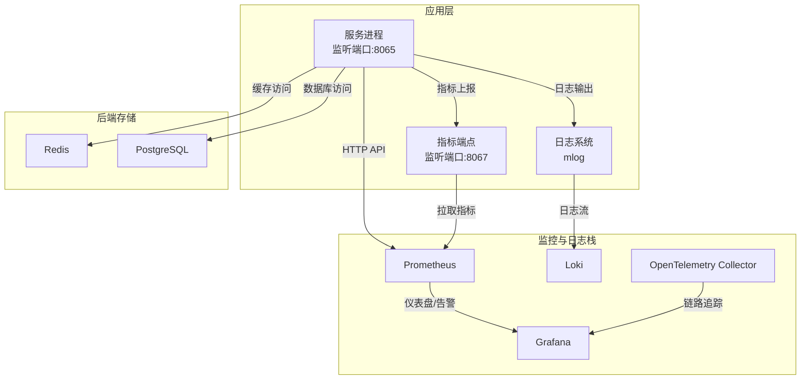
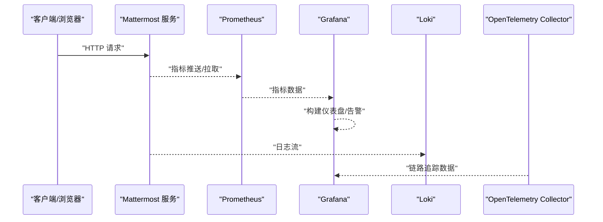
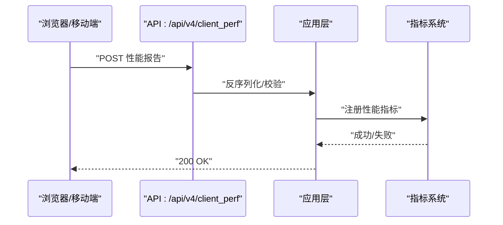
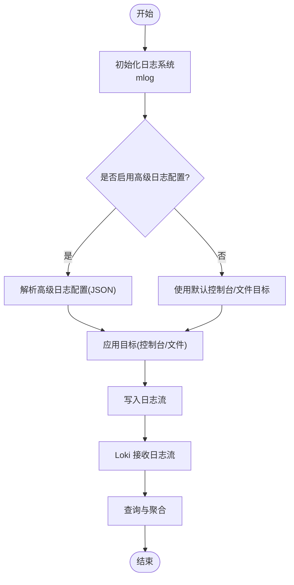
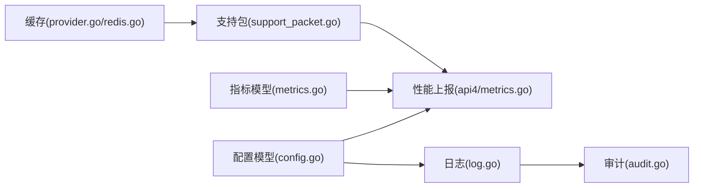

# 监控与日志

<cite>
**本文引用的文件**
- [config.go](file://server/public/model/config.go)
- [metrics.go](file://server/public/model/metrics.go)
- [metrics.go](file://server/channels/api4/metrics.go)
- [log.go](file://server/channels/app/platform/log.go)
- [docker-compose.yaml](file://server/docker-compose.yaml)
- [docker-compose.generated.yml](file://server/docker-compose.generated.yml)
- [docker-compose.makefile.yml](file://server/docker-compose.makefile.yml)
- [provider.go](file://server/platform/services/cache/provider.go)
- [redis.go](file://server/platform/services/cache/redis.go)
- [support_packet.go](file://server/channels/app/platform/support_packet.go)
- [support_packet.go](file://server/public/model/support_packet.go)
- [audit.go](file://server/channels/app/audit.go)
- [levels.go](file://server/public/shared/mlog/levels.go)
</cite>

## 目录
1. [简介](#简介)
2. [项目结构](#项目结构)
3. [核心组件](#核心组件)
4. [架构总览](#架构总览)
5. [详细组件分析](#详细组件分析)
6. [依赖关系分析](#依赖关系分析)
7. [性能考量](#性能考量)
8. [故障排查指南](#故障排查指南)
9. [结论](#结论)
10. [附录](#附录)

## 简介
本指南面向运维与平台工程团队，系统化阐述 Mattermost 在容器化环境中的监控与日志体系：Prometheus 指标采集（应用性能、数据库、缓存、业务指标）、Grafana 可视化与告警、Loki 日志聚合与查询、OpenTelemetry 分布式追踪集成、应用内部指标暴露与自定义指标扩展、日志格式标准化与敏感信息脱敏策略，以及告警阈值与通知通道配置建议。文档以仓库中现有实现为依据，结合容器编排文件，给出可落地的配置步骤与最佳实践。

## 项目结构
围绕监控与日志的关键目录与文件：
- 配置模型与默认值：server/public/model/config.go
- 客户端性能指标模型：server/public/model/metrics.go
- 性能指标上报接口：server/channels/api4/metrics.go
- 日志子系统初始化与高级日志目标管理：server/channels/app/platform/log.go
- 容器编排与外部组件暴露：server/docker-compose.yaml、server/docker-compose.generated.yml、server/docker-compose.makefile.yml
- 缓存与指标对接：server/platform/services/cache/provider.go、server/platform/services/cache/redis.go
- 支持包与数据库统计字段：server/channels/app/platform/support_packet.go、server/public/model/support_packet.go
- 审计日志与自定义日志级别：server/channels/app/audit.go、server/public/shared/mlog/levels.go

图示来源
- [docker-compose.yaml:69-94](file://server/docker-compose.yaml#L69-L94)
- [docker-compose.generated.yml:1-17](file://server/docker-compose.generated.yml#L1-L17)
- [docker-compose.makefile.yml:103-116](file://server/docker-compose.makefile.yml#L103-L116)

章节来源
- [docker-compose.yaml:69-94](file://server/docker-compose.yaml#L69-L94)
- [docker-compose.generated.yml:1-17](file://server/docker-compose.generated.yml#L1-L17)
- [docker-compose.makefile.yml:103-116](file://server/docker-compose.makefile.yml#L103-L116)

## 核心组件
- 指标配置与默认值：MetricsSettings 提供监听地址、开关、客户端指标与通知指标等配置项，并设置默认值；支持客户端侧用户ID白名单限制数量。
- 客户端性能指标模型：定义了前端/移动端关键体验指标类型、采样结构与校验逻辑。
- 指标上报接口：提供 /api/v4/client_perf 的 POST 接口，接收客户端性能报告并进行有效性校验。
- 日志系统：统一初始化 mlog，支持标准输出与文件目标；支持移除未授权的日志目标；支持基于 JSON 的高级日志配置；支持审计日志的独立配置源。
- 缓存与指标对接：Redis 缓存提供连接与 Ping 能力，缓存提供者可注入 MetricsInterface 以接入指标采集。
- 数据库统计字段：支持包中包含数据库连接池等待时长、连接关闭计数、PostgreSQL 特有命中率、死锁、临时文件等字段，便于在监控面板中展示。

章节来源
- [config.go:1185-1228](file://server/public/model/config.go#L1185-L1228)
- [metrics.go:13-161](file://server/public/model/metrics.go#L13-L161)
- [metrics.go:13-41](file://server/channels/api4/metrics.go#L13-L41)
- [log.go:31-86](file://server/channels/app/platform/log.go#L31-L86)
- [provider.go:125-146](file://server/platform/services/cache/provider.go#L125-L146)
- [redis.go:24-52](file://server/platform/services/cache/redis.go#L24-L52)
- [support_packet.go:56-67](file://server/channels/app/platform/support_packet.go#L56-L67)
- [support_packet.go:70-85](file://server/public/model/support_packet.go#L70-L85)

## 架构总览
下图展示了 Mattermost 与外部监控与日志组件的交互关系，以及指标与日志的流向。

图示来源
- [docker-compose.yaml:69-94](file://server/docker-compose.yaml#L69-L94)
- [docker-compose.generated.yml:1-17](file://server/docker-compose.generated.yml#L1-L17)
- [docker-compose.makefile.yml:103-116](file://server/docker-compose.makefile.yml#L103-L116)

## 详细组件分析

### Prometheus 指标采集与配置
- 指标端点与开关
  - 应用通过 MetricsSettings.ListenAddress 暴露指标，默认监听端口为 8067；可通过配置启用/禁用指标功能及客户端指标、通知指标。
  - 客户端侧用户ID白名单限制数量，避免过多标签基数导致指标膨胀。
- 指标类型与来源
  - 客户端性能指标：TTFB、TTLB、FCP、LCP、INP、CLS、长任务、页面加载时长、频道/团队切换时长、桌面端 CPU/内存、移动端网络请求统计等。
  - 业务指标：通知相关指标由 EnableNotificationMetrics 控制。
- 上报流程
  - 前端通过 /api/v4/client_perf POST 将性能报告提交到服务端，服务端进行版本与时间窗口校验后注册到指标系统。

图示来源
- [metrics.go:17-40](file://server/channels/api4/metrics.go#L17-L40)
- [metrics.go:99-134](file://server/public/model/metrics.go#L99-L134)

章节来源
- [config.go:1185-1228](file://server/public/model/config.go#L1185-L1228)
- [metrics.go:13-161](file://server/public/model/metrics.go#L13-L161)
- [metrics.go:13-41](file://server/channels/api4/metrics.go#L13-L41)

### Grafana 仪表盘与告警
- 组件暴露
  - Grafana 默认端口 3000，已通过 docker-compose 暴露。
- 建议的仪表盘与指标
  - 应用性能：页面加载时长、TTFB/TTLB、INP/CLS、移动端网络请求统计。
  - 缓存健康：Redis Ping 成功、键空间命中率（需结合缓存指标）。
  - 数据库健康：连接池等待时长、连接关闭计数、PostgreSQL 命中率、死锁、临时文件、最长查询时长等。
  - 业务指标：通知发送速率、失败率、用户活跃度等。
- 告警规则
  - 基于 Prometheus 报警规则（PromQL），建议设置：
    - 页面加载时长 P95/P99 超阈
    - INP/CLS 异常升高
    - Redis 连接失败或延迟异常
    - 数据库等待时长持续升高
    - 通知发送失败率上升
  - 通知渠道：邮件、Webhook、IM 机器人等。

章节来源
- [docker-compose.yaml:76-82](file://server/docker-compose.yaml#L76-L82)
- [support_packet.go:56-67](file://server/channels/app/platform/support_packet.go#L56-L67)
- [support_packet.go:70-85](file://server/public/model/support_packet.go#L70-L85)

### Loki 日志聚合与查询
- 组件暴露
  - Loki 默认端口 3100，已通过 docker-compose 暴露。
- 日志格式与目标
  - 应用使用 mlog 初始化日志系统，支持标准输出与文件目标；支持高级日志配置（JSON），可定义多个目标（控制台、文件等）。
  - 审计日志可配置独立的高级日志配置源，便于分离审计与常规日志。
- 查询建议
  - 使用日志标签（如 service、instance、level、component）进行过滤与聚合。
  - 常见查询模式：按时间范围、按级别、按组件、按错误堆栈关键字。
- 日志轮转
  - 建议通过文件目标配合外部轮转工具（如 logrotate）实现日志轮转与压缩，避免单文件过大影响查询性能。

图示来源
- [log.go:31-86](file://server/channels/app/platform/log.go#L31-L86)
- [audit.go:127-151](file://server/channels/app/audit.go#L127-L151)

章节来源
- [docker-compose.yaml:83-89](file://server/docker-compose.yaml#L83-L89)
- [log.go:31-86](file://server/channels/app/platform/log.go#L31-L86)
- [audit.go:127-151](file://server/channels/app/audit.go#L127-L151)

### OpenTelemetry 分布式追踪集成
- 组件暴露
  - OpenTelemetry Collector 默认端口 13133，已通过 docker-compose 暴露。
- 集成建议
  - 在应用侧引入 OTel SDK，配置 Collector 地址与导出协议（OTLP），对关键链路（HTTP 请求、数据库调用、缓存操作）打点。
  - 在 Grafana 中配置 OTel 数据源，构建端到端链路视图，定位慢调用与热点。

章节来源
- [docker-compose.yaml:90-94](file://server/docker-compose.yaml#L90-L94)
- [docker-compose.makefile.yml:110-116](file://server/docker-compose.makefile.yml#L110-L116)

### 应用内部指标暴露与自定义指标
- 指标端点
  - 通过 MetricsSettings.ListenAddress 暴露指标，默认 8067；可按需调整端口与路径。
- 自定义指标
  - 在应用中新增指标时，遵循现有指标命名规范与标签设计，避免标签基数爆炸。
  - 对于客户端性能指标，参考 PerformanceReport 结构体，确保版本兼容与时间窗口有效。

章节来源
- [config.go:1185-1228](file://server/public/model/config.go#L1185-L1228)
- [metrics.go:99-134](file://server/public/model/metrics.go#L99-L134)

### 缓存与数据库指标
- 缓存
  - Redis 提供 Ping 能力用于连通性检测；缓存提供者可注入 MetricsInterface 以便采集缓存相关指标。
- 数据库
  - 支持包中包含数据库连接池等待时长、连接关闭计数、PostgreSQL 命中率、死锁、临时文件、最长查询时长等字段，便于在监控面板中展示。

章节来源
- [provider.go:125-146](file://server/platform/services/cache/provider.go#L125-L146)
- [redis.go:24-52](file://server/platform/services/cache/redis.go#L24-L52)
- [support_packet.go:56-67](file://server/channels/app/platform/support_packet.go#L56-L67)
- [support_packet.go:70-85](file://server/public/model/support_packet.go#L70-L85)

## 依赖关系分析
- 组件耦合
  - 日志系统与配置解耦，支持动态重载；审计日志与常规日志可分别配置。
  - 指标系统与应用层通过 MetricsSettings 解耦，便于按需开启/关闭。
  - 缓存提供者与指标接口解耦，便于替换实现与扩展。
- 外部依赖
  - Prometheus、Grafana、Loki、OpenTelemetry Collector 通过 docker-compose 暴露端口，形成完整的观测闭环。

图示来源
- [config.go:1185-1228](file://server/public/model/config.go#L1185-L1228)
- [metrics.go:13-161](file://server/public/model/metrics.go#L13-L161)
- [metrics.go:13-41](file://server/channels/api4/metrics.go#L13-L41)
- [log.go:31-86](file://server/channels/app/platform/log.go#L31-L86)
- [audit.go:127-151](file://server/channels/app/audit.go#L127-L151)
- [provider.go:125-146](file://server/platform/services/cache/provider.go#L125-L146)
- [redis.go:24-52](file://server/platform/services/cache/redis.go#L24-L52)
- [support_packet.go:56-67](file://server/channels/app/platform/support_packet.go#L56-L67)

## 性能考量
- 指标基数控制
  - 客户端侧用户ID白名单数量限制，避免过多标签导致指标系统压力。
- 日志级别与格式
  - 使用标准日志级别与 JSON 格式，便于 Loki 快速解析与过滤。
- 缓存与数据库
  - 合理设置缓存 TTL 与过期策略；关注数据库等待时长与死锁指标，及时优化慢查询。

## 故障排查指南
- 日志读取与安全
  - 平台服务提供日志读取能力，会校验日志文件路径，防止越权读取；若返回 403/500，检查日志文件路径与权限。
- 审计日志配置
  - 审计日志可配置独立的高级日志配置源；若配置无效，检查 JSON 格式与日志级别定义。
- 指标不可用
  - 若客户端性能指标上报无效，检查 MetricsSettings.EnableClientMetrics 与 ListenAddress 是否正确；确认上报接口路径与参数格式。

章节来源
- [log.go:105-200](file://server/channels/app/platform/log.go#L105-L200)
- [audit.go:127-151](file://server/channels/app/audit.go#L127-L151)
- [metrics.go:17-40](file://server/channels/api4/metrics.go#L17-L40)

## 结论
通过在 Mattermost 中启用指标端点、配置 Loki 日志聚合与 Grafana 可视化、集成 OpenTelemetry 进行分布式追踪，并结合缓存与数据库健康指标，可以构建一套完善的可观测性体系。建议在生产环境中严格控制指标基数、规范日志格式与级别、合理设置告警阈值与通知渠道，以获得稳定可靠的监控与日志体验。

## 附录
- 关键端口与组件
  - Prometheus: 9090
  - Grafana: 3000
  - Loki: 3100
  - OpenTelemetry Collector: 13133
  - 指标端点: 8067
- 建议的监控主题
  - 前端性能（TTFB/LCP/INP/CLS）
  - 缓存健康（连接、命中率、延迟）
  - 数据库健康（等待时长、死锁、临时文件）
  - 业务指标（通知、用户活跃度）