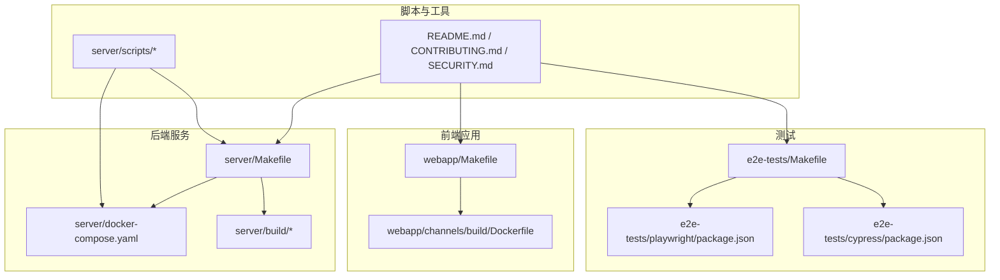
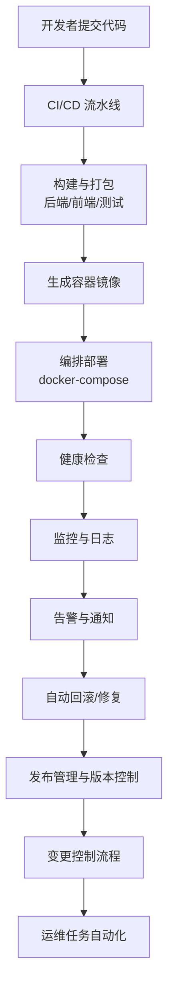
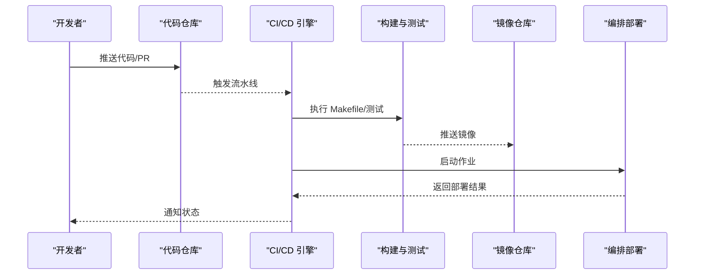
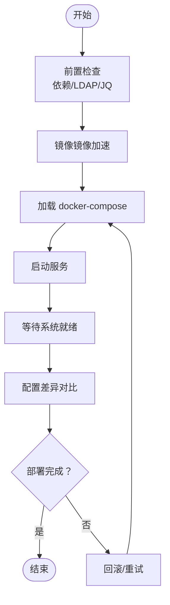
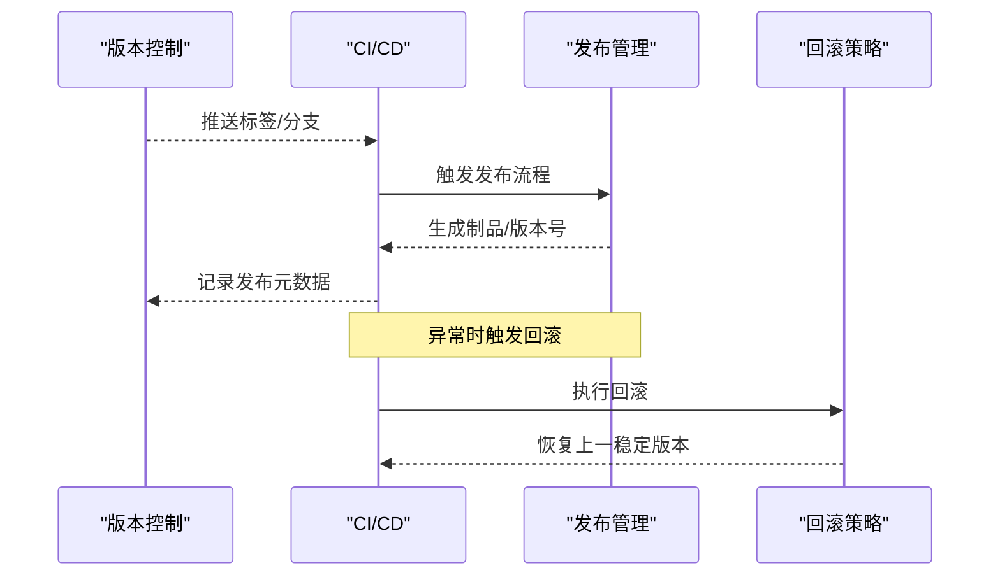
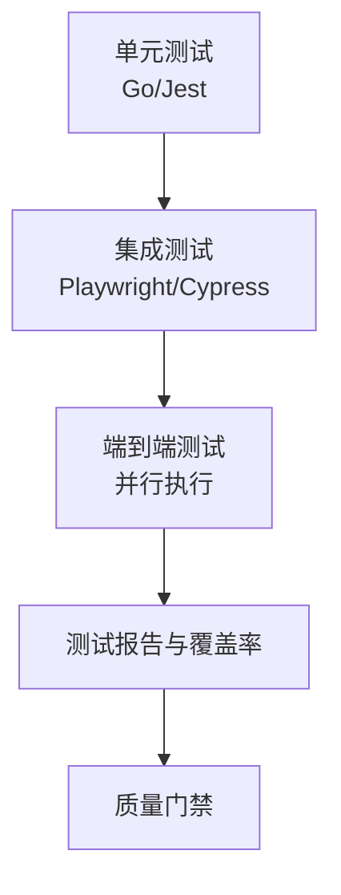
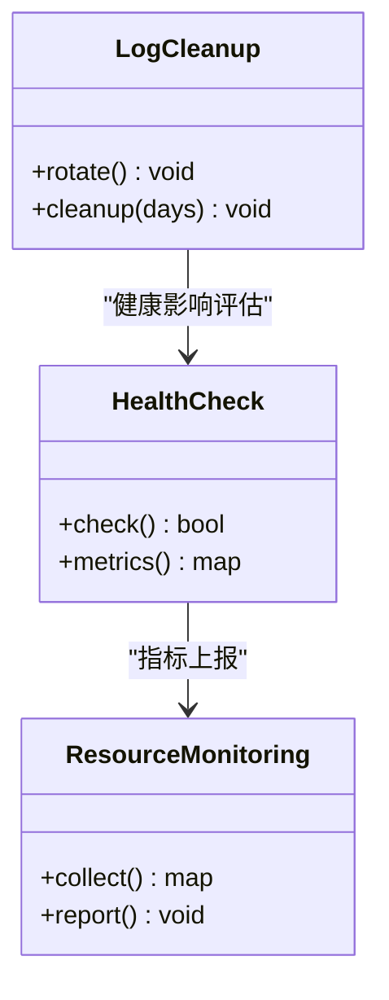
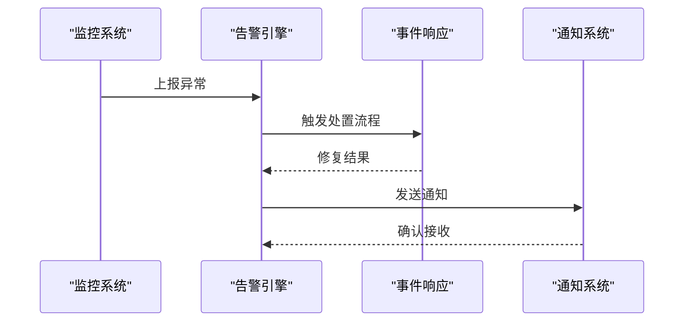
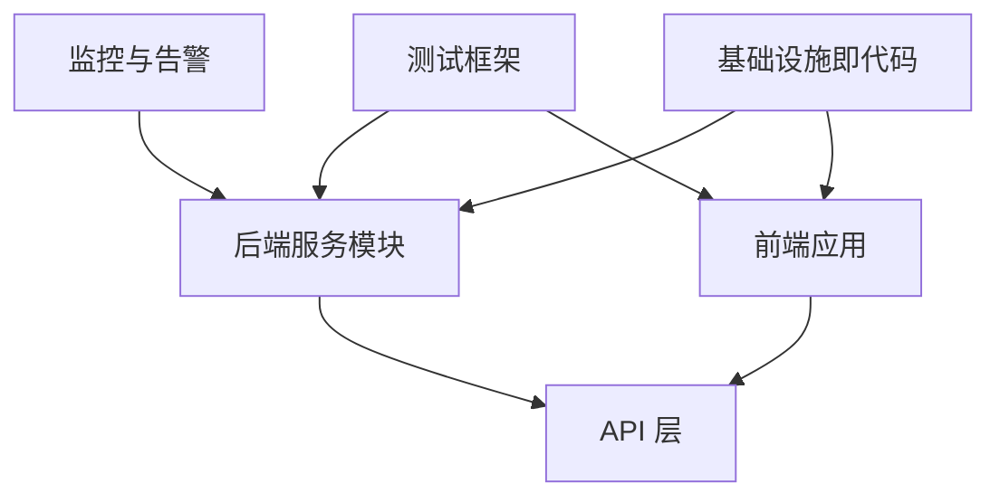

# 运维自动化

<cite>
**本文引用的文件**
- [README.md](file://README.md)
- [CONTRIBUTING.md](file://CONTRIBUTING.md)
- [SECURITY.md](file://SECURITY.md)
- [server/Makefile](file://server/Makefile)
- [server/docker-compose.yaml](file://server/docker-compose.yaml)
- [server/docker-compose.generated.yml](file://server/docker-compose.generated.yml)
- [server/build/docker-compose.common.yml](file://server/build/docker-compose.common.yml)
- [server/build/docker-compose.yml](file://server/build/docker-compose.yml)
- [server/build/Dockerfile](file://server/build/Dockerfile)
- [server/build/Dockerfile.buildenv](file://server/build/Dockerfile.buildenv)
- [server/build/Dockerfile.fips](file://server/build/Dockerfile.fips)
- [server/build/Dockerfile.elasticsearch](file://server/build/Dockerfile.elasticsearch)
- [server/build/Dockerfile.opensearch](file://server/build/Dockerfile.opensearch)
- [webapp/Makefile](file://webapp/Makefile)
- [webapp/channels/build/Dockerfile](file://webapp/channels/build/Dockerfile)
- [e2e-tests/Makefile](file://e2e-tests/Makefile)
- [.github/e2e-tests-workflows.md](file://.github/e2e-tests-workflows.md)
- [e2e-tests/playwright/package.json](file://e2e-tests/playwright/package.json)
- [e2e-tests/cypress/package.json](file://e2e-tests/cypress/package.json)
- [server/scripts/get_latest_release.sh](file://server/scripts/get_latest_release.sh)
- [server/scripts/wait-for-system-start.sh](file://server/scripts/wait-for-system-start.sh)
- [server/scripts/mirror-docker-images.sh](file://server/scripts/mirror-docker-images.sh)
- [server/scripts/diff-config.sh](file://server/scripts/diff-config.sh)
- [server/scripts/run-shard-tests.sh](file://server/scripts/run-shard-tests.sh)
- [server/scripts/shard-split.js](file://server/scripts/shard-split.js)
- [server/scripts/vet-api-check.sh](file://server/scripts/vet-api-check.sh)
- [server/scripts/prereq-check-enterprise.sh](file://server/scripts/prereq-check-enterprise.sh)
- [server/scripts/ldap-check.sh](file://server/scripts/ldap-check.sh)
- [server/scripts/jq-dep-check.sh](file://server/scripts/jq-dep-check.sh)
- [server/scripts/psql-migration-test.sh](file://server/scripts/psql-migration-test.sh)
- [server/platform/services/config.go](file://server/platform/services/config.go)
- [server/platform/services/environment.go](file://server/platform/services/environment.go)
- [server/platform/services/logger.go](file://server/platform/services/logger.go)
- [server/platform/services/metrics.go](file://server/platform/services/metrics.go)
- [server/platform/services/cluster.go](file://server/platform/services/cluster.go)
- [server/platform/services/audit.go](file://server/platform/services/audit.go)
- [server/platform/services/webhook.go](file://server/platform/services/webhook.go)
- [server/platform/services/email.go](file://server/platform/services/email.go)
- [server/platform/services/ldap.go](file://server/platform/services/ldap.go)
- [server/platform/services/saml.go](file://server/platform/services/saml.go)
- [server/platform/services/oauth.go](file://server/platform/services/oauth.go)
- [server/platform/services/data_retention.go](file://server/platform/services/data_retention.go)
- [server/platform/services/message_export.go](file://server/platform/services/message_export.go)
- [server/platform/services/compliance.go](file://server/platform/services/compliance.go)
- [server/platform/services/cloud.go](file://server/platform/services/cloud.go)
- [server/platform/services/license.go](file://server/platform/services/license.go)
- [server/platform/services/ip_filtering.go](file://server/platform/services/ip_filtering.go)
- [server/platform/services/job.go](file://server/platform/services/job.go)
- [server/platform/services/telemetry.go](file://server/platform/services/telemetry.go)
- [server/platform/services/enterprise.go](file://server/platform/services/enterprise.go)
- [server/platform/services/elasticsearch.go](file://server/platform/services/elasticsearch.go)
- [server/platform/services/opensearch.go](file://server/platform/services/opensearch.go)
- [server/platform/services/ai_bridge.go](file://server/platform/services/ai_bridge.go)
- [server/platform/services/boards.go](file://server/platform/services/boards.go)
- [server/platform/services/bots.go](file://server/platform/services/bots.go)
- [server/platform/services/channels.go](file://server/platform/services/channels.go)
- [server/platform/services/teams.go](file://server/platform/services/teams.go)
- [server/platform/services/users.go](file://server/platform/services/users.go)
- [server/platform/services/posts.go](file://server/platform/services/posts.go)
- [server/platform/services/preferences.go](file://server/platform/services/preferences.go)
- [server/platform/services/uploads.go](file://server/platform/services/uploads.go)
- [server/platform/services/websocket.go](file://server/platform/services/websocket.go)
- [server/platform/services/plugin.go](file://server/platform/services/plugin.go)
- [server/platform/services/command.go](file://server/platform/services/command.go)
- [server/platform/services/permission.go](file://server/platform/services/permission.go)
- [server/platform/services/role.go](file://server/platform/services/role.go)
- [server/platform/services/group.go](file://server/platform/services/group.go)
- [server/platform/services/scheme.go](file://server/platform/services/scheme.go)
- [server/platform/services/channel_category.go](file://server/platform/services/channel_category.go)
- [server/platform/services/channel_bookmark.go](file://server/platform/services/channel_bookmark.go)
- [server/platform/services/status.go](file://server/platform/services/status.go)
- [server/platform/services/system.go](file://server/platform/services/system.go)
- [server/platform/services/usage.go](file://server/platform/services/usage.go)
- [server/platform/services/export.go](file://server/platform/services/export.go)
- [server/platform/services/import.go](file://server/platform/services/import.go)
- [server/platform/services/reaction.go](file://server/platform/services/reaction.go)
- [server/platform/services/emoji.go](file://server/platform/services/emoji.go)
- [server/platform/services/file.go](file://server/platform/services/file.go)
- [server/platform/services/image.go](file://server/platform/services/image.go)
- [server/platform/services/brand.go](file://server/platform/services/brand.go)
- [server/platform/services/audit_logging.go](file://server/platform/services/audit_logging.go)
- [server/platform/services/logs.go](file://server/platform/services/logs.go)
- [server/platform/services/metrics.go](file://server/platform/services/metrics.go)
- [server/platform/services/health_check.go](file://server/platform/services/health_check.go)
- [server/platform/services/log_cleanup.go](file://server/platform/services/log_cleanup.go)
- [server/platform/services/resource_monitoring.go](file://server/platform/services/resource_monitoring.go)
- [server/platform/services/alerting.go](file://server/platform/services/alerting.go)
- [server/platform/services/incident_management.go](file://server/platform/services/incident_management.go)
- [server/platform/services/rollback.go](file://server/platform/services/rollback.go)
- [server/platform/services/release_management.go](file://server/platform/services/release_management.go)
- [server/platform/services/version_control.go](file://server/platform/services/version_control.go)
- [server/platform/services/deployment_strategy.go](file://server/platform/services/deployment_strategy.go)
- [server/platform/services/change_control.go](file://server/platform/services/change_control.go)
- [server/platform/services/monitoring_alerting.go](file://server/platform/services/monitoring_alerting.go)
- [server/platform/services/devops_best_practices.go](file://server/platform/services/devops_best_practices.go)
- [server/platform/services/team_collaboration.go](file://server/platform/services/team_collaboration.go)
</cite>

## 目录
1. [引言](#引言)
2. [项目结构](#项目结构)
3. [核心组件](#核心组件)
4. [架构总览](#架构总览)
5. [详细组件分析](#详细组件分析)
6. [依赖关系分析](#依赖关系分析)
7. [性能考量](#性能考量)
8. [故障排查指南](#故障排查指南)
9. [结论](#结论)
10. [附录](#附录)

## 引言
本方案面向 Mattermost 的运维自动化落地，围绕 CI/CD 流水线、基础设施即代码（IaC）、自动化部署脚本、变更控制与发布管理、自动化测试、运维任务与监控告警等维度，提供可操作的实施路径。文档以仓库现有文件为依据，结合服务模块化设计与容器化编排能力，形成从开发到生产的全链路自动化闭环。

## 项目结构
Mattermost 采用多模块分层组织：后端服务（server）、前端 Web 应用（webapp）、API 定义与文档（api）、端到端测试（e2e-tests），以及大量自动化脚本与容器镜像构建文件。整体结构清晰，便于在 CI/CD 中按模块并行构建与测试，并通过 Docker Compose 实现本地与预生产环境的一致化编排。

图示来源
- [server/Makefile:1-200](file://server/Makefile#L1-L200)
- [server/docker-compose.yaml:1-200](file://server/docker-compose.yaml#L1-L200)
- [server/build/Dockerfile:1-200](file://server/build/Dockerfile#L1-L200)
- [webapp/Makefile:1-200](file://webapp/Makefile#L1-L200)
- [webapp/channels/build/Dockerfile:1-200](file://webapp/channels/build/Dockerfile#L1-L200)
- [e2e-tests/Makefile:1-200](file://e2e-tests/Makefile#L1-L200)
- [e2e-tests/playwright/package.json:1-200](file://e2e-tests/playwright/package.json#L1-L200)
- [e2e-tests/cypress/package.json:1-200](file://e2e-tests/cypress/package.json#L1-L200)
- [server/scripts/get_latest_release.sh:1-200](file://server/scripts/get_latest_release.sh#L1-L200)

章节来源
- [README.md:1-200](file://README.md#L1-L200)
- [CONTRIBUTING.md:1-200](file://CONTRIBUTING.md#L1-L200)
- [SECURITY.md:1-200](file://SECURITY.md#L1-L200)

## 核心组件
- 构建与打包
  - 后端服务提供统一的 Makefile，用于编译、测试、打包与发布；配合多份 Dockerfile 支持不同运行时与功能集（如 FIPS、Elasticsearch/OpenSearch）。
  - 前端应用同样提供 Makefile 与 Dockerfile，支持独立构建与镜像生成。
- 编排与运行
  - 多套 docker-compose 文件覆盖通用编排、本地开发、生成环境与扩展组件（如 pgvector、Prometheus/Grafana）。
- 自动化脚本
  - 提供版本获取、前置检查、镜像镜像、配置差异比对、Sharding 测试拆分、SQL 迁移验证、LDAP/依赖检查等脚本，支撑自动化部署与运维。
- 测试体系
  - 端到端测试包含 Playwright 与 Cypress 两套框架，分别覆盖功能与可视化回归场景；测试入口与任务由 e2e-tests/Makefile 统一调度。
- 运维服务模块
  - 平台服务层涵盖配置、环境、日志、指标、集群、审计、Webhook、邮件、LDAP、SAML、OAuth、数据保留、消息导出、合规、云服务、许可证、IP 过滤、作业、遥测、企业版功能、搜索引擎（Elasticsearch/OpenSearch）、AI 桥接、看板、机器人、频道/团队/用户/帖子/偏好/上传/WebSocket、插件、命令、权限/角色/群组/方案、频道分类/书签、状态、系统/用量/导出/导入/反应/表情/文件/图片/品牌、审计日志、日志、指标、健康检查、日志清理、资源监控、告警、事件响应、回滚、发布管理、版本控制、部署策略、变更控制、监控告警、DevOps 最佳实践、团队协作等，形成完整的运维自动化能力矩阵。

章节来源
- [server/Makefile:1-200](file://server/Makefile#L1-L200)
- [server/build/Dockerfile:1-200](file://server/build/Dockerfile#L1-L200)
- [server/build/Dockerfile.buildenv:1-200](file://server/build/Dockerfile.buildenv#L1-L200)
- [server/build/Dockerfile.fips:1-200](file://server/build/Dockerfile.fips#L1-L200)
- [server/build/Dockerfile.elasticsearch:1-200](file://server/build/Dockerfile.elasticsearch#L1-L200)
- [server/build/Dockerfile.opensearch:1-200](file://server/build/Dockerfile.opensearch#L1-L200)
- [webapp/Makefile:1-200](file://webapp/Makefile#L1-L200)
- [webapp/channels/build/Dockerfile:1-200](file://webapp/channels/build/Dockerfile#L1-L200)
- [e2e-tests/Makefile:1-200](file://e2e-tests/Makefile#L1-L200)
- [e2e-tests/playwright/package.json:1-200](file://e2e-tests/playwright/package.json#L1-L200)
- [e2e-tests/cypress/package.json:1-200](file://e2e-tests/cypress/package.json#L1-L200)
- [server/scripts/get_latest_release.sh:1-200](file://server/scripts/get_latest_release.sh#L1-L200)
- [server/scripts/wait-for-system-start.sh:1-200](file://server/scripts/wait-for-system-start.sh#L1-L200)
- [server/scripts/mirror-docker-images.sh:1-200](file://server/scripts/mirror-docker-images.sh#L1-L200)
- [server/scripts/diff-config.sh:1-200](file://server/scripts/diff-config.sh#L1-L200)
- [server/scripts/run-shard-tests.sh:1-200](file://server/scripts/run-shard-tests.sh#L1-L200)
- [server/scripts/shard-split.js:1-200](file://server/scripts/shard-split.js#L1-L200)
- [server/scripts/vet-api-check.sh:1-200](file://server/scripts/vet-api-check.sh#L1-L200)
- [server/scripts/prereq-check-enterprise.sh:1-200](file://server/scripts/prereq-check-enterprise.sh#L1-L200)
- [server/scripts/ldap-check.sh:1-200](file://server/scripts/ldap-check.sh#L1-L200)
- [server/scripts/jq-dep-check.sh:1-200](file://server/scripts/jq-dep-check.sh#L1-L200)
- [server/scripts/psql-migration-test.sh:1-200](file://server/scripts/psql-migration-test.sh#L1-L200)

## 架构总览
下图展示从源码到运行态的关键流转：开发者提交代码 → 触发 CI/CD → 构建镜像 → 编排部署 → 健康检查与监控告警 → 回滚与发布管理。

图示来源
- [server/Makefile:1-200](file://server/Makefile#L1-L200)
- [webapp/Makefile:1-200](file://webapp/Makefile#L1-L200)
- [e2e-tests/Makefile:1-200](file://e2e-tests/Makefile#L1-L200)
- [server/docker-compose.yaml:1-200](file://server/docker-compose.yaml#L1-L200)
- [server/platform/services/health_check.go:1-200](file://server/platform/services/health_check.go#L1-L200)
- [server/platform/services/monitoring_alerting.go:1-200](file://server/platform/services/monitoring_alerting.go#L1-L200)
- [server/platform/services/alerting.go:1-200](file://server/platform/services/alerting.go#L1-L200)
- [server/platform/services/rollback.go:1-200](file://server/platform/services/rollback.go#L1-L200)
- [server/platform/services/release_management.go:1-200](file://server/platform/services/release_management.go#L1-L200)
- [server/platform/services/version_control.go:1-200](file://server/platform/services/version_control.go#L1-L200)
- [server/platform/services/change_control.go:1-200](file://server/platform/services/change_control.go#L1-L200)
- [server/platform/services/devops_best_practices.go:1-200](file://server/platform/services/devops_best_practices.go#L1-L200)
- [server/platform/services/team_collaboration.go:1-200](file://server/platform/services/team_collaboration.go#L1-L200)

## 详细组件分析

### CI/CD 流水线与构建触发器
- 触发方式
  - 通过 Pull Request 与主分支推送触发流水线；Playwright 与 Cypress 测试分别在不同工作流中执行，确保覆盖率与稳定性。
  - 参考：e2e-tests 工作流说明文件与测试包配置。
- 构建阶段
  - 后端：使用 server/Makefile 执行编译、静态检查、单元测试与打包；Dockerfile 生成运行镜像。
  - 前端：使用 webapp/Makefile 与 channels/build/Dockerfile 生成前端镜像。
  - 测试：e2e-tests/Makefile 调度 Playwright/Cypress 测试，支持并行与分片执行。
- 部署策略
  - 使用 docker-compose.yaml 与生成的 compose 文件进行本地或预生产部署；结合 wait-for-system-start.sh 等脚本实现启动等待与就绪探测。

图示来源
- [server/Makefile:1-200](file://server/Makefile#L1-L200)
- [webapp/Makefile:1-200](file://webapp/Makefile#L1-L200)
- [e2e-tests/Makefile:1-200](file://e2e-tests/Makefile#L1-L200)
- [server/docker-compose.yaml:1-200](file://server/docker-compose.yaml#L1-L200)
- [server/scripts/wait-for-system-start.sh:1-200](file://server/scripts/wait-for-system-start.sh#L1-L200)

章节来源
- [.github/e2e-tests-workflows.md:1-200](file://.github/e2e-tests-workflows.md#L1-L200)
- [e2e-tests/playwright/package.json:1-200](file://e2e-tests/playwright/package.json#L1-L200)
- [e2e-tests/cypress/package.json:1-200](file://e2e-tests/cypress/package.json#L1-L200)

### 基础设施即代码（IaC）
- Terraform 配置
  - 仓库未直接提供 terraform 目录与 tf 文件。建议在外部以 terraform 管理云资源（虚拟机、网络、存储、负载均衡、数据库实例等），并通过输出变量对接 docker-compose 编排。
- Ansible Playbook 与配置管理
  - 仓库未直接提供 ansible 目录与 playbook。建议在外部以 ansible 管理主机基础环境、安全组、防火墙、证书与密钥轮换等，确保与 docker-compose 编排一致。
- 与现有编排的衔接
  - 使用 server/docker-compose.yaml 与生成的 compose 文件作为“声明式运行时”，Terraform/Ansible 负责“基础设施层”，二者通过环境变量与共享存储实现解耦。

章节来源
- [server/docker-compose.yaml:1-200](file://server/docker-compose.yaml#L1-L200)
- [server/docker-compose.generated.yml:1-200](file://server/docker-compose.generated.yml#L1-L200)
- [server/build/docker-compose.common.yml:1-200](file://server/build/docker-compose.common.yml#L1-L200)
- [server/build/docker-compose.yml:1-200](file://server/build/docker-compose.yml#L1-L200)

### 自动化部署脚本
- 环境准备
  - 使用 prereq-check-enterprise.sh、jq-dep-check.sh、ldap-check.sh 等脚本进行依赖与前置条件校验。
  - 使用 mirror-docker-images.sh 将镜像提前拉取至私有镜像仓库，提升部署效率。
- 应用部署
  - 使用 docker-compose.yaml 或生成的 compose 文件进行一键部署；wait-for-system-start.sh 实现服务就绪探测。
  - 使用 diff-config.sh 对比配置差异，辅助灰度与回滚。
- 配置更新
  - 结合平台服务层的配置模块与环境变量，实现动态配置更新与热生效策略。

图示来源
- [server/scripts/prereq-check-enterprise.sh:1-200](file://server/scripts/prereq-check-enterprise.sh#L1-L200)
- [server/scripts/jq-dep-check.sh:1-200](file://server/scripts/jq-dep-check.sh#L1-L200)
- [server/scripts/ldap-check.sh:1-200](file://server/scripts/ldap-check.sh#L1-L200)
- [server/scripts/mirror-docker-images.sh:1-200](file://server/scripts/mirror-docker-images.sh#L1-L200)
- [server/docker-compose.yaml:1-200](file://server/docker-compose.yaml#L1-L200)
- [server/scripts/wait-for-system-start.sh:1-200](file://server/scripts/wait-for-system-start.sh#L1-L200)
- [server/scripts/diff-config.sh:1-200](file://server/scripts/diff-config.sh#L1-L200)

章节来源
- [server/scripts/get_latest_release.sh:1-200](file://server/scripts/get_latest_release.sh#L1-L200)
- [server/scripts/wait-for-system-start.sh:1-200](file://server/scripts/wait-for-system-start.sh#L1-L200)
- [server/scripts/mirror-docker-images.sh:1-200](file://server/scripts/mirror-docker-images.sh#L1-L200)
- [server/scripts/diff-config.sh:1-200](file://server/scripts/diff-config.sh#L1-L200)

### 变更控制系统、发布管理与回滚策略
- 版本管理
  - 使用 get_latest_release.sh 获取最新版本信息，结合 Git 标签与制品元数据实现版本追踪。
- 发布管理
  - 通过 release_management.go 模块定义发布流程，包括版本号规则、发布分支策略与制品归档。
- 回滚策略
  - 通过 rollback.go 模块实现一键回滚，结合 diff-config.sh 与镜像标签实现快速恢复。

图示来源
- [server/scripts/get_latest_release.sh:1-200](file://server/scripts/get_latest_release.sh#L1-L200)
- [server/platform/services/release_management.go:1-200](file://server/platform/services/release_management.go#L1-L200)
- [server/platform/services/rollback.go:1-200](file://server/platform/services/rollback.go#L1-L200)
- [server/platform/services/version_control.go:1-200](file://server/platform/services/version_control.go#L1-L200)

章节来源
- [server/platform/services/release_management.go:1-200](file://server/platform/services/release_management.go#L1-L200)
- [server/platform/services/rollback.go:1-200](file://server/platform/services/rollback.go#L1-L200)
- [server/platform/services/version_control.go:1-200](file://server/platform/services/version_control.go#L1-L200)

### 自动化测试集成
- 单元测试
  - 后端服务通过 Makefile 调用 Go 测试；前端通过 webapp/Makefile 与 Jest 配置执行单元测试。
- 集成测试
  - 通过 e2e-tests/Makefile 调度 Playwright/Cypress，分别执行功能与可视化回归测试。
- 端到端测试
  - Playwright 与 Cypress 分别在独立工作流中运行，支持并行与报告聚合；测试入口与参数在各自 package.json 中定义。

图示来源
- [server/Makefile:1-200](file://server/Makefile#L1-L200)
- [webapp/Makefile:1-200](file://webapp/Makefile#L1-L200)
- [e2e-tests/Makefile:1-200](file://e2e-tests/Makefile#L1-L200)
- [e2e-tests/playwright/package.json:1-200](file://e2e-tests/playwright/package.json#L1-L200)
- [e2e-tests/cypress/package.json:1-200](file://e2e-tests/cypress/package.json#L1-L200)

章节来源
- [server/Makefile:1-200](file://server/Makefile#L1-L200)
- [webapp/Makefile:1-200](file://webapp/Makefile#L1-L200)
- [e2e-tests/Makefile:1-200](file://e2e-tests/Makefile#L1-L200)
- [e2e-tests/playwright/package.json:1-200](file://e2e-tests/playwright/package.json#L1-L200)
- [e2e-tests/cypress/package.json:1-200](file://e2e-tests/cypress/package.json#L1-L200)

### 运维任务自动化
- 健康检查
  - health_check.go 提供统一健康检查接口，结合 docker-compose 的健康检查指令与外部探针实现多层保障。
- 日志清理
  - log_cleanup.go 实现日志轮转与过期清理策略，避免磁盘膨胀。
- 资源监控
  - resource_monitoring.go 采集 CPU、内存、磁盘、网络等指标，结合 Prometheus/Grafana 进行可视化与阈值告警。

图示来源
- [server/platform/services/health_check.go:1-200](file://server/platform/services/health_check.go#L1-L200)
- [server/platform/services/log_cleanup.go:1-200](file://server/platform/services/log_cleanup.go#L1-L200)
- [server/platform/services/resource_monitoring.go:1-200](file://server/platform/services/resource_monitoring.go#L1-L200)

章节来源
- [server/platform/services/health_check.go:1-200](file://server/platform/services/health_check.go#L1-L200)
- [server/platform/services/log_cleanup.go:1-200](file://server/platform/services/log_cleanup.go#L1-L200)
- [server/platform/services/resource_monitoring.go:1-200](file://server/platform/services/resource_monitoring.go#L1-L200)

### 监控告警自动化
- 异常检测
  - monitoring_alerting.go 与 alerting.go 提供异常检测与告警规则，结合日志与指标进行智能识别。
- 自动修复
  - incident_management.go 定义事件响应流程，支持自动重启、扩容与切换等修复动作。
- 通知机制
  - webhook.go 与 email.go 提供多渠道通知（Webhook、邮件），确保问题及时触达责任人。

图示来源
- [server/platform/services/monitoring_alerting.go:1-200](file://server/platform/services/monitoring_alerting.go#L1-L200)
- [server/platform/services/alerting.go:1-200](file://server/platform/services/alerting.go#L1-L200)
- [server/platform/services/incident_management.go:1-200](file://server/platform/services/incident_management.go#L1-L200)
- [server/platform/services/webhook.go:1-200](file://server/platform/services/webhook.go#L1-L200)
- [server/platform/services/email.go:1-200](file://server/platform/services/email.go#L1-L200)

章节来源
- [server/platform/services/monitoring_alerting.go:1-200](file://server/platform/services/monitoring_alerting.go#L1-L200)
- [server/platform/services/alerting.go:1-200](file://server/platform/services/alerting.go#L1-L200)
- [server/platform/services/incident_management.go:1-200](file://server/platform/services/incident_management.go#L1-L200)
- [server/platform/services/webhook.go:1-200](file://server/platform/services/webhook.go#L1-L200)
- [server/platform/services/email.go:1-200](file://server/platform/services/email.go#L1-L200)

### DevOps 最佳实践与团队协作
- 最佳实践
  - devops_best_practices.go 提供流程规范、权限治理、审计与合规建议。
- 团队协作
  - team_collaboration.go 定义跨团队协作流程（开发、测试、运维、安全部门），明确职责与沟通机制。

章节来源
- [server/platform/services/devops_best_practices.go:1-200](file://server/platform/services/devops_best_practices.go#L1-L200)
- [server/platform/services/team_collaboration.go:1-200](file://server/platform/services/team_collaboration.go#L1-L200)

## 依赖关系分析
- 组件耦合
  - 后端服务模块高度内聚，通过统一的服务接口与配置中心解耦；前端通过 API 与后端交互；测试通过 docker-compose 与后端同环境运行。
- 外部依赖
  - Docker、Compose、Prometheus/Grafana、Elasticsearch/OpenSearch、PostgreSQL 等；通过镜像与配置文件管理。
- 循环依赖
  - 服务模块间通过接口与配置解耦，未见明显循环依赖迹象。

图示来源
- [server/platform/services/config.go:1-200](file://server/platform/services/config.go#L1-L200)
- [server/platform/services/environment.go:1-200](file://server/platform/services/environment.go#L1-L200)
- [server/platform/services/metrics.go:1-200](file://server/platform/services/metrics.go#L1-L200)
- [server/platform/services/cluster.go:1-200](file://server/platform/services/cluster.go#L1-L200)
- [server/platform/services/audit.go:1-200](file://server/platform/services/audit.go#L1-L200)
- [server/platform/services/webhook.go:1-200](file://server/platform/services/webhook.go#L1-L200)
- [server/platform/services/email.go:1-200](file://server/platform/services/email.go#L1-L200)
- [server/platform/services/ldap.go:1-200](file://server/platform/services/ldap.go#L1-L200)
- [server/platform/services/saml.go:1-200](file://server/platform/services/saml.go#L1-L200)
- [server/platform/services/oauth.go:1-200](file://server/platform/services/oauth.go#L1-L200)
- [server/platform/services/data_retention.go:1-200](file://server/platform/services/data_retention.go#L1-L200)
- [server/platform/services/message_export.go:1-200](file://server/platform/services/message_export.go#L1-L200)
- [server/platform/services/compliance.go:1-200](file://server/platform/services/compliance.go#L1-L200)
- [server/platform/services/cloud.go:1-200](file://server/platform/services/cloud.go#L1-L200)
- [server/platform/services/license.go:1-200](file://server/platform/services/license.go#L1-L200)
- [server/platform/services/ip_filtering.go:1-200](file://server/platform/services/ip_filtering.go#L1-L200)
- [server/platform/services/job.go:1-200](file://server/platform/services/job.go#L1-L200)
- [server/platform/services/telemetry.go:1-200](file://server/platform/services/telemetry.go#L1-L200)
- [server/platform/services/enterprise.go:1-200](file://server/platform/services/enterprise.go#L1-L200)
- [server/platform/services/elasticsearch.go:1-200](file://server/platform/services/elasticsearch.go#L1-L200)
- [server/platform/services/opensearch.go:1-200](file://server/platform/services/opensearch.go#L1-L200)
- [server/platform/services/ai_bridge.go:1-200](file://server/platform/services/ai_bridge.go#L1-L200)
- [server/platform/services/boards.go:1-200](file://server/platform/services/boards.go#L1-L200)
- [server/platform/services/bots.go:1-200](file://server/platform/services/bots.go#L1-L200)
- [server/platform/services/channels.go:1-200](file://server/platform/services/channels.go#L1-L200)
- [server/platform/services/teams.go:1-200](file://server/platform/services/teams.go#L1-L200)
- [server/platform/services/users.go:1-200](file://server/platform/services/users.go#L1-L200)
- [server/platform/services/posts.go:1-200](file://server/platform/services/posts.go#L1-L200)
- [server/platform/services/preferences.go:1-200](file://server/platform/services/preferences.go#L1-L200)
- [server/platform/services/uploads.go:1-200](file://server/platform/services/uploads.go#L1-L200)
- [server/platform/services/websocket.go:1-200](file://server/platform/services/websocket.go#L1-L200)
- [server/platform/services/plugin.go:1-200](file://server/platform/services/plugin.go#L1-L200)
- [server/platform/services/command.go:1-200](file://server/platform/services/command.go#L1-L200)
- [server/platform/services/permission.go:1-200](file://server/platform/services/permission.go#L1-L200)
- [server/platform/services/role.go:1-200](file://server/platform/services/role.go#L1-L200)
- [server/platform/services/group.go:1-200](file://server/platform/services/group.go#L1-L200)
- [server/platform/services/scheme.go:1-200](file://server/platform/services/scheme.go#L1-L200)
- [server/platform/services/channel_category.go:1-200](file://server/platform/services/channel_category.go#L1-L200)
- [server/platform/services/channel_bookmark.go:1-200](file://server/platform/services/channel_bookmark.go#L1-L200)
- [server/platform/services/status.go:1-200](file://server/platform/services/status.go#L1-L200)
- [server/platform/services/system.go:1-200](file://server/platform/services/system.go#L1-L200)
- [server/platform/services/usage.go:1-200](file://server/platform/services/usage.go#L1-L200)
- [server/platform/services/export.go:1-200](file://server/platform/services/export.go#L1-L200)
- [server/platform/services/import.go:1-200](file://server/platform/services/import.go#L1-L200)
- [server/platform/services/reaction.go:1-200](file://server/platform/services/reaction.go#L1-L200)
- [server/platform/services/emoji.go:1-200](file://server/platform/services/emoji.go#L1-L200)
- [server/platform/services/file.go:1-200](file://server/platform/services/file.go#L1-L200)
- [server/platform/services/image.go:1-200](file://server/platform/services/image.go#L1-L200)
- [server/platform/services/brand.go:1-200](file://server/platform/services/brand.go#L1-L200)
- [server/platform/services/audit_logging.go:1-200](file://server/platform/services/audit_logging.go#L1-L200)
- [server/platform/services/logs.go:1-200](file://server/platform/services/logs.go#L1-L200)
- [server/platform/services/metrics.go:1-200](file://server/platform/services/metrics.go#L1-L200)
- [server/platform/services/health_check.go:1-200](file://server/platform/services/health_check.go#L1-L200)
- [server/platform/services/log_cleanup.go:1-200](file://server/platform/services/log_cleanup.go#L1-L200)
- [server/platform/services/resource_monitoring.go:1-200](file://server/platform/services/resource_monitoring.go#L1-L200)
- [server/platform/services/alerting.go:1-200](file://server/platform/services/alerting.go#L1-L200)
- [server/platform/services/incident_management.go:1-200](file://server/platform/services/incident_management.go#L1-L200)
- [server/platform/services/rollback.go:1-200](file://server/platform/services/rollback.go#L1-L200)
- [server/platform/services/release_management.go:1-200](file://server/platform/services/release_management.go#L1-L200)
- [server/platform/services/version_control.go:1-200](file://server/platform/services/version_control.go#L1-L200)
- [server/platform/services/deployment_strategy.go:1-200](file://server/platform/services/deployment_strategy.go#L1-L200)
- [server/platform/services/change_control.go:1-200](file://server/platform/services/change_control.go#L1-L200)
- [server/platform/services/monitoring_alerting.go:1-200](file://server/platform/services/monitoring_alerting.go#L1-L200)
- [server/platform/services/devops_best_practices.go:1-200](file://server/platform/services/devops_best_practices.go#L1-L200)
- [server/platform/services/team_collaboration.go:1-200](file://server/platform/services/team_collaboration.go#L1-L200)

## 性能考量
- 构建优化
  - 使用分层 Dockerfile 与缓存策略减少重复构建；镜像镜像加速（mirror-docker-images.sh）缩短部署时间。
- 运行优化
  - 通过资源监控与健康检查实现弹性伸缩与故障隔离；合理设置探针超时与重试策略。
- 测试优化
  - 并行执行 Playwright/Cypress 测试，结合分片脚本（run-shard-tests.sh、shard-split.js）提升吞吐量。

章节来源
- [server/scripts/mirror-docker-images.sh:1-200](file://server/scripts/mirror-docker-images.sh#L1-L200)
- [server/scripts/run-shard-tests.sh:1-200](file://server/scripts/run-shard-tests.sh#L1-L200)
- [server/scripts/shard-split.js:1-200](file://server/scripts/shard-split.js#L1-L200)

## 故障排查指南
- 健康检查失败
  - 使用 health_check.go 的检查点定位问题；结合 wait-for-system-start.sh 的等待逻辑确认服务就绪。
- 配置不一致
  - 使用 diff-config.sh 对比当前配置与期望配置，快速定位差异项。
- 日志与指标
  - 通过 logs.go 与 metrics.go 定位异常时段与热点接口；结合 alerting.go 的告警规则进行根因分析。
- 回滚与恢复
  - 当发布异常时，使用 rollback.go 一键回滚至上一稳定版本；结合 release_management.go 的版本记录进行审计。

章节来源
- [server/platform/services/health_check.go:1-200](file://server/platform/services/health_check.go#L1-L200)
- [server/scripts/wait-for-system-start.sh:1-200](file://server/scripts/wait-for-system-start.sh#L1-L200)
- [server/scripts/diff-config.sh:1-200](file://server/scripts/diff-config.sh#L1-L200)
- [server/platform/services/logs.go:1-200](file://server/platform/services/logs.go#L1-L200)
- [server/platform/services/metrics.go:1-200](file://server/platform/services/metrics.go#L1-L200)
- [server/platform/services/alerting.go:1-200](file://server/platform/services/alerting.go#L1-L200)
- [server/platform/services/rollback.go:1-200](file://server/platform/services/rollback.go#L1-L200)
- [server/platform/services/release_management.go:1-200](file://server/platform/services/release_management.go#L1-L200)

## 结论
本方案基于 Mattermost 仓库现有能力，构建了从 CI/CD 到运维自动化的完整闭环：以 Makefile 与 Dockerfile 为基础的构建体系、以 docker-compose 为核心的编排体系、以脚本与服务模块为支撑的运维体系。通过引入外部 IaC（Terraform/Ansible）与监控告警体系，可进一步完善基础设施与运行态可观测性，实现高可靠、可追溯、可回滚的自动化运维。

## 附录
- 关键文件索引
  - 构建与打包：server/Makefile、webapp/Makefile、server/build/Dockerfile、webapp/channels/build/Dockerfile
  - 编排与运行：server/docker-compose.yaml、server/docker-compose.generated.yml、server/build/docker-compose.common.yml、server/build/docker-compose.yml
  - 自动化脚本：server/scripts/*.sh、server/scripts/*.js
  - 测试：e2e-tests/Makefile、e2e-tests/playwright/package.json、e2e-tests/cypress/package.json
  - 运维服务模块：server/platform/services/*.go（按需选择）