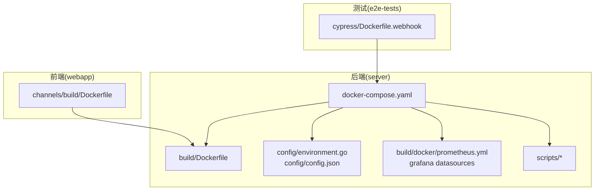
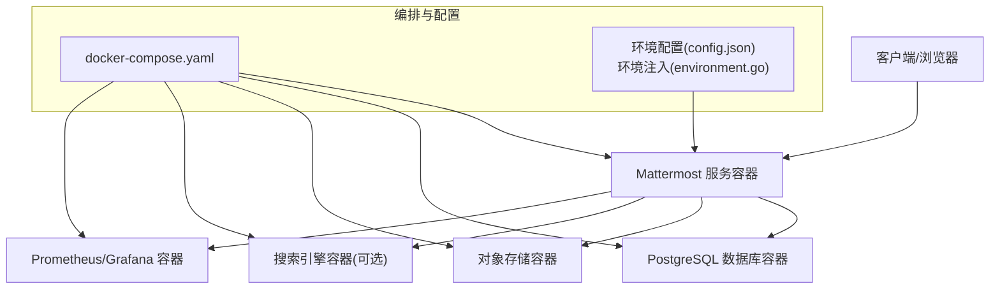
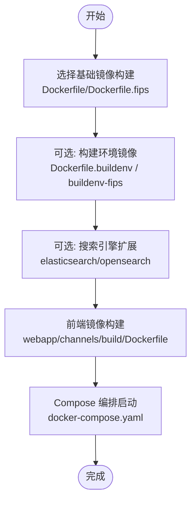
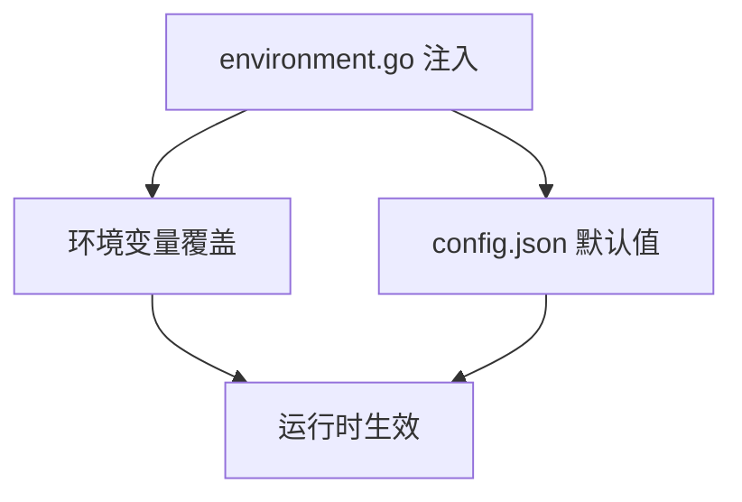
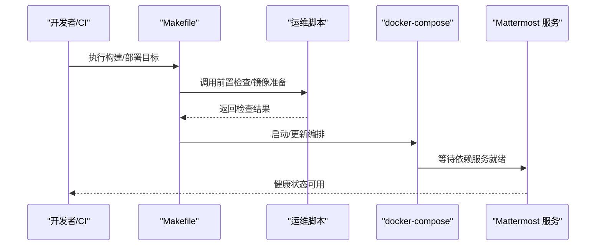
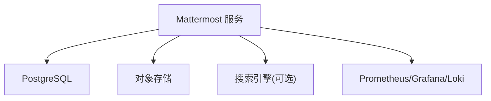

# 部署运维

<cite>
**本文引用的文件**
- [server/docker-compose.yaml](file://server/docker-compose.yaml)
- [server/docker-compose.generated.yml](file://server/docker-compose.generated.yml)
- [server/docker-compose.makefile.yml](file://server/docker-compose.makefile.yml)
- [server/docker-compose.pgvector.yml](file://server/docker-compose.pgvector.yml)
- [server/build/docker-compose.common.yml](file://server/build/docker-compose.common.yml)
- [server/build/Dockerfile](file://server/build/Dockerfile)
- [server/build/Dockerfile.buildenv](file://server/build/Dockerfile.buildenv)
- [server/build/Dockerfile.fips](file://server/build/Dockerfile.fips)
- [server/build/Dockerfile.buildenv-fips](file://server/build/Dockerfile.buildenv-fips)
- [server/build/Dockerfile.elasticsearch](file://server/build/Dockerfile.elasticsearch)
- [server/build/Dockerfile.opensearch](file://server/build/Dockerfile.opensearch)
- [server/build/docker/prometheus.yml](file://server/build/docker/prometheus.yml)
- [server/build/docker/grafana/provisioning/datasources/prometheus.yml](file://server/build/docker/grafana/provisioning/datasources/prometheus.yml)
- [server/build/docker/grafana/provisioning/datasources/loki.yml](file://server/build/docker/grafana/provisioning/datasources/loki.yml)
- [server/config/environment.go](file://server/config/environment.go)
- [server/config/config.json](file://server/config/config.json)
- [server/scripts/mirror-docker-images.sh](file://server/scripts/mirror-docker-images.sh)
- [server/scripts/wait-for-system-start.sh](file://server/scripts/wait-for-system-start.sh)
- [server/scripts/prereq-check-enterprise.sh](file://server/scripts/prereq-check-enterprise.sh)
- [server/Makefile](file://server/Makefile)
- [webapp/channels/build/Dockerfile](file://webapp/channels/build/Dockerfile)
- [e2e-tests/cypress/Dockerfile.webhook](file://e2e-tests/cypress/Dockerfile.webhook)
- [README.md](file://README.md)
- [项目启动指南.md](file://项目启动指南.md)
</cite>

## 目录
1. [简介](#简介)
2. [项目结构](#项目结构)
3. [核心组件](#核心组件)
4. [架构总览](#架构总览)
5. [详细组件分析](#详细组件分析)
6. [依赖关系分析](#依赖关系分析)
7. [性能考虑](#性能考虑)
8. [故障排查指南](#故障排查指南)
9. [结论](#结论)
10. [附录](#附录)

## 简介
本指南面向 Mattermost 的部署与运维团队，覆盖容器化（Docker Compose）与 Web 应用打包、Kubernetes 部署策略（概念性说明）、传统服务器部署流程、环境配置管理、监控与日志、备份与恢复、性能优化、安全加固以及运维自动化等主题。文档中的具体实现细节均以仓库中现有文件为依据，并通过“章节来源”与“图表来源”进行精确溯源。

## 项目结构
Mattermost 仓库包含后端服务、Web 前端、测试工具与大量部署相关的构建与编排文件。与部署运维直接相关的关键目录与文件如下：
- server：后端服务源码、Docker 构建文件、Compose 编排、Prometheus/Grafana 监控配置、环境配置与脚本
- webapp：前端打包与构建配置
- e2e-tests：端到端测试与相关 Docker 化工具
- 根目录：总体说明与启动指南

图表来源
- [server/docker-compose.yaml](file://server/docker-compose.yaml)
- [server/build/Dockerfile](file://server/build/Dockerfile)
- [server/config/environment.go](file://server/config/environment.go)
- [server/config/config.json](file://server/config/config.json)
- [server/build/docker/prometheus.yml](file://server/build/docker/prometheus.yml)
- [server/build/docker/grafana/provisioning/datasources/prometheus.yml](file://server/build/docker/grafana/provisioning/datasources/prometheus.yml)
- [webapp/channels/build/Dockerfile](file://webapp/channels/build/Dockerfile)
- [e2e-tests/cypress/Dockerfile.webhook](file://e2e-tests/cypress/Dockerfile.webhook)

章节来源
- [server/docker-compose.yaml](file://server/docker-compose.yaml)
- [server/build/docker-compose.common.yml](file://server/build/docker-compose.common.yml)
- [server/build/Dockerfile](file://server/build/Dockerfile)
- [server/config/environment.go](file://server/config/environment.go)
- [server/config/config.json](file://server/config/config.json)
- [server/build/docker/prometheus.yml](file://server/build/docker/prometheus.yml)
- [server/build/docker/grafana/provisioning/datasources/prometheus.yml](file://server/build/docker/grafana/provisioning/datasources/prometheus.yml)
- [webapp/channels/build/Dockerfile](file://webapp/channels/build/Dockerfile)
- [e2e-tests/cypress/Dockerfile.webhook](file://e2e-tests/cypress/Dockerfile.webhook)

## 核心组件
- 容器编排与服务编排
  - 使用 docker-compose.yaml 统一编排后端服务、数据库、对象存储、搜索引擎（可选）与监控组件
  - 提供多套 compose 片段（如 pgvector、makefile 支持、生成式配置），便于按需启用特定功能
- 镜像构建
  - 后端镜像基于 build/Dockerfile 构建；提供 FIPS 与非 FIPS 变体及构建环境镜像
  - 前端镜像由 webapp/channels/build/Dockerfile 产出
- 环境配置与运行时参数
  - 通过 config/environment.go 与 config/config.json 管理环境变量注入与默认配置
- 监控与可观测性
  - Prometheus 与 Grafana 预置配置，支持指标采集与数据源注册
- 运维脚本
  - 提供前置检查、镜像镜像拉取、系统启动等待等脚本，辅助自动化与稳定性

章节来源
- [server/docker-compose.yaml](file://server/docker-compose.yaml)
- [server/docker-compose.generated.yml](file://server/docker-compose.generated.yml)
- [server/docker-compose.makefile.yml](file://server/docker-compose.makefile.yml)
- [server/docker-compose.pgvector.yml](file://server/docker-compose.pgvector.yml)
- [server/build/Dockerfile](file://server/build/Dockerfile)
- [server/build/Dockerfile.fips](file://server/build/Dockerfile.fips)
- [server/build/Dockerfile.buildenv](file://server/build/Dockerfile.buildenv)
- [server/build/Dockerfile.buildenv-fips](file://server/build/Dockerfile.buildenv-fips)
- [server/config/environment.go](file://server/config/environment.go)
- [server/config/config.json](file://server/config/config.json)
- [server/build/docker/prometheus.yml](file://server/build/docker/prometheus.yml)
- [server/build/docker/grafana/provisioning/datasources/prometheus.yml](file://server/build/docker/grafana/provisioning/datasources/prometheus.yml)
- [server/build/docker/grafana/provisioning/datasources/loki.yml](file://server/build/docker/grafana/provisioning/datasources/loki.yml)
- [server/scripts/mirror-docker-images.sh](file://server/scripts/mirror-docker-images.sh)
- [server/scripts/wait-for-system-start.sh](file://server/scripts/wait-for-system-start.sh)
- [server/scripts/prereq-check-enterprise.sh](file://server/scripts/prereq-check-enterprise.sh)
- [webapp/channels/build/Dockerfile](file://webapp/channels/build/Dockerfile)

## 架构总览
下图展示容器化部署的整体架构：后端服务通过 Compose 编排，数据库与对象存储作为持久化层，可选搜索引擎用于全文检索，监控组件负责指标与日志采集。

图表来源
- [server/docker-compose.yaml](file://server/docker-compose.yaml)
- [server/config/environment.go](file://server/config/environment.go)
- [server/config/config.json](file://server/config/config.json)
- [server/build/docker/prometheus.yml](file://server/build/docker/prometheus.yml)
- [server/build/docker/grafana/provisioning/datasources/prometheus.yml](file://server/build/docker/grafana/provisioning/datasources/prometheus.yml)

## 详细组件分析

### 容器化部署与镜像构建
- 后端镜像
  - 基础镜像构建：server/build/Dockerfile
  - FIPS 变体：server/build/Dockerfile.fips 与 server/build/Dockerfile.buildenv-fips
  - 构建环境镜像：server/build/Dockerfile.buildenv
  - 搜索引擎扩展镜像：server/build/Dockerfile.elasticsearch、server/build/Dockerfile.opensearch
- 前端镜像
  - webapp/channels/build/Dockerfile 负责前端静态资源打包与发布
- Compose 编排
  - 主编排：server/docker-compose.yaml
  - 扩展片段：pgvector、makefile 支持、生成式配置等
  - 公共片段：server/build/docker-compose.common.yml

图表来源
- [server/build/Dockerfile](file://server/build/Dockerfile)
- [server/build/Dockerfile.fips](file://server/build/Dockerfile.fips)
- [server/build/Dockerfile.buildenv](file://server/build/Dockerfile.buildenv)
- [server/build/Dockerfile.buildenv-fips](file://server/build/Dockerfile.buildenv-fips)
- [server/build/Dockerfile.elasticsearch](file://server/build/Dockerfile.elasticsearch)
- [server/build/Dockerfile.opensearch](file://server/build/Dockerfile.opensearch)
- [webapp/channels/build/Dockerfile](file://webapp/channels/build/Dockerfile)
- [server/docker-compose.yaml](file://server/docker-compose.yaml)

章节来源
- [server/build/Dockerfile](file://server/build/Dockerfile)
- [server/build/Dockerfile.fips](file://server/build/Dockerfile.fips)
- [server/build/Dockerfile.buildenv](file://server/build/Dockerfile.buildenv)
- [server/build/Dockerfile.buildenv-fips](file://server/build/Dockerfile.buildenv-fips)
- [server/build/Dockerfile.elasticsearch](file://server/build/Dockerfile.elasticsearch)
- [server/build/Dockerfile.opensearch](file://server/build/Dockerfile.opensearch)
- [webapp/channels/build/Dockerfile](file://webapp/channels/build/Dockerfile)
- [server/docker-compose.yaml](file://server/docker-compose.yaml)
- [server/docker-compose.pgvector.yml](file://server/docker-compose.pgvector.yml)
- [server/docker-compose.makefile.yml](file://server/docker-compose.makefile.yml)
- [server/docker-compose.generated.yml](file://server/docker-compose.generated.yml)
- [server/build/docker-compose.common.yml](file://server/build/docker-compose.common.yml)

### 环境配置管理（开发/测试/预生产/生产）
- 环境注入与默认值
  - config/environment.go 负责从环境变量注入配置并提供默认值
  - config/config.json 提供默认配置模板，可在不同环境中覆盖
- 多环境差异
  - 通过 docker-compose 片段与环境变量组合，实现开发、测试、预生产与生产的差异化配置
  - 建议在 CI/CD 中按环境设置不同的环境变量与卷挂载

图表来源
- [server/config/environment.go](file://server/config/environment.go)
- [server/config/config.json](file://server/config/config.json)

章节来源
- [server/config/environment.go](file://server/config/environment.go)
- [server/config/config.json](file://server/config/config.json)
- [server/docker-compose.yaml](file://server/docker-compose.yaml)

### 监控与日志系统
- 指标与告警
  - Prometheus 配置位于 server/build/docker/prometheus.yml
  - Grafana 数据源预置 prometheus.yml 与 loki.yml，便于统一面板与日志关联
- 日志聚合
  - Grafana Loki 数据源配置位于 server/build/docker/grafana/provisioning/datasources/loki.yml
- 建议
  - 在生产环境启用独立的日志与指标存储卷，确保数据持久化与容量规划

图表来源
- [server/build/docker/prometheus.yml](file://server/build/docker/prometheus.yml)
- [server/build/docker/grafana/provisioning/datasources/prometheus.yml](file://server/build/docker/grafana/provisioning/datasources/prometheus.yml)
- [server/build/docker/grafana/provisioning/datasources/loki.yml](file://server/build/docker/grafana/provisioning/datasources/loki.yml)

章节来源
- [server/build/docker/prometheus.yml](file://server/build/docker/prometheus.yml)
- [server/build/docker/grafana/provisioning/datasources/prometheus.yml](file://server/build/docker/grafana/provisioning/datasources/prometheus.yml)
- [server/build/docker/grafana/provisioning/datasources/loki.yml](file://server/build/docker/grafana/provisioning/datasources/loki.yml)

### 备份与恢复策略
- 数据库备份
  - PostgreSQL 容器应配置独立卷与定期快照/逻辑备份策略
- 文件存储备份
  - 对象存储容器的数据卷需纳入备份范围
- 恢复流程建议
  - 制定分阶段恢复清单：先恢复数据库与对象存储，再重启应用服务并验证健康状态
- 注意
  - 本节为通用运维建议，未直接分析具体备份脚本文件

### 性能优化指南
- 数据库优化
  - 合理设置连接池大小、查询超时与索引维护计划
- 缓存策略
  - 结合应用层缓存与外部缓存（如 Redis，若引入）提升热点数据访问性能
- 资源调优
  - 根据并发用户规模调整容器 CPU/内存限制与副本数
- 建议
  - 通过监控面板持续观察 QPS、P95/P99 延迟与数据库连接数，动态优化

### 安全加固措施
- 网络安全
  - 仅暴露必要端口；使用反向代理或 Ingress 控制入口流量
- 访问控制
  - 强制启用 HTTPS、最小权限原则与定期轮换密钥
- 漏洞管理
  - 定期更新镜像与依赖；结合扫描工具识别并修复高危漏洞
- 建议
  - 在 CI/CD 中集成安全扫描步骤，阻断不合规镜像上线

### 运维自动化
- 镜像镜像拉取
  - server/scripts/mirror-docker-images.sh 可用于离线环境准备镜像
- 系统启动等待
  - server/scripts/wait-for-system-start.sh 可在容器启动后等待依赖服务就绪
- 前置检查
  - server/scripts/prereq-check-enterprise.sh 用于企业版部署前的系统检查
- 编排与构建
  - server/Makefile 提供常用构建与编排命令，便于统一执行

图表来源
- [server/Makefile](file://server/Makefile)
- [server/scripts/mirror-docker-images.sh](file://server/scripts/mirror-docker-images.sh)
- [server/scripts/wait-for-system-start.sh](file://server/scripts/wait-for-system-start.sh)
- [server/scripts/prereq-check-enterprise.sh](file://server/scripts/prereq-check-enterprise.sh)
- [server/docker-compose.yaml](file://server/docker-compose.yaml)

章节来源
- [server/Makefile](file://server/Makefile)
- [server/scripts/mirror-docker-images.sh](file://server/scripts/mirror-docker-images.sh)
- [server/scripts/wait-for-system-start.sh](file://server/scripts/wait-for-system-start.sh)
- [server/scripts/prereq-check-enterprise.sh](file://server/scripts/prereq-check-enterprise.sh)
- [server/docker-compose.yaml](file://server/docker-compose.yaml)

### 传统服务器部署指南
- 系统要求与依赖
  - 参考 server/scripts/prereq-check-enterprise.sh 的系统检查项，确保满足运行前置条件
- 服务配置
  - 使用 config/config.json 作为默认配置模板，结合 config/environment.go 的环境注入机制进行定制
- 启动脚本
  - 可参考 server/scripts/wait-for-system-start.sh 的等待逻辑，在自定义启动脚本中复用
- 建议
  - 将数据库与对象存储作为独立服务部署，减少单点风险

章节来源
- [server/scripts/prereq-check-enterprise.sh](file://server/scripts/prereq-check-enterprise.sh)
- [server/config/config.json](file://server/config/config.json)
- [server/config/environment.go](file://server/config/environment.go)
- [server/scripts/wait-for-system-start.sh](file://server/scripts/wait-for-system-start.sh)

### Kubernetes 部署策略（概念性说明）
- Pod 配置
  - 为 Mattermost 服务定义 Deployment，设置资源请求与限制、健康检查探针与滚动更新策略
- 服务发现与负载均衡
  - 使用 Service 暴露服务，结合 Ingress 实现域名路由与 TLS 终止
- 存储
  - 使用 PVC 挂载数据库与对象存储数据卷，确保持久化与高可用
- 自动扩缩容
  - 基于 CPU/内存或自定义指标配置 HPA，结合 VPA 优化资源边界
- 建议
  - 将配置通过 ConfigMap/Secret 管理，避免硬编码在镜像中

（本节为概念性说明，未直接分析具体 K8s YAML 文件）

## 依赖关系分析
- 组件耦合
  - Mattermost 服务依赖数据库与对象存储；可选依赖搜索引擎；监控组件独立但与应用共享网络
- 外部依赖
  - PostgreSQL、对象存储、搜索引擎（可选）、Prometheus/Grafana/Loki
- 潜在环路
  - Compose 编排中各服务通过网络隔离，无直接循环依赖

图表来源
- [server/docker-compose.yaml](file://server/docker-compose.yaml)
- [server/build/docker/prometheus.yml](file://server/build/docker/prometheus.yml)
- [server/build/docker/grafana/provisioning/datasources/prometheus.yml](file://server/build/docker/grafana/provisioning/datasources/prometheus.yml)
- [server/build/docker/grafana/provisioning/datasources/loki.yml](file://server/build/docker/grafana/provisioning/datasources/loki.yml)

章节来源
- [server/docker-compose.yaml](file://server/docker-compose.yaml)
- [server/build/docker/prometheus.yml](file://server/build/docker/prometheus.yml)
- [server/build/docker/grafana/provisioning/datasources/prometheus.yml](file://server/build/docker/grafana/provisioning/datasources/prometheus.yml)
- [server/build/docker/grafana/provisioning/datasources/loki.yml](file://server/build/docker/grafana/provisioning/datasources/loki.yml)

## 性能考虑
- 数据库层面
  - 合理设置连接池上限与查询超时；定期维护索引与统计信息
- 缓存与会话
  - 对热点接口与用户会话引入缓存，降低数据库压力
- 资源配额
  - 基于历史峰值与增长趋势设定 CPU/内存配额，避免资源争抢
- 监控驱动优化
  - 通过指标面板识别瓶颈，优先处理高延迟与高错误率路径

（本节提供通用指导，未直接分析具体性能文件）

## 故障排查指南
- 健康检查失败
  - 使用 server/scripts/wait-for-system-start.sh 的等待逻辑，定位依赖服务是否就绪
- 配置问题
  - 检查 config/environment.go 的环境变量注入与 config/config.json 的默认值覆盖
- 镜像与网络
  - 使用 server/scripts/mirror-docker-images.sh 准备离线镜像；确认 Compose 网络连通性
- 建议
  - 在 CI/CD 中加入自动化健康检查与失败重试策略

章节来源
- [server/scripts/wait-for-system-start.sh](file://server/scripts/wait-for-system-start.sh)
- [server/config/environment.go](file://server/config/environment.go)
- [server/config/config.json](file://server/config/config.json)
- [server/scripts/mirror-docker-images.sh](file://server/scripts/mirror-docker-images.sh)
- [server/docker-compose.yaml](file://server/docker-compose.yaml)

## 结论
本指南基于仓库现有文件，给出了 Mattermost 在容器化环境下的部署与运维实践路径：以 Compose 统一编排、以环境配置与脚本保障稳定性、以监控与日志完善可观测性，并辅以传统服务器部署与自动化流程建议。对于 Kubernetes 部署，提供了可落地的概念性策略。实际落地时，请结合自身环境对镜像、存储、网络与安全策略进行细化与加固。

## 附录
- 快速参考
  - 后端镜像构建：server/build/Dockerfile
  - 前端镜像构建：webapp/channels/build/Dockerfile
  - 编排与片段：server/docker-compose.yaml、server/docker-compose.pgvector.yml、server/docker-compose.makefile.yml、server/docker-compose.generated.yml、server/build/docker-compose.common.yml
  - 环境配置：server/config/environment.go、server/config/config.json
  - 监控配置：server/build/docker/prometheus.yml、server/build/docker/grafana/provisioning/datasources/*.yml
  - 运维脚本：server/scripts/*

章节来源
- [server/build/Dockerfile](file://server/build/Dockerfile)
- [webapp/channels/build/Dockerfile](file://webapp/channels/build/Dockerfile)
- [server/docker-compose.yaml](file://server/docker-compose.yaml)
- [server/docker-compose.pgvector.yml](file://server/docker-compose.pgvector.yml)
- [server/docker-compose.makefile.yml](file://server/docker-compose.makefile.yml)
- [server/docker-compose.generated.yml](file://server/docker-compose.generated.yml)
- [server/build/docker-compose.common.yml](file://server/build/docker-compose.common.yml)
- [server/config/environment.go](file://server/config/environment.go)
- [server/config/config.json](file://server/config/config.json)
- [server/build/docker/prometheus.yml](file://server/build/docker/prometheus.yml)
- [server/build/docker/grafana/provisioning/datasources/prometheus.yml](file://server/build/docker/grafana/provisioning/datasources/prometheus.yml)
- [server/build/docker/grafana/provisioning/datasources/loki.yml](file://server/build/docker/grafana/provisioning/datasources/loki.yml)
- [server/scripts/mirror-docker-images.sh](file://server/scripts/mirror-docker-images.sh)
- [server/scripts/wait-for-system-start.sh](file://server/scripts/wait-for-system-start.sh)
- [server/scripts/prereq-check-enterprise.sh](file://server/scripts/prereq-check-enterprise.sh)
- [README.md](file://README.md)
- [项目启动指南.md](file://项目启动指南.md)