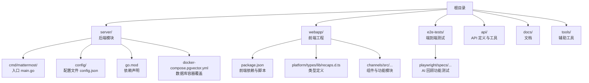
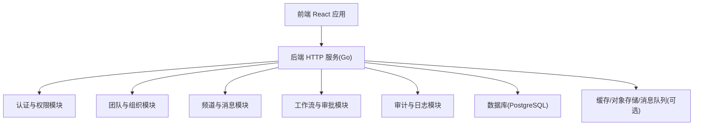
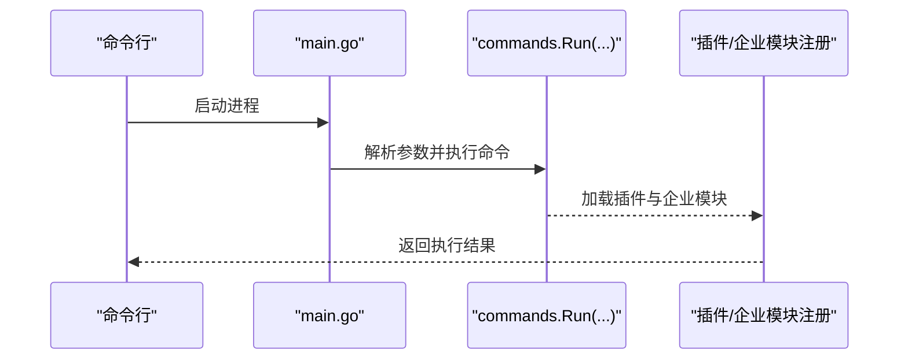
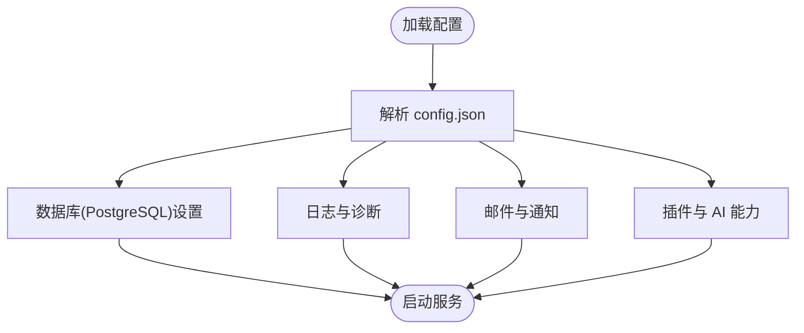
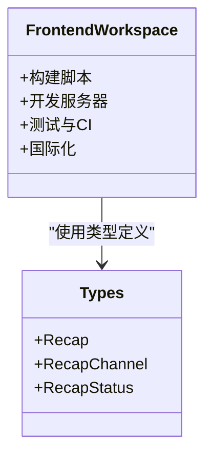
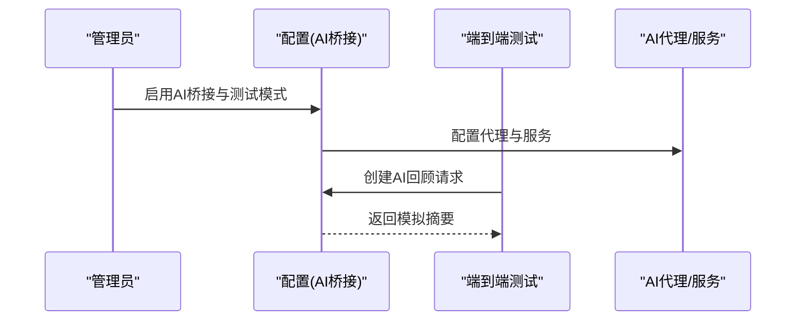
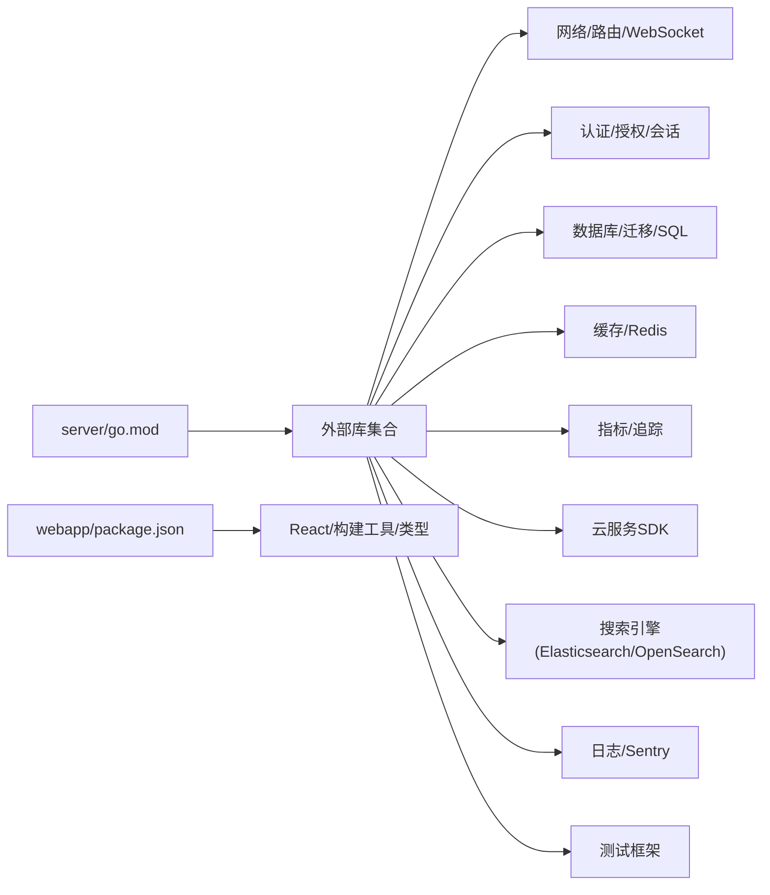

# 项目概述

<cite>
**本文引用的文件**
- [README.md](file://README.md)
- [LICENSE.txt](file://LICENSE.txt)
- [CONTRIBUTING.md](file://CONTRIBUTING.md)
- [PROJECT_ANALYSIS.md](file://PROJECT_ANALYSIS.md)
- [server/go.mod](file://server/go.mod)
- [webapp/package.json](file://webapp/package.json)
- [server/cmd/mattermost/main.go](file://server/cmd/mattermost/main.go)
- [server/config/config.json](file://server/config/config.json)
- [server/docker-compose.pgvector.yml](file://server/docker-compose.pgvector.yml)
- [server/public/model/manifest.go](file://server/public/model/manifest.go)
- [e2e-tests/playwright/specs/functional/channels/ai/recaps.spec.ts](file://e2e-tests/playwright/specs/functional/channels/ai/recaps.spec.ts)
- [webapp/platform/types/lib/recaps.d.ts](file://webapp/platform/types/lib/recaps.d.ts)
</cite>

## 目录
1. [引言](#引言)
2. [项目结构](#项目结构)
3. [核心组件](#核心组件)
4. [架构总览](#架构总览)
5. [详细组件分析](#详细组件分析)
6. [依赖分析](#依赖分析)
7. [性能考虑](#性能考虑)
8. [故障排查指南](#故障排查指南)
9. [结论](#结论)
10. [附录](#附录)

## 引言
Mattermost 是一款开源、自托管的企业级协作平台，提供即时聊天、工作流自动化、语音通话、屏幕共享与 AI 集成能力。项目采用 Go 语言与 React 技术栈，以单二进制形式运行，数据库依赖 PostgreSQL。发布策略为每月固定日期（16日）发布新版本，许可证为 MIT；同时提供企业版许可与配套功能。

- 平台定位与能力：聊天、工作流自动化、语音通话、屏幕共享、AI 集成
- 技术栈：后端 Go、前端 React
- 运行模式：单二进制
- 数据库：PostgreSQL
- 发布节奏：每月 16 日
- 许可证：MIT（及企业版许可）

**章节来源**
- [README.md:1-104](file://README.md#L1-L104)

## 项目结构
仓库包含后端（Go）、前端（React）、测试（E2E）、配置与文档等模块。核心入口位于后端命令入口与前端包管理配置，数据库配置与容器编排文件支撑本地与云部署。

**图表来源**
- [server/cmd/mattermost/main.go:1-24](file://server/cmd/mattermost/main.go#L1-L24)
- [server/config/config.json:1-776](file://server/config/config.json#L1-L776)
- [server/go.mod:1-243](file://server/go.mod#L1-L243)
- [server/docker-compose.pgvector.yml:1-8](file://server/docker-compose.pgvector.yml#L1-L8)
- [webapp/package.json:1-119](file://webapp/package.json#L1-L119)
- [webapp/platform/types/lib/recaps.d.ts:1-35](file://webapp/platform/types/lib/recaps.d.ts#L1-L35)
- [e2e-tests/playwright/specs/functional/channels/ai/recaps.spec.ts:1-551](file://e2e-tests/playwright/specs/functional/channels/ai/recaps.spec.ts#L1-L551)

**章节来源**
- [server/go.mod:1-243](file://server/go.mod#L1-L243)
- [webapp/package.json:1-119](file://webapp/package.json#L1-L119)
- [server/config/config.json:162-179](file://server/config/config.json#L162-L179)
- [server/docker-compose.pgvector.yml:1-8](file://server/docker-compose.pgvector.yml#L1-L8)

## 核心组件
- 后端入口与命令行：后端以单一可执行程序运行，入口负责加载命令与插件注册。
- 配置系统：集中式 JSON 配置文件，涵盖服务、数据库、日志、邮件、认证与插件等模块。
- 前端工程：React 工程，使用现代构建工具与工作空间组织，提供国际化与类型体系。
- 插件与 AI 能力：插件清单与 AI 桥接能力在配置与测试中均有体现，支持 AI 回顾等特性。
- 数据库与容器：默认使用 PostgreSQL，提供 pgvector 覆盖以支持向量检索场景。

**章节来源**
- [server/cmd/mattermost/main.go:19-23](file://server/cmd/mattermost/main.go#L19-L23)
- [server/config/config.json:162-179](file://server/config/config.json#L162-L179)
- [webapp/package.json:8-24](file://webapp/package.json#L8-L24)
- [server/public/model/manifest.go:241-266](file://server/public/model/manifest.go#L241-L266)
- [e2e-tests/playwright/specs/functional/channels/ai/recaps.spec.ts:13-32](file://e2e-tests/playwright/specs/functional/channels/ai/recaps.spec.ts#L13-L32)

## 架构总览
整体采用“前后端分离 + 模块化单体优先”的架构风格。前端 React 应用通过 HTTP API 与后端交互；后端以模块化方式组织业务域（认证、团队、频道、工作流、审计等），在早期以单体形态快速迭代，后期根据扩展需求拆分服务。

**图表来源**
- [PROJECT_ANALYSIS.md:96-117](file://PROJECT_ANALYSIS.md#L96-L117)
- [PROJECT_ANALYSIS.md:220-236](file://PROJECT_ANALYSIS.md#L220-L236)
- [server/config/config.json:162-179](file://server/config/config.json#L162-L179)

## 详细组件分析

### 后端入口与运行模式
- 单二进制运行：入口函数加载命令与插件注册，确保运行时即开即用。
- 插件生态：通过清单与注册机制接入 OAuth 提供商与企业功能模块。

**图表来源**
- [server/cmd/mattermost/main.go:6-17](file://server/cmd/mattermost/main.go#L6-L17)
- [server/cmd/mattermost/main.go:19-23](file://server/cmd/mattermost/main.go#L19-L23)

**章节来源**
- [server/cmd/mattermost/main.go:1-24](file://server/cmd/mattermost/main.go#L1-L24)

### 配置系统与数据库依赖
- 配置文件集中管理服务、认证、邮件、日志、插件、缓存、集群、指标、搜索、数据保留、作业调度等模块。
- 数据库设置明确使用 PostgreSQL，连接参数与迁移超时等关键配置可在此处调整。

**图表来源**
- [server/config/config.json:162-179](file://server/config/config.json#L162-L179)
- [server/config/config.json:180-194](file://server/config/config.json#L180-L194)
- [server/config/config.json:272-303](file://server/config/config.json#L272-L303)
- [server/config/config.json:633-662](file://server/config/config.json#L633-L662)

**章节来源**
- [server/config/config.json:1-776](file://server/config/config.json#L1-L776)

### 前端工程与类型体系
- 前端使用现代构建工具与工作空间组织，脚本涵盖构建、开发服务器、测试与国际化提取。
- 类型定义覆盖 AI 回顾等特性，保证前端与后端接口一致性。

**图表来源**
- [webapp/package.json:8-24](file://webapp/package.json#L8-L24)
- [webapp/platform/types/lib/recaps.d.ts:1-35](file://webapp/platform/types/lib/recaps.d.ts#L1-L35)

**章节来源**
- [webapp/package.json:1-119](file://webapp/package.json#L1-L119)
- [webapp/platform/types/lib/recaps.d.ts:1-35](file://webapp/platform/types/lib/recaps.d.ts#L1-L35)

### 插件与 AI 能力
- 插件清单支持多平台可执行文件与 Webapp 包路径，满足跨平台部署与客户端集成。
- AI 回顾功能在端到端测试中被启用与验证，体现平台对 AI 集成的支持。

**图表来源**
- [server/public/model/manifest.go:241-266](file://server/public/model/manifest.go#L241-L266)
- [e2e-tests/playwright/specs/functional/channels/ai/recaps.spec.ts:13-32](file://e2e-tests/playwright/specs/functional/channels/ai/recaps.spec.ts#L13-L32)
- [e2e-tests/playwright/specs/functional/channels/ai/recaps.spec.ts:480-508](file://e2e-tests/playwright/specs/functional/channels/ai/recaps.spec.ts#L480-L508)

**章节来源**
- [server/public/model/manifest.go:229-314](file://server/public/model/manifest.go#L229-L314)
- [e2e-tests/playwright/specs/functional/channels/ai/recaps.spec.ts:1-551](file://e2e-tests/playwright/specs/functional/channels/ai/recaps.spec.ts#L1-L551)

## 依赖分析
- 后端依赖：Go 模块声明了大量外部库，涵盖网络、日志、认证、数据库、缓存、搜索、指标、云服务 SDK、测试框架等。
- 前端依赖：React 生态与构建工具链，包含国际化、样式、测试与打包工具。
- 数据库与容器：默认 PostgreSQL，提供 pgvector 覆盖以支持向量检索场景。

**图表来源**
- [server/go.mod:5-86](file://server/go.mod#L5-L86)
- [webapp/package.json:25-59](file://webapp/package.json#L25-L59)

**章节来源**
- [server/go.mod:1-243](file://server/go.mod#L1-L243)
- [webapp/package.json:1-119](file://webapp/package.json#L1-L119)

## 性能考虑
- 单二进制部署简化运维，减少启动与部署成本。
- 数据库连接池与迁移超时配置有助于提升稳定性与可维护性。
- 指标与日志配置便于运行时性能观测与问题定位。
- 前端构建与类型检查在 CI 中尽早发现潜在性能与兼容问题。

[本节为通用指导，不直接分析具体文件]

## 故障排查指南
- 配置校验：优先核对 config.json 中数据库、日志、邮件与插件相关配置项。
- 日志与诊断：开启结构化日志与 Sentry，关注错误堆栈与慢查询。
- 插件与企业功能：确认插件清单与最小服务器版本匹配，避免运行时异常。
- 端到端测试：利用 AI 回顾等测试用例验证 AI 桥接与代理配置。

**章节来源**
- [server/config/config.json:180-194](file://server/config/config.json#L180-L194)
- [server/public/model/manifest.go:301-311](file://server/public/model/manifest.go#L301-L311)
- [e2e-tests/playwright/specs/functional/channels/ai/recaps.spec.ts:13-32](file://e2e-tests/playwright/specs/functional/channels/ai/recaps.spec.ts#L13-L32)

## 结论
Mattermost 以“开源、自托管、模块化单体优先”的方式，提供从聊天到工作流、从语音通话到 AI 集成的协作能力。后端采用 Go、前端采用 React，单二进制运行与 PostgreSQL 依赖构成简洁稳定的工程基座。项目遵循每月发布节奏，许可证为 MIT，适合对数据主权与合规性有更高要求的组织采用。

[本节为总结性内容，不直接分析具体文件]

## 附录

### 许可证与发布信息
- 许可证：MIT（及企业版许可）
- 发布周期：每月 16 日
- 社区与贡献：提供贡献指南与社区渠道

**章节来源**
- [LICENSE.txt:1-800](file://LICENSE.txt#L1-L800)
- [README.md:3](file://README.md#L3-L3)
- [CONTRIBUTING.md:1-8](file://CONTRIBUTING.md#L1-L8)

### 项目历史与社区
- 项目定位与愿景：开源核心、自托管协作平台
- 社区参与：提供安装、文档、开发者文档与社区讨论渠道
- 企业采用：通过企业版许可与功能增强支持更大规模组织

**章节来源**
- [README.md:1-104](file://README.md#L1-L104)