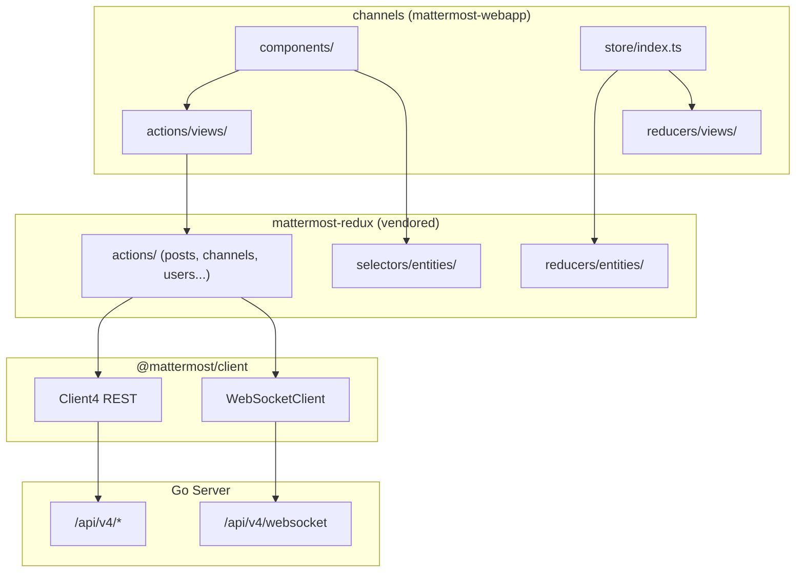
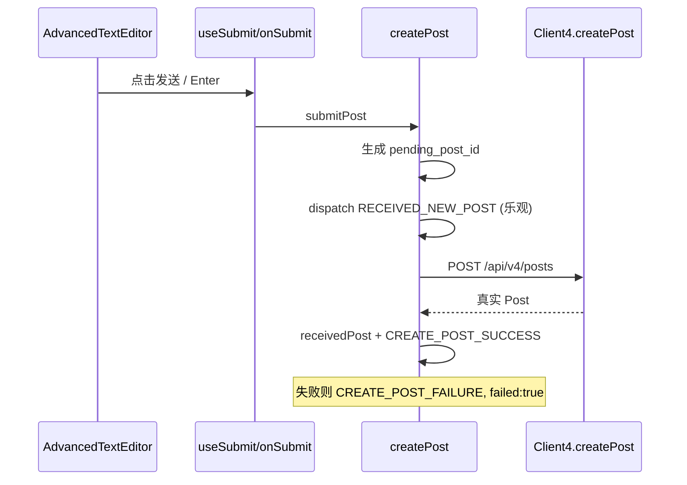
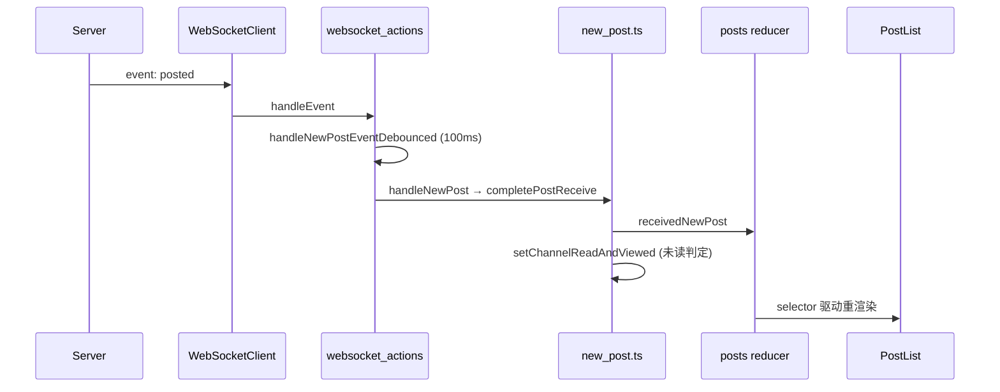

# Mattermost 项目前端业务梳理报告

本报告基于对 `d:\workspace\mattermost` 仓库的系统浏览，重点覆盖 `webapp/` 下的 Web 客户端。Mattermost 是开源团队协作/即时通讯平台，前端为 npm workspaces monorepo，主应用在 `webapp/channels`，与 Go 后端通过 REST + WebSocket 协作。

--- 

## 一、项目整体定位

| 层级 | 路径 | 职责 |
|------|------|------|
| **Web 前端** | `webapp/` | React SPA，IM 核心 UI |
| **Go 服务端** | `server/` | API、WebSocket Hub、持久化 |
| **API 定义** | `api/` | OpenAPI 规范 |
| **E2E 测试** | `e2e-tests/` | Playwright / Cypress |

前端产物输出到 `webapp/channels/dist/`，由 Go server Makefile 挂载为静态 `client` 资源，public path 为 `/static/`。

---

## 二、技术栈与工程化配置

### 2.1 核心框架版本

| 类别 | 技术 | 版本 |
|------|------|------|
| 运行时 | Node / npm | ^24 / ^11 |
| UI 框架 | React / React DOM | 18.2.0 |
| 语言 | TypeScript | 5.6.3 |
| 状态管理 | Redux + redux-thunk + redux-persist | 5.0.1 / 3.1.0 / 6.0.0 |
| React 绑定 | react-redux | 9.2.0 |
| 路由 | react-router-dom v5 + history v4 | 5.3.4 / 4.10.1 |
| 国际化 | react-intl | 7.1.14 |
| UI 库 | MUI 5、Bootstrap 3、styled-components | 混合并存 |
| 应用版本 | mattermost-webapp (channels) | 11.8.0 |

### 2.2 Monorepo 工作区结构

```text
webapp/
├── channels/              # 主 React 应用（Webpack 5 打包）
├── platform/
│   ├── client/            # Client4 REST + WebSocket 客户端
│   ├── types/             # 共享 TypeScript 类型
│   ├── shared/            # 共享 UI（Button、Tooltip 等，Parcel 构建）
│   ├── components/        # 通用组件库（Rollup 构建）
│   ├── mattermost-redux/  # 可独立发布的 Redux 层
│   └── eslint-plugin/     # 自定义 ESLint 规则
├── scripts/               # build.mjs / dev-server.mjs 编排
└── patches/               # patch-package 补丁
```

`postinstall` 自动构建 platform 包：`types → client → shared → components`。

### 2.3 构建与工具链

| 工具 | 用途 | 配置文件 |
|------|------|----------|
| **Webpack 5** | 主应用打包（非 Vite） | `webapp/channels/webpack.config.js` |
| **Babel 7** | TS/JSX 转译 | `webapp/channels/babel.config.js` |
| **Parcel 2** | `@mattermost/shared` 构建 | `platform/shared/.parcelrc` |
| **Rollup** | `@mattermost/components` 构建 | `platform/components/rollup.config.js` |
| **tsc** | client/types/redux 编译 | 各包 `tsconfig.json` |
| **Jest 30** | 单元测试 | `webapp/channels/jest.config.js` |
| **ESLint 8 + Stylelint 16** | 代码/样式检查 | `.eslintrc.json` / `.stylelintrc.json` |
| **patch-package** | 依赖补丁 | postinstall 触发 |

Webpack 关键特性：
- 入口：`src/root.tsx` → 动态 import `entry.tsx`
- **Module Federation**：向插件/Product 暴露 `./app`、`./store`、`./styles`、`./registry`
- 插件：Monaco Editor、PWA manifest、图片压缩
- 开发：`webpack-dev-server`（`npm run dev-server`）

### 2.4 架构设计逻辑



**分层原则：**
- **entities 层**（mattermost-redux）：服务端数据镜像（posts、channels、users、teams…）
- **views 层**（channels）：UI 状态（RHS 面板、草稿、路由相关）
- **传输层**（@mattermost/client）：与后端通信，不含业务逻辑
- **插件扩展**：Webpack MF + `plugins/` + Pluggable 扩展点

---

## 三、目录结构与模块划分

### 3.1 `channels/src/` 主要目录

| 目录 | 说明 |
|------|------|
| `components/` | 按功能域划分的 React 组件（最大目录） |
| `actions/` | 应用层 thunk（`websocket_actions.ts`、`post_actions.ts`、`views/*`） |
| `reducers/` | 仅 views/plugins/storage |
| `selectors/` | 应用层 selector（`views/`、`rhs`、`lhs`） |
| `store/` | Redux 组装 + redux-persist + 跨 Tab 同步 |
| `packages/mattermost-redux/` | **内嵌 vendored** Redux 核心（webpack alias 解析） |
| `client/` | WebSocket 单例封装 |
| `plugins/` | 插件注册与加载 |
| `sass/` | 全局 SCSS |
| `i18n/` | 多语言 JSON |
| `hooks/`、`utils/`、`types/` | 工具与类型 |

### 3.2 组件复用机制（优先级由高到低）

1. **`@mattermost/shared`** — Button、WithTooltip 等（见 `webapp/AGENTS.md`）
2. **`@mattermost/components`** — Modal、TourTip、SkeletonLoader
3. **`components/common/`** — 应用内 hooks（`useChannel`、`useUser`）与通用 UI
4. **功能域自包含** — `components/post_view/`、`components/sidebar/` 等

### 3.3 状态管理方案

Store 组装链：

```33:38:d:\workspace\mattermost\webapp\channels\src\store\index.ts
export default function configureStore(preloadedState?: DeepPartial<GlobalState>, additionalReducers?: Record<string, any>): Store<GlobalState> {
    const reducers = additionalReducers ? {...appReducers, ...additionalReducers} : appReducers;
    const store = configureServiceStore({
        appReducers: reducers,
        preloadedState,
    });
```

特性：
- **redux-thunk**：异步 action
- **redux-batched-actions**：批量 dispatch 减少渲染
- **redux-persist + localforage**：持久化 + **跨 Tab 同步**（`localforage-observable`）
- **reselect**：memoized selector
- 调试：`window.store` 单例（`stores/redux_store.tsx`）

`GlobalState` 类型定义在 `webapp/platform/types/src/store.ts`。

---

## 四、IM 聊天核心功能实现

### 4.1 消息发送流程（Optimistic UI + REST）



**关键路径：**

| 环节 | 文件 | 核心函数/组件 |
|------|------|---------------|
| 输入框 | `components/advanced_text_editor/advanced_text_editor.tsx` | `AdvancedTextEditor` |
| 提交逻辑 | `components/advanced_text_editor/use_submit.tsx` | `useSubmit` |
| 路由到发消息 | `actions/views/create_comment.tsx` | `onSubmit`, `submitPost` |
| 乐观更新 | `packages/mattermost-redux/src/actions/posts.ts` | `createPost` |

`createPost` 核心逻辑：生成 `pending_post_id`（`userId:timestamp`）→ 立即 dispatch 乐观 post → 异步 `Client4.createPost` → 成功替换/失败标记。

### 4.2 消息接收流程（WebSocket → Redux → UI）



**WebSocket 事件分发：**

```433:450:d:\workspace\mattermost\webapp\channels\src\actions\websocket_actions.ts
export function handleEvent(msg: WebSocketMessage) {
    switch (msg.event) {
    case WebSocketEvents.Posted:
    case WebSocketEvents.EphemeralMessage:
        handleNewPostEventDebounced(msg);
        break;

    case WebSocketEvents.PostEdited:
        handlePostEditEvent(msg);
        break;

    case WebSocketEvents.PostDeleted:
        handlePostDeleteEvent(msg);
        break;

    case WebSocketEvents.PostUnread:
        handlePostUnreadEvent(msg);
        break;
```

**已读/未读判定**（`actions/new_post.ts` → `setChannelReadAndViewed`）：
- 自己发的非系统消息 → 本地标记已读
- 当前频道 + 窗口 active → 已读 + `markChannelAsViewedOnServer`
- 否则 → `actionsToMarkChannelAsUnread` 增加未读

### 4.3 会话/频道管理

| 环节 | 文件 | 说明 |
|------|------|------|
| URL 路由 | `components/channel_layout/channel_identifier_router/` | 解析 team/channel/@user |
| 频道切换 | `actions/global_actions.tsx` | `emitChannelClickEvent` → `SELECT_CHANNEL` |
| 导航 | `actions/views/channel.ts` | `switchToChannel`, `loadIfNecessaryAndSwitchToChannelById` |
| 帖子加载 | `actions/views/channel.ts` | `loadUnreads`, `loadPosts`, `syncPostsInChannel` |
| 活跃频道通知 | `components/channel_view/channel_view.tsx` | `WebSocketClient.updateActiveChannel` |

切换流程：URL 变化 → `onChannelByIdentifierEnter` → join/load 频道 → `emitChannelClickEvent` → Redux `SELECT_CHANNEL` → 路由 push → `ChannelView` 加载 posts。

### 4.4 消息渲染

**组件层级：**

```text
ChannelView
  └─ PostView
       └─ PostList (connect Redux)
            └─ VirtPostList (虚拟滚动, DynamicVirtualizedList)
                 └─ PostListRow
                      └─ PostComponent
                           └─ PostMessageView
                                └─ PostMarkdown → Markdown
```

| 文件 | 职责 |
|------|------|
| `components/post_view/post_list/post_list_virtualized.tsx` | 虚拟列表，性能关键 |
| `components/post_view/post_list_row/post_list_row.tsx` | 日期分隔线、新消息分隔线、合并活动 |
| `components/post/post_component.tsx` | 单条消息：头像、反应、附件、编辑 |
| `packages/mattermost-redux/src/utils/post_list.ts` | `makePreparePostIdsForPostList` 预处理 listId |

### 4.5 未读计数

**计算公式：** `未读 = channel.messageCounts - myMembers[channelId].msg_count`（CRT 模式下用 `root` 字段）。

```386:394:d:\workspace\mattermost\webapp\channels\src\packages\mattermost-redux\src\selectors\entities\channels.ts
export function makeGetChannelUnreadCount(): (state: GlobalState, channelId: string) => ReturnType<typeof calculateUnreadCount> {
    return createSelector(
        'makeGetChannelUnreadCount',
        (state: GlobalState, channelId: string) => getChannelMessageCount(state, channelId),
        (state: GlobalState, channelId: string) => getMyChannelMembership(state, channelId),
        isCollapsedThreadsEnabled,
        (messageCount: ChannelMessageCount | undefined, member: ChannelMembership | undefined, crtEnabled) =>
            calculateUnreadCount(messageCount, member, crtEnabled),
    );
}
```

| 场景 | 处理 |
|------|------|
| 新消息到达 | `new_post.ts` → `setChannelReadAndViewed` |
| 手动标记未读 | `post_actions.ts` → `markPostAsUnread` → `Client4.markPostAsUnread` |
| 服务端推送 | WS `PostUnread` → `handlePostUnreadEvent` |
| UI 展示 | 侧边栏 badge、`UnreadsStatusHandler`（标题/favicon/桌面 badge）、`NewMessageSeparator` |

### 4.6 富文本 / Markdown

**渲染链：**

```text
PostMessageView → PostMarkdown → Markdown
  → formatText (utils/text_formatting.ts)
  → messageHtmlToComponent (utils/message_html_to_component.tsx)
```

| 文件 | 职责 |
|------|------|
| `components/markdown/markdown.tsx` | Markdown → HTML → React |
| `utils/text_formatting.ts` | 解析 @mention、链接、代码块 |
| `components/post_markdown/system_message_helpers.tsx` | 系统消息（加入/离开等） |
| `components/advanced_text_editor/formatting_bar/` | 编辑器格式化工具栏 |
| `utils/markdown/apply_markdown.ts` | 选区应用格式 |

输入端支持预览模式（`ShowFormat` 组件）。

---

## 五、前后端交互规范

### 5.1 REST API（Client4）

| 项 | 路径 |
|----|------|
| 实现 | `webapp/platform/client/src/client4.ts`（~5000+ 行） |
| 单例 | `channels/src/packages/mattermost-redux/src/client/index.ts` |
| 服务端对应 | `server/public/model/client4.go` |
| 初始化 | `components/root/root.tsx` 设置 `Client4.setUrl(getSiteURL())` |

**IM 相关 REST 端点（示例）：**

| 操作 | Client4 方法 | HTTP |
|------|-------------|------|
| 发消息 | `createPost` | POST `/api/v4/posts` |
| 拉历史 | `getPosts`, `getPostsBefore/After` | GET `/api/v4/channels/{id}/posts` |
| 增量同步 | `getPostsSince` | GET `.../posts?since={ts}` |
| 标记未读 | `markPostAsUnread` | POST `/api/v4/users/{id}/posts/{id}/set_unread` |
| 标记已读 | `viewMyChannel` | POST `/api/v4/channels/{id}/view` |
| 用户状态 | `getStatusesByIds` | POST `/api/v4/users/status/ids` |

认证：Cookie + CSRF（`Client4.setAuthHeader = false`，配合 CSRF cookie）。

### 5.2 WebSocket

| 项 | 路径 |
|----|------|
| 底层客户端 | `webapp/platform/client/src/websocket.ts` |
| 事件枚举 | `webapp/platform/client/src/websocket_events.ts` |
| 应用封装 | `webapp/channels/src/client/web_websocket_client.tsx` |
| 业务分发 | `webapp/channels/src/actions/websocket_actions.ts` |

连接 URL：`{site}/api/v4/websocket?connection_id=...&sequence_number=...`

登录后初始化：`components/logged_in/logged_in.tsx` → `WebSocketActions.initialize()`

**IM 相关 WS 事件：**

| 事件 | 处理 |
|------|------|
| `posted` / `ephemeral_message` | 新消息入 store |
| `post_edited` / `post_deleted` | 更新/删除 post |
| `post_unread` | 未读状态变更 |
| `channel_updated/created/deleted` | 频道变更 |
| `user_added/removed` | 成员变更 |
| `status_change` | 用户在线状态 |

### 5.3 消息同步策略

| 模式 | 机制 |
|------|------|
| **实时** | WS `posted` → debounce 100ms 批量 → Redux |
| **断线补洞** | `reconnect()` → 当前频道 `syncPostsInChannel` → `Client4.getPostsSince` |
| **首次进入** | `loadUnreads` / `loadPosts` / `getPostsUnread` |
| **出站** | 乐观更新 + REST 确认 |

`reconnect()` 还会：重新 fetch channels/members/categories、`getMyTeamUnreads`、threads sync、更新 active channel/team。

### 5.4 用户状态同步

| 模式 | 机制 |
|------|------|
| **实时** | WS `status_change` → `RECEIVED_STATUSES` |
| **轮询补充** | `status_profile_polling.ts` → `BackgroundDataLoader` → `getStatusesByIds`（当前频道可见用户） |
| **发帖推断** | `handleNewPostEvent` 中若 `set_online` 则推断 ONLINE |
| **重连** | `reconnect()` 重新加入轮询池 |

---

## 六、关键代码路径速查

| 关注点 | 首选入口 |
|--------|----------|
| 应用入口 | `webapp/channels/src/root.tsx` → `entry.tsx` |
| 路由根 | `webapp/channels/src/components/root/root.tsx` |
| 发消息 | `mattermost-redux/.../actions/posts.ts` → `createPost` |
| 收消息 | `actions/websocket_actions.ts` + `actions/new_post.ts` |
| 切频道 | `actions/global_actions.tsx` → `emitChannelClickEvent` |
| 消息列表 | `components/post_view/post_list/index.tsx` |
| 单条消息 | `components/post/post_component.tsx` |
| Markdown | `components/markdown/markdown.tsx` |
| 未读 | `mattermost-redux/.../selectors/entities/channels.ts` |
| WebSocket | `actions/websocket_actions.ts` + `platform/client/src/websocket.ts` |
| REST 客户端 | `platform/client/src/client4.ts` |
| Redux Store | `channels/src/store/index.ts` |
| 断线补帖 | `actions/views/channel.ts` → `syncPostsInChannel` |

---

## 七、架构优缺点分析

### 优点

1. **清晰分层**：entities（数据）与 views（UI 状态）分离，mattermost-redux 可独立测试/发布。
2. **乐观 UI**：发消息即时显示，体验接近原生 IM。
3. **双通道同步**：WebSocket 实时 + REST 补洞，断线重连可靠。
4. **Monorepo 复用**：`@mattermost/client/types/shared` 跨包共享，类型安全。
5. **插件生态**：Webpack Module Federation 支持 Product/Plugin 扩展。
6. **虚拟列表**：PostList 虚拟滚动，大频道性能可控。
7. **跨 Tab 同步**：redux-persist + localforage observable，多标签页状态一致。

### 缺点 / 技术债

1. **UI 栈混杂**：Bootstrap 3 + MUI 5 + styled-components + SCSS 并存，风格与维护成本较高。
2. **react-router v5**：未升级到 v6，嵌套路由与数据加载模式偏旧。
3. **Redux 样板代码多**：大量 action/reducer/selector，新功能开发链路长。
4. **mattermost-redux 双份**：platform 包与 channels 内 vendored 副本，需 alias 同步，易混淆。
5. **websocket_actions.ts 超 2300 行**：单文件职责过重，事件分发与业务耦合。
6. **无 Vite**：Webpack 5 冷启动与 HMR 相对慢于现代工具链。
7. **Class 与 Hooks 混用**：部分遗留 Class 组件（如 `LoggedIn`、`UnreadsStatusHandler`）与函数组件并存。

---

## 八、总结

Mattermost 前端是一个 **React 18 + Redux 5 + TypeScript 5.6** 的成熟 IM 客户端，采用 **npm workspaces monorepo**，主应用 `channels` 通过 **Webpack 5 Module Federation** 支持插件扩展。IM 核心遵循 **「WebSocket 推送为主、REST 拉取兜底」** 的同步策略，发消息采用 **乐观更新**，未读基于 **messageCounts 与 membership 差值** 计算。

若要深入某一模块（例如线程 CRT、插件 registry、搜索、或 Admin Console），可以指定模块继续展开。